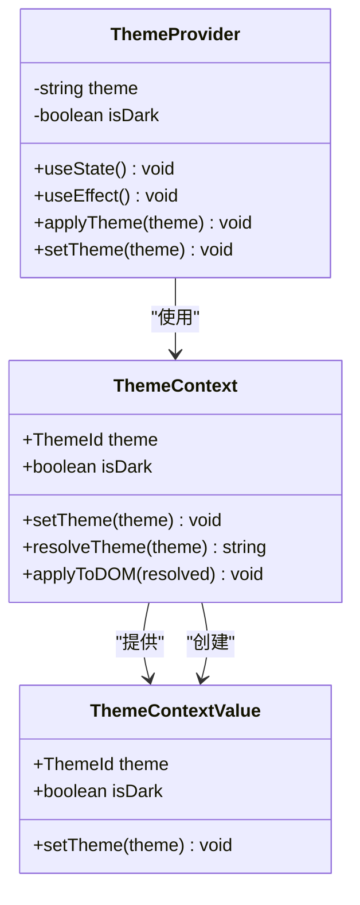
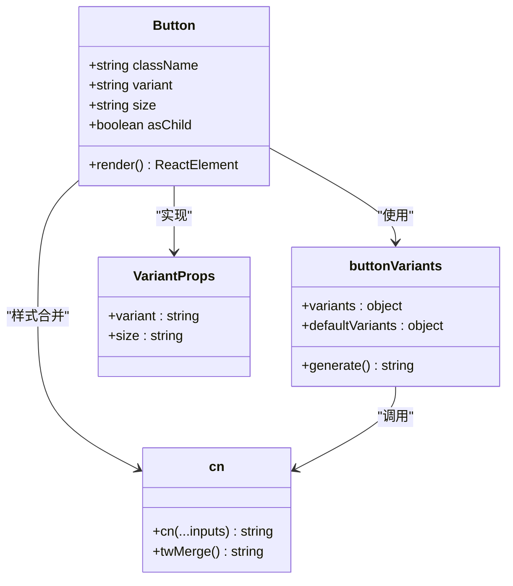
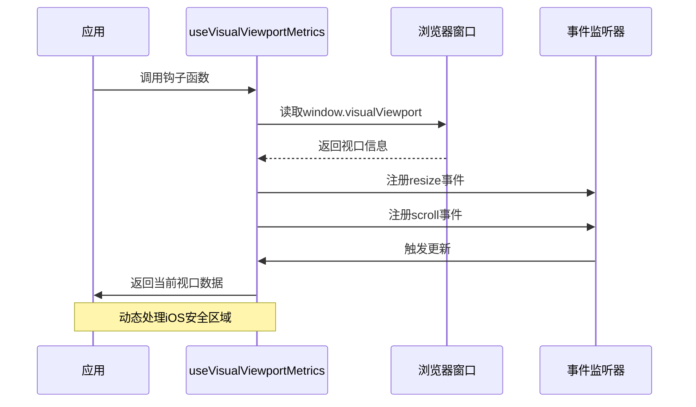
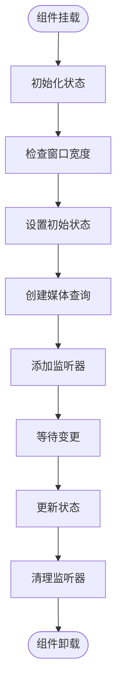

# Tailwind CSS配置

<cite>
**本文档引用的文件**
- [package.json](file://package.json)
- [postcss.config.mjs](file://postcss.config.mjs)
- [vite.config.ts](file://vite.config.ts)
- [src/styles/tailwind.css](file://src/styles/tailwind.css)
- [src/styles/theme.css](file://src/styles/theme.css)
- [src/app/components/ui/button.tsx](file://src/app/components/ui/button.tsx)
- [src/app/components/ui/utils.ts](file://src/app/components/ui/utils.ts)
- [src/app/components/ui/use-visual-viewport.ts](file://src/app/components/ui/use-visual-viewport.ts)
- [src/app/components/ui/use-mobile.ts](file://src/app/components/ui/use-mobile.ts)
- [src/app/components/context/ThemeContext.tsx](file://src/app/components/context/ThemeContext.tsx)
- [src/app/App.tsx](file://src/app/App.tsx)
</cite>

## 目录
1. [简介](#简介)
2. [项目结构](#项目结构)
3. [核心组件](#核心组件)
4. [架构概览](#架构概览)
5. [详细组件分析](#详细组件分析)
6. [依赖关系分析](#依赖关系分析)
7. [性能考虑](#性能考虑)
8. [故障排除指南](#故障排除指南)
9. [结论](#结论)

## 简介

本项目采用Tailwind CSS v4作为主要的样式框架，结合Vite构建工具和React生态系统，实现了现代化的前端开发体验。项目配置了完整的响应式设计系统、主题切换机制和组件化样式管理。

## 项目结构

项目采用模块化的样式组织方式，主要包含以下关键目录和文件：

```mermaid
graph TB
subgraph "样式系统"
A[src/styles/] --> B[tailwind.css]
A --> C[theme.css]
A --> D[index.css]
end
subgraph "组件系统"
E[src/app/components/ui/] --> F[button.tsx]
E --> G[utils.ts]
E --> H[use-visual-viewport.ts]
E --> I[use-mobile.ts]
end
subgraph "上下文系统"
J[src/app/components/context/] --> K[ThemeContext.tsx]
L[src/app/components/context/] --> M[NoteContext.tsx]
end
subgraph "构建配置"
N[vite.config.ts] --> O[@tailwindcss/vite]
P[postcss.config.mjs] --> Q[自动配置]
R[package.json] --> S[tailwindcss 4.1.12]
end
```

**图表来源**
- [vite.config.ts:1-44](file://vite.config.ts#L1-L44)
- [package.json:85-92](file://package.json#L85-L92)

**章节来源**
- [vite.config.ts:1-44](file://vite.config.ts#L1-L44)
- [package.json:1-113](file://package.json#L1-L113)

## 核心组件

### Tailwind CSS配置

项目使用Tailwind CSS v4，通过Vite插件自动配置所有必要的PostCSS插件：

- **自动配置**: `@tailwindcss/vite` 插件自动设置Tailwind CSS和Autoprefixer
- **插件扩展**: 通过PostCSS配置文件添加额外插件支持
- **源文件扫描**: 配置了完整的TypeScript源文件扫描路径

### 主题系统

项目实现了完整的深色/浅色主题切换机制：

- **CSS变量**: 使用现代CSS自定义属性实现主题变量
- **OKLCH色彩空间**: 采用OKLCH色彩模型确保更好的色彩一致性
- **语义化命名**: 使用语义化变量名如 `--hi-text-primary` 和 `--hi-card-bg`
- **响应式主题**: 支持系统偏好检测和用户手动切换

### 组件化样式

通过CVA (Class Variance Authority) 实现组件化样式管理：

- **变体系统**: 支持不同尺寸和样式的按钮变体
- **条件样式**: 基于状态的条件样式应用
- **样式合并**: 使用 `tailwind-merge` 避免样式冲突

**章节来源**
- [src/styles/tailwind.css:1-7](file://src/styles/tailwind.css#L1-L7)
- [src/styles/theme.css:1-280](file://src/styles/theme.css#L1-L280)
- [src/app/components/ui/button.tsx:1-59](file://src/app/components/ui/button.tsx#L1-L59)

## 架构概览

```mermaid
graph TB
subgraph "构建层"
A[Vite] --> B[@tailwindcss/vite]
B --> C[Tailwind CSS v4]
C --> D[PostCSS处理器]
end
subgraph "样式层"
E[theme.css] --> F[CSS变量定义]
F --> G[OKLCH色彩系统]
G --> H[语义化主题令牌]
end
subgraph "组件层"
I[Button组件] --> J[CVA变体]
J --> K[条件样式]
K --> L[样式合并]
end
subgraph "上下文层"
M[ThemeContext] --> N[主题切换]
N --> O[localStorage持久化]
O --> P[系统偏好检测]
end
A --> E
C --> I
F --> I
M --> I
```

**图表来源**
- [vite.config.ts:3-9](file://vite.config.ts#L3-L9)
- [src/app/components/context/ThemeContext.tsx:63-105](file://src/app/components/context/ThemeContext.tsx#L63-L105)
- [src/app/components/ui/button.tsx:7-35](file://src/app/components/ui/button.tsx#L7-L35)

## 详细组件分析

### 主题上下文系统



**图表来源**
- [src/app/components/context/ThemeContext.tsx:1-110](file://src/app/components/context/ThemeContext.tsx#L1-L110)

主题系统的核心特性：

- **多模式支持**: 支持 `system`、`light`、`dark` 三种主题模式
- **智能解析**: 自动检测系统偏好设置
- **持久化存储**: 使用localStorage保存用户选择
- **DOM应用**: 通过 `data-theme` 属性应用到根元素

**章节来源**
- [src/app/components/context/ThemeContext.tsx:1-110](file://src/app/components/context/ThemeContext.tsx#L1-L110)

### 按钮组件系统



**图表来源**
- [src/app/components/ui/button.tsx:1-59](file://src/app/components/ui/button.tsx#L1-L59)
- [src/app/components/ui/utils.ts:1-7](file://src/app/components/ui/utils.ts#L1-L7)

按钮组件的设计模式：

- **CVA架构**: 使用Class Variance Authority实现变体系统
- **条件样式**: 基于状态的条件样式应用（禁用、悬停、焦点等）
- **SVG支持**: 内置SVG图标支持和尺寸适配
- **可访问性**: 完整的键盘导航和屏幕阅读器支持

**章节来源**
- [src/app/components/ui/button.tsx:1-59](file://src/app/components/ui/button.tsx#L1-L59)
- [src/app/components/ui/utils.ts:1-7](file://src/app/components/ui/utils.ts#L1-L7)

### 视口适配系统



**图表来源**
- [src/app/components/ui/use-visual-viewport.ts:40-72](file://src/app/components/ui/use-visual-viewport.ts#L40-L72)

视口适配的关键功能：

- **安全区域处理**: 正确处理iOS设备的安全区域
- **动态更新**: 监听窗口大小变化和滚动事件
- **降级支持**: 在不支持的环境中提供降级方案
- **性能优化**: 使用useRef缓存基准高度值

**章节来源**
- [src/app/components/ui/use-visual-viewport.ts:1-73](file://src/app/components/ui/use-visual-viewport.ts#L1-L73)

### 移动端检测系统



**图表来源**
- [src/app/components/ui/use-mobile.ts:5-21](file://src/app/components/ui/use-mobile.ts#L5-L21)

移动端检测的实现特点：

- **断点定义**: 使用768px作为移动设备断点
- **实时监听**: 监听媒体查询变化自动更新状态
- **内存管理**: 组件卸载时自动清理事件监听器
- **SSR兼容**: 在服务端渲染环境中提供安全的降级处理

**章节来源**
- [src/app/components/ui/use-mobile.ts:1-21](file://src/app/components/ui/use-mobile.ts#L1-L21)

## 依赖关系分析

```mermaid
graph LR
subgraph "构建工具"
A[Vite] --> B[@tailwindcss/vite]
C[PostCSS] --> D[自动配置]
end
subgraph "样式框架"
B --> E[Tailwind CSS v4]
E --> F[CSS变量]
E --> G[动画系统]
end
subgraph "React生态"
H[Radix UI] --> I[组件库]
J[Emotion] --> K[样式系统]
L[Class Variance Authority] --> M[样式变体]
end
subgraph "第三方插件"
N[@tailwindcss/typography] --> O[排版增强]
P[tw-animate-css] --> Q[动画效果]
end
A --> H
A --> J
E --> N
E --> P
```

**图表来源**
- [package.json:85-92](file://package.json#L85-L92)
- [vite.config.ts:3-9](file://vite.config.ts#L3-L9)

**章节来源**
- [package.json:1-113](file://package.json#L1-L113)
- [vite.config.ts:1-44](file://vite.config.ts#L1-L44)

## 性能考虑

### Tree Shaking优化

项目通过以下方式实现最佳的Tree Shaking效果：

- **单一入口预打包**: 在optimizeDeps中预打包关键依赖
- **React去重**: 确保所有包使用相同的React实例
- **按需导入**: 组件库支持Tree Shaking的模块结构

### 构建优化策略

- **插件自动配置**: 使用 `@tailwindcss/vite` 自动配置PostCSS插件
- **源文件扫描**: 精确的源文件路径扫描避免不必要的重新编译
- **开发服务器**: Vite提供的快速热重载和模块热替换

### 样式优化技术

- **CSS变量缓存**: 使用CSS自定义属性减少重复计算
- **样式合并**: `tailwind-merge` 避免样式冲突和重复
- **条件样式**: 基于状态的条件样式减少不必要的类名

## 故障排除指南

### 常见问题及解决方案

**主题切换不生效**
- 检查 `data-theme` 属性是否正确应用到 `<html>` 元素
- 确认CSS变量定义完整且优先级正确
- 验证 `ThemeContext` 提供者是否正确包裹应用

**样式冲突问题**
- 使用 `twMerge` 函数合并多个样式类
- 检查Tailwind CSS版本兼容性
- 确认样式优先级顺序正确

**移动端适配问题**
- 验证 `use-mobile` 钩子的断点设置
- 检查 `use-visual-viewport` 的降级处理
- 确认CSS媒体查询语法正确

**构建错误排查**
- 检查 `@tailwindcss/vite` 插件配置
- 验证PostCSS配置文件格式
- 确认Node.js版本兼容性

**章节来源**
- [src/app/components/context/ThemeContext.tsx:50-61](file://src/app/components/context/ThemeContext.tsx#L50-L61)
- [src/app/components/ui/utils.ts:1-7](file://src/app/components/ui/utils.ts#L1-L7)

## 结论

本项目展示了现代前端开发中Tailwind CSS v4的最佳实践，通过以下关键特性实现了高质量的样式系统：

- **自动化配置**: 利用 `@tailwindcss/vite` 实现零配置的现代化构建
- **主题系统**: 完整的深色/浅色主题切换机制，支持系统偏好检测
- **组件化架构**: 基于CVA的组件化样式管理，支持丰富的变体系统
- **响应式设计**: 全面的移动端适配和视口处理
- **性能优化**: 通过Tree Shaking和构建优化确保最佳性能

该配置为Note-taking应用提供了坚实的基础，支持复杂的交互需求和多样化的用户界面场景。通过模块化的架构设计，系统具有良好的可维护性和扩展性，能够适应未来的需求变化。