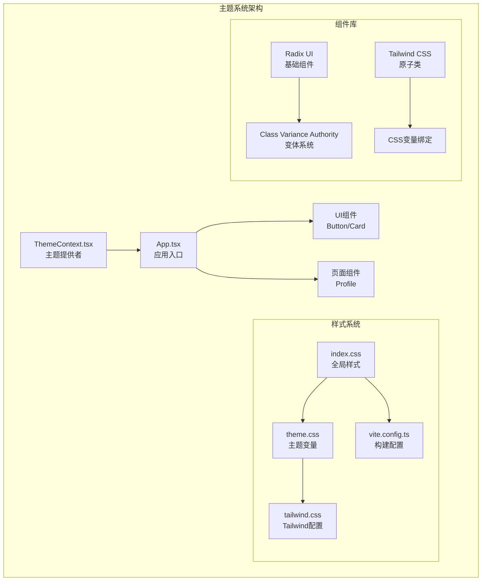
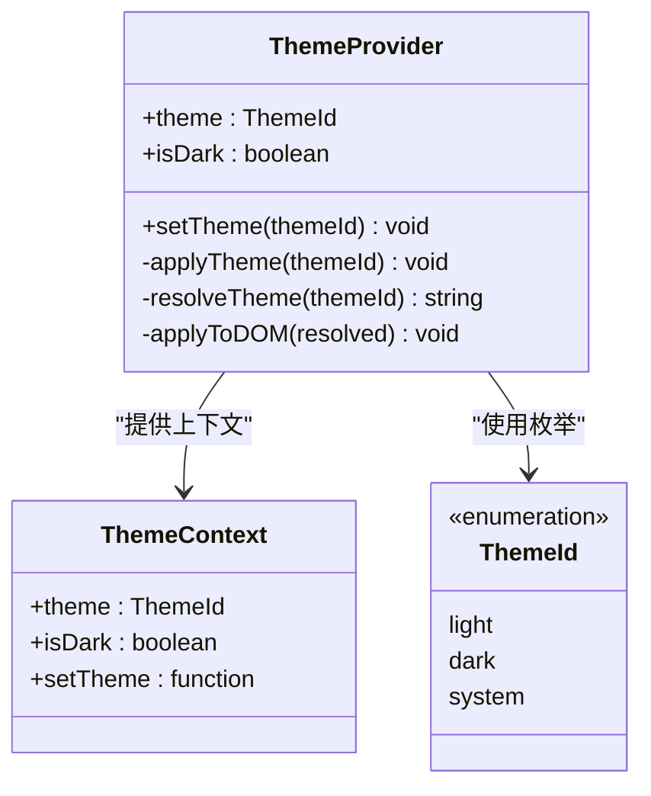
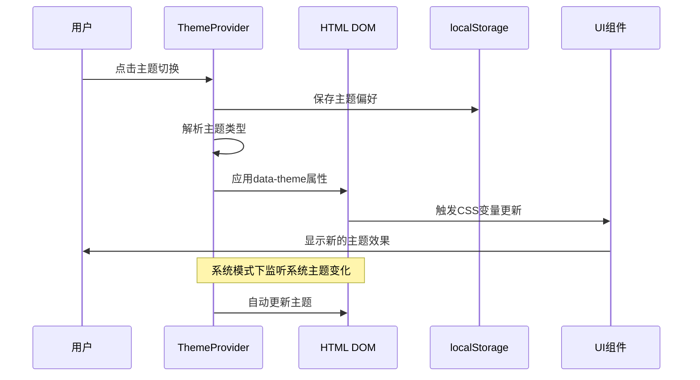
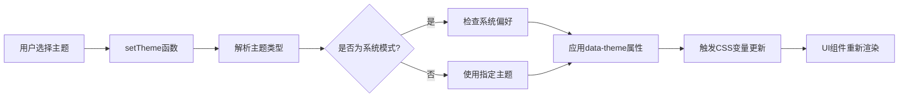
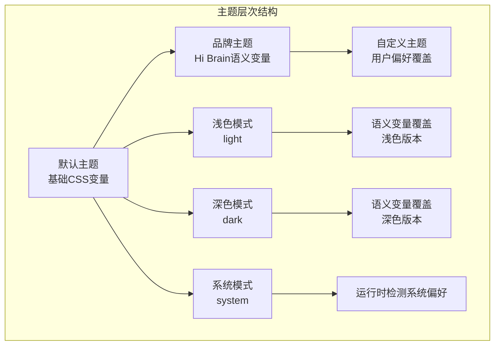
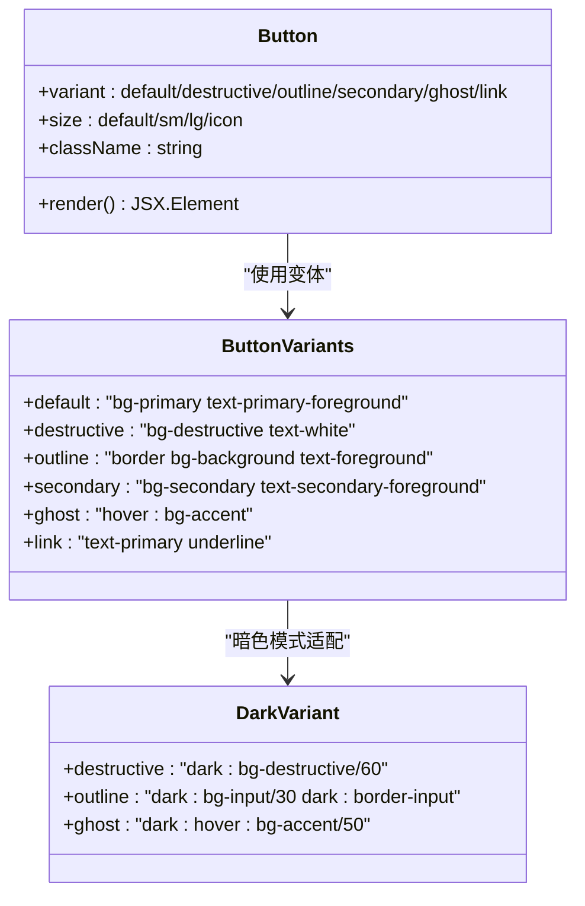
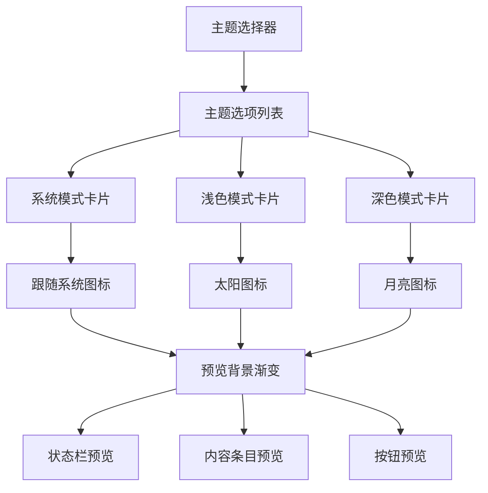
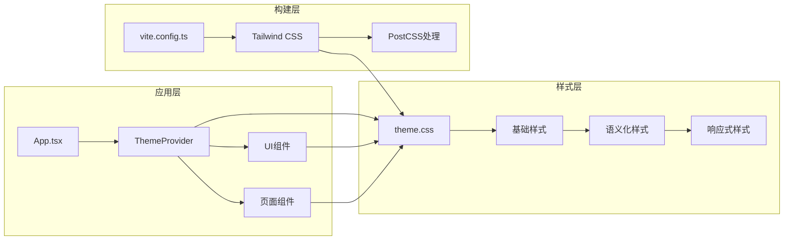

# 主题系统实现

<cite>
**本文档引用的文件**
- [ThemeContext.tsx](file://src/app/components/context/ThemeContext.tsx)
- [theme.css](file://src/styles/theme.css)
- [index.css](file://src/styles/index.css)
- [tailwind.css](file://src/styles/tailwind.css)
- [App.tsx](file://src/app/App.tsx)
- [button.tsx](file://src/app/components/ui/button.tsx)
- [card.tsx](file://src/app/components/ui/card.tsx)
- [Profile.tsx](file://src/app/pages/Profile.tsx)
- [vite.config.ts](file://vite.config.ts)
- [package.json](file://package.json)
</cite>

## 目录
1. [简介](#简介)
2. [项目结构](#项目结构)
3. [核心组件](#核心组件)
4. [架构概览](#架构概览)
5. [详细组件分析](#详细组件分析)
6. [依赖关系分析](#依赖关系分析)
7. [性能考量](#性能考量)
8. [故障排除指南](#故障排除指南)
9. [结论](#结论)
10. [附录](#附录)

## 简介

本项目实现了完整的主题系统，支持浅色模式、深色模式和系统跟随三种主题模式。系统基于CSS变量和Tailwind CSS构建，采用React Context提供主题状态管理，通过localStorage持久化用户偏好设置。主题系统不仅支持基本的颜色切换，还包含了丰富的语义化颜色变量、品牌定制能力和深度的可访问性考虑。

## 项目结构

主题系统主要分布在以下目录和文件中：



**图表来源**
- [ThemeContext.tsx:1-110](file://src/app/components/context/ThemeContext.tsx#L1-L110)
- [App.tsx:1-17](file://src/app/App.tsx#L1-L17)
- [index.css:1-229](file://src/styles/index.css#L1-L229)

**章节来源**
- [ThemeContext.tsx:1-110](file://src/app/components/context/ThemeContext.tsx#L1-L110)
- [App.tsx:1-17](file://src/app/App.tsx#L1-L17)
- [index.css:1-229](file://src/styles/index.css#L1-L229)

## 核心组件

### 主题提供者（ThemeProvider）

主题提供者是整个主题系统的核心，负责：
- 管理主题状态（light/dark/system）
- 处理用户偏好存储
- 动态应用CSS变量
- 监听系统主题变化



**图表来源**
- [ThemeContext.tsx:3-15](file://src/app/components/context/ThemeContext.tsx#L3-L15)
- [ThemeContext.tsx:63-105](file://src/app/components/context/ThemeContext.tsx#L63-L105)

### CSS变量管理系统

系统采用两层CSS变量架构：

1. **基础变量层**：定义颜色、字体、间距等基础设计令牌
2. **语义变量层**：为特定功能区域定义语义化颜色变量

```mermaid
flowchart TD
A[CSS变量系统] --> B[基础变量层]
A --> C[语义变量层]
B --> D[:root 定义<br/>--background, --foreground, --primary]
B --> E[data-theme="dark"] 覆盖<br/>深色模式变量
C --> F[--hi-* 品牌变量<br/>页面背景、文本颜色]
C --> G[--dt-* 导航变量<br/>导航栏颜色]
D --> H[@theme inline<br/>生成CSS变量别名]
E --> H
F --> H
G --> H
```

**图表来源**
- [theme.css:3-92](file://src/styles/theme.css#L3-L92)
- [theme.css:94-144](file://src/styles/theme.css#L94-L144)
- [theme.css:183-222](file://src/styles/theme.css#L183-L222)

**章节来源**
- [ThemeContext.tsx:63-105](file://src/app/components/context/ThemeContext.tsx#L63-L105)
- [theme.css:1-280](file://src/styles/theme.css#L1-L280)

## 架构概览

主题系统的整体架构采用分层设计：



**图表来源**
- [ThemeContext.tsx:72-98](file://src/app/components/context/ThemeContext.tsx#L72-L98)
- [ThemeContext.tsx:83-92](file://src/app/components/context/ThemeContext.tsx#L83-L92)

## 详细组件分析

### 主题切换实现原理

#### 动态样式注入机制

主题切换通过向`<html>`元素添加`data-theme`属性来实现：



**图表来源**
- [ThemeContext.tsx:28-32](file://src/app/components/context/ThemeContext.tsx#L28-L32)
- [ThemeContext.tsx:50-61](file://src/app/components/context/ThemeContext.tsx#L50-L61)

#### 状态管理机制

系统采用React Hooks实现状态管理：
- 使用`useState`管理当前主题和深色状态
- 使用`useEffect`处理副作用（监听系统变化、应用主题）
- 使用`useCallback`优化函数引用稳定性

**章节来源**
- [ThemeContext.tsx:63-105](file://src/app/components/context/ThemeContext.tsx#L63-L105)

### 深色模式与浅色模式实现

#### 颜色映射差异

深色模式和浅色模式在颜色映射上存在显著差异：

| 颜色类别 | 浅色模式示例 | 深色模式示例 | 设计考量 |
|---------|-------------|-------------|----------|
| 背景 | `#ffffff` | `oklch(0.145 0 0)` | 浅色背景提升可读性，深色背景减少眩光 |
| 主要文字 | `#1E1B4B` | `#E8E6FF` | 深色文字在浅色背景上更清晰 |
| 卡片背景 | `rgba(255,255,255,0.82)` | `rgba(22,20,42,0.90)` | 透明度确保层次感同时保持可读性 |
| 边框 | `rgba(0,0,0,0.1)` | `rgba(255,255,255,0.07)` | 深色模式使用更高透明度边框 |

#### 对比度调整策略

系统采用OKLCH色彩空间确保良好的对比度：
- 文字与背景对比度≥4.5:1（AA标准）
- 重要信息使用高对比度配色
- 交互元素保持足够的视觉反馈

**章节来源**
- [theme.css:43-84](file://src/styles/theme.css#L43-L84)
- [theme.css:94-144](file://src/styles/theme.css#L94-L144)

### 主题继承与覆盖机制

#### 默认主题、自定义主题和品牌主题



**图表来源**
- [theme.css:3-92](file://src/styles/theme.css#L3-L92)
- [theme.css:94-144](file://src/styles/theme.css#L94-L144)

#### 变量继承链

CSS变量采用层级继承机制：
1. `:root`定义基础变量
2. `[data-theme="dark"]`覆盖深色模式变量
3. `.dark`类提供额外的暗色适配
4. `@theme inline`生成CSS变量别名供Tailwind使用

**章节来源**
- [theme.css:183-222](file://src/styles/theme.css#L183-L222)

### UI组件的主题集成

#### Button组件的多主题支持

Button组件通过CSS变量实现主题适配：



**图表来源**
- [button.tsx:7-35](file://src/app/components/ui/button.tsx#L7-L35)
- [button.tsx:8](file://src/app/components/ui/button.tsx#L8)

#### Card组件的主题适配

Card组件直接使用语义化CSS变量：
- `bg-card` - 卡片背景色
- `text-card-foreground` - 卡片文字色
- `border` - 卡片边框色

**章节来源**
- [button.tsx:12-21](file://src/app/components/ui/button.tsx#L12-L21)
- [card.tsx:10](file://src/app/components/ui/card.tsx#L10)

### 主题切换界面实现

#### Profile页面的主题选择器

主题选择器提供了直观的用户界面：



**图表来源**
- [Profile.tsx:3172-3220](file://src/app/pages/Profile.tsx#L3172-L3220)
- [Profile.tsx:3222-3254](file://src/app/pages/Profile.tsx#L3222-L3254)

**章节来源**
- [Profile.tsx:3256-3368](file://src/app/pages/Profile.tsx#L3256-L3368)

## 依赖关系分析

### 核心依赖关系

```mermaid
graph TB
subgraph "主题系统依赖"
A[ThemeContext.tsx] --> B[React Context]
A --> C[localStorage API]
A --> D[matchMedia API]
E[theme.css] --> F[CSS变量]
E --> G[@theme指令]
E --> H[自定义变体]
I[button.tsx] --> J[Class Variance Authority]
I --> K[CSS变量绑定]
L[card.tsx] --> M[语义化CSS变量]
end
subgraph "构建工具依赖"
N[vite.config.ts] --> O[Tailwind CSS]
N --> P[React Plugin]
Q[package.json] --> R[Radix UI]
Q --> S[Tailwind CSS v4]
Q --> T[Motion]
end
```

**图表来源**
- [ThemeContext.tsx:17-26](file://src/app/components/context/ThemeContext.tsx#L17-L26)
- [theme.css:1-1](file://src/styles/theme.css#L1-L1)
- [vite.config.ts:1-44](file://vite.config.ts#L1-L44)

### 组件间依赖关系



**图表来源**
- [App.tsx:5](file://src/app/App.tsx#L5)
- [theme.css:224-280](file://src/styles/theme.css#L224-L280)

**章节来源**
- [package.json:10-83](file://package.json#L10-L83)
- [vite.config.ts:1-44](file://vite.config.ts#L1-L44)

## 性能考量

### 主题切换性能优化

系统在多个层面进行了性能优化：

#### CSS变量缓存机制
- 使用`@theme inline`预生成CSS变量别名
- 避免JavaScript运行时计算颜色值
- 减少DOM查询和样式重排

#### 主题切换动画优化
- CSS过渡动画持续0.35秒，平衡流畅性和性能
- 使用`will-change`属性优化动画性能
- 避免在主题切换时触发布局抖动

#### 内存管理
- 使用`useCallback`稳定函数引用
- 合理清理事件监听器
- 避免内存泄漏

### 构建时优化

#### Vite优化配置
- React包去重，避免重复实例
- 预打包常用依赖
- 源码路径别名配置

**章节来源**
- [ThemeContext.tsx:54](file://src/app/components/context/ThemeContext.tsx#L54)
- [vite.config.ts:27-41](file://vite.config.ts#L27-L41)

## 故障排除指南

### 常见问题及解决方案

#### 主题不生效问题

**症状**：主题切换后UI没有变化
**可能原因**：
1. CSS变量未正确更新
2. 组件未使用语义化变量
3. 浏览器缓存问题

**解决步骤**：
1. 检查`<html>`元素的`data-theme`属性
2. 验证CSS变量是否在`:root`中定义
3. 确认组件使用的是语义化CSS变量而非硬编码颜色

#### 主题偏好丢失问题

**症状**：刷新页面后主题恢复默认
**可能原因**：
1. localStorage访问受限
2. SSR环境下的安全检查失败

**解决方法**：
1. 检查浏览器隐私设置
2. 确认`safeGetStorage`和`safeSetStorage`函数正常工作
3. 在开发环境中使用本地存储模拟

#### 系统主题同步问题

**症状**：系统主题变化但应用未响应
**解决方法**：
1. 确认`matchMedia`监听器已正确注册
2. 检查`theme === 'system'`条件判断
3. 验证事件监听器的清理逻辑

**章节来源**
- [ThemeContext.tsx:34-48](file://src/app/components/context/ThemeContext.tsx#L34-L48)
- [ThemeContext.tsx:83-92](file://src/app/components/context/ThemeContext.tsx#L83-L92)

## 结论

本主题系统实现了现代化的CSS变量驱动设计，具有以下特点：

1. **完整的主题支持**：支持浅色、深色和系统跟随三种模式
2. **语义化设计**：使用语义化CSS变量确保设计一致性
3. **高性能实现**：通过CSS变量和构建时优化实现快速切换
4. **可扩展性**：提供清晰的扩展接口支持品牌定制
5. **可访问性**：符合WCAG 2.1 AA标准的对比度要求

系统架构清晰，组件职责明确，为后续的功能扩展和维护奠定了良好基础。

## 附录

### 主题扩展指南

#### 添加新颜色变量

1. 在`:root`中定义基础变量
2. 在`[data-theme="dark"]`中添加对应深色变量
3. 使用`@theme inline`生成CSS变量别名
4. 在UI组件中使用语义化变量

#### 自定义组件样式

1. 使用CSS变量而非硬编码颜色
2. 支持暗色模式适配
3. 提供适当的对比度和可访问性
4. 遵循语义化命名约定

#### 主题打包发布

1. 确保所有CSS变量完整定义
2. 测试不同主题模式下的视觉效果
3. 验证组件在各种场景下的表现
4. 提供主题定制文档和示例