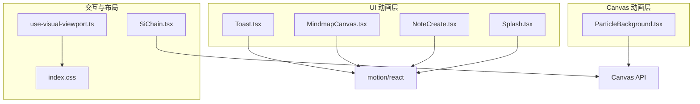
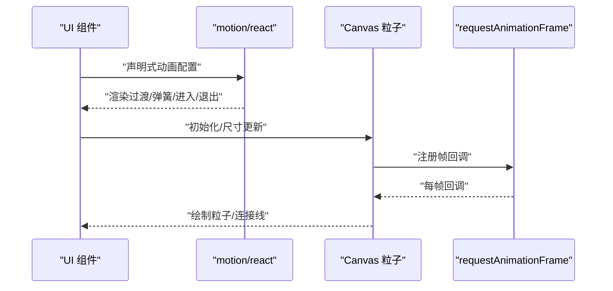
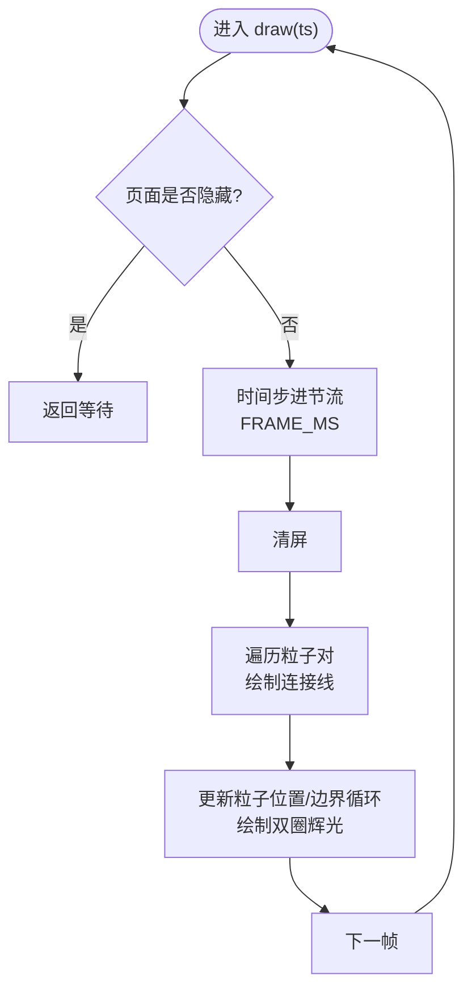
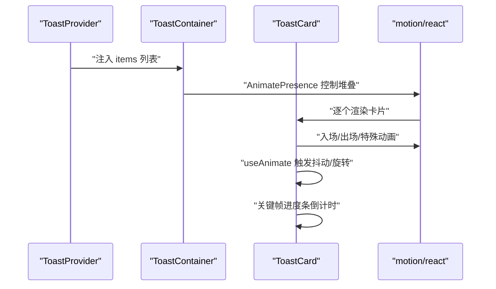
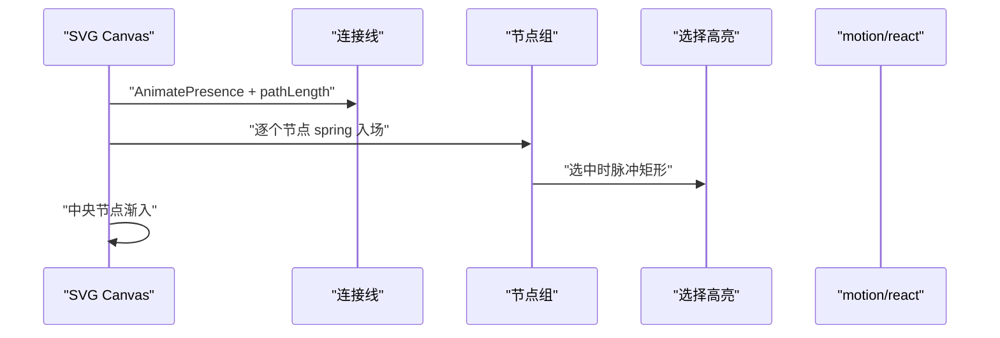
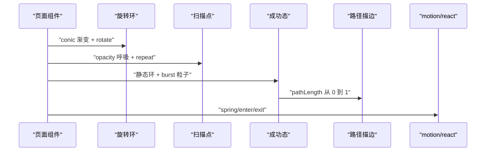
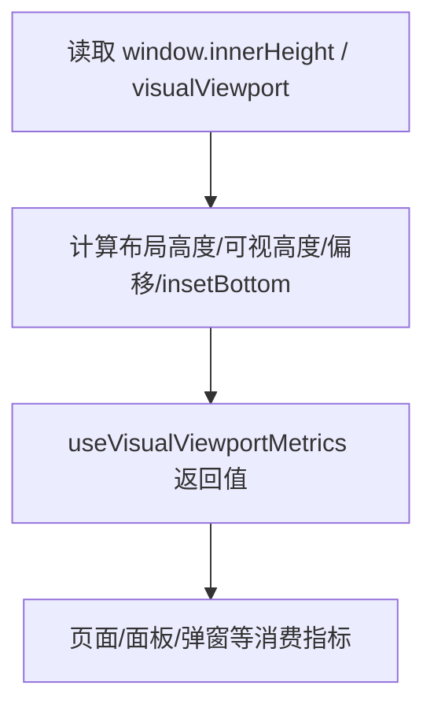
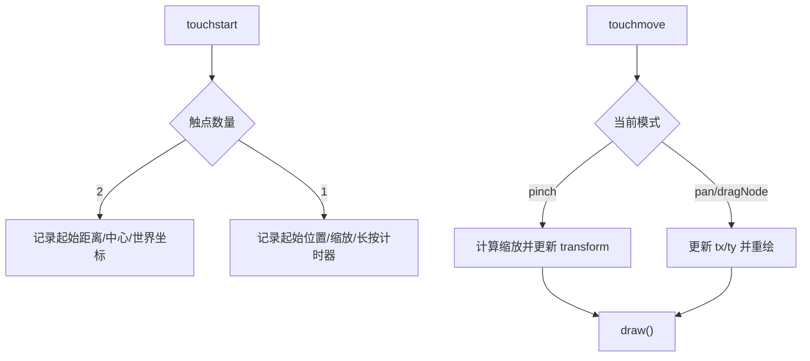
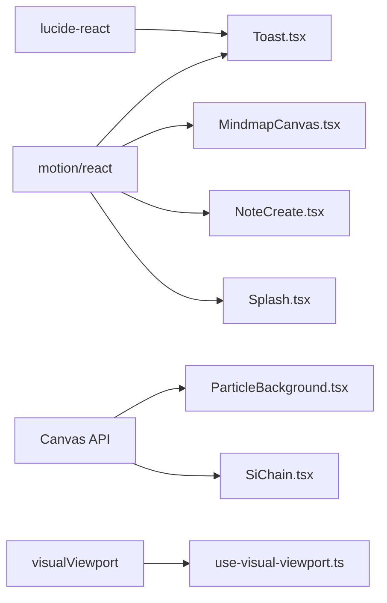

# 动画与过渡效果

<cite>
**本文引用的文件**
- [ParticleBackground.tsx](file://src/app/components/ParticleBackground.tsx)
- [Toast.tsx](file://src/app/components/ui/Toast.tsx)
- [MindmapCanvas.tsx](file://src/app/components/MindmapCanvas.tsx)
- [NoteCreate.tsx](file://src/app/pages/NoteCreate.tsx)
- [Splash.tsx](file://src/app/pages/Splash.tsx)
- [index.css](file://src/styles/index.css)
- [SiChain.tsx](file://src/app/pages/SiChain.tsx)
- [use-visual-viewport.ts](file://src/app/components/ui/use-visual-viewport.ts)
</cite>

## 目录
1. [简介](#简介)
2. [项目结构](#项目结构)
3. [核心组件](#核心组件)
4. [架构总览](#架构总览)
5. [详细组件分析](#详细组件分析)
6. [依赖关系分析](#依赖关系分析)
7. [性能考量](#性能考量)
8. [故障排查指南](#故障排查指南)
9. [结论](#结论)
10. [附录](#附录)

## 简介
本文件系统化梳理前端动画与过渡效果的实现，覆盖以下方面：
- CSS 关键帧动画与过渡效果
- JavaScript 驱动的动画（基于 motion/react 的 useAnimate、useMotionValue、useTransform 等模式）
- Canvas 粒子背景动画（粒子系统、连接线、交互响应）
- 组件间动画协调（进入/退出、状态切换、手势）
- 性能优化（硬件加速、帧率控制、内存管理）
- 调试工具与跨浏览器兼容策略

## 项目结构
本项目的动画相关实现主要分布在如下模块：
- Canvas 粒子背景：ParticleBackground.tsx
- Toast 通知系统：Toast.tsx（包含关键帧与基于 motion 的动画）
- 思维导图画布：MindmapCanvas.tsx（路径描边、节点入场/退出、弹簧动画）
- 页面级动画：NoteCreate.tsx、Splash.tsx（加载环、路径描边、弹性质感）
- 视口适配与滚动：use-visual-viewport.ts、index.css
- 手势与缩放：SiChain.tsx（触摸手势、缩放与拖拽）

图表来源
- [Toast.tsx](file://src/app/components/ui/Toast.tsx)
- [MindmapCanvas.tsx](file://src/app/components/MindmapCanvas.tsx)
- [NoteCreate.tsx](file://src/app/pages/NoteCreate.tsx)
- [Splash.tsx](file://src/app/pages/Splash.tsx)
- [ParticleBackground.tsx](file://src/app/components/ParticleBackground.tsx)
- [use-visual-viewport.ts](file://src/app/components/ui/use-visual-viewport.ts)
- [index.css](file://src/styles/index.css)
- [SiChain.tsx](file://src/app/pages/SiChain.tsx)

章节来源
- [ParticleBackground.tsx](file://src/app/components/ParticleBackground.tsx)
- [Toast.tsx](file://src/app/components/ui/Toast.tsx)
- [MindmapCanvas.tsx](file://src/app/components/MindmapCanvas.tsx)
- [NoteCreate.tsx](file://src/app/pages/NoteCreate.tsx)
- [Splash.tsx](file://src/app/pages/Splash.tsx)
- [index.css](file://src/styles/index.css)
- [use-visual-viewport.ts](file://src/app/components/ui/use-visual-viewport.ts)
- [SiChain.tsx](file://src/app/pages/SiChain.tsx)

## 核心组件
- Canvas 粒子背景：基于 requestAnimationFrame 的时间步进、设备像素比适配、连接线与双圈辉光渲染、ResizeObserver 尺寸监听、页面隐藏暂停
- Toast 通知：基于 AnimatePresence 与 useAnimate 的卡片入场/出场、进度条倒计时、特殊类型动画（加载、成就、点赞）
- 思维导图画布：基于 AnimatePresence 的路径与节点入场/退出、弹簧动画、选择高亮脉冲
- 页面级动画：NoteCreate 中的旋转环、扫描点、成功态环与粒子爆发；Splash 中的轨道环、图标路径描边、渐变文本
- 视口与滚动：useVisualViewportMetrics 提供动态视口信息，index.css 提供全屏与滚动优化

章节来源
- [ParticleBackground.tsx](file://src/app/components/ParticleBackground.tsx)
- [Toast.tsx](file://src/app/components/ui/Toast.tsx)
- [MindmapCanvas.tsx](file://src/app/components/MindmapCanvas.tsx)
- [NoteCreate.tsx](file://src/app/pages/NoteCreate.tsx)
- [Splash.tsx](file://src/app/pages/Splash.tsx)
- [index.css](file://src/styles/index.css)
- [use-visual-viewport.ts](file://src/app/components/ui/use-visual-viewport.ts)

## 架构总览
动画系统采用“声明式 + 命令式”混合架构：
- 声明式：motion/react 提供 animate、transition、AnimatePresence 等，用于 UI 层的进入/退出、状态切换与弹簧物理
- 命令式：Canvas API 与 requestAnimationFrame 实现粒子系统的时间步进与渲染
- 工具层：useAnimate/useMotionValue/useTransform（在 Toast 中演示 useAnimate），视口与滚动适配

图表来源
- [Toast.tsx](file://src/app/components/ui/Toast.tsx)
- [ParticleBackground.tsx](file://src/app/components/ParticleBackground.tsx)

## 详细组件分析

### Canvas 粒子背景（ParticleBackground）
- 数据结构：粒子数组，包含位置、速度、半径、透明度、颜色索引
- 初始化：计算 DPR、设置画布尺寸、按面积密度生成粒子
- 时间步进：以目标帧间隔进行节流，保证运动速度稳定
- 渲染：清屏、绘制连接线（阈值距离）、绘制双圈辉光（外层淡圈+核心实心）
- 交互：页面隐藏暂停、ResizeObserver 监听容器尺寸变化、清理资源

图表来源
- [ParticleBackground.tsx](file://src/app/components/ParticleBackground.tsx)

章节来源
- [ParticleBackground.tsx](file://src/app/components/ParticleBackground.tsx)

### Toast 通知系统（基于 motion/react）
- 类型与配置：16 种语义类型，每种配置颜色、渐变、边框、特殊动画等
- 动画策略：入场/出场使用 AnimatePresence，useAnimate 用于触发抖动等局部动画
- 特殊动画：
  - 加载：旋转环与点阵呼吸
  - 成就：脉冲环、闪亮渐变、金粒子
  - 点赞：漂浮爱心
- 进度条：关键帧动画倒计时，配合自动消失定时器

图表来源
- [Toast.tsx](file://src/app/components/ui/Toast.tsx)

章节来源
- [Toast.tsx](file://src/app/components/ui/Toast.tsx)

### 思维导图画布（MindmapCanvas）
- 路径描边：使用 AnimatePresence 与 pathLength 实现连线绘制
- 节点入场：弹簧动画，带延迟序列，突出层级关系
- 选择高亮：脉冲矩形与阴影滤镜
- 中央节点：渐入放大与径向渐变填充

图表来源
- [MindmapCanvas.tsx](file://src/app/components/MindmapCanvas.tsx)

章节来源
- [MindmapCanvas.tsx](file://src/app/components/MindmapCanvas.tsx)

### 页面级动画（NoteCreate、Splash）
- NoteCreate：
  - 旋转环：conic 渐变 + 弹簧旋转
  - 扫描点：无限循环呼吸
  - 成功态：静态环 + 粒子爆发 + 路径描边勾勒对勾
- Splash：
  - 轨道环：双环相向旋转
  - 图标：路径描边与多点弹出
  - 文本：渐入与分段出现

图表来源
- [NoteCreate.tsx](file://src/app/pages/NoteCreate.tsx)
- [Splash.tsx](file://src/app/pages/Splash.tsx)

章节来源
- [NoteCreate.tsx](file://src/app/pages/NoteCreate.tsx)
- [Splash.tsx](file://src/app/pages/Splash.tsx)

### 视口与滚动适配（use-visual-viewport.ts、index.css）
- use-visual-viewport.ts：读取布局高度、可视高度、偏移与底部 inset，提供动态视口指标
- index.css：全屏高度适配（dvh）、滚动条隐藏、平滑滚动与编辑器样式

图表来源
- [use-visual-viewport.ts](file://src/app/components/ui/use-visual-viewport.ts)
- [index.css](file://src/styles/index.css)

章节来源
- [use-visual-viewport.ts](file://src/app/components/ui/use-visual-viewport.ts)
- [index.css](file://src/styles/index.css)

### 手势与缩放（SiChain）
- 多指识别：单指拖拽、双指捏合
- 缩放与平移：根据两点距离与中心计算缩放比例与平移
- 世界坐标转换：toWorld 将屏幕坐标映射到画布世界坐标
- 长按触发：检测长按并进入拖拽节点模式

图表来源
- [SiChain.tsx](file://src/app/pages/SiChain.tsx)

章节来源
- [SiChain.tsx](file://src/app/pages/SiChain.tsx)

## 依赖关系分析
- 组件间依赖：
  - UI 动画组件（Toast、Mindmap、NoteCreate、Splash）均依赖 motion/react
  - Canvas 粒子背景独立于第三方动画库，直接使用 Canvas API
  - SiChain 与 Canvas 粒子共享画布渲染管线
- 外部依赖：
  - motion/react：声明式动画与 AnimatePresence
  - lucide-react：图标库（Toast 中使用）
  - 浏览器 API：requestAnimationFrame、ResizeObserver、visualViewport

图表来源
- [Toast.tsx](file://src/app/components/ui/Toast.tsx)
- [MindmapCanvas.tsx](file://src/app/components/MindmapCanvas.tsx)
- [NoteCreate.tsx](file://src/app/pages/NoteCreate.tsx)
- [Splash.tsx](file://src/app/pages/Splash.tsx)
- [ParticleBackground.tsx](file://src/app/components/ParticleBackground.tsx)
- [SiChain.tsx](file://src/app/pages/SiChain.tsx)
- [use-visual-viewport.ts](file://src/app/components/ui/use-visual-viewport.ts)

章节来源
- [Toast.tsx](file://src/app/components/ui/Toast.tsx)
- [MindmapCanvas.tsx](file://src/app/components/MindmapCanvas.tsx)
- [NoteCreate.tsx](file://src/app/pages/NoteCreate.tsx)
- [Splash.tsx](file://src/app/pages/Splash.tsx)
- [ParticleBackground.tsx](file://src/app/components/ParticleBackground.tsx)
- [SiChain.tsx](file://src/app/pages/SiChain.tsx)
- [use-visual-viewport.ts](file://src/app/components/ui/use-visual-viewport.ts)

## 性能考量
- 硬件加速与合成层
  - 使用 transform/opacity 等可触发合成层的属性，避免频繁触发布局与绘制
  - Canvas 渲染尽量减少全局状态切换，批量绘制
- 帧率控制
  - Canvas 使用固定帧间隔节流，保证速度稳定
  - 页面隐藏时暂停动画，降低能耗
- 内存管理
  - Canvas 循环中避免对象分配，复用路径与状态
  - 组件卸载时取消 requestAnimationFrame、断开 ResizeObserver、移除事件监听
- 视口与滚动
  - 使用 dvh 适配动态视口，减少布局抖动
  - 滚动条隐藏与平滑滚动提升体验

章节来源
- [ParticleBackground.tsx](file://src/app/components/ParticleBackground.tsx)
- [Toast.tsx](file://src/app/components/ui/Toast.tsx)
- [index.css](file://src/styles/index.css)

## 故障排查指南
- 动画卡顿或掉帧
  - 检查是否在每帧创建大量临时对象（Canvas）
  - 确认是否启用固定帧间隔节流
  - 在页面不可见时是否暂停动画
- 进入/退出动画异常
  - 确认 AnimatePresence 的 key 是否随状态正确变化
  - 检查 transition 配置与 ease 函数
- Canvas 尺寸不匹配
  - 确认 DPR 计算与缩放
  - 检查 ResizeObserver 是否正确初始化
- 视口高度异常
  - 使用 useVisualViewportMetrics 获取最新指标
  - 确保 dvh 降级回填逻辑生效

章节来源
- [ParticleBackground.tsx](file://src/app/components/ParticleBackground.tsx)
- [Toast.tsx](file://src/app/components/ui/Toast.tsx)
- [use-visual-viewport.ts](file://src/app/components/ui/use-visual-viewport.ts)
- [index.css](file://src/styles/index.css)

## 结论
本项目通过“声明式 + 命令式”的混合方案实现了丰富的动画与过渡效果：
- motion/react 提供了流畅的 UI 动画与组件协调
- Canvas 粒子系统在性能与视觉上取得平衡
- 页面级动画强化品牌体验
- 视口与滚动适配确保在多端一致表现
建议在后续迭代中进一步：
- 抽象通用动画钩子（如 useMotionValue/useTransform 的封装）
- 增加动画调试面板与性能监控
- 完善跨浏览器兼容测试与降级策略

## 附录
- 动画 API 速查
  - motion/react：animate、transition、AnimatePresence、useAnimate、useMotionValue、useTransform
  - Canvas：requestAnimationFrame、ResizeObserver、devicePixelRatio、路径与渐变
  - 视口：visualViewport、dvh、滚动优化