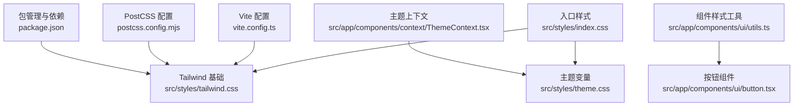
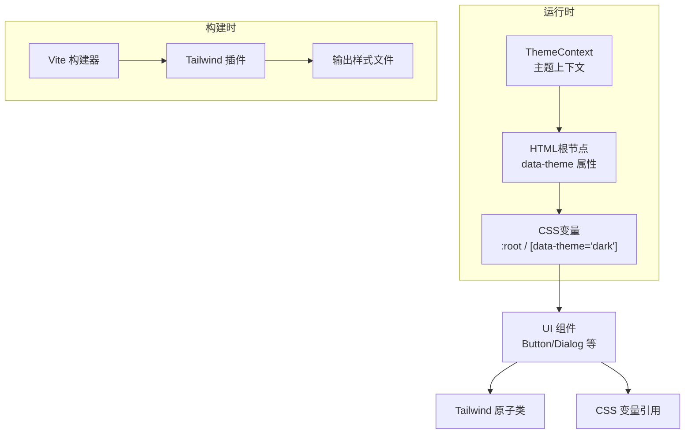
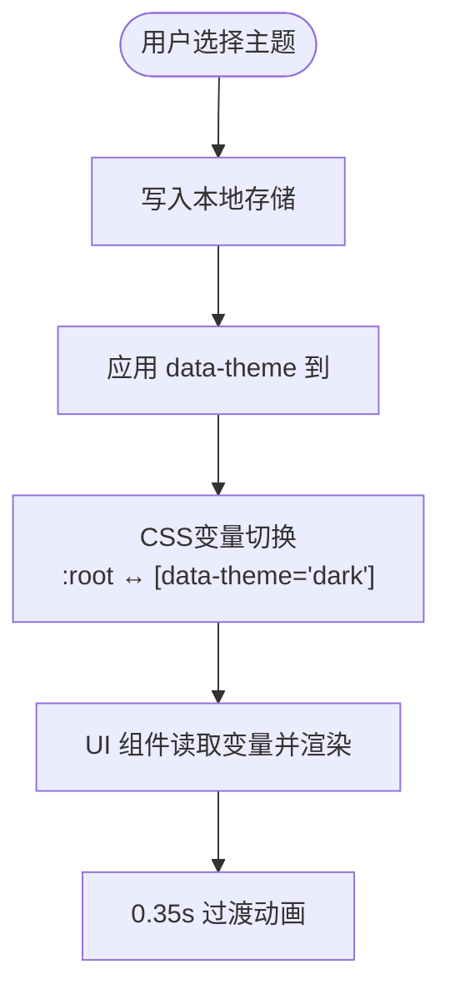
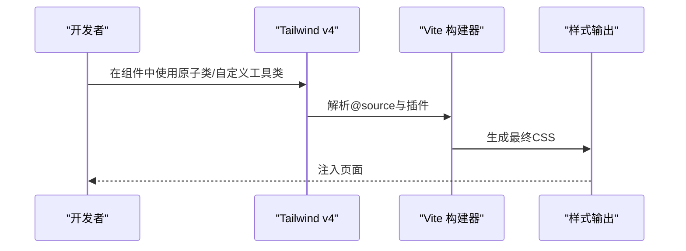
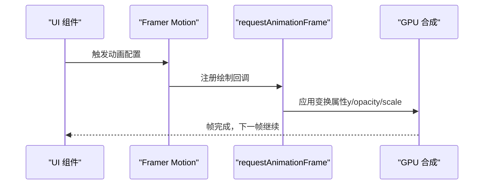
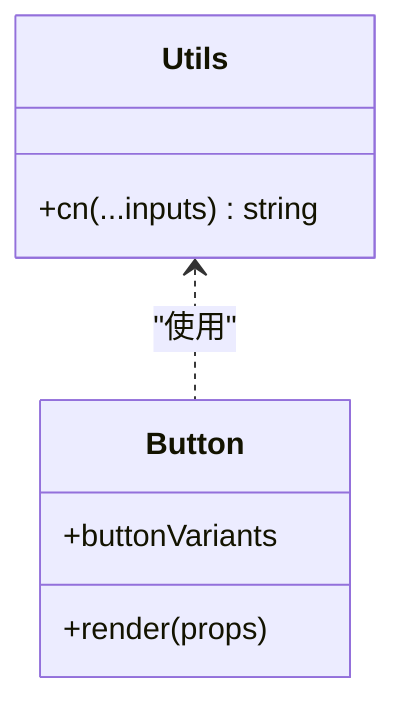
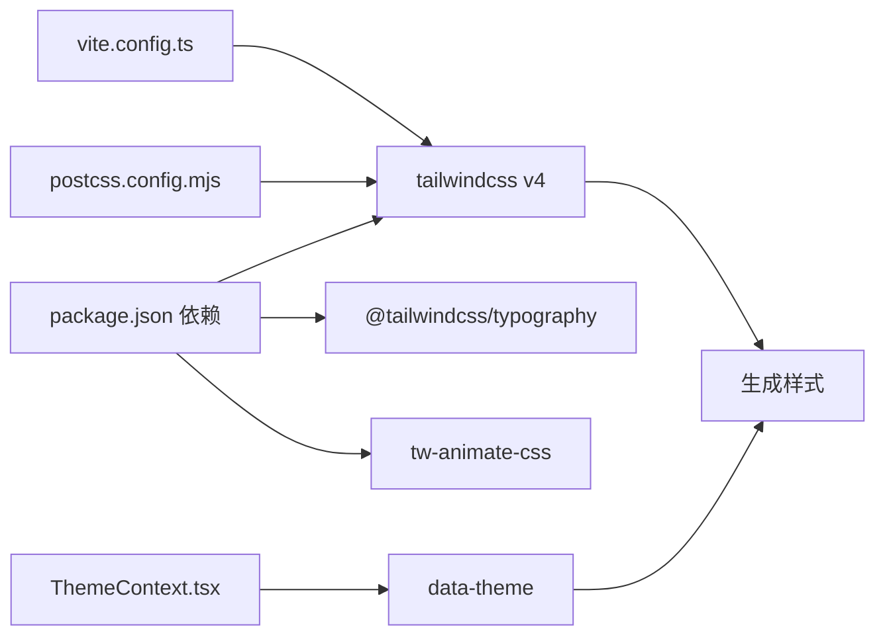

# 样式与主题系统

<cite>
**本文档引用的文件**
- [index.css](file://src/styles/index.css)
- [tailwind.css](file://src/styles/tailwind.css)
- [theme.css](file://src/styles/theme.css)
- [ThemeContext.tsx](file://src/app/components/context/ThemeContext.tsx)
- [utils.ts](file://src/app/components/ui/utils.ts)
- [button.tsx](file://src/app/components/ui/button.tsx)
- [dialog.tsx](file://src/app/components/ui/dialog.tsx)
- [vite.config.ts](file://vite.config.ts)
- [postcss.config.mjs](file://postcss.config.mjs)
- [package.json](file://package.json)
</cite>

## 目录
1. [简介](#简介)
2. [项目结构](#项目结构)
3. [核心组件](#核心组件)
4. [架构总览](#架构总览)
5. [详细组件分析](#详细组件分析)
6. [依赖关系分析](#依赖关系分析)
7. [性能考虑](#性能考虑)
8. [故障排查指南](#故障排查指南)
9. [结论](#结论)
10. [附录](#附录)

## 简介
本文件面向样式与主题系统，系统性阐述该前端项目的CSS架构设计理念、样式组织方式、命名规范与模块化策略；详解Tailwind CSS v4的配置与定制（含自定义工具类、主题变量与响应式断点）；覆盖动画实现（CSS动画与JavaScript驱动动画）及性能优化；解释主题系统（CSS变量、动态样式切换与主题继承）；提供样式调试工具使用方法与最佳实践；并包含浏览器兼容性、性能优化与可访问性支持建议，以及为开发者提供的样式扩展、主题定制与品牌视觉设计指导。

## 项目结构
样式与主题系统由三层构成：
- 入口聚合层：通过入口样式文件聚合字体、Tailwind基础与主题变量，形成统一的样式入口。
- 主题变量层：以CSS自定义属性为核心，定义明暗两套语义令牌与主题映射，支持运行时切换。
- 组件样式层：基于Tailwind v4与CVA（Class Variance Authority）实现原子化与变体化的UI组件。

图表来源
- [index.css:1-229](file://src/styles/index.css#L1-L229)
- [tailwind.css:1-7](file://src/styles/tailwind.css#L1-L7)
- [theme.css:1-280](file://src/styles/theme.css#L1-L280)
- [ThemeContext.tsx:1-110](file://src/app/components/context/ThemeContext.tsx#L1-L110)
- [utils.ts:1-7](file://src/app/components/ui/utils.ts#L1-L7)
- [button.tsx:1-59](file://src/app/components/ui/button.tsx#L1-L59)
- [vite.config.ts:1-44](file://vite.config.ts#L1-L44)
- [postcss.config.mjs:1-16](file://postcss.config.mjs#L1-L16)
- [package.json:1-113](file://package.json#L1-L113)

章节来源
- [index.css:1-229](file://src/styles/index.css#L1-L229)
- [tailwind.css:1-7](file://src/styles/tailwind.css#L1-L7)
- [theme.css:1-280](file://src/styles/theme.css#L1-L280)
- [ThemeContext.tsx:1-110](file://src/app/components/context/ThemeContext.tsx#L1-L110)
- [utils.ts:1-7](file://src/app/components/ui/utils.ts#L1-L7)
- [button.tsx:1-59](file://src/app/components/ui/button.tsx#L1-L59)
- [vite.config.ts:1-44](file://vite.config.ts#L1-L44)
- [postcss.config.mjs:1-16](file://postcss.config.mjs#L1-L16)
- [package.json:1-113](file://package.json#L1-L113)

## 核心组件
- 主题上下文与切换逻辑：负责在客户端读取系统偏好、持久化用户选择、应用data-theme属性并触发DOM更新。
- 主题变量与映射：以CSS自定义属性定义语义令牌，通过@theme inline生成设计系统变量，配合暗色变体实现主题继承。
- 组件样式工具：基于clsx与tailwind-merge合并与去重类名，确保原子化样式组合的确定性与性能。
- UI组件：采用CVA定义变体与尺寸，结合Tailwind原子类与CSS变量，实现一致的视觉与交互体验。

章节来源
- [ThemeContext.tsx:1-110](file://src/app/components/context/ThemeContext.tsx#L1-L110)
- [theme.css:1-280](file://src/styles/theme.css#L1-L280)
- [utils.ts:1-7](file://src/app/components/ui/utils.ts#L1-L7)
- [button.tsx:1-59](file://src/app/components/ui/button.tsx#L1-L59)

## 架构总览
整体架构围绕“CSS变量 + Tailwind v4 + React上下文”的模式构建，强调：
- 可维护性：通过CSS变量集中管理颜色、字体、半径等设计令牌。
- 可扩展性：Tailwind v4的@source扫描与插件体系支持自定义工具类与主题扩展。
- 可访问性：组件遵循语义化与键盘可达性，提供无障碍标签与焦点可见性。
- 性能：按需构建、类名合并去重、动画使用高性能属性。

图表来源
- [ThemeContext.tsx:50-61](file://src/app/components/context/ThemeContext.tsx#L50-L61)
- [theme.css:3-92](file://src/styles/theme.css#L3-L92)
- [vite.config.ts:7-10](file://vite.config.ts#L7-L10)
- [button.tsx:8-35](file://src/app/components/ui/button.tsx#L8-L35)

## 详细组件分析

### 主题系统与CSS变量
- 设计令牌：在:root中定义基础令牌（背景、前景、卡片、输入、开关背景、字体权重、环形光晕、图表色板、圆角半径等），并在[data-theme="dark"]中为暗色主题提供对应值。
- 主题映射：通过@theme inline将CSS变量映射为可被Tailwind使用的color/radius等设计系统变量，使原子类与CSS变量解耦。
- 动态切换：ThemeContext在DOM根节点设置data-theme属性，从而激活暗色变体与对应的语义令牌，实现平滑过渡。

图表来源
- [ThemeContext.tsx:63-105](file://src/app/components/context/ThemeContext.tsx#L63-L105)
- [theme.css:94-144](file://src/styles/theme.css#L94-L144)
- [theme.css:183-222](file://src/styles/theme.css#L183-L222)

章节来源
- [theme.css:1-280](file://src/styles/theme.css#L1-L280)
- [ThemeContext.tsx:1-110](file://src/app/components/context/ThemeContext.tsx#L1-L110)

### Tailwind CSS v4 配置与定制
- 插件与源码扫描：通过@source指定扫描范围，确保新组件样式被纳入构建；启用@tailwindcss/typography与tw-animate-css插件。
- 自定义工具类：可在tailwind.css中添加自定义指令与插件，实现品牌专属工具类。
- 响应式断点：Tailwind v4默认断点满足移动端优先策略，结合CSS变量与媒体查询可进一步细化。

图表来源
- [tailwind.css:1-7](file://src/styles/tailwind.css#L1-L7)
- [vite.config.ts:7-10](file://vite.config.ts#L7-L10)
- [package.json:87-91](file://package.json#L87-L91)

章节来源
- [tailwind.css:1-7](file://src/styles/tailwind.css#L1-L7)
- [vite.config.ts:1-44](file://vite.config.ts#L1-L44)
- [package.json:1-113](file://package.json#L1-L113)

### 动画设计与性能优化
- CSS动画：通过Tailwind内置动画类与@plugin tw-animate-css实现轻量级入场/出场动画。
- JavaScript驱动动画：使用motion（Framer Motion）实现复杂交互动画（如粒子、脉冲、堆叠提示等），并采用高性能属性（如y、opacity、scale）与repeat/无限循环策略。
- 性能优化：限制设备像素比上限、帧率节流、requestAnimationFrame调度、避免强制同步布局、减少重绘重排。

图表来源
- [button.tsx:8-35](file://src/app/components/ui/button.tsx#L8-L35)
- [dialog.tsx:41-46](file://src/app/components/ui/dialog.tsx#L41-L46)

章节来源
- [button.tsx:1-59](file://src/app/components/ui/button.tsx#L1-L59)
- [dialog.tsx:1-136](file://src/app/components/ui/dialog.tsx#L1-L136)

### 组件样式与类名合并
- 类名合并：utils.ts中的cn函数结合clsx与tailwind-merge，确保类名冲突消除与原子类去重。
- 组件变体：button.tsx使用CVA定义variant与size变体，结合Tailwind原子类与CSS变量，保证一致性与可维护性。

图表来源
- [utils.ts:4-6](file://src/app/components/ui/utils.ts#L4-L6)
- [button.tsx:7-35](file://src/app/components/ui/button.tsx#L7-L35)

章节来源
- [utils.ts:1-7](file://src/app/components/ui/utils.ts#L1-L7)
- [button.tsx:1-59](file://src/app/components/ui/button.tsx#L1-L59)

### 样式入口与编辑器适配
- 样式入口：index.css聚合字体、Tailwind基础与主题变量，确保全局样式顺序正确。
- 编辑器适配：针对富文本编辑器（Tiptap）提供专用样式（图片、标题渐变、引用块、列表与表格），统一视觉风格。

章节来源
- [index.css:1-229](file://src/styles/index.css#L1-L229)

## 依赖关系分析
- 构建链路：Vite加载@tailwindcss/vite插件，PostCSS配置为空（仅保留Tailwind v4自动配置），Tailwind v4负责扫描源码并生成样式。
- 运行时链路：ThemeContext在客户端读取系统偏好与本地存储，设置data-theme，CSS变量随之切换，UI组件重新渲染。

图表来源
- [package.json:87-91](file://package.json#L87-L91)
- [vite.config.ts:7-10](file://vite.config.ts#L7-L10)
- [postcss.config.mjs:15](file://postcss.config.mjs#L15)
- [ThemeContext.tsx:50-61](file://src/app/components/context/ThemeContext.tsx#L50-L61)

章节来源
- [package.json:1-113](file://package.json#L1-L113)
- [vite.config.ts:1-44](file://vite.config.ts#L1-L44)
- [postcss.config.mjs:1-16](file://postcss.config.mjs#L1-L16)
- [ThemeContext.tsx:1-110](file://src/app/components/context/ThemeContext.tsx#L1-L110)

## 性能考虑
- 构建期优化：Tailwind v4按需扫描源码，减少无效样式；PostCSS保持最小配置，避免额外转换开销。
- 运行时优化：CSS变量切换成本低；类名合并避免重复与冲突；动画使用GPU加速属性；限制设备像素比与帧率节流降低渲染压力。
- 资源优化：合理拆分样式入口，避免一次性注入过多规则；对第三方UI库样式进行按需引入。

## 故障排查指南
- 主题不生效
  - 检查是否正确设置<html>的data-theme属性。
  - 确认CSS变量映射与暗色变体声明完整。
- 动画卡顿
  - 使用GPU加速属性（如transform/opacity）替代布局敏感属性。
  - 控制动画数量与频率，避免同时大量动画。
- 类名冲突
  - 使用cn函数合并类名，确保tailwind-merge正确去重。
- 构建异常
  - 确认@tailwindcss/vite已安装且版本匹配；检查@source路径与文件后缀。

章节来源
- [ThemeContext.tsx:50-61](file://src/app/components/context/ThemeContext.tsx#L50-L61)
- [theme.css:183-222](file://src/styles/theme.css#L183-L222)
- [utils.ts:4-6](file://src/app/components/ui/utils.ts#L4-L6)
- [vite.config.ts:7-10](file://vite.config.ts#L7-L10)

## 结论
该样式与主题系统以CSS变量为核心、Tailwind v4为骨架、React上下文为控制器，实现了高可维护性与强扩展性的前端样式基础设施。通过合理的命名规范、模块化组织与性能优化策略，既满足当前业务需求，也为未来品牌视觉扩展与主题定制提供了清晰路径。

## 附录
- 浏览器兼容性：Tailwind v4与现代浏览器良好兼容；如需支持旧版浏览器，建议在PostCSS中添加必要插件（当前配置为空）。
- 可访问性：组件提供语义化标签与焦点可见性，建议在新增组件时遵循WCAG标准。
- 主题定制建议：通过扩展CSS变量与@theme映射，逐步沉淀品牌设计令牌；对常用变体封装为CVA，提升复用性与一致性。