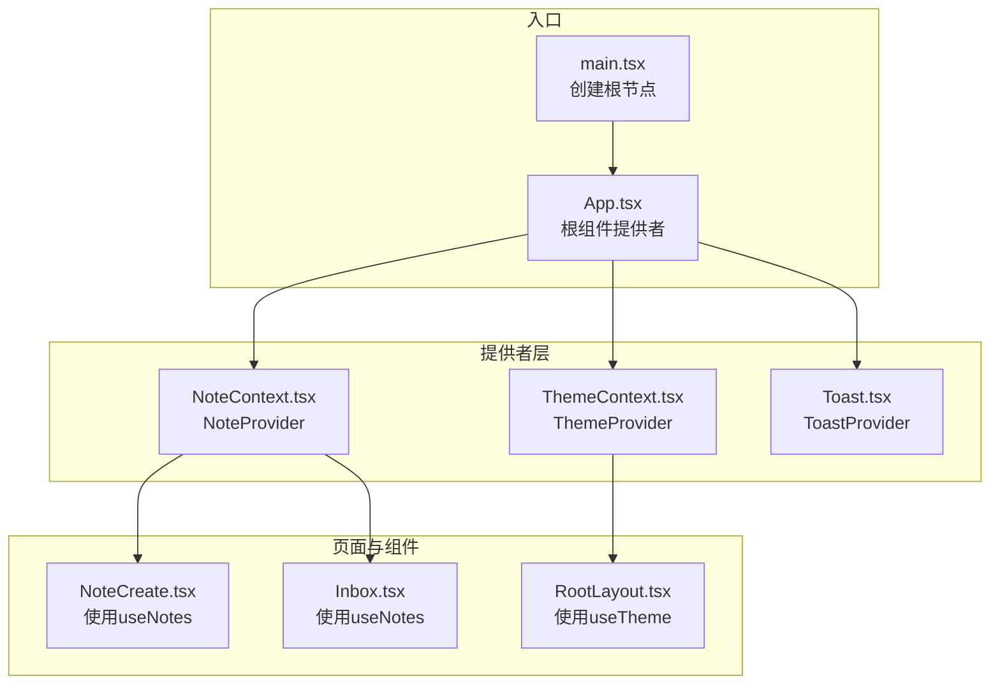
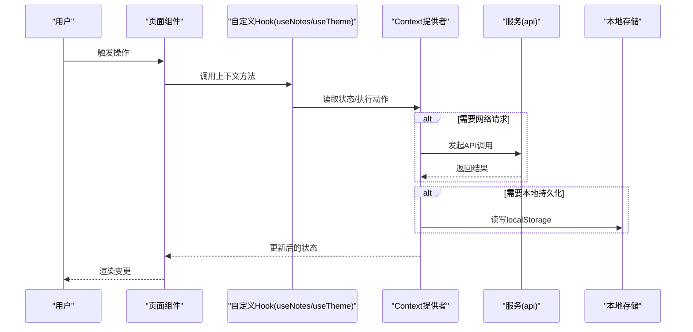
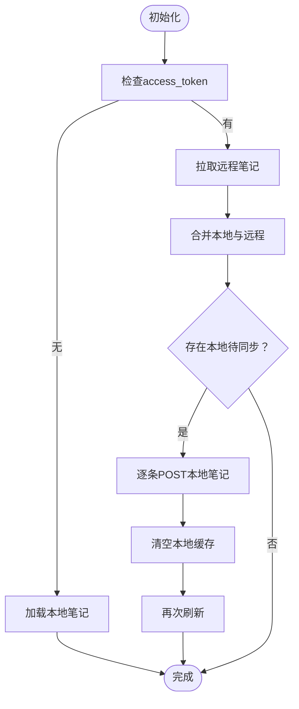
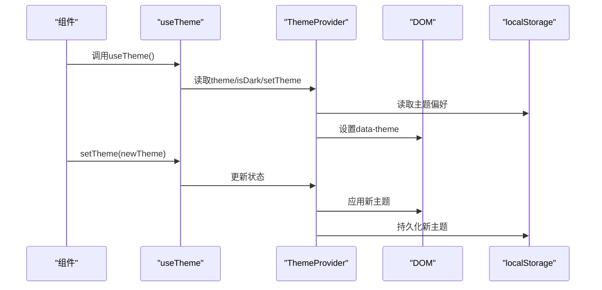
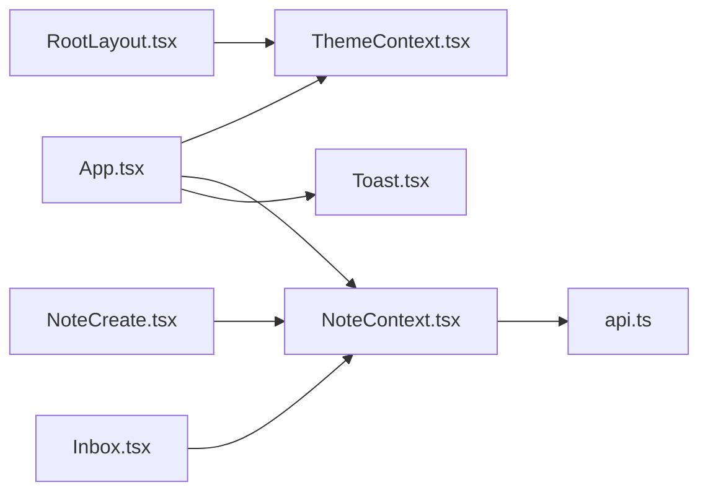

# Context提供者系统

<cite>
**本文档引用的文件**
- [NoteContext.tsx](file://src/app/components/context/NoteContext.tsx)
- [ThemeContext.tsx](file://src/app/components/context/ThemeContext.tsx)
- [App.tsx](file://src/app/App.tsx)
- [main.tsx](file://src/main.tsx)
- [api.ts](file://src/app/services/api.ts)
- [NoteCreate.tsx](file://src/app/pages/NoteCreate.tsx)
- [Inbox.tsx](file://src/app/pages/Inbox.tsx)
- [RootLayout.tsx](file://src/app/components/RootLayout.tsx)
- [Toast.tsx](file://src/app/components/ui/Toast.tsx)
</cite>

## 目录
1. [简介](#简介)
2. [项目结构](#项目结构)
3. [核心组件](#核心组件)
4. [架构概览](#架构概览)
5. [详细组件分析](#详细组件分析)
6. [依赖关系分析](#依赖关系分析)
7. [性能考量](#性能考量)
8. [故障排除指南](#故障排除指南)
9. [结论](#结论)
10. [附录](#附录)

## 简介
本文件系统性阐述该笔记应用前端的Context提供者体系，重点解析NoteContext与ThemeContext的设计理念、实现细节与最佳实践。文档覆盖状态管理模式、数据流、组件间通信、组合使用、嵌套提供者、错误处理、状态持久化、异步状态管理与并发更新策略，并给出扩展与自定义状态管理的指导。

## 项目结构
应用采用分层组织，Context提供者位于组件层，通过根组件进行注入，页面组件通过自定义Hook消费上下文，服务层负责与后端交互。

**图表来源**
- [main.tsx:1-7](file://src/main.tsx#L1-L7)
- [App.tsx:1-17](file://src/app/App.tsx#L1-L17)
- [ThemeContext.tsx:63-105](file://src/app/components/context/ThemeContext.tsx#L63-L105)
- [NoteContext.tsx:89-347](file://src/app/components/context/NoteContext.tsx#L89-L347)
- [Toast.tsx:458-478](file://src/app/components/ui/Toast.tsx#L458-L478)
- [NoteCreate.tsx:999-1003](file://src/app/pages/NoteCreate.tsx#L999-L1003)
- [Inbox.tsx:40-42](file://src/app/pages/Inbox.tsx#L40-L42)
- [RootLayout.tsx:10-11](file://src/app/components/RootLayout.tsx#L10-L11)

**章节来源**
- [main.tsx:1-7](file://src/main.tsx#L1-L7)
- [App.tsx:1-17](file://src/app/App.tsx#L1-L17)

## 核心组件
- NoteContext：统一管理笔记列表、加载状态、错误信息与CRUD操作；内置本地存储与云端同步逻辑。
- ThemeContext：管理主题模式、深色/浅色状态与系统跟随；持久化用户偏好并响应系统主题变化。
- ToastProvider：全局通知系统，支持多种类型与动画效果，提供toast工具集。

**章节来源**
- [NoteContext.tsx:18-26](file://src/app/components/context/NoteContext.tsx#L18-L26)
- [ThemeContext.tsx:5-9](file://src/app/components/context/ThemeContext.tsx#L5-L9)
- [Toast.tsx:26-42](file://src/app/components/ui/Toast.tsx#L26-L42)

## 架构概览
应用采用“根提供者注入 + 页面/组件消费”的模式。根组件同时包裹多个提供者，形成多层上下文树。页面通过useNotes/useTheme等自定义Hook访问对应上下文值，实现跨层级的状态共享与事件驱动。

**图表来源**
- [App.tsx:7-16](file://src/app/App.tsx#L7-L16)
- [NoteContext.tsx:89-347](file://src/app/components/context/NoteContext.tsx#L89-L347)
- [ThemeContext.tsx:63-105](file://src/app/components/context/ThemeContext.tsx#L63-L105)
- [api.ts:36-42](file://src/app/services/api.ts#L36-L42)

## 详细组件分析

### NoteContext：笔记状态管理
- 数据模型与规范化
  - Note类型包含id、title、content、type、status、createdAt、tags、imageUrl、structuredData、localOnly、pendingSync等字段。
  - 内容规范化：normalizeContent将输入标准化为字符串；stripHtmlToPlainText去除HTML标签提取纯文本；deriveDisplayTitle优先使用标题，否则从内容截断生成。
  - 标签规范化：normalizeTags兼容数组、字符串与JSON字符串数组，支持中文逗号、顿号、空格、竖线等分隔符。
- 提供者职责
  - 初始化：从localStorage加载本地笔记，设置loading=true，error=null。
  - 获取笔记：若存在access_token则拉取后端数据，合并本地与云端，去重排序；否则仅使用本地数据。
  - 同步策略：检测本地待同步笔记，逐条POST至后端，成功后清空本地缓存并再次刷新。
  - 增删改：无token时走本地流程（更新内存与localStorage），有token时调用后端接口并回写本地状态。
- 订阅与渲染
  - 组件通过useNotes消费上下文，直接读取notes、loading、error与操作方法，无需层层传递props。
- 错误处理
  - 请求异常捕获并设置error；对401进行令牌刷新与登出处理；对网络异常与后端错误进行友好提示。

**图表来源**
- [NoteContext.tsx:152-218](file://src/app/components/context/NoteContext.tsx#L152-L218)
- [NoteContext.tsx:191-210](file://src/app/components/context/NoteContext.tsx#L191-L210)

**章节来源**
- [NoteContext.tsx:4-16](file://src/app/components/context/NoteContext.tsx#L4-L16)
- [NoteContext.tsx:30-57](file://src/app/components/context/NoteContext.tsx#L30-L57)
- [NoteContext.tsx:59-87](file://src/app/components/context/NoteContext.tsx#L59-L87)
- [NoteContext.tsx:89-218](file://src/app/components/context/NoteContext.tsx#L89-L218)
- [NoteContext.tsx:224-340](file://src/app/components/context/NoteContext.tsx#L224-L340)

### ThemeContext：主题状态管理
- 主题枚举与解析
  - ThemeId支持'system'、'light'、'dark'；resolveTheme将'system'解析为当前系统偏好。
- 存储与DOM应用
  - 从localStorage读取用户偏好；applyToDOM根据resolved主题设置<html>的data-theme属性，实现样式切换。
- 响应式更新
  - 首次挂载与theme变化时应用主题；监听系统主题变化（当处于'system'模式时）以动态调整。
- 消费与使用
  - useTheme返回theme、isDark与setTheme；页面组件可据此控制UI外观与元信息（如theme-color）。

**图表来源**
- [ThemeContext.tsx:63-105](file://src/app/components/context/ThemeContext.tsx#L63-L105)
- [RootLayout.tsx:10-30](file://src/app/components/RootLayout.tsx#L10-L30)

**章节来源**
- [ThemeContext.tsx:3-15](file://src/app/components/context/ThemeContext.tsx#L3-L15)
- [ThemeContext.tsx:17-48](file://src/app/components/context/ThemeContext.tsx#L17-L48)
- [ThemeContext.tsx:50-61](file://src/app/components/context/ThemeContext.tsx#L50-L61)
- [ThemeContext.tsx:63-105](file://src/app/components/context/ThemeContext.tsx#L63-L105)
- [RootLayout.tsx:10-30](file://src/app/components/RootLayout.tsx#L10-L30)

### ToastProvider：全局通知系统
- 单例调度：通过全局_addToast/_removeToast维护通知队列，限制同时展示数量。
- 类型与配置：内置16种通知类型，每种类型具有默认标题、颜色、图标、动画与持续时间。
- 渲染与动画：使用motion/react实现进入/退出动画与计时条，支持动作按钮与自动关闭。
- 使用方式：通过toast工具集在任意组件或普通函数中调用，如toast.success、toast.error等。

**章节来源**
- [Toast.tsx:92-126](file://src/app/components/ui/Toast.tsx#L92-L126)
- [Toast.tsx:54-71](file://src/app/components/ui/Toast.tsx#L54-L71)
- [Toast.tsx:458-478](file://src/app/components/ui/Toast.tsx#L458-L478)

## 依赖关系分析
- 根组件注入顺序：ThemeProvider -> NoteProvider -> ToastProvider -> RouterProvider。
- 页面组件依赖：NoteCreate、Inbox等页面直接使用useNotes；RootLayout使用useTheme。
- 服务依赖：NoteContext内部通过api服务发起HTTP请求；api.ts封装Axios实例与拦截器，处理鉴权与令牌刷新。

**图表来源**
- [App.tsx:7-16](file://src/app/App.tsx#L7-L16)
- [NoteContext.tsx:89-347](file://src/app/components/context/NoteContext.tsx#L89-L347)
- [ThemeContext.tsx:63-105](file://src/app/components/context/ThemeContext.tsx#L63-L105)
- [Toast.tsx:458-478](file://src/app/components/ui/Toast.tsx#L458-L478)
- [api.ts:36-42](file://src/app/services/api.ts#L36-L42)
- [NoteCreate.tsx:999-1003](file://src/app/pages/NoteCreate.tsx#L999-L1003)
- [Inbox.tsx:40-42](file://src/app/pages/Inbox.tsx#L40-L42)
- [RootLayout.tsx:10-11](file://src/app/components/RootLayout.tsx#L10-L11)

**章节来源**
- [App.tsx:1-17](file://src/app/App.tsx#L1-L17)
- [api.ts:36-127](file://src/app/services/api.ts#L36-L127)

## 性能考量
- 本地优先与批量同步：NoteContext在无token时优先使用本地存储，减少网络请求；待token可用时批量同步本地笔记，避免频繁网络抖动。
- 合并与去重：拉取远程笔记后基于id构建Map，确保唯一性与一致性，避免重复渲染。
- 作用域最小化：每个提供者仅暴露必要方法与状态，降低订阅范围与重渲染成本。
- 主题切换过渡：ThemeContext为<html>设置过渡动画，避免闪烁。
- 通知节流：ToastProvider限制同时展示数量，避免过度DOM节点与动画开销。

[本节为通用性能建议，不直接分析具体文件]

## 故障排除指南
- 上下文未包装
  - 症状：useNotes/useTheme抛出错误。
  - 排查：确认根组件是否正确包裹对应Provider。
  - 参考：useNotes内部错误抛出位置。
- 网络异常与后端错误
  - 症状：toast.error显示“网络开小差了”或后端错误消息。
  - 排查：检查api拦截器与全局错误翻译逻辑。
- 401未授权与令牌刷新
  - 症状：自动跳转登录页。
  - 排查：确认refresh_token存在与刷新流程是否成功。
- 本地笔记无法同步
  - 症状：本地新增笔记未上云。
  - 排查：检查本地待同步标记与同步循环逻辑。

**章节来源**
- [NoteContext.tsx:349-355](file://src/app/components/context/NoteContext.tsx#L349-L355)
- [api.ts:56-127](file://src/app/services/api.ts#L56-L127)

## 结论
该Context提供者系统通过清晰的职责划分与稳健的错误处理，实现了笔记与主题两大核心状态的高效管理。NoteContext兼顾本地与云端，提供平滑的用户体验；ThemeContext响应系统偏好，确保视觉一致性。结合ToastProvider，形成完整的状态管理与反馈闭环。建议在扩展时遵循现有模式：单一职责、最小暴露、明确错误边界与持久化策略。

[本节为总结性内容，不直接分析具体文件]

## 附录

### 使用示例与最佳实践
- 正确使用Context提供者
  - 在根组件按需顺序包裹Provider，确保子树可访问所需上下文。
  - 页面组件通过useNotes/useTheme消费状态与方法，避免跨层级props传递。
- 状态更新与订阅机制
  - 通过提供者暴露的方法触发状态变更，组件内部使用useMemo/useCallback优化重渲染。
- 性能优化
  - 合理拆分提供者，缩小订阅范围；对高频更新的数据进行稳定化处理。
- 组合使用与嵌套提供者
  - 多个提供者可并行存在，注意提供者顺序与依赖关系。
- 错误边界处理
  - 在提供者内部捕获异常并设置error，向UI层暴露统一错误状态。
- 状态持久化与异步管理
  - 本地存储作为兜底方案；异步操作采用防抖/节流与重试策略。
- 并发更新处理
  - 对关键操作加锁（如同步循环），避免竞态条件；必要时引入乐观更新与回滚。

**章节来源**
- [App.tsx:7-16](file://src/app/App.tsx#L7-L16)
- [NoteCreate.tsx:999-1003](file://src/app/pages/NoteCreate.tsx#L999-L1003)
- [Inbox.tsx:40-42](file://src/app/pages/Inbox.tsx#L40-L42)
- [RootLayout.tsx:10-30](file://src/app/components/RootLayout.tsx#L10-L30)