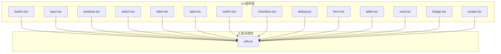
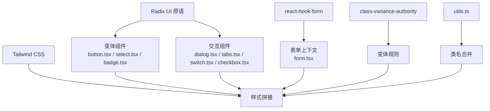
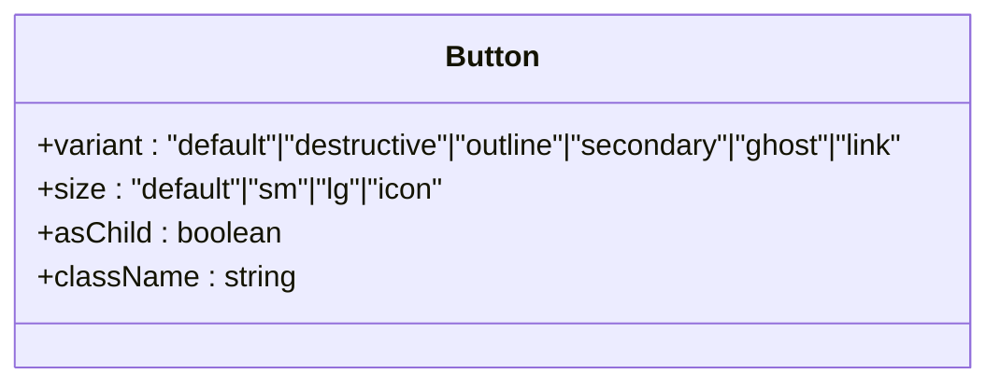
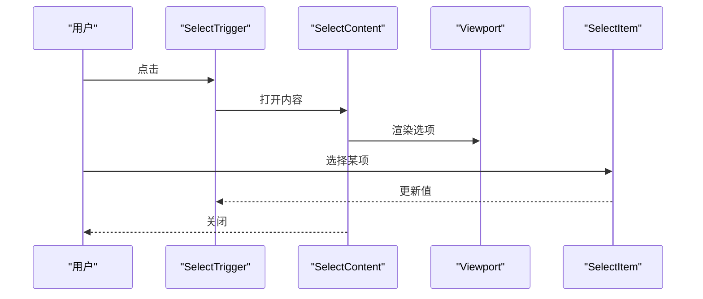
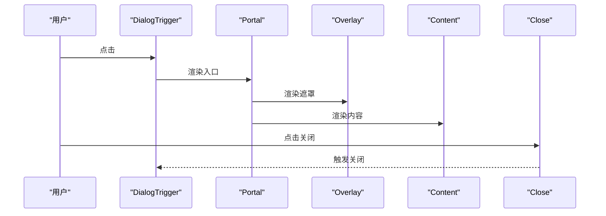
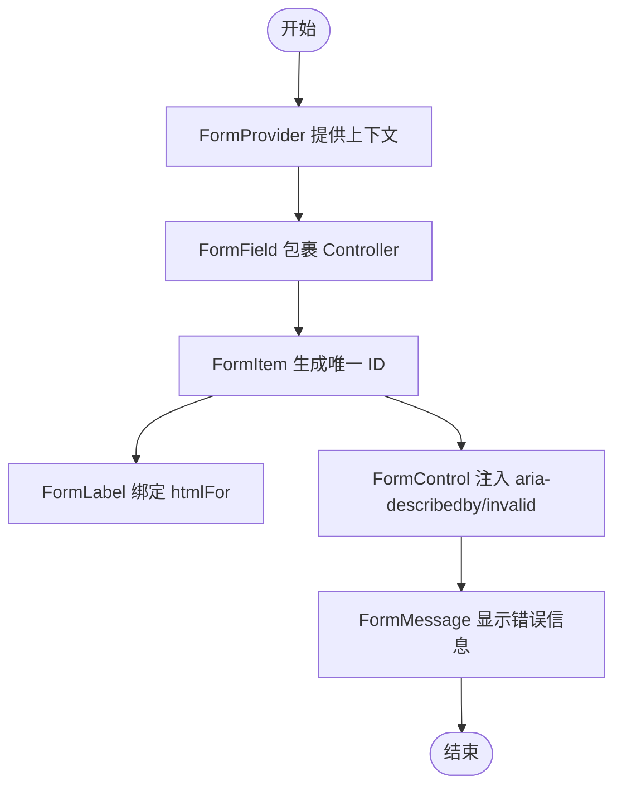
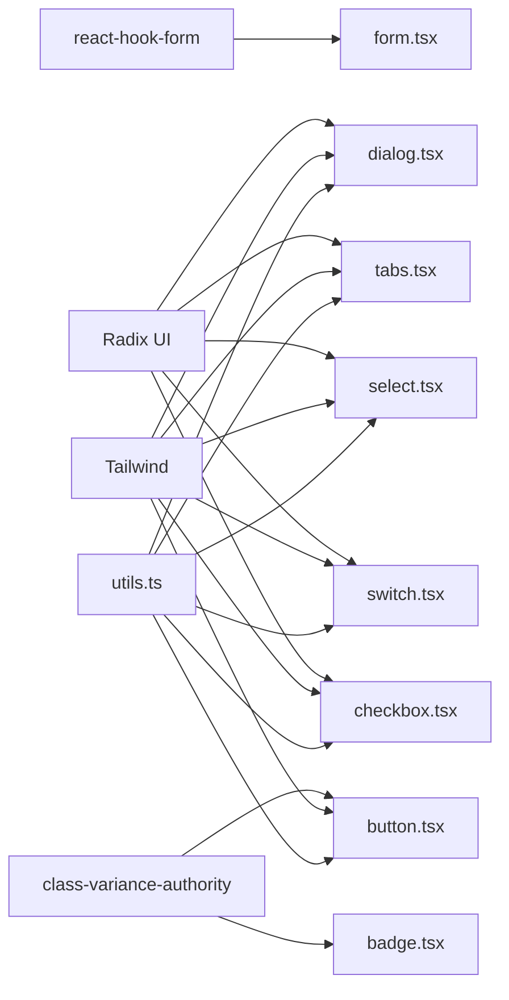

# UI组件库

<cite>
**本文引用的文件**
- [button.tsx](file://src/app/components/ui/button.tsx)
- [input.tsx](file://src/app/components/ui/input.tsx)
- [dialog.tsx](file://src/app/components/ui/dialog.tsx)
- [form.tsx](file://src/app/components/ui/form.tsx)
- [table.tsx](file://src/app/components/ui/table.tsx)
- [card.tsx](file://src/app/components/ui/card.tsx)
- [badge.tsx](file://src/app/components/ui/badge.tsx)
- [avatar.tsx](file://src/app/components/ui/avatar.tsx)
- [textarea.tsx](file://src/app/components/ui/textarea.tsx)
- [select.tsx](file://src/app/components/ui/select.tsx)
- [label.tsx](file://src/app/components/ui/label.tsx)
- [tabs.tsx](file://src/app/components/ui/tabs.tsx)
- [switch.tsx](file://src/app/components/ui/switch.tsx)
- [checkbox.tsx](file://src/app/components/ui/checkbox.tsx)
- [utils.ts](file://src/app/components/ui/utils.ts)
</cite>

## 目录
1. [简介](#简介)
2. [项目结构](#项目结构)
3. [核心组件](#核心组件)
4. [架构总览](#架构总览)
5. [组件详解](#组件详解)
6. [依赖关系分析](#依赖关系分析)
7. [性能与可访问性](#性能与可访问性)
8. [故障排查指南](#故障排查指南)
9. [结论](#结论)
10. [附录：扩展与定制实践](#附录扩展与定制实践)

## 简介
本文件面向开发者与设计团队，系统化梳理本项目中的UI组件库，覆盖按钮、输入框、对话框、表单、表格、卡片、徽标、头像、文本域、选择器、标签、标签页、开关、复选框等基础组件。文档从架构、数据流、可访问性、样式定制、组合模式、动画与过渡、响应式适配、主题与性能优化等方面进行深入说明，并提供可直接定位到源码的路径指引，便于快速查阅与二次开发。

## 项目结构
UI组件集中位于 src/app/components/ui 目录下，采用“按功能模块拆分”的组织方式，每个组件独立文件，便于按需引入与维护。组件普遍以 Radix UI 为基础，结合 class-variance-authority 实现变体样式，使用 Tailwind CSS 进行样式拼接与主题化，通过统一的工具函数进行类名合并与冲突修复。

图表来源
- [button.tsx:1-59](file://src/app/components/ui/button.tsx#L1-L59)
- [input.tsx:1-22](file://src/app/components/ui/input.tsx#L1-L22)
- [textarea.tsx:1-19](file://src/app/components/ui/textarea.tsx#L1-L19)
- [select.tsx:1-190](file://src/app/components/ui/select.tsx#L1-L190)
- [label.tsx:1-25](file://src/app/components/ui/label.tsx#L1-L25)
- [tabs.tsx:1-67](file://src/app/components/ui/tabs.tsx#L1-L67)
- [switch.tsx:1-32](file://src/app/components/ui/switch.tsx#L1-L32)
- [checkbox.tsx:1-33](file://src/app/components/ui/checkbox.tsx#L1-L33)
- [dialog.tsx:1-136](file://src/app/components/ui/dialog.tsx#L1-L136)
- [form.tsx:1-169](file://src/app/components/ui/form.tsx#L1-L169)
- [table.tsx:1-117](file://src/app/components/ui/table.tsx#L1-L117)
- [card.tsx:1-93](file://src/app/components/ui/card.tsx#L1-L93)
- [badge.tsx:1-47](file://src/app/components/ui/badge.tsx#L1-L47)
- [avatar.tsx:1-54](file://src/app/components/ui/avatar.tsx#L1-L54)
- [utils.ts:1-7](file://src/app/components/ui/utils.ts#L1-L7)

章节来源
- [button.tsx:1-59](file://src/app/components/ui/button.tsx#L1-L59)
- [input.tsx:1-22](file://src/app/components/ui/input.tsx#L1-L22)
- [dialog.tsx:1-136](file://src/app/components/ui/dialog.tsx#L1-L136)
- [form.tsx:1-169](file://src/app/components/ui/form.tsx#L1-L169)
- [table.tsx:1-117](file://src/app/components/ui/table.tsx#L1-L117)
- [card.tsx:1-93](file://src/app/components/ui/card.tsx#L1-L93)
- [badge.tsx:1-47](file://src/app/components/ui/badge.tsx#L1-L47)
- [avatar.tsx:1-54](file://src/app/components/ui/avatar.tsx#L1-L54)
- [textarea.tsx:1-19](file://src/app/components/ui/textarea.tsx#L1-L19)
- [select.tsx:1-190](file://src/app/components/ui/select.tsx#L1-L190)
- [label.tsx:1-25](file://src/app/components/ui/label.tsx#L1-L25)
- [tabs.tsx:1-67](file://src/app/components/ui/tabs.tsx#L1-L67)
- [switch.tsx:1-32](file://src/app/components/ui/switch.tsx#L1-L32)
- [checkbox.tsx:1-33](file://src/app/components/ui/checkbox.tsx#L1-L33)
- [utils.ts:1-7](file://src/app/components/ui/utils.ts#L1-L7)

## 核心组件
本节概览各组件的职责、典型用法与可定制点，帮助快速定位到具体实现文件。

- 按钮 Button
  - 职责：承载交互动作，支持多种视觉变体与尺寸；支持透传原生 button 属性或作为容器渲染。
  - 关键特性：变体（默认/破坏性/描边/次级/幽灵/链接）、尺寸（默认/小/大/图标）、焦点可见性与禁用态样式、可选 asChild 渲染。
  - 参考路径：[button.tsx:1-59](file://src/app/components/ui/button.tsx#L1-L59)

- 输入框 Input
  - 职责：基础文本输入，内置聚焦环、禁用态、错误态样式。
  - 关键特性：占位符、选择态、聚焦环、错误态 aria-invalid。
  - 参考路径：[input.tsx:1-22](file://src/app/components/ui/input.tsx#L1-L22)

- 文本域 Textarea
  - 职责：多行文本输入，支持禁用与聚焦环。
  - 参考路径：[textarea.tsx:1-19](file://src/app/components/ui/textarea.tsx#L1-L19)

- 选择器 Select
  - 职责：下拉选择，支持组、标签、滚动按钮、内容区动画与定位。
  - 关键特性：触发器尺寸、内容弹出位置、项指示器、滚动控制。
  - 参考路径：[select.tsx:1-190](file://src/app/components/ui/select.tsx#L1-L190)

- 标签 Label
  - 职责：与表单控件关联，支持禁用态与分组禁用态。
  - 参考路径：[label.tsx:1-25](file://src/app/components/ui/label.tsx#L1-L25)

- 标签页 Tabs
  - 职责：内容分区切换，支持列表与触发器样式。
  - 参考路径：[tabs.tsx:1-67](file://src/app/components/ui/tabs.tsx#L1-L67)

- 开关 Switch
  - 职责：二元状态切换，支持禁用与聚焦环。
  - 参考路径：[switch.tsx:1-32](file://src/app/components/ui/switch.tsx#L1-L32)

- 复选框 Checkbox
  - 职责：多选/单选，内置指示器图标。
  - 参考路径：[checkbox.tsx:1-33](file://src/app/components/ui/checkbox.tsx#L1-L33)

- 对话框 Dialog
  - 职责：模态弹窗，包含根、触发器、入口、遮罩、内容、标题、描述、页脚等子组件。
  - 关键特性：入场/出场动画、居中布局、关闭按钮、无障碍属性。
  - 参考路径：[dialog.tsx:1-136](file://src/app/components/ui/dialog.tsx#L1-L136)

- 表单 Form
  - 职责：基于 react-hook-form 的表单上下文与字段封装，提供标签、描述、消息、控制槽位。
  - 关键特性：字段上下文、错误态 aria 描述、表单 Provider。
  - 参考路径：[form.tsx:1-169](file://src/app/components/ui/form.tsx#L1-L169)

- 表格 Table
  - 职责：表格容器与行/列/表头/单元格等子组件，支持横向滚动容器。
  - 参考路径：[table.tsx:1-117](file://src/app/components/ui/table.tsx#L1-L117)

- 卡片 Card
  - 职责：内容容器，支持头部、标题、描述、操作、内容、底部等区域。
  - 参考路径：[card.tsx:1-93](file://src/app/components/ui/card.tsx#L1-L93)

- 徽标 Badge
  - 职责：标签式标识，支持多种变体与图标。
  - 参考路径：[badge.tsx:1-47](file://src/app/components/ui/badge.tsx#L1-L47)

- 头像 Avatar
  - 职责：用户头像，支持图片与回退占位。
  - 参考路径：[avatar.tsx:1-54](file://src/app/components/ui/avatar.tsx#L1-L54)

- 工具函数 Utils
  - 职责：类名合并与冲突修复。
  - 参考路径：[utils.ts:1-7](file://src/app/components/ui/utils.ts#L1-L7)

章节来源
- [button.tsx:1-59](file://src/app/components/ui/button.tsx#L1-L59)
- [input.tsx:1-22](file://src/app/components/ui/input.tsx#L1-L22)
- [textarea.tsx:1-19](file://src/app/components/ui/textarea.tsx#L1-L19)
- [select.tsx:1-190](file://src/app/components/ui/select.tsx#L1-L190)
- [label.tsx:1-25](file://src/app/components/ui/label.tsx#L1-L25)
- [tabs.tsx:1-67](file://src/app/components/ui/tabs.tsx#L1-L67)
- [switch.tsx:1-32](file://src/app/components/ui/switch.tsx#L1-L32)
- [checkbox.tsx:1-33](file://src/app/components/ui/checkbox.tsx#L1-L33)
- [dialog.tsx:1-136](file://src/app/components/ui/dialog.tsx#L1-L136)
- [form.tsx:1-169](file://src/app/components/ui/form.tsx#L1-L169)
- [table.tsx:1-117](file://src/app/components/ui/table.tsx#L1-L117)
- [card.tsx:1-93](file://src/app/components/ui/card.tsx#L1-L93)
- [badge.tsx:1-47](file://src/app/components/ui/badge.tsx#L1-L47)
- [avatar.tsx:1-54](file://src/app/components/ui/avatar.tsx#L1-L54)
- [utils.ts:1-7](file://src/app/components/ui/utils.ts#L1-L7)

## 架构总览
组件库遵循“基础组件 + 变体样式 + 上下文/表单集成 + 动画/无障碍”的分层架构。基础组件以 Radix UI 为核心，确保可访问性与跨浏览器一致性；变体通过 class-variance-authority 管理；样式统一由 Tailwind 提供，工具函数负责类名合并；表单体系基于 react-hook-form，提供字段上下文与错误态管理。

图表来源
- [button.tsx:1-59](file://src/app/components/ui/button.tsx#L1-L59)
- [select.tsx:1-190](file://src/app/components/ui/select.tsx#L1-L190)
- [badge.tsx:1-47](file://src/app/components/ui/badge.tsx#L1-L47)
- [dialog.tsx:1-136](file://src/app/components/ui/dialog.tsx#L1-L136)
- [tabs.tsx:1-67](file://src/app/components/ui/tabs.tsx#L1-L67)
- [switch.tsx:1-32](file://src/app/components/ui/switch.tsx#L1-L32)
- [checkbox.tsx:1-33](file://src/app/components/ui/checkbox.tsx#L1-L33)
- [form.tsx:1-169](file://src/app/components/ui/form.tsx#L1-L169)
- [utils.ts:1-7](file://src/app/components/ui/utils.ts#L1-L7)

## 组件详解

### 按钮 Button
- Props 接口
  - className: 自定义类名
  - variant: 变体（default/destructive/outline/secondary/ghost/link）
  - size: 尺寸（default/sm/lg/icon）
  - asChild: 是否以子节点容器渲染
  - 其余继承原生 button 属性
- 事件与行为
  - 支持 onClick 等原生事件
  - 禁用态自动叠加透明度与指针事件
  - 聚焦可见性：边框环与扩展环
- 样式定制
  - 通过 variant/size 控制背景、边框、文字色
  - 支持 SVG 内联图标尺寸与对齐
- 可访问性
  - 自动设置 aria-invalid 与聚焦环
- 使用示例（路径）
  - [button.tsx:37-56](file://src/app/components/ui/button.tsx#L37-L56)

图表来源
- [button.tsx:37-56](file://src/app/components/ui/button.tsx#L37-L56)

章节来源
- [button.tsx:1-59](file://src/app/components/ui/button.tsx#L1-L59)

### 输入框 Input
- Props 接口
  - className: 自定义类名
  - type: 原生 input 类型
  - 其余继承原生 input 属性
- 样式与交互
  - 聚焦时边框与扩展环
  - 错误态 aria-invalid
  - 占位符与选择态颜色
- 使用示例（路径）
  - [input.tsx:5-19](file://src/app/components/ui/input.tsx#L5-L19)

章节来源
- [input.tsx:1-22](file://src/app/components/ui/input.tsx#L1-L22)

### 文本域 Textarea
- Props 接口
  - className: 自定义类名
  - 其余继承原生 textarea 属性
- 样式与交互
  - 禁用态、聚焦环、错误态
  - 自适应高度与可选 resize
- 使用示例（路径）
  - [textarea.tsx:5-15](file://src/app/components/ui/textarea.tsx#L5-L15)

章节来源
- [textarea.tsx:1-19](file://src/app/components/ui/textarea.tsx#L1-L19)

### 选择器 Select
- 子组件
  - Select/SelectTrigger/SelectValue/SelectContent/SelectGroup/SelectLabel/SelectItem/SelectSeparator/SelectScrollUpButton/SelectScrollDownButton
- Props 接口
  - SelectTrigger: size（sm/default）
  - SelectContent: position（popper/等）
- 动画与定位
  - 打开/关闭动画、侧向滑入、弹出器定位
- 使用示例（路径）
  - [select.tsx:13-189](file://src/app/components/ui/select.tsx#L13-L189)

图表来源
- [select.tsx:31-127](file://src/app/components/ui/select.tsx#L31-L127)

章节来源
- [select.tsx:1-190](file://src/app/components/ui/select.tsx#L1-L190)

### 标签 Label
- Props 接口
  - className: 自定义类名
  - 其余继承原生 label 属性
- 可访问性
  - 与表单控件联动，支持禁用态
- 使用示例（路径）
  - [label.tsx:8-21](file://src/app/components/ui/label.tsx#L8-L21)

章节来源
- [label.tsx:1-25](file://src/app/components/ui/label.tsx#L1-L25)

### 标签页 Tabs
- 子组件
  - Tabs/TabsList/TabsTrigger/TabsContent
- 样式与交互
  - 触发器激活态样式、禁用态、聚焦环
- 使用示例（路径）
  - [tabs.tsx:8-64](file://src/app/components/ui/tabs.tsx#L8-L64)

章节来源
- [tabs.tsx:1-67](file://src/app/components/ui/tabs.tsx#L1-L67)

### 开关 Switch
- Props 接口
  - className: 自定义类名
  - 其余继承原生原语属性
- 样式与交互
  - 滑块平移、激活/非激活态背景色、禁用态
- 使用示例（路径）
  - [switch.tsx:8-29](file://src/app/components/ui/switch.tsx#L8-L29)

章节来源
- [switch.tsx:1-32](file://src/app/components/ui/switch.tsx#L1-L32)

### 复选框 Checkbox
- Props 接口
  - className: 自定义类名
  - 其余继承原生原语属性
- 样式与交互
  - 指示器图标、选中态背景与文字色
- 使用示例（路径）
  - [checkbox.tsx:9-29](file://src/app/components/ui/checkbox.tsx#L9-L29)

章节来源
- [checkbox.tsx:1-33](file://src/app/components/ui/checkbox.tsx#L1-L33)

### 对话框 Dialog
- 子组件
  - Dialog/DialogTrigger/DialogPortal/DialogOverlay/DialogContent/DialogHeader/DialogFooter/DialogTitle/DialogDescription/DialogClose
- 动画与布局
  - 居中网格布局、入场/出场淡入/缩放/滑入动画
- 可访问性
  - 关闭按钮含 sr-only 文本、遮罩点击关闭
- 使用示例（路径）
  - [dialog.tsx:9-135](file://src/app/components/ui/dialog.tsx#L9-L135)

图表来源
- [dialog.tsx:15-72](file://src/app/components/ui/dialog.tsx#L15-L72)

章节来源
- [dialog.tsx:1-136](file://src/app/components/ui/dialog.tsx#L1-L136)

### 表单 Form
- 子组件
  - Form/FormField/FormLabel/FormControl/FormDescription/FormMessage/FormItem
- 上下文与钩子
  - useFormField 获取字段 ID、描述与消息 ID、错误状态
- 可访问性
  - 自动注入 aria-describedby/aria-invalid
- 使用示例（路径）
  - [form.tsx:32-167](file://src/app/components/ui/form.tsx#L32-L167)

图表来源
- [form.tsx:19-167](file://src/app/components/ui/form.tsx#L19-L167)

章节来源
- [form.tsx:1-169](file://src/app/components/ui/form.tsx#L1-L169)

### 表格 Table
- 子组件
  - Table/TableHeader/TableBody/TableFooter/TableRow/TableHead/TableCell/TableCaption
- 特性
  - 容器横向滚动、悬停与选中态、复数行选择友好
- 使用示例（路径）
  - [table.tsx:7-105](file://src/app/components/ui/table.tsx#L7-L105)

章节来源
- [table.tsx:1-117](file://src/app/components/ui/table.tsx#L1-L117)

### 卡片 Card
- 子组件
  - Card/CardHeader/CardTitle/CardDescription/CardAction/CardContent/CardFooter
- 特性
  - 头部网格布局、操作区对齐、边框与圆角
- 使用示例（路径）
  - [card.tsx:5-81](file://src/app/components/ui/card.tsx#L5-L81)

章节来源
- [card.tsx:1-93](file://src/app/components/ui/card.tsx#L1-L93)

### 徽标 Badge
- Props 接口
  - variant: 变体（default/secondary/destructive/outline）
  - asChild: 是否以子节点容器渲染
  - className: 自定义类名
- 使用示例（路径）
  - [badge.tsx:28-43](file://src/app/components/ui/badge.tsx#L28-L43)

章节来源
- [badge.tsx:1-47](file://src/app/components/ui/badge.tsx#L1-L47)

### 头像 Avatar
- 子组件
  - Avatar/AvatarImage/AvatarFallback
- 使用示例（路径）
  - [avatar.tsx:8-50](file://src/app/components/ui/avatar.tsx#L8-L50)

章节来源
- [avatar.tsx:1-54](file://src/app/components/ui/avatar.tsx#L1-L54)

## 依赖关系分析
- 组件间耦合
  - 表单组件与 react-hook-form 强耦合，提供上下文与错误态
  - 交互组件（Dialog、Tabs、Select）依赖 Radix UI 原语，保证可访问性
  - 变体组件（Button、Badge）依赖 class-variance-authority 与 Tailwind
- 外部依赖
  - @radix-ui/react-*：可访问性与状态管理
  - lucide-react：图标
  - class-variance-authority：变体规则
  - tailwind-merge/clsx：类名合并
- 潜在循环依赖
  - 当前结构清晰，无明显循环导入

图表来源
- [form.tsx:1-169](file://src/app/components/ui/form.tsx#L1-L169)
- [dialog.tsx:1-136](file://src/app/components/ui/dialog.tsx#L1-L136)
- [tabs.tsx:1-67](file://src/app/components/ui/tabs.tsx#L1-L67)
- [select.tsx:1-190](file://src/app/components/ui/select.tsx#L1-L190)
- [switch.tsx:1-32](file://src/app/components/ui/switch.tsx#L1-L32)
- [checkbox.tsx:1-33](file://src/app/components/ui/checkbox.tsx#L1-L33)
- [button.tsx:1-59](file://src/app/components/ui/button.tsx#L1-L59)
- [badge.tsx:1-47](file://src/app/components/ui/badge.tsx#L1-L47)
- [utils.ts:1-7](file://src/app/components/ui/utils.ts#L1-L7)

章节来源
- [form.tsx:1-169](file://src/app/components/ui/form.tsx#L1-L169)
- [dialog.tsx:1-136](file://src/app/components/ui/dialog.tsx#L1-L136)
- [tabs.tsx:1-67](file://src/app/components/ui/tabs.tsx#L1-L67)
- [select.tsx:1-190](file://src/app/components/ui/select.tsx#L1-L190)
- [switch.tsx:1-32](file://src/app/components/ui/switch.tsx#L1-L32)
- [checkbox.tsx:1-33](file://src/app/components/ui/checkbox.tsx#L1-L33)
- [button.tsx:1-59](file://src/app/components/ui/button.tsx#L1-L59)
- [badge.tsx:1-47](file://src/app/components/ui/badge.tsx#L1-L47)
- [utils.ts:1-7](file://src/app/components/ui/utils.ts#L1-L7)

## 性能与可访问性
- 性能
  - 使用 asChild 渲染减少多余 DOM 节点（如 Button）
  - 变体样式通过 class-variance-authority 预编译，避免运行时计算
  - 表单组件仅在字段上下文变化时更新相关节点
- 可访问性
  - 所有交互组件均基于 Radix UI 原语，具备键盘导航、焦点管理、ARIA 属性
  - 表单组件自动注入 aria-describedby/aria-invalid
  - 对话框与选择器提供关闭按钮与遮罩点击关闭
- 主题与样式
  - 统一使用 Tailwind 变量与暗色模式变量，支持深浅主题切换
  - 变体通过颜色语义变量控制，便于主题定制

[本节为通用指导，无需列出章节来源]

## 故障排查指南
- 表单字段未显示错误
  - 检查是否包裹在 Form 和 FormField 中，useFormField 是否在组件树内调用
  - 参考路径：[form.tsx:45-66](file://src/app/components/ui/form.tsx#L45-L66)
- 对话框无法关闭
  - 确认使用 DialogClose 或在 Portal 内部触发关闭
  - 参考路径：[dialog.tsx:27-31](file://src/app/components/ui/dialog.tsx#L27-L31)
- 选择器选项不显示
  - 确认 SelectContent 在 Portal 内渲染且 viewport 正确绑定
  - 参考路径：[select.tsx:63-89](file://src/app/components/ui/select.tsx#L63-L89)
- 按钮图标尺寸异常
  - 确保图标未显式指定 size，或使用组件提供的 size 变体
  - 参考路径：[button.tsx:7-35](file://src/app/components/ui/button.tsx#L7-L35)

章节来源
- [form.tsx:1-169](file://src/app/components/ui/form.tsx#L1-L169)
- [dialog.tsx:1-136](file://src/app/components/ui/dialog.tsx#L1-L136)
- [select.tsx:1-190](file://src/app/components/ui/select.tsx#L1-L190)
- [button.tsx:1-59](file://src/app/components/ui/button.tsx#L1-L59)

## 结论
本 UI 组件库以 Radix UI 为基础，结合 class-variance-authority 与 Tailwind CSS，提供了高可访问性、强可定制性的组件体系。表单与交互组件分别覆盖了常见业务场景，配合工具函数与上下文机制，能够满足复杂页面的状态管理与样式需求。建议在实际项目中优先使用现有变体与上下文能力，避免重复造轮子；同时遵循可访问性与性能最佳实践，确保一致的用户体验。

[本节为总结性内容，无需列出章节来源]

## 附录：扩展与定制实践
- 新增组件
  - 建议参考 Button/Select/Badge 的变体写法，使用 cva 定义变体与默认值
  - 使用 asChild 保持语义与可组合性
  - 参考路径：[button.tsx:7-35](file://src/app/components/ui/button.tsx#L7-L35)，[select.tsx:13-55](file://src/app/components/ui/select.tsx#L13-L55)，[badge.tsx:7-26](file://src/app/components/ui/badge.tsx#L7-L26)
- 表单集成
  - 使用 Form/FormField/FormLabel/FormControl/FormMessage 组合，确保可访问性与错误态
  - 参考路径：[form.tsx:19-167](file://src/app/components/ui/form.tsx#L19-L167)
- 动画与过渡
  - 利用 Radix UI 的 data-state 属性与 Tailwind 动画类，实现统一的入场/出场动画
  - 参考路径：[dialog.tsx:33-72](file://src/app/components/ui/dialog.tsx#L33-L72)，[select.tsx:57-90](file://src/app/components/ui/select.tsx#L57-L90)
- 响应式与主题
  - 使用 Tailwind 断点与暗色模式变量，确保在移动端与深色主题下的一致表现
  - 参考路径：[input.tsx:10-15](file://src/app/components/ui/input.tsx#L10-L15)，[button.tsx:7-35](file://src/app/components/ui/button.tsx#L7-L35)

章节来源
- [button.tsx:1-59](file://src/app/components/ui/button.tsx#L1-L59)
- [select.tsx:1-190](file://src/app/components/ui/select.tsx#L1-L190)
- [badge.tsx:1-47](file://src/app/components/ui/badge.tsx#L1-L47)
- [dialog.tsx:1-136](file://src/app/components/ui/dialog.tsx#L1-L136)
- [form.tsx:1-169](file://src/app/components/ui/form.tsx#L1-L169)
- [input.tsx:1-22](file://src/app/components/ui/input.tsx#L1-L22)