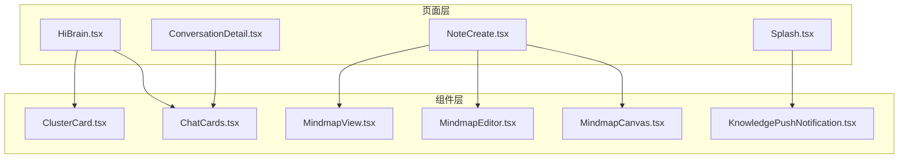
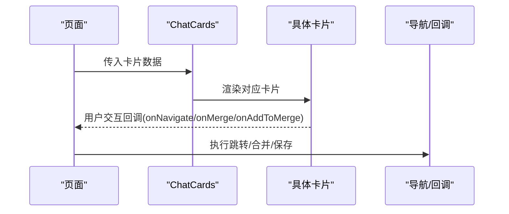
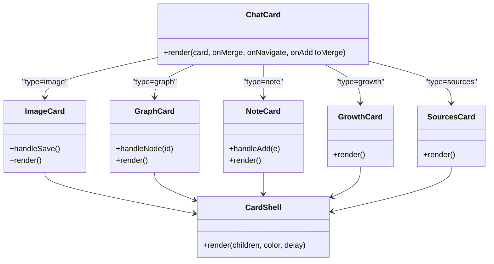
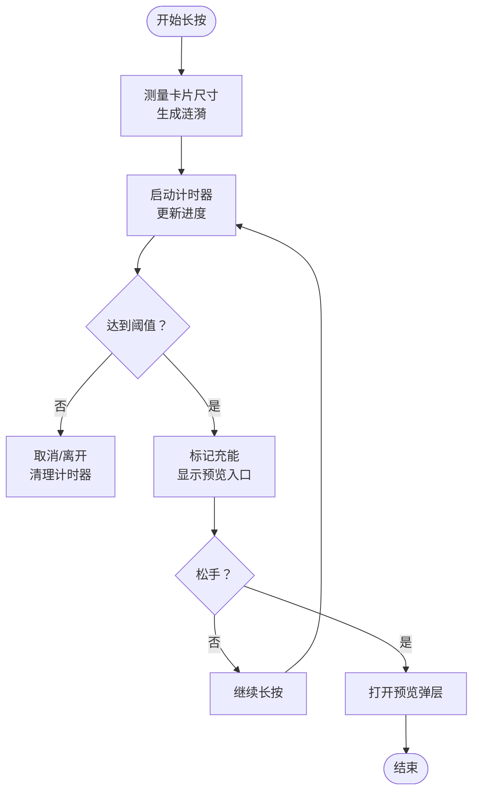
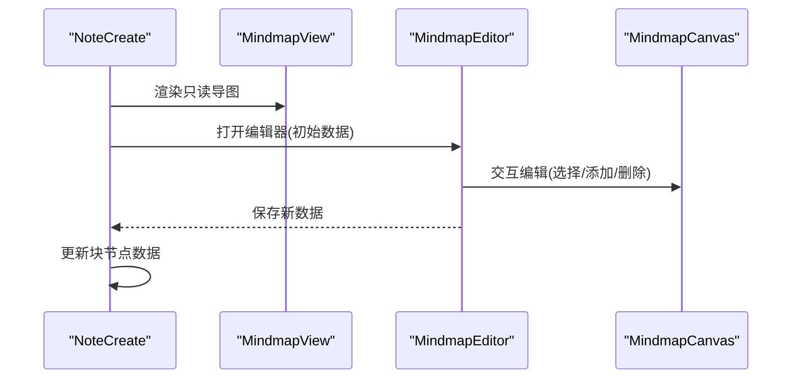
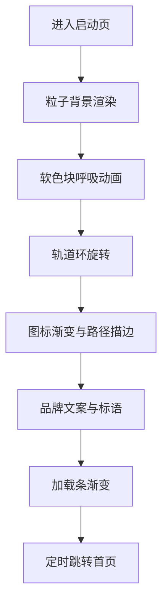
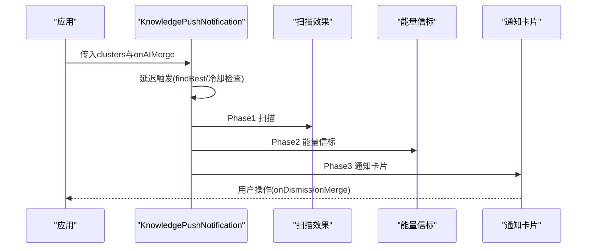
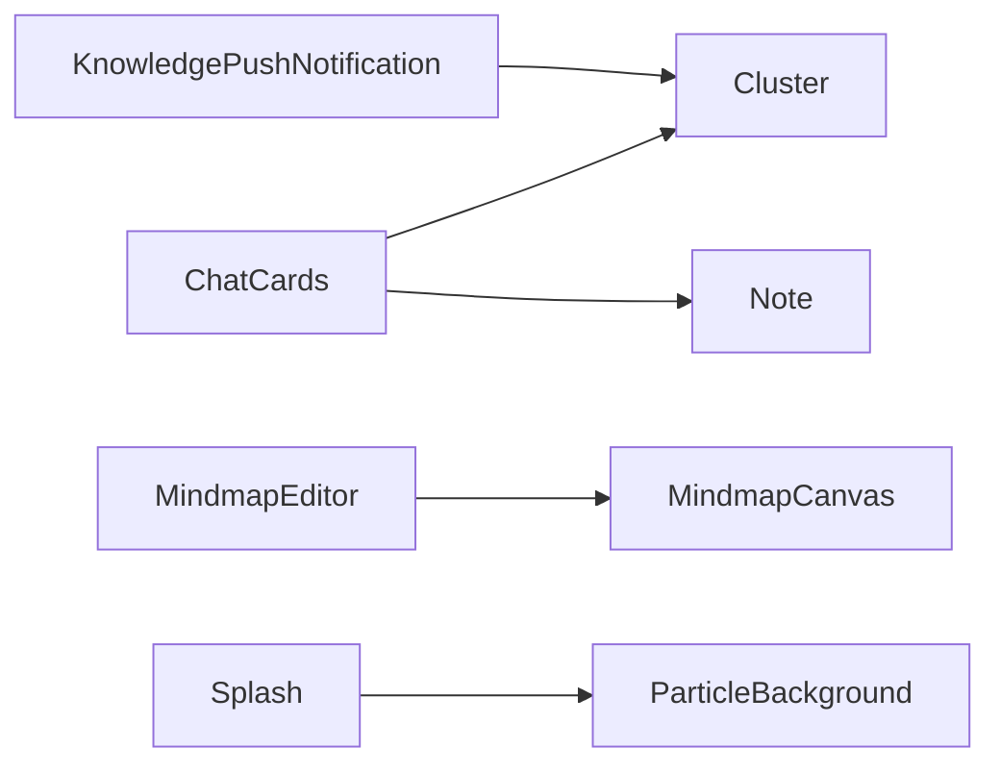

# 专用功能组件

<cite>
**本文档引用的文件**
- [ChatCards.tsx](file://src/app/components/ChatCards.tsx)
- [ClusterCard.tsx](file://src/app/components/ClusterCard.tsx)
- [MindmapCanvas.tsx](file://src/app/components/MindmapCanvas.tsx)
- [MindmapEditor.tsx](file://src/app/components/MindmapEditor.tsx)
- [MindmapView.tsx](file://src/app/components/MindmapView.tsx)
- [KnowledgePushNotification.tsx](file://src/app/components/KnowledgePushNotification.tsx)
- [Splash.tsx](file://src/app/pages/Splash.tsx)
- [HiBrain.tsx](file://src/app/pages/HiBrain.tsx)
- [ConversationDetail.tsx](file://src/app/pages/ConversationDetail.tsx)
- [NoteCreate.tsx](file://src/app/pages/NoteCreate.tsx)
</cite>

## 目录
1. [简介](#简介)
2. [项目结构](#项目结构)
3. [核心组件](#核心组件)
4. [架构总览](#架构总览)
5. [详细组件分析](#详细组件分析)
6. [依赖分析](#依赖分析)
7. [性能考虑](#性能考虑)
8. [故障排查指南](#故障排查指南)
9. [结论](#结论)
10. [附录](#附录)

## 简介
本文件聚焦于应用中的专用功能组件，涵盖聊天富卡片、集群卡片、思维导图组件、启动页与通知组件。内容包括各组件的核心功能、交互逻辑、视觉效果、数据绑定、事件处理、状态管理、动画与过渡、用户体验优化，以及扩展与自定义最佳实践。目标是帮助开发者快速理解并高效使用这些组件。

## 项目结构
- 组件集中位于 src/app/components，页面位于 src/app/pages。
- 专用功能组件主要分布在以下文件：
  - 聊天富卡片：ChatCards.tsx
  - 集群卡片：ClusterCard.tsx
  - 思维导图：MindmapCanvas.tsx、MindmapEditor.tsx、MindmapView.tsx
  - 启动页：Splash.tsx
  - 知识推送通知：KnowledgePushNotification.tsx
- 页面中对组件的使用示例：
  - HiBrain.tsx 中使用 ClusterCard 与 ChatCard
  - ConversationDetail.tsx 中渲染聊天消息与富卡片
  - NoteCreate.tsx 中嵌入 MindmapView 并与编辑器联动

图表来源
- [HiBrain.tsx](file://src/app/pages/HiBrain.tsx)
- [ConversationDetail.tsx](file://src/app/pages/ConversationDetail.tsx)
- [NoteCreate.tsx](file://src/app/pages/NoteCreate.tsx)
- [Splash.tsx](file://src/app/pages/Splash.tsx)
- [ChatCards.tsx](file://src/app/components/ChatCards.tsx)
- [ClusterCard.tsx](file://src/app/components/ClusterCard.tsx)
- [MindmapCanvas.tsx](file://src/app/components/MindmapCanvas.tsx)
- [MindmapEditor.tsx](file://src/app/components/MindmapEditor.tsx)
- [MindmapView.tsx](file://src/app/components/MindmapView.tsx)
- [KnowledgePushNotification.tsx](file://src/app/components/KnowledgePushNotification.tsx)

章节来源
- [ChatCards.tsx](file://src/app/components/ChatCards.tsx)
- [ClusterCard.tsx](file://src/app/components/ClusterCard.tsx)
- [MindmapCanvas.tsx](file://src/app/components/MindmapCanvas.tsx)
- [MindmapEditor.tsx](file://src/app/components/MindmapEditor.tsx)
- [MindmapView.tsx](file://src/app/components/MindmapView.tsx)
- [KnowledgePushNotification.tsx](file://src/app/components/KnowledgePushNotification.tsx)
- [Splash.tsx](file://src/app/pages/Splash.tsx)
- [HiBrain.tsx](file://src/app/pages/HiBrain.tsx)
- [ConversationDetail.tsx](file://src/app/pages/ConversationDetail.tsx)
- [NoteCreate.tsx](file://src/app/pages/NoteCreate.tsx)

## 核心组件
- 聊天富卡片（ChatCards）：支持图片、知识图谱、笔记引用、知识成长与来源卡片五类，统一的卡片壳体与动画入场。
- 集群卡片（ClusterCard）：长按预览、渐进式进度环、标签与碎片列表、可串联状态提示与交互。
- 思维导图（MindmapCanvas/Editor/View）：布局计算、SVG 渲染、节点选择与编辑、全屏编辑器、只读预览。
- 启动页（Splash）：粒子背景、动态光晕、轨道旋转、品牌文案与加载条。
- 知识推送通知（KnowledgePushNotification）：三阶段扫描、能量信标、通知卡片与拖拽关闭。

章节来源
- [ChatCards.tsx](file://src/app/components/ChatCards.tsx)
- [ClusterCard.tsx](file://src/app/components/ClusterCard.tsx)
- [MindmapCanvas.tsx](file://src/app/components/MindmapCanvas.tsx)
- [MindmapEditor.tsx](file://src/app/components/MindmapEditor.tsx)
- [MindmapView.tsx](file://src/app/components/MindmapView.tsx)
- [KnowledgePushNotification.tsx](file://src/app/components/KnowledgePushNotification.tsx)
- [Splash.tsx](file://src/app/pages/Splash.tsx)

## 架构总览
- 数据流：页面通过 props 将数据传递给专用组件；组件内部通过状态与回调处理交互，最终触发页面级行为（导航、合并、保存）。
- 动画与过渡：统一采用 motion/react 的 AnimatePresence/motion，确保进入/退出动画一致性与性能。
- 事件链路：节点点击、长按、拖拽、键盘输入等事件在组件内处理并向上冒泡或调用回调。

图表来源
- [ChatCards.tsx](file://src/app/components/ChatCards.tsx)
- [HiBrain.tsx](file://src/app/pages/HiBrain.tsx)
- [ConversationDetail.tsx](file://src/app/pages/ConversationDetail.tsx)

## 详细组件分析

### 聊天富卡片组件（ChatCards）
- 支持卡片类型
  - 图片卡片：图片灯箱、保存到思库、模糊加载、缩放提示。
  - 知识图谱卡片：节点可选中高亮、边动画绘制、连接关系可视化。
  - 笔记引用卡片：可展开预览、加入串联、标签展示。
  - 知识成长卡片：完成度环形进度、渐变按钮、碎片预览与标签。
  - 来源卡片：从详情映射来源、分类展示笔记/文档/附件/Web。
- 核心特性
  - 统一卡片壳体：带顶部强调色条与毛玻璃背景，入场弹簧动画。
  - 动画与过渡：入场缩放与透明度、悬停缩放、切换动画、AnmatePresence 控制挂载。
  - 事件处理：点击、长按、拖拽、键盘事件；回调驱动导航与合并。
  - 数据绑定：根据 payload.type 分发渲染，内部解析 note/document/attachment 等字段。
- 使用方式
  - 在页面中接收 AI 返回的消息，当存在 card 字段时，渲染 ChatCard 并传入 onMerge/onNavigate/onAddToMerge。
- 扩展建议
  - 新增卡片类型时，在分发器中新增 case，并在 CardShell 中保持一致的视觉风格。
  - 对于复杂交互（如图谱），建议将布局计算抽离为独立工具函数，便于测试与复用。

图表来源
- [ChatCards.tsx](file://src/app/components/ChatCards.tsx)

章节来源
- [ChatCards.tsx](file://src/app/components/ChatCards.tsx)
- [HiBrain.tsx](file://src/app/pages/HiBrain.tsx)
- [ConversationDetail.tsx](file://src/app/pages/ConversationDetail.tsx)

### 集群卡片组件（ClusterCard）
- 核心交互
  - 长按触发：计时器与进度条，触发展开预览；松手即触发预览弹层。
  - 预览弹层：包含标签、碎片列表、统计信息、操作按钮（继续积累/AI串联）。
  - 视觉反馈：涟漪波纹、扫描光效、长按边框追踪、脉冲高亮。
- 数据模型
  - Cluster：包含名称、标签、笔记列表、碎片数、颜色、完成度、阶段、最新更新时间。
- 状态管理
  - 触摸状态、进度、是否充能、预览开关、涟漪数组、卡片尺寸测量。
- 使用方式
  - 在页面中遍历集群列表，传入 onAIMerge 与 onNavigate，以及相邻颜色用于渐变。
- 扩展建议
  - 将长按阈值与动画参数抽取为常量，便于统一调整。
  - 预览弹层可抽象为通用 Portal 组件，减少重复代码。

图表来源
- [ClusterCard.tsx](file://src/app/components/ClusterCard.tsx)

章节来源
- [ClusterCard.tsx](file://src/app/components/ClusterCard.tsx)
- [HiBrain.tsx](file://src/app/pages/HiBrain.tsx)

### 思维导图组件（MindmapCanvas/Editor/View）
- MindmapCanvas
  - 计算布局：中心节点、分支节点、子节点角度与半径，连接线为二次贝塞尔曲线。
  - 渲染：SVG 路径连接、节点矩形与文本、选中高亮、网格背景、滤镜阴影。
  - 交互：节点点击选择、中央主题点击、ActionMenu（编辑/添加/删除）。
- MindmapEditor
  - 全屏编辑器：顶部栏、提示横幅、缩放控制、添加主节点按钮。
  - 文本编辑底部面板：输入校验、回车确认、ESC 取消。
  - 与 MindmapCanvas 通过 props 通信，支持保存与关闭。
- MindmapView
  - 只读预览：在 AI 结果卡片中展示完整导图。
- 使用方式
  - 在 NoteCreate 中嵌入 MindmapView，并通过自定义事件与编辑器联动，实现数据更新。
- 扩展建议
  - 将布局算法与 SVG 渲染分离，便于单元测试与性能优化。
  - ActionMenu 可抽取为通用组件，支持插槽化扩展。

图表来源
- [MindmapView.tsx](file://src/app/components/MindmapView.tsx)
- [MindmapEditor.tsx](file://src/app/components/MindmapEditor.tsx)
- [MindmapCanvas.tsx](file://src/app/components/MindmapCanvas.tsx)
- [NoteCreate.tsx](file://src/app/pages/NoteCreate.tsx)

章节来源
- [MindmapCanvas.tsx](file://src/app/components/MindmapCanvas.tsx)
- [MindmapEditor.tsx](file://src/app/components/MindmapEditor.tsx)
- [MindmapView.tsx](file://src/app/components/MindmapView.tsx)
- [NoteCreate.tsx](file://src/app/pages/NoteCreate.tsx)

### 启动页组件（Splash）
- 核心元素
  - 粒子背景：动态粒子与模糊背景。
  - 软色块：随时间呼吸式缩放与透明度变化。
  - 轨道环：内外两圈不同速度旋转，点缀光点。
  - 主视觉：渐变圆角图标与星形装饰，路径描边动画。
  - 文案与加载条：品牌标语、渐变加载进度与版本信息。
- 动画策略
  - 多层级动画：背景、环、图标、路径描边、文字依次入场，形成节奏感。
  - 过渡缓动：Spring 类型保证自然弹性，EaseInOut 保证平滑。
- 使用方式
  - 在路由初始化时渲染，定时跳转首页。

图表来源
- [Splash.tsx](file://src/app/pages/Splash.tsx)

章节来源
- [Splash.tsx](file://src/app/pages/Splash.tsx)

### 知识推送通知组件（KnowledgePushNotification）
- 三阶段交互
  - 扫描阶段：全屏扫描线、边缘光爆、手机震动。
  - 能量信标：底部脉冲扩散，提示通知即将到来。
  - 通知卡片：弹射上屏、粒子环绕、自动倒计时、拖拽关闭、展开/收起碎片列表。
- 触发策略
  - 基于集群完成度与碎片数量筛选，本地存储冷却时间避免频繁打扰。
- 交互细节
  - 自动倒计时关闭、拖拽阈值与速度判断、渐变按钮与光晕效果。
- 使用方式
  - 在页面中传入 clusters 与 onAIMerge，组件内部负责触发与交互。

图表来源
- [KnowledgePushNotification.tsx](file://src/app/components/KnowledgePushNotification.tsx)

章节来源
- [KnowledgePushNotification.tsx](file://src/app/components/KnowledgePushNotification.tsx)

## 依赖分析
- 组件间依赖
  - ChatCards 依赖 Cluster 类型与 Note 上下文，用于渲染成长与笔记卡片。
  - MindmapEditor 依赖 MindmapCanvas 作为核心渲染与交互载体。
  - KnowledgePushNotification 依赖 Cluster 类型与本地存储冷却策略。
  - 页面依赖组件进行数据展示与交互。
- 外部依赖
  - motion/react：统一动画与过渡。
  - lucide-react：图标库。
  - createPortal：将弹层/扫描效果挂载到 body，避免层级与裁剪问题。

图表来源
- [ChatCards.tsx](file://src/app/components/ChatCards.tsx)
- [MindmapEditor.tsx](file://src/app/components/MindmapEditor.tsx)
- [KnowledgePushNotification.tsx](file://src/app/components/KnowledgePushNotification.tsx)
- [Splash.tsx](file://src/app/pages/Splash.tsx)

章节来源
- [ChatCards.tsx](file://src/app/components/ChatCards.tsx)
- [MindmapEditor.tsx](file://src/app/components/MindmapEditor.tsx)
- [KnowledgePushNotification.tsx](file://src/app/components/KnowledgePushNotification.tsx)
- [Splash.tsx](file://src/app/pages/Splash.tsx)

## 性能考虑
- 动画性能
  - 使用 AnimatePresence 控制挂载/卸载，避免不必要的 DOM。
  - motion 的 transition 参数尽量使用物理引擎（spring）以减少 JS 计算。
- 渲染优化
  - MindmapCanvas 使用 useMemo 缓存布局计算结果，避免重复布局。
  - ChatCards 中的 SVG 动画按序延迟，降低首帧压力。
- 交互节流
  - 长按计时器与进度条使用 requestAnimationFrame 风格的间隔器，及时清理。
- 存储与网络
  - 推送冷却使用 localStorage，避免频繁请求；注意异常兜底。

## 故障排查指南
- 聊天富卡片
  - 图片不显示：检查图片 URL 与加载回调，确认模糊过渡与 scale 切换逻辑。
  - 图谱节点不可选中：确认节点坐标与点击区域，检查 connectedIds 计算。
  - 加入串联无效：确认 onAddToMerge 回调是否正确传入与执行。
- 集群卡片
  - 长按无反应：检查指针事件捕获与计时器清理，确认触摸状态切换。
  - 预览弹层不出现：确认 Portal 挂载与 z-index，检查 charged 状态。
- 思维导图
  - 导图不更新：检查编辑器保存回调与页面监听事件，确认自定义事件名一致。
  - 节点无法编辑：确认 ActionMenu 显示条件与输入焦点。
- 启动页
  - 动画卡顿：检查帧率与缓动函数，适当降低粒子数量或模糊强度。
- 知识推送通知
  - 重复触发：检查冷却键值与时间戳，确认本地存储写入成功。
  - 卡片不弹出：确认 findBest 筛选条件与 phase 状态流转。

章节来源
- [ChatCards.tsx](file://src/app/components/ChatCards.tsx)
- [ClusterCard.tsx](file://src/app/components/ClusterCard.tsx)
- [MindmapEditor.tsx](file://src/app/components/MindmapEditor.tsx)
- [KnowledgePushNotification.tsx](file://src/app/components/KnowledgePushNotification.tsx)
- [Splash.tsx](file://src/app/pages/Splash.tsx)

## 结论
上述专用功能组件围绕“数据驱动、动画一致、交互明确、可扩展”设计，既满足当前业务场景，又为后续扩展预留空间。通过统一的动画框架、清晰的事件链路与模块化的结构，开发者可以快速集成、定制与维护这些组件。

## 附录
- 最佳实践清单
  - 统一动画参数与缓动曲线，确保跨组件一致性。
  - 将布局与渲染分离，提升可测试性与可维护性。
  - 使用 Portal 管理弹层与全局效果，避免层级与样式污染。
  - 为复杂交互（长按、拖拽、键盘）提供明确的可访问性提示。
  - 对关键状态（冷却、预览、编辑）提供本地持久化与兜底逻辑。