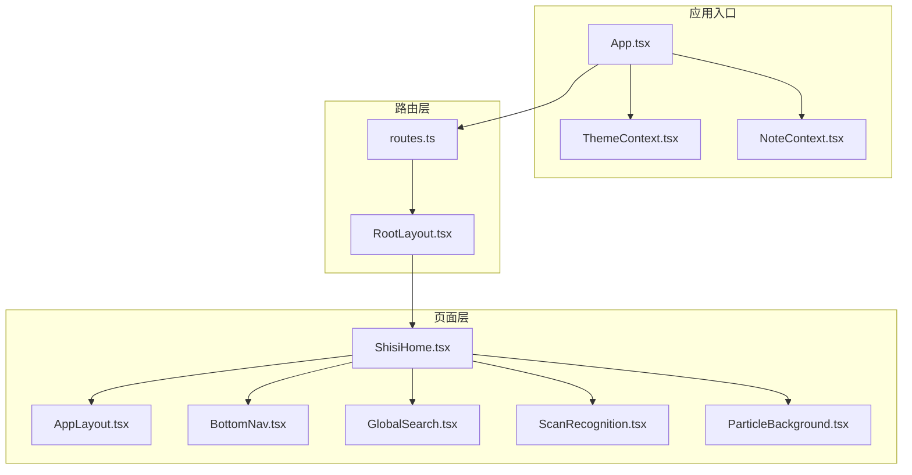
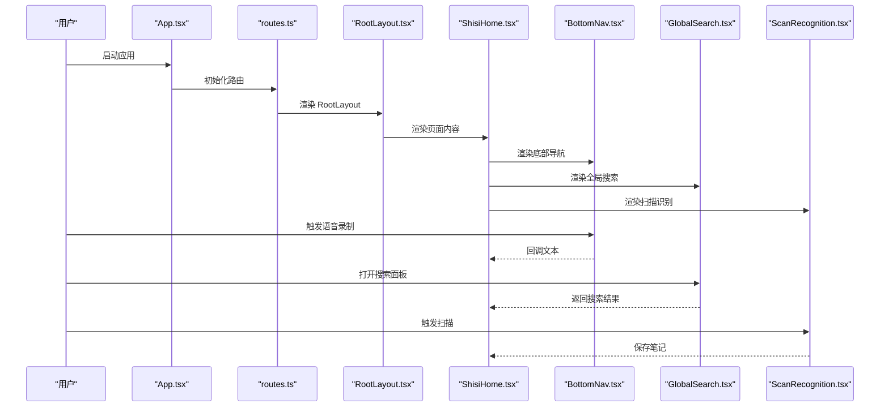
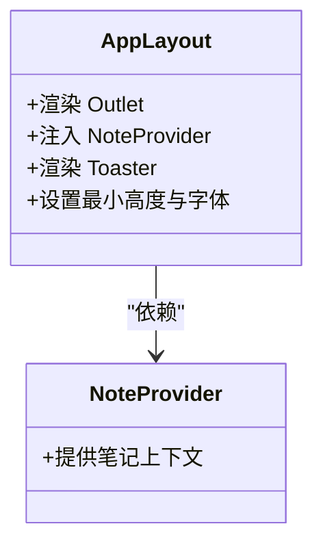
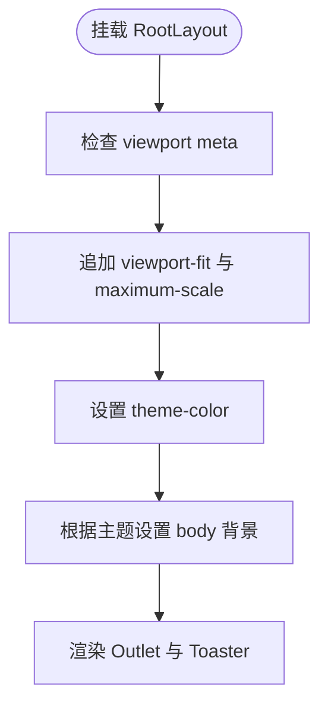
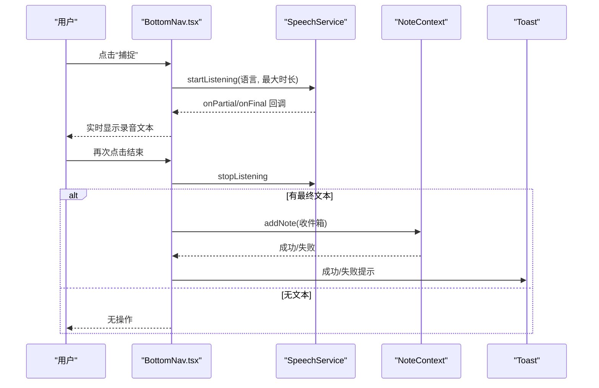
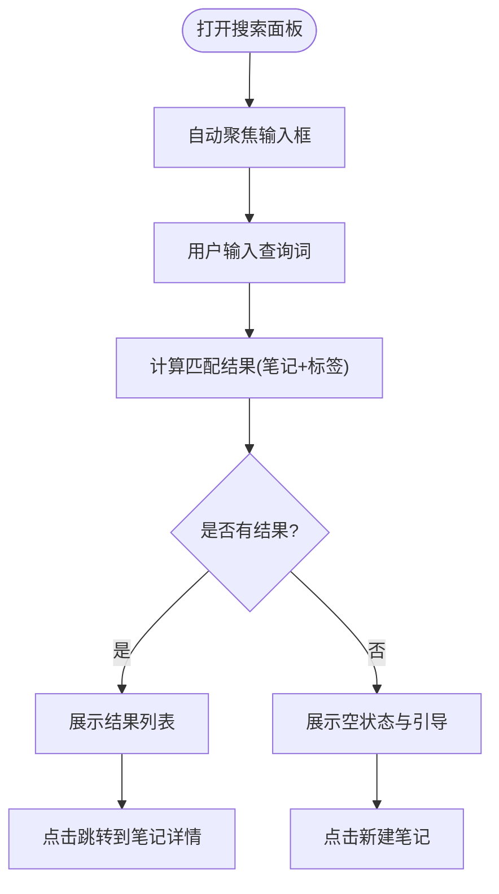
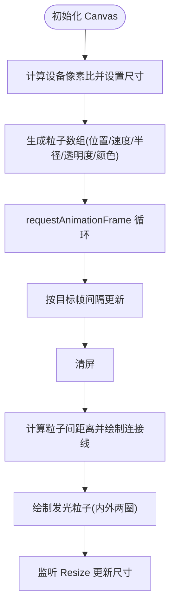
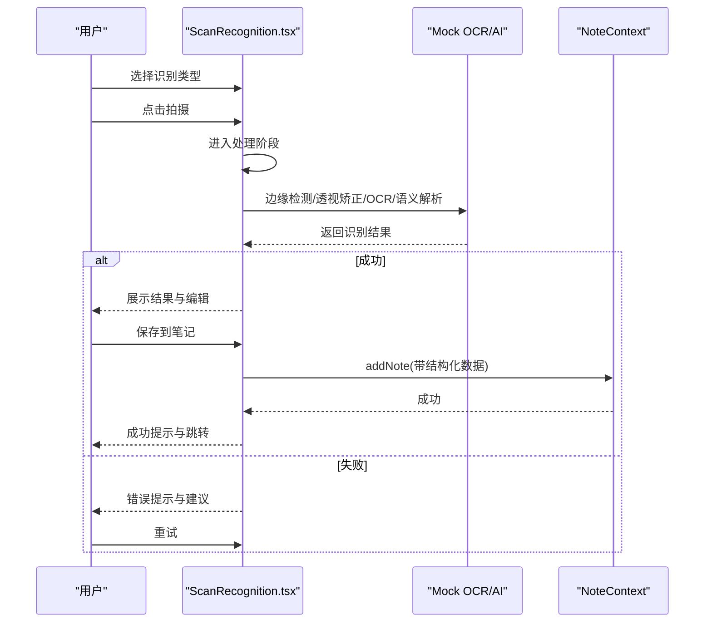
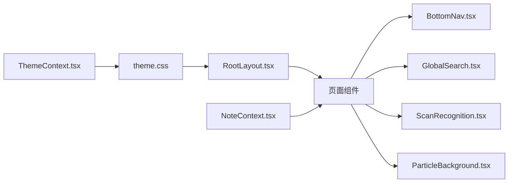
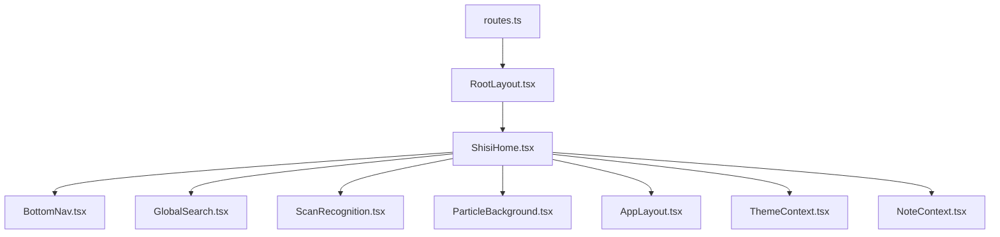

# 布局组件系统

<cite>
**本文档引用的文件**
- [AppLayout.tsx](file://src/app/components/AppLayout.tsx)
- [RootLayout.tsx](file://src/app/components/RootLayout.tsx)
- [BottomNav.tsx](file://src/app/components/BottomNav.tsx)
- [GlobalSearch.tsx](file://src/app/components/GlobalSearch.tsx)
- [ParticleBackground.tsx](file://src/app/components/ParticleBackground.tsx)
- [ScanRecognition.tsx](file://src/app/components/ScanRecognition.tsx)
- [NoteContext.tsx](file://src/app/components/context/NoteContext.tsx)
- [ThemeContext.tsx](file://src/app/components/context/ThemeContext.tsx)
- [App.tsx](file://src/app/App.tsx)
- [routes.ts](file://src/app/routes.ts)
- [ShisiHome.tsx](file://src/app/pages/ShisiHome.tsx)
- [featureFlags.ts](file://src/app/utils/featureFlags.ts)
- [theme.css](file://src/styles/theme.css)
- [README.md](file://README.md)
</cite>

## 目录
1. [引言](#引言)
2. [项目结构](#项目结构)
3. [核心组件](#核心组件)
4. [架构总览](#架构总览)
5. [详细组件分析](#详细组件分析)
6. [依赖分析](#依赖分析)
7. [性能考虑](#性能考虑)
8. [故障排除指南](#故障排除指南)
9. [结论](#结论)
10. [附录](#附录)

## 引言
本文件系统性梳理笔记应用前端的布局组件体系，围绕 AppLayout 与 RootLayout 的设计理念与实现方式进行深入解析，覆盖底部导航、全局搜索、粒子背景、扫描识别等专用布局组件的功能特性与使用方式。文档同时阐述响应式设计、屏幕适配与移动端优化策略，提供状态管理、事件处理与性能优化的实践建议，并给出布局扩展与自定义组件的最佳实践。

## 项目结构
应用采用分层模块化组织，布局组件集中在 `src/app/components` 下，页面组件位于 `src/app/pages`，路由配置在 `src/app/routes.ts`，主题与上下文通过 `src/app/components/context` 和 `src/styles/theme.css` 统一管理。根组件 `App.tsx` 注入主题、笔记与通知上下文，路由由 `routes.ts` 配置并以 `RootLayout` 作为顶层容器，页面内按需嵌套 `AppLayout` 或直接渲染内容。

**图表来源**
- [App.tsx:1-17](file://src/app/App.tsx#L1-L17)
- [routes.ts:1-61](file://src/app/routes.ts#L1-L61)
- [RootLayout.tsx:1-52](file://src/app/components/RootLayout.tsx#L1-L52)
- [ShisiHome.tsx:1-457](file://src/app/pages/ShisiHome.tsx#L1-L457)
- [AppLayout.tsx:1-15](file://src/app/components/AppLayout.tsx#L1-L15)
- [BottomNav.tsx:1-387](file://src/app/components/BottomNav.tsx#L1-L387)
- [GlobalSearch.tsx:1-425](file://src/app/components/GlobalSearch.tsx#L1-L425)
- [ScanRecognition.tsx:1-822](file://src/app/components/ScanRecognition.tsx#L1-L822)
- [ParticleBackground.tsx:1-147](file://src/app/components/ParticleBackground.tsx#L1-L147)

**章节来源**
- [App.tsx:1-17](file://src/app/App.tsx#L1-L17)
- [routes.ts:1-61](file://src/app/routes.ts#L1-L61)
- [RootLayout.tsx:1-52](file://src/app/components/RootLayout.tsx#L1-L52)

## 核心组件
- AppLayout：为页面提供统一的最小高度容器、全局通知与笔记上下文注入，确保页面级状态与交互的一致性。
- RootLayout：负责移动端 viewport 与主题色 meta 注入、动态主题切换与全局通知样式定制，保证首屏与主题一致性。
- BottomNav：底部导航栏，支持动态菜单项、未读消息徽标、语音录制与实时预览、安全区域适配与动画过渡。
- GlobalSearch：全局搜索面板，支持热词与最近搜索、标签与笔记结果聚合、高亮与片段截取、键盘快捷键与回退动画。
- ParticleBackground：粒子背景，基于 Canvas 的高性能粒子系统，支持连接线、发光效果与自适应分辨率。
- ScanRecognition：扫描识别流程面板，包含取景器、处理步骤、结果编辑与保存流程，支持多类型识别与错误处理。
- NoteContext：笔记状态管理，本地与云端笔记合并、离线存储、同步与乐观更新。
- ThemeContext：主题上下文，支持系统/浅色/深色切换、DOM 属性应用与持久化。

**章节来源**
- [AppLayout.tsx:1-15](file://src/app/components/AppLayout.tsx#L1-L15)
- [RootLayout.tsx:1-52](file://src/app/components/RootLayout.tsx#L1-L52)
- [BottomNav.tsx:1-387](file://src/app/components/BottomNav.tsx#L1-L387)
- [GlobalSearch.tsx:1-425](file://src/app/components/GlobalSearch.tsx#L1-L425)
- [ParticleBackground.tsx:1-147](file://src/app/components/ParticleBackground.tsx#L1-L147)
- [ScanRecognition.tsx:1-822](file://src/app/components/ScanRecognition.tsx#L1-L822)
- [NoteContext.tsx:1-356](file://src/app/components/context/NoteContext.tsx#L1-L356)
- [ThemeContext.tsx:1-110](file://src/app/components/context/ThemeContext.tsx#L1-L110)

## 架构总览
应用采用“上下文注入 + 路由容器 + 页面组件”的分层架构。App.tsx 注入 ThemeProvider、NoteProvider、ToastProvider，routes.ts 以 RootLayout 为顶层布局，页面内根据需要使用 AppLayout 或直接渲染内容。页面组件通过 BottomNav、GlobalSearch、ScanRecognition、ParticleBackground 等专用组件构建丰富的交互体验。

**图表来源**
- [App.tsx:1-17](file://src/app/App.tsx#L1-L17)
- [routes.ts:1-61](file://src/app/routes.ts#L1-L61)
- [RootLayout.tsx:1-52](file://src/app/components/RootLayout.tsx#L1-L52)
- [ShisiHome.tsx:1-457](file://src/app/pages/ShisiHome.tsx#L1-L457)
- [BottomNav.tsx:1-387](file://src/app/components/BottomNav.tsx#L1-L387)
- [GlobalSearch.tsx:1-425](file://src/app/components/GlobalSearch.tsx#L1-L425)
- [ScanRecognition.tsx:1-822](file://src/app/components/ScanRecognition.tsx#L1-L822)

## 详细组件分析

### AppLayout 分析
- 设计理念：为页面提供统一的容器与上下文，确保页面级状态一致与通知显示。
- 实现要点：注入 NoteProvider 与全局 Toaster，设置最小高度与字体选择样式，保证内容占满视口。
- 使用场景：页面级布局包装，如 ShisiHome 中的 AppLayout。

**图表来源**
- [AppLayout.tsx:1-15](file://src/app/components/AppLayout.tsx#L1-L15)
- [NoteContext.tsx:89-347](file://src/app/components/context/NoteContext.tsx#L89-L347)

**章节来源**
- [AppLayout.tsx:1-15](file://src/app/components/AppLayout.tsx#L1-L15)
- [NoteContext.tsx:89-347](file://src/app/components/context/NoteContext.tsx#L89-L347)

### RootLayout 分析
- 设计理念：在挂载时注入移动端 viewport 与主题色 meta，动态应用主题并保持全局通知样式。
- 实现要点：监听 viewport-fit 与 maximum-scale，设置 theme-color，根据主题切换 body 背景，注入 Toaster 样式。
- 使用场景：路由顶层布局，确保所有页面共享一致的主题与元信息。

**图表来源**
- [RootLayout.tsx:10-51](file://src/app/components/RootLayout.tsx#L10-L51)

**章节来源**
- [RootLayout.tsx:1-52](file://src/app/components/RootLayout.tsx#L1-L52)

### 底部导航 BottomNav 分析
- 功能特性：动态菜单项（支持思圈开关）、未读消息徽标、语音录制与实时预览、安全区域适配、动画过渡。
- 状态管理：未读数监听、导航项激活态计算、录音状态与回调处理。
- 事件处理：点击导航跳转、长按触发语音录制、键盘事件与窗口事件监听。
- 性能优化：录音服务异步控制、防抖与节流、动画帧控制、内存清理。

**图表来源**
- [BottomNav.tsx:96-221](file://src/app/components/BottomNav.tsx#L96-L221)
- [BottomNav.tsx:135-215](file://src/app/components/BottomNav.tsx#L135-L215)
- [NoteContext.tsx:224-272](file://src/app/components/context/NoteContext.tsx#L224-L272)

**章节来源**
- [BottomNav.tsx:1-387](file://src/app/components/BottomNav.tsx#L1-L387)
- [NoteContext.tsx:18-26](file://src/app/components/context/NoteContext.tsx#L18-L26)

### 全局搜索 GlobalSearch 分析
- 功能特性：热词与最近搜索、标签与笔记结果聚合、高亮与片段截取、键盘快捷键与回退动画。
- 数据处理：基于查询词的大小写不敏感匹配，限制结果数量，去重标签集合。
- 交互设计：空状态建议、结果计数、无结果提示、新建笔记引导。
- 性能优化：useMemo 缓存结果、防抖输入、动画过渡与回退。

**图表来源**
- [GlobalSearch.tsx:33-73](file://src/app/components/GlobalSearch.tsx#L33-L73)
- [GlobalSearch.tsx:56-70](file://src/app/components/GlobalSearch.tsx#L56-L70)

**章节来源**
- [GlobalSearch.tsx:1-425](file://src/app/components/GlobalSearch.tsx#L1-L425)

### 粒子背景 ParticleBackground 分析
- 功能特性：基于 Canvas 的粒子系统，支持连接线、发光效果、自适应分辨率与性能控制。
- 性能优化：帧率节流、可见性暂停、ResizeObserver 自适应、零分配绘制。
- 参数配置：粒子数量、颜色集、连接距离、目标 FPS。

**图表来源**
- [ParticleBackground.tsx:30-138](file://src/app/components/ParticleBackground.tsx#L30-L138)

**章节来源**
- [ParticleBackground.tsx:1-147](file://src/app/components/ParticleBackground.tsx#L1-L147)

### 扫描识别 ScanRecognition 分析
- 功能特性：多类型识别（文档/书籍/白板/名片）、模拟处理步骤、AI 整理、结果编辑、保存到笔记。
- 流程控制：视窗器 -> 处理中 -> 结果 -> 保存中 -> 成功/错误。
- 错误处理：随机失败概率、错误提示与改进建议、重试机制。
- 交互设计：遮罩点击关闭、滑动面板、标签增删、保存按钮。

**图表来源**
- [ScanRecognition.tsx:115-196](file://src/app/components/ScanRecognition.tsx#L115-L196)
- [ScanRecognition.tsx:146-177](file://src/app/components/ScanRecognition.tsx#L146-L177)
- [NoteContext.tsx:224-272](file://src/app/components/context/NoteContext.tsx#L224-L272)

**章节来源**
- [ScanRecognition.tsx:1-822](file://src/app/components/ScanRecognition.tsx#L1-L822)
- [NoteContext.tsx:18-26](file://src/app/components/context/NoteContext.tsx#L18-L26)

### 概念总览
- 响应式设计：通过 CSS 变量与安全区域变量适配不同设备，底部导航与搜索面板均考虑安全区域与动画过渡。
- 主题系统：ThemeContext 在 DOM 上设置 data-theme 并应用到 CSS 变量，RootLayout 动态更新 theme-color。
- 上下文管理：NoteContext 负责笔记状态、本地/云端合并与同步，AppLayout 注入上下文保证页面可用。

**图表来源**
- [ThemeContext.tsx:63-105](file://src/app/components/context/ThemeContext.tsx#L63-L105)
- [theme.css:1-280](file://src/styles/theme.css#L1-L280)
- [RootLayout.tsx:10-30](file://src/app/components/RootLayout.tsx#L10-L30)
- [NoteContext.tsx:89-347](file://src/app/components/context/NoteContext.tsx#L89-L347)

## 依赖分析
- 组件耦合：页面组件依赖上下文与专用布局组件；上下文独立于 UI，便于复用。
- 外部依赖：motion/react 用于动画过渡，lucide-react 提供图标，Capacitor 用于原生平台能力。
- 路由集成：routes.ts 将页面与 RootLayout 组合，页面内可选择性使用 AppLayout。

**图表来源**
- [routes.ts:26-60](file://src/app/routes.ts#L26-L60)
- [ShisiHome.tsx:45-457](file://src/app/pages/ShisiHome.tsx#L45-L457)

**章节来源**
- [routes.ts:1-61](file://src/app/routes.ts#L1-L61)
- [ShisiHome.tsx:1-457](file://src/app/pages/ShisiHome.tsx#L1-L457)

## 性能考虑
- 动画与渲染
  - 使用 requestAnimationFrame 控制帧率，避免高频重绘。
  - motion/react 的 AnimatePresence 与 layoutId 仅在必要时触发布局变化。
- Canvas 优化
  - ParticleBackground 通过 ResizeObserver 与 DPR 限制重绘成本，连接线与发光使用零分配绘制。
- 状态与计算
  - GlobalSearch 使用 useMemo 缓存搜索结果，避免重复过滤。
  - BottomNav 使用 useRef 与防抖/节流控制录音状态与回调。
- 资源与生命周期
  - RootLayout 在卸载时移除事件监听，避免内存泄漏。
  - ScanRecognition 在清理阶段停止定时器与释放资源。

[本节为通用性能指导，无需特定文件引用]

## 故障排除指南
- 主题不生效
  - 检查 ThemeContext 是否正确应用 data-theme 到根元素，确认 theme.css 中变量是否覆盖。
  - 确认 RootLayout 是否在挂载时设置 theme-color。
- 语音录制异常
  - 检查 SpeechService 的权限与回调是否正确注册，确认录音状态与 stop 回调。
  - 查看 BottomNav 的录音文本缓存与异常处理逻辑。
- 搜索结果不更新
  - 确认 GlobalSearch 的 query 状态与 notes 上下文是否同步，检查 useMemo 依赖。
- 扫描识别失败
  - 查看随机失败分支与错误提示，确认 mock 结果与标签处理。
- 粒子背景卡顿
  - 检查 DPR 限制与帧率节流，确认可见性暂停逻辑是否启用。

**章节来源**
- [ThemeContext.tsx:50-61](file://src/app/components/context/ThemeContext.tsx#L50-L61)
- [RootLayout.tsx:13-30](file://src/app/components/RootLayout.tsx#L13-L30)
- [BottomNav.tsx:135-175](file://src/app/components/BottomNav.tsx#L135-L175)
- [GlobalSearch.tsx:56-70](file://src/app/components/GlobalSearch.tsx#L56-L70)
- [ScanRecognition.tsx:146-177](file://src/app/components/ScanRecognition.tsx#L146-L177)
- [ParticleBackground.tsx:46-79](file://src/app/components/ParticleBackground.tsx#L46-L79)

## 结论
该布局组件系统通过上下文注入、路由容器与专用组件的协同，实现了主题一致、交互丰富且性能友好的移动端体验。BottomNav、GlobalSearch、ParticleBackground、ScanRecognition 等组件在功能与性能之间取得平衡，配合 NoteContext 与 ThemeContext 提供了良好的扩展基础。开发者可在现有组件之上进行组合与定制，遵循状态管理、事件处理与性能优化的最佳实践，快速构建符合业务需求的布局方案。

## 附录
- 代码示例路径（不展示具体代码，仅提供定位）
  - AppLayout 注入与使用：[AppLayout.tsx:5-14](file://src/app/components/AppLayout.tsx#L5-L14)，[ShisiHome.tsx:409-412](file://src/app/pages/ShisiHome.tsx#L409-L412)
  - RootLayout 主题与 viewport：[RootLayout.tsx:13-30](file://src/app/components/RootLayout.tsx#L13-L30)
  - 底部导航录音与保存：[BottomNav.tsx:135-215](file://src/app/components/BottomNav.tsx#L135-L215)，[NoteContext.tsx:224-272](file://src/app/components/context/NoteContext.tsx#L224-L272)
  - 全局搜索结果计算：[GlobalSearch.tsx:56-70](file://src/app/components/GlobalSearch.tsx#L56-L70)
  - 粒子背景初始化与绘制：[ParticleBackground.tsx:49-125](file://src/app/components/ParticleBackground.tsx#L49-L125)
  - 扫描识别流程：[ScanRecognition.tsx:146-196](file://src/app/components/ScanRecognition.tsx#L146-L196)
  - 主题变量与 CSS：[theme.css:43-144](file://src/styles/theme.css#L43-L144)
  - 特性开关与路由：[featureFlags.ts:7-13](file://src/app/utils/featureFlags.ts#L7-L13)，[routes.ts:24-52](file://src/app/routes.ts#L24-L52)
  - Capacitor 音频插件说明：[README.md:12-39](file://README.md#L12-L39)