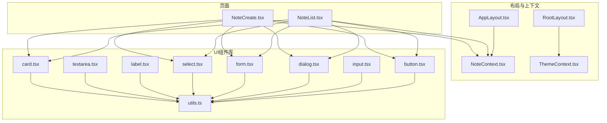
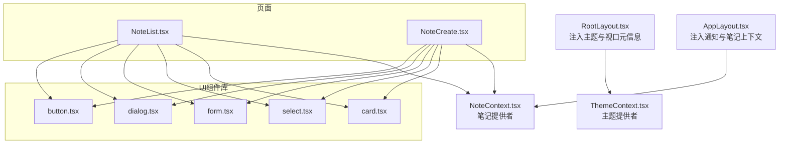
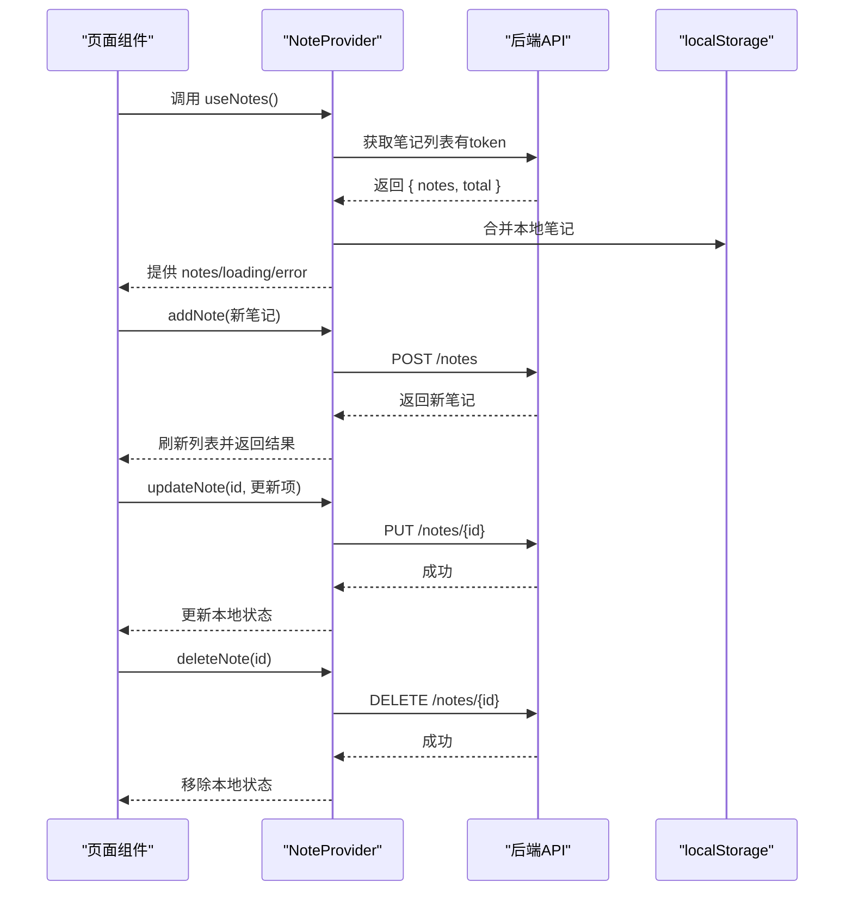
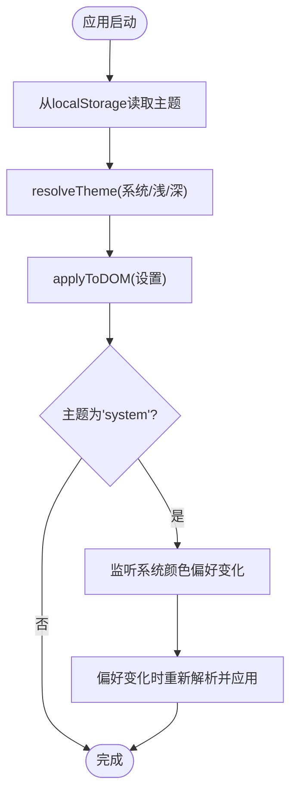
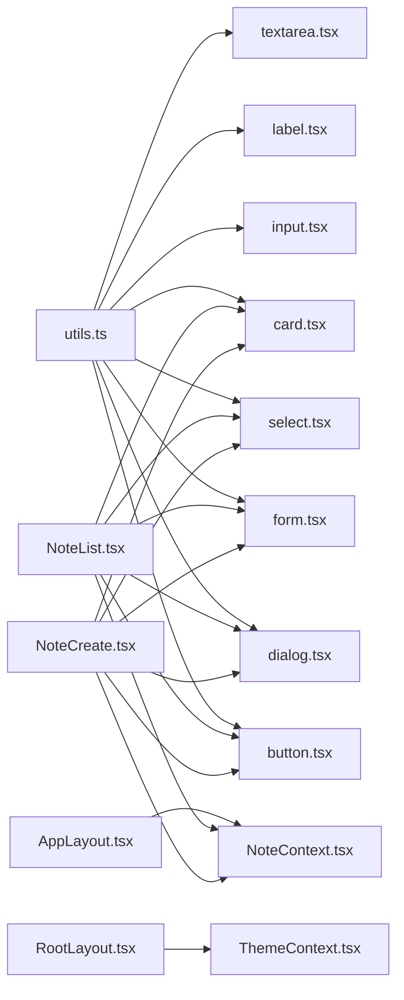

# 核心组件系统

<cite>
**本文引用的文件**
- [NoteContext.tsx](file://src/app/components/context/NoteContext.tsx)
- [ThemeContext.tsx](file://src/app/components/context/ThemeContext.tsx)
- [AppLayout.tsx](file://src/app/components/AppLayout.tsx)
- [RootLayout.tsx](file://src/app/components/RootLayout.tsx)
- [button.tsx](file://src/app/components/ui/button.tsx)
- [input.tsx](file://src/app/components/ui/input.tsx)
- [dialog.tsx](file://src/app/components/ui/dialog.tsx)
- [form.tsx](file://src/app/components/ui/form.tsx)
- [select.tsx](file://src/app/components/ui/select.tsx)
- [label.tsx](file://src/app/components/ui/label.tsx)
- [textarea.tsx](file://src/app/components/ui/textarea.tsx)
- [card.tsx](file://src/app/components/ui/card.tsx)
- [utils.ts](file://src/app/components/ui/utils.ts)
- [NoteList.tsx](file://src/app/pages/NoteList.tsx)
- [NoteCreate.tsx](file://src/app/pages/NoteCreate.tsx)
</cite>

## 目录
1. [简介](#简介)
2. [项目结构](#项目结构)
3. [核心组件](#核心组件)
4. [架构总览](#架构总览)
5. [详细组件分析](#详细组件分析)
6. [依赖关系分析](#依赖关系分析)
7. [性能考量](#性能考量)
8. [故障排查指南](#故障排查指南)
9. [结论](#结论)
10. [附录](#附录)

## 简介
本文件系统化梳理笔记应用前端的核心组件体系，覆盖UI组件库概览、自定义组件设计与使用示例，并深入解析Context提供者模式（NoteContext与ThemeContext）的设计原理与最佳实践。文档同时阐述组件间通信机制、状态共享模式与生命周期管理策略，给出props定义、事件处理、样式定制与可访问性支持的规范建议，并提供扩展与自定义的指导。

## 项目结构
项目采用“按功能域分层 + 组件库模块化”的组织方式：
- 组件层：ui目录提供原子组件与复合组件；context目录提供全局状态上下文；布局组件负责路由容器与主题注入。
- 页面层：pages目录承载业务页面，直接消费上下文与UI组件。
- 服务层：services目录封装API调用与业务服务。
- 工具层：components/ui/utils.ts统一类名合并逻辑，配合Tailwind与class-variance-authority实现变体样式。

图表来源
- [AppLayout.tsx:1-15](file://src/app/components/AppLayout.tsx#L1-L15)
- [RootLayout.tsx:1-52](file://src/app/components/RootLayout.tsx#L1-L52)
- [NoteContext.tsx:1-356](file://src/app/components/context/NoteContext.tsx#L1-L356)
- [ThemeContext.tsx:1-110](file://src/app/components/context/ThemeContext.tsx#L1-L110)
- [button.tsx:1-59](file://src/app/components/ui/button.tsx#L1-L59)
- [input.tsx:1-22](file://src/app/components/ui/input.tsx#L1-L22)
- [dialog.tsx:1-136](file://src/app/components/ui/dialog.tsx#L1-L136)
- [form.tsx:1-169](file://src/app/components/ui/form.tsx#L1-L169)
- [select.tsx:1-190](file://src/app/components/ui/select.tsx#L1-L190)
- [label.tsx:1-25](file://src/app/components/ui/label.tsx#L1-L25)
- [textarea.tsx:1-19](file://src/app/components/ui/textarea.tsx#L1-L19)
- [card.tsx:1-93](file://src/app/components/ui/card.tsx#L1-L93)
- [utils.ts:1-7](file://src/app/components/ui/utils.ts#L1-L7)
- [NoteList.tsx:1-800](file://src/app/pages/NoteList.tsx#L1-L800)
- [NoteCreate.tsx:1-800](file://src/app/pages/NoteCreate.tsx#L1-L800)

章节来源
- [AppLayout.tsx:1-15](file://src/app/components/AppLayout.tsx#L1-L15)
- [RootLayout.tsx:1-52](file://src/app/components/RootLayout.tsx#L1-L52)

## 核心组件
本节聚焦UI组件库与上下文提供者的职责边界与协作方式，帮助开发者快速定位组件能力与使用场景。

- UI组件库
  - 按功能域划分：表单控件（input、textarea、label）、按钮（button）、对话框（dialog）、选择器（select）、卡片（card）等。
  - 设计原则：以Radix UI为基础，结合class-variance-authority实现变体样式，通过utils.ts的cn函数统一合并类名，确保一致的视觉与交互体验。
  - 可访问性：大量使用aria-*属性与语义化标签，保证键盘导航与屏幕阅读器友好。

- 上下文提供者
  - NoteContext：统一管理笔记数据的增删改查、本地/云端同步、加载与错误状态，暴露useNotes钩子供页面消费。
  - ThemeContext：统一管理主题切换（系统/浅色/深色），持久化存储于localStorage，并在DOM上应用data-theme属性，实现全局样式切换。

章节来源
- [button.tsx:1-59](file://src/app/components/ui/button.tsx#L1-L59)
- [input.tsx:1-22](file://src/app/components/ui/input.tsx#L1-L22)
- [dialog.tsx:1-136](file://src/app/components/ui/dialog.tsx#L1-L136)
- [form.tsx:1-169](file://src/app/components/ui/form.tsx#L1-L169)
- [select.tsx:1-190](file://src/app/components/ui/select.tsx#L1-L190)
- [label.tsx:1-25](file://src/app/components/ui/label.tsx#L1-L25)
- [textarea.tsx:1-19](file://src/app/components/ui/textarea.tsx#L1-L19)
- [card.tsx:1-93](file://src/app/components/ui/card.tsx#L1-L93)
- [utils.ts:1-7](file://src/app/components/ui/utils.ts#L1-L7)
- [NoteContext.tsx:1-356](file://src/app/components/context/NoteContext.tsx#L1-L356)
- [ThemeContext.tsx:1-110](file://src/app/components/context/ThemeContext.tsx#L1-L110)

## 架构总览
整体架构采用“布局容器 + 上下文提供者 + UI组件库 + 页面”的分层设计。布局组件负责注入全局状态与主题，UI组件库提供可复用的原子与复合组件，页面通过上下文钩子与组件组合完成业务功能。

图表来源
- [RootLayout.tsx:1-52](file://src/app/components/RootLayout.tsx#L1-L52)
- [ThemeContext.tsx:1-110](file://src/app/components/context/ThemeContext.tsx#L1-L110)
- [AppLayout.tsx:1-15](file://src/app/components/AppLayout.tsx#L1-L15)
- [NoteContext.tsx:1-356](file://src/app/components/context/NoteContext.tsx#L1-L356)
- [button.tsx:1-59](file://src/app/components/ui/button.tsx#L1-L59)
- [dialog.tsx:1-136](file://src/app/components/ui/dialog.tsx#L1-L136)
- [form.tsx:1-169](file://src/app/components/ui/form.tsx#L1-L169)
- [select.tsx:1-190](file://src/app/components/ui/select.tsx#L1-L190)
- [card.tsx:1-93](file://src/app/components/ui/card.tsx#L1-L93)

## 详细组件分析

### NoteContext：笔记上下文与状态管理
- 数据模型与类型
  - Note接口定义字段（id、title、content、type、status、createdAt、tags、imageUrl、structuredData、localOnly、pendingSync）。
  - NoteContextType暴露notes、loading、error以及addNote、deleteNote、updateNote、refreshNotes等操作方法。
- 生命周期与副作用
  - 在NoteProvider中通过useEffect初始化加载；当存在access_token时拉取后端笔记列表，否则回退到本地localStorage。
  - 合并本地与远端数据，按createdAt倒序排序；首次发现本地待同步条目时触发批量同步至后端。
- 本地/云端同步策略
  - 本地笔记标记localOnly与pendingSync，生成以local-开头的临时ID；更新/删除时区分本地ID与服务端ID，分别走本地持久化或API调用。
  - 同步完成后清理本地缓存并重新拉取最新列表。
- 错误处理与加载态
  - 统一设置loading与error状态，便于UI层渲染骨架屏与错误提示。
- 使用示例（路径参考）
  - 页面读取笔记列表与过滤：[NoteList.tsx:383-551](file://src/app/pages/NoteList.tsx#L383-L551)
  - 新建/更新/删除笔记：[NoteContext.tsx:224-340](file://src/app/components/context/NoteContext.tsx#L224-L340)

图表来源
- [NoteContext.tsx:152-218](file://src/app/components/context/NoteContext.tsx#L152-L218)
- [NoteContext.tsx:224-340](file://src/app/components/context/NoteContext.tsx#L224-L340)
- [NoteList.tsx:383-551](file://src/app/pages/NoteList.tsx#L383-L551)

章节来源
- [NoteContext.tsx:1-356](file://src/app/components/context/NoteContext.tsx#L1-L356)
- [NoteList.tsx:1-800](file://src/app/pages/NoteList.tsx#L1-L800)

### ThemeContext：主题上下文与系统偏好监听
- 主题枚举与解析
  - ThemeId包含'system' | 'light' | 'dark'；resolveTheme根据系统偏好动态解析实际主题。
- DOM应用与持久化
  - applyToDOM在<html>上设置data-theme属性，实现全局CSS变量切换；safeGetStorage/safeSetStorage处理受限环境。
- 响应式与变更监听
  - 监听window.matchMedia变化，当主题为'system'时自动跟随系统偏好；setTheme更新状态并持久化。
- 使用示例（路径参考）
  - RootLayout挂载时读取isDark并设置主题色与背景：[RootLayout.tsx:10-30](file://src/app/components/RootLayout.tsx#L10-L30)
  - 主题切换入口：[ThemeContext.tsx:94-98](file://src/app/components/context/ThemeContext.tsx#L94-L98)

图表来源
- [ThemeContext.tsx:63-105](file://src/app/components/context/ThemeContext.tsx#L63-L105)
- [RootLayout.tsx:10-30](file://src/app/components/RootLayout.tsx#L10-L30)

章节来源
- [ThemeContext.tsx:1-110](file://src/app/components/context/ThemeContext.tsx#L1-L110)
- [RootLayout.tsx:1-52](file://src/app/components/RootLayout.tsx#L1-L52)

### UI组件库：原子与复合组件
- button.tsx
  - 使用cva定义变体（default、destructive、outline、secondary、ghost、link）与尺寸（default、sm、lg、icon），支持asChild与data-slot标注，便于样式覆盖与无障碍识别。
  - 参考路径：[button.tsx:1-59](file://src/app/components/ui/button.tsx#L1-L59)
- input.tsx
  - 统一输入框基础样式与焦点态、禁用态、错误态的视觉反馈，提供data-slot便于调试与测试。
  - 参考路径：[input.tsx:1-22](file://src/app/components/ui/input.tsx#L1-L22)
- dialog.tsx
  - 基于@radix-ui/react-dialog封装，提供Portal、Overlay、Content、Header/Footer、Title/Description等子组件，内置关闭按钮与可访问性标签。
  - 参考路径：[dialog.tsx:1-136](file://src/app/components/ui/dialog.tsx#L1-L136)
- form.tsx
  - 封装react-hook-form，提供Form、FormField、FormItem、FormLabel、FormControl、FormDescription、FormMessage等，统一错误态与ARIA属性。
  - 参考路径：[form.tsx:1-169](file://src/app/components/ui/form.tsx#L1-L169)
- select.tsx
  - 基于@radix-ui/react-select，提供Trigger、Content、Item、Label、Separator、ScrollUp/DownButton等，支持尺寸与滚动行为配置。
  - 参考路径：[select.tsx:1-190](file://src/app/components/ui/select.tsx#L1-L190)
- label.tsx、textarea.tsx、card.tsx
  - 保持最小必要封装，统一类名合并与可访问性属性。
  - 参考路径：[label.tsx:1-25](file://src/app/components/ui/label.tsx#L1-L25)，[textarea.tsx:1-19](file://src/app/components/ui/textarea.tsx#L1-L19)，[card.tsx:1-93](file://src/app/components/ui/card.tsx#L1-L93)

章节来源
- [button.tsx:1-59](file://src/app/components/ui/button.tsx#L1-L59)
- [input.tsx:1-22](file://src/app/components/ui/input.tsx#L1-L22)
- [dialog.tsx:1-136](file://src/app/components/ui/dialog.tsx#L1-L136)
- [form.tsx:1-169](file://src/app/components/ui/form.tsx#L1-L169)
- [select.tsx:1-190](file://src/app/components/ui/select.tsx#L1-L190)
- [label.tsx:1-25](file://src/app/components/ui/label.tsx#L1-L25)
- [textarea.tsx:1-19](file://src/app/components/ui/textarea.tsx#L1-L19)
- [card.tsx:1-93](file://src/app/components/ui/card.tsx#L1-L93)
- [utils.ts:1-7](file://src/app/components/ui/utils.ts#L1-L7)

### 组件使用示例与最佳实践
- 在页面中使用NoteContext
  - 读取笔记列表与过滤：[NoteList.tsx:383-551](file://src/app/pages/NoteList.tsx#L383-L551)
  - 新建/更新/删除笔记：[NoteContext.tsx:224-340](file://src/app/components/context/NoteContext.tsx#L224-L340)
- 在页面中使用ThemeContext
  - 动态设置主题色与背景：[RootLayout.tsx:10-30](file://src/app/components/RootLayout.tsx#L10-L30)
- 表单与选择器
  - 使用Form/FormField/FormControl等组合构建受控表单：[form.tsx:1-169](file://src/app/components/ui/form.tsx#L1-L169)
  - 使用Select实现多选项选择：[select.tsx:1-190](file://src/app/components/ui/select.tsx#L1-L190)
- 对话框与按钮
  - 使用Dialog与Button实现模态交互：[dialog.tsx:1-136](file://src/app/components/ui/dialog.tsx#L1-L136)，[button.tsx:1-59](file://src/app/components/ui/button.tsx#L1-L59)

章节来源
- [NoteList.tsx:1-800](file://src/app/pages/NoteList.tsx#L1-L800)
- [NoteContext.tsx:1-356](file://src/app/components/context/NoteContext.tsx#L1-L356)
- [RootLayout.tsx:1-52](file://src/app/components/RootLayout.tsx#L1-L52)
- [form.tsx:1-169](file://src/app/components/ui/form.tsx#L1-L169)
- [select.tsx:1-190](file://src/app/components/ui/select.tsx#L1-L190)
- [dialog.tsx:1-136](file://src/app/components/ui/dialog.tsx#L1-L136)
- [button.tsx:1-59](file://src/app/components/ui/button.tsx#L1-L59)

## 依赖关系分析
- 组件耦合与内聚
  - UI组件高度内聚，仅依赖utils.ts进行类名合并；上下文提供者独立封装状态与副作用，页面通过钩子解耦消费。
- 外部依赖
  - Radix UI用于无障碍与可访问性；class-variance-authority用于变体样式；Tailwind与twMerge用于样式合并与冲突解决。
- 潜在循环依赖
  - 当前结构清晰，上下文提供者位于组件树根部，避免跨层级循环依赖。

图表来源
- [utils.ts:1-7](file://src/app/components/ui/utils.ts#L1-L7)
- [button.tsx:1-59](file://src/app/components/ui/button.tsx#L1-L59)
- [input.tsx:1-22](file://src/app/components/ui/input.tsx#L1-L22)
- [dialog.tsx:1-136](file://src/app/components/ui/dialog.tsx#L1-L136)
- [form.tsx:1-169](file://src/app/components/ui/form.tsx#L1-L169)
- [select.tsx:1-190](file://src/app/components/ui/select.tsx#L1-L190)
- [label.tsx:1-25](file://src/app/components/ui/label.tsx#L1-L25)
- [textarea.tsx:1-19](file://src/app/components/ui/textarea.tsx#L1-L19)
- [card.tsx:1-93](file://src/app/components/ui/card.tsx#L1-L93)
- [AppLayout.tsx:1-15](file://src/app/components/AppLayout.tsx#L1-L15)
- [RootLayout.tsx:1-52](file://src/app/components/RootLayout.tsx#L1-L52)
- [NoteList.tsx:1-800](file://src/app/pages/NoteList.tsx#L1-L800)
- [NoteCreate.tsx:1-800](file://src/app/pages/NoteCreate.tsx#L1-L800)

章节来源
- [utils.ts:1-7](file://src/app/components/ui/utils.ts#L1-L7)
- [AppLayout.tsx:1-15](file://src/app/components/AppLayout.tsx#L1-L15)
- [RootLayout.tsx:1-52](file://src/app/components/RootLayout.tsx#L1-L52)
- [NoteList.tsx:1-800](file://src/app/pages/NoteList.tsx#L1-L800)
- [NoteCreate.tsx:1-800](file://src/app/pages/NoteCreate.tsx#L1-L800)

## 性能考量
- 渲染优化
  - 页面侧使用useMemo对过滤与统计计算进行缓存，减少重复渲染开销。
  - NoteList中对富文本内容进行节流与条件渲染（图片缩略、脑图预览、标签截断）。
- 状态同步
  - NoteContext在新增/更新/删除时优先更新本地状态，再异步与后端同步，降低等待时间。
- 样式与类名
  - 通过utils.ts统一合并类名，避免重复计算与样式冲突；变体样式由cva集中管理，便于缓存与复用。
- 可访问性
  - 所有交互组件均提供aria-*属性与键盘可达性，保障低视力用户与辅助技术可用性。

[本节为通用性能建议，不直接分析具体文件，故无章节来源]

## 故障排查指南
- 主题切换无效
  - 检查浏览器是否支持matchMedia与localStorage；确认<html>元素上data-theme是否被正确设置。
  - 参考路径：[ThemeContext.tsx:17-61](file://src/app/components/context/ThemeContext.tsx#L17-L61)
- 笔记无法同步
  - 确认access_token是否存在；检查本地localStorage键值；查看NoteContext中的错误状态与控制台报错。
  - 参考路径：[NoteContext.tsx:152-218](file://src/app/components/context/NoteContext.tsx#L152-L218)
- 表单验证异常
  - 确保在Form/FormField/FormControl组合中正确传递name与控制权；检查useFormState与useFormField的上下文绑定。
  - 参考路径：[form.tsx:45-66](file://src/app/components/ui/form.tsx#L45-L66)
- 对话框无法关闭
  - 确认DialogClose与DialogTrigger的使用是否正确；检查Portal与Overlay的渲染层级。
  - 参考路径：[dialog.tsx:15-31](file://src/app/components/ui/dialog.tsx#L15-L31)

章节来源
- [ThemeContext.tsx:1-110](file://src/app/components/context/ThemeContext.tsx#L1-L110)
- [NoteContext.tsx:1-356](file://src/app/components/context/NoteContext.tsx#L1-L356)
- [form.tsx:1-169](file://src/app/components/ui/form.tsx#L1-L169)
- [dialog.tsx:1-136](file://src/app/components/ui/dialog.tsx#L1-L136)

## 结论
本核心组件系统通过上下文提供者与UI组件库实现了高内聚、低耦合的状态与界面抽象。NoteContext与ThemeContext分别承担业务状态与主题态的统一管理，页面通过钩子与组件组合高效完成复杂交互。遵循本文的props定义、事件处理、样式定制与可访问性规范，可确保组件在多端与多环境下的一致体验与可维护性。

[本节为总结性内容，不直接分析具体文件，故无章节来源]

## 附录
- 最佳实践清单
  - Props定义：明确必填/可选字段，使用类型约束；为事件回调提供默认空实现。
  - 事件处理：统一在组件内部处理防抖/节流；对外暴露稳定回调签名。
  - 样式定制：优先通过变体参数与className扩展；避免内联样式的硬编码。
  - 可访问性：为交互元素提供aria-*属性与键盘可达性；为表单提供label与描述。
  - 扩展与自定义：基于cva与utils.ts扩展新变体；通过asChild与Portal扩展复合组件。

[本节为通用指导，不直接分析具体文件，故无章节来源]