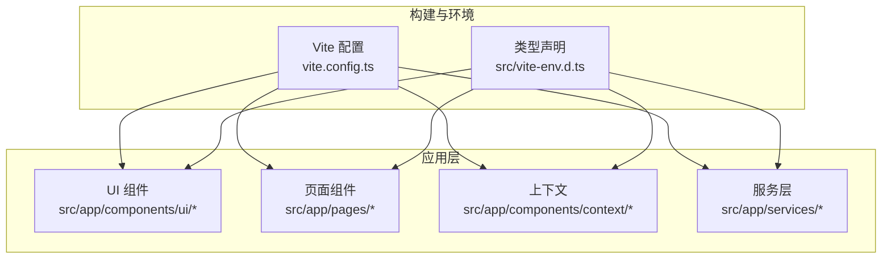
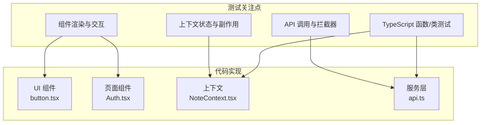
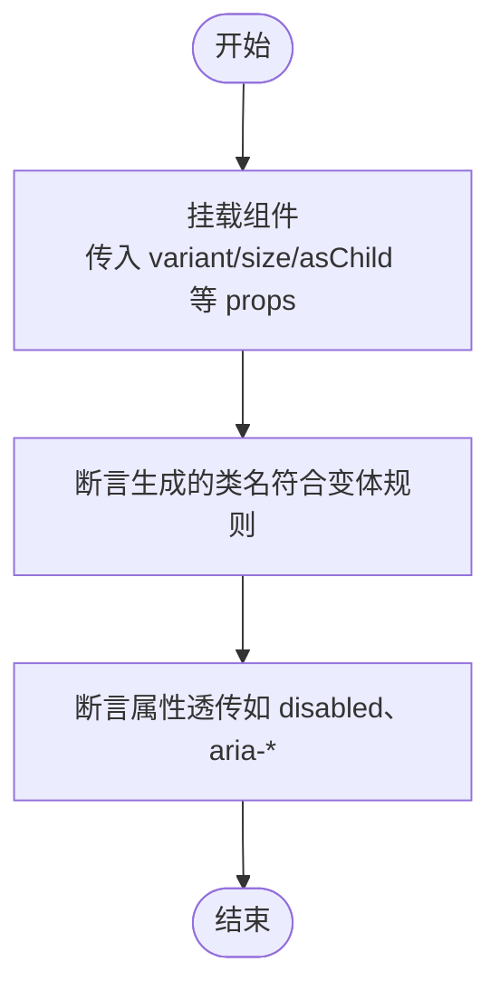
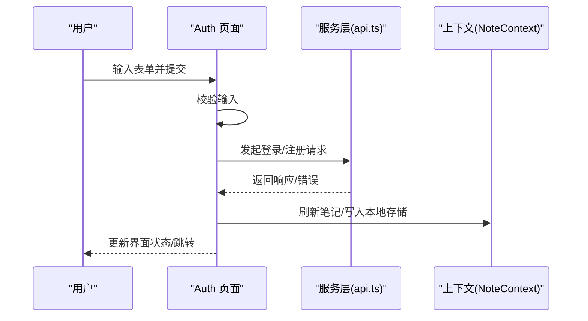
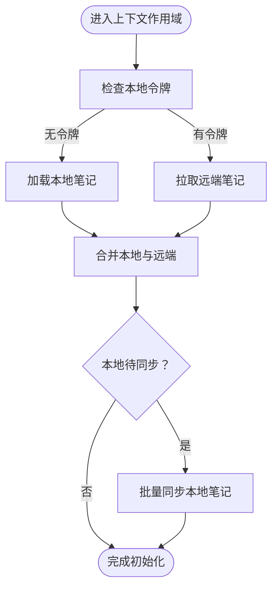
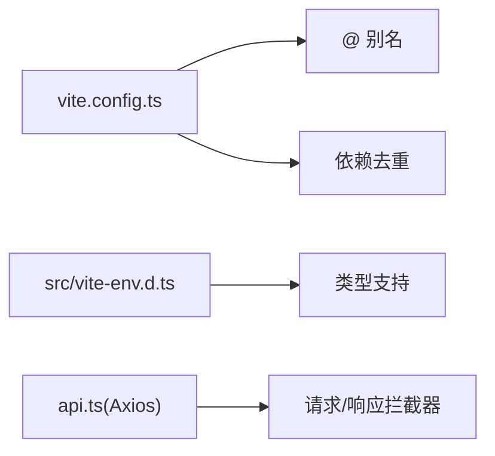

# 单元测试

<cite>
**本文引用的文件**
- [package.json](file://package.json)
- [vite.config.ts](file://vite.config.ts)
- [src/vite-env.d.ts](file://src/vite-env.d.ts)
- [src/app/services/api.ts](file://src/app/services/api.ts)
- [src/app/components/context/NoteContext.tsx](file://src/app/components/context/NoteContext.tsx)
- [src/app/components/ui/button.tsx](file://src/app/components/ui/button.tsx)
- [src/app/pages/Auth.tsx](file://src/app/pages/Auth.tsx)
</cite>

## 目录
1. [简介](#简介)
2. [项目结构](#项目结构)
3. [核心组件](#核心组件)
4. [架构总览](#架构总览)
5. [详细组件分析](#详细组件分析)
6. [依赖分析](#依赖分析)
7. [性能考虑](#性能考虑)
8. [故障排查指南](#故障排查指南)
9. [结论](#结论)
10. [附录](#附录)

## 简介
本指南面向在 React 项目中编写与运行单元测试的开发者，结合当前仓库的工程配置与业务代码，提供从环境搭建、测试策略到最佳实践与常见陷阱的完整落地路径。重点覆盖：
- 测试环境与工具链：基于 Vite 的前端工程，如何引入与配置测试相关能力
- 组件测试：渲染、Props 传递、事件处理
- TypeScript 代码测试：函数与类的测试策略
- Mock 对象：API 调用 Mock 与第三方库 Mock
- 覆盖率报告：生成与分析
- 测试文件命名与组织
- 最佳实践与常见陷阱

## 项目结构
本项目采用 Vite 构建，React 18 生态，包含大量 UI 组件、上下文与服务层。测试应围绕以下层次展开：
- 组件层：原子组件与页面组件
- 服务层：Axios 封装与拦截器
- 上下文层：状态管理与副作用
- 工具与类型：TS 类型与工具函数

图表来源
- [vite.config.ts:1-44](file://vite.config.ts#L1-L44)
- [src/vite-env.d.ts:1-12](file://src/vite-env.d.ts#L1-L12)

章节来源
- [vite.config.ts:1-44](file://vite.config.ts#L1-L44)
- [src/vite-env.d.ts:1-12](file://src/vite-env.d.ts#L1-L12)

## 核心组件
- UI 组件：如按钮等原子组件，适合进行渲染与样式变体测试
- 页面组件：如认证页，包含复杂交互、动画与副作用，适合集成与行为测试
- 上下文：笔记上下文封装了数据加载、增删改、本地同步等逻辑，是测试重点
- 服务层：Axios 封装与拦截器，统一处理鉴权与错误翻译，需重点 Mock

章节来源
- [src/app/components/ui/button.tsx:1-59](file://src/app/components/ui/button.tsx#L1-L59)
- [src/app/pages/Auth.tsx:1-800](file://src/app/pages/Auth.tsx#L1-L800)
- [src/app/components/context/NoteContext.tsx:1-356](file://src/app/components/context/NoteContext.tsx#L1-L356)
- [src/app/services/api.ts:1-127](file://src/app/services/api.ts#L1-L127)

## 架构总览
测试关注点映射到实际代码模块如下：

图表来源
- [src/app/components/ui/button.tsx:1-59](file://src/app/components/ui/button.tsx#L1-L59)
- [src/app/pages/Auth.tsx:1-800](file://src/app/pages/Auth.tsx#L1-L800)
- [src/app/components/context/NoteContext.tsx:1-356](file://src/app/components/context/NoteContext.tsx#L1-L356)
- [src/app/services/api.ts:1-127](file://src/app/services/api.ts#L1-L127)

## 详细组件分析

### 组件渲染与交互测试（以 Button 为例）
目标
- 验证不同变体与尺寸的渲染一致性
- 验证透传的 props 行为
- 验证作为容器元素（asChild）的行为

建议步骤
- 使用测试运行器与 DOM 测试库，挂载组件并断言类名与属性
- 为变体与尺寸参数化测试，覆盖默认值与边界值
- 断言图标与禁用态等视觉状态

图表来源
- [src/app/components/ui/button.tsx:37-56](file://src/app/components/ui/button.tsx#L37-L56)

章节来源
- [src/app/components/ui/button.tsx:1-59](file://src/app/components/ui/button.tsx#L1-L59)

### 页面组件行为测试（以 Auth 为例）
目标
- 验证表单校验与错误提示
- 验证登录/注册流程中的状态切换与副作用
- 验证第三方动画库的交互（如 motion）

建议步骤
- 使用内存路由与上下文 Provider 包裹
- Mock 服务层 API 调用，控制响应与错误
- 触发用户交互（输入、点击、键盘事件），断言状态变化与副作用
- 对动画与计时器进行快进或清理

图表来源
- [src/app/pages/Auth.tsx:516-549](file://src/app/pages/Auth.tsx#L516-L549)
- [src/app/services/api.ts:36-42](file://src/app/services/api.ts#L36-L42)
- [src/app/components/context/NoteContext.tsx:224-272](file://src/app/components/context/NoteContext.tsx#L224-L272)

章节来源
- [src/app/pages/Auth.tsx:1-800](file://src/app/pages/Auth.tsx#L1-L800)
- [src/app/services/api.ts:1-127](file://src/app/services/api.ts#L1-L127)
- [src/app/components/context/NoteContext.tsx:1-356](file://src/app/components/context/NoteContext.tsx#L1-L356)

### 上下文状态与副作用测试（以 NoteContext 为例）
目标
- 验证笔记列表加载、合并与本地同步
- 验证新增、删除、更新的乐观更新与回滚
- 验证错误处理与加载状态

建议步骤
- Mock localStorage 与服务层 API
- 分场景驱动：有令牌/无令牌、本地笔记存在与否、网络异常
- 断言状态变更、本地持久化与请求次数

图表来源
- [src/app/components/context/NoteContext.tsx:152-218](file://src/app/components/context/NoteContext.tsx#L152-L218)
- [src/app/components/context/NoteContext.tsx:195-210](file://src/app/components/context/NoteContext.tsx#L195-L210)

章节来源
- [src/app/components/context/NoteContext.tsx:1-356](file://src/app/components/context/NoteContext.tsx#L1-L356)

### TypeScript 函数与类测试策略
- 函数测试：对纯函数与工具函数进行输入输出断言，覆盖边界与异常分支
- 类测试：对带状态的对象，重点测试状态转换与副作用触发
- 建议使用参数化测试与快照测试辅助回归

章节来源
- [src/app/components/context/NoteContext.tsx:30-87](file://src/app/components/context/NoteContext.tsx#L30-L87)

### Mock 对象与第三方库
- API 调用 Mock：对服务层 Axios 实例进行拦截与替换，控制响应与错误
- 第三方库 Mock：对动画库、路由、存储等进行隔离，保证测试可重复性
- 建议集中管理 Mock 工厂与测试工具，减少重复代码

章节来源
- [src/app/services/api.ts:1-127](file://src/app/services/api.ts#L1-L127)
- [src/app/pages/Auth.tsx:1-800](file://src/app/pages/Auth.tsx#L1-L800)

## 依赖分析
- 构建与别名：Vite 配置中设置了别名与去重，有助于测试时的模块解析一致性
- 类型声明：全局类型与环境变量声明确保测试环境具备类型支持
- 服务层：Axios 封装统一了鉴权与错误处理，测试时应优先隔离该层

图表来源
- [vite.config.ts:11-25](file://vite.config.ts#L11-L25)
- [src/vite-env.d.ts:1-12](file://src/vite-env.d.ts#L1-L12)
- [src/app/services/api.ts:44-54](file://src/app/services/api.ts#L44-L54)

章节来源
- [vite.config.ts:1-44](file://vite.config.ts#L1-L44)
- [src/vite-env.d.ts:1-12](file://src/vite-env.d.ts#L1-L12)
- [src/app/services/api.ts:1-127](file://src/app/services/api.ts#L1-L127)

## 性能考虑
- 测试并发与异步：合理拆分测试用例，避免长链路串联导致的不稳定
- 快进计时器：对定时器与动画进行快进，缩短等待时间
- 覆盖关键路径：优先保证高风险路径与高频交互的测试

## 故障排查指南
- 网络错误与鉴权失败：服务层拦截器会统一处理 401 与错误翻译，测试时应覆盖这些分支
- 本地存储与令牌：注意测试前后对 localStorage 的清理与恢复
- 动画与副作用：对第三方动画库的副作用进行隔离或快照控制

章节来源
- [src/app/services/api.ts:56-126](file://src/app/services/api.ts#L56-L126)

## 结论
通过围绕组件、服务、上下文与工具函数的分层测试，结合 API 与第三方库的 Mock，可以在本项目中建立稳定可靠的单元测试体系。建议从简单组件与纯函数入手，逐步扩展到页面与上下文的集成测试，并持续优化覆盖率与执行效率。

## 附录

### 测试环境与工具链建议
- 测试运行器：推荐使用与 Vite 生态兼容的测试框架（如 Vitest）
- DOM 测试库：用于组件渲染与交互断言
- 类型支持：确保测试文件具备类型声明与环境变量类型
- 覆盖率：开启覆盖率统计，定期分析薄弱环节

章节来源
- [package.json:1-113](file://package.json#L1-L113)
- [src/vite-env.d.ts:1-12](file://src/vite-env.d.ts#L1-L12)

### 测试文件命名与组织
- 命名：组件测试以组件名结尾，如 Button.test.tsx；页面测试以页面名结尾，如 Auth.test.tsx
- 组织：按功能模块划分目录，如 components/ui、pages、services、context

### 最佳实践与常见陷阱
- 最佳实践
  - 优先测试公开接口与行为，而非内部实现细节
  - 参数化与快照测试结合，提升回归效率
  - 集中管理 Mock 与测试工具，保持一致性
- 常见陷阱
  - 过度依赖真实网络请求，导致测试不稳定
  - 忽视第三方库副作用，导致测试间相互影响
  - 缺乏覆盖率与质量门禁，导致问题积累