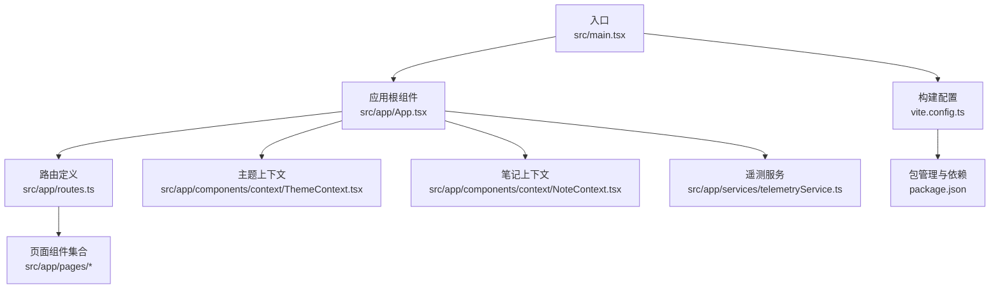
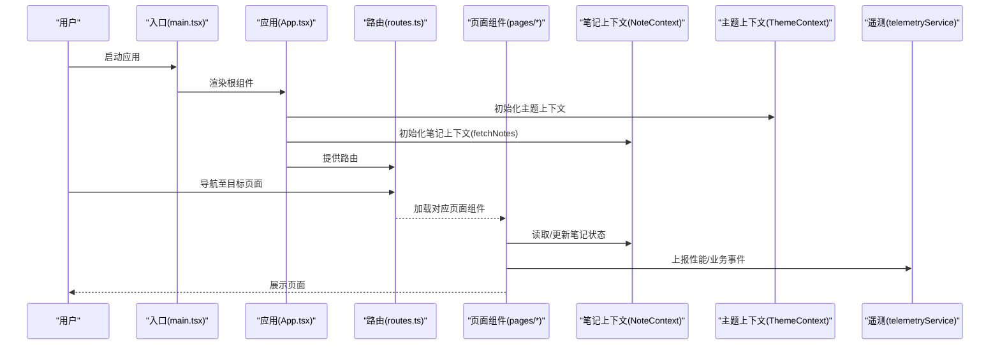
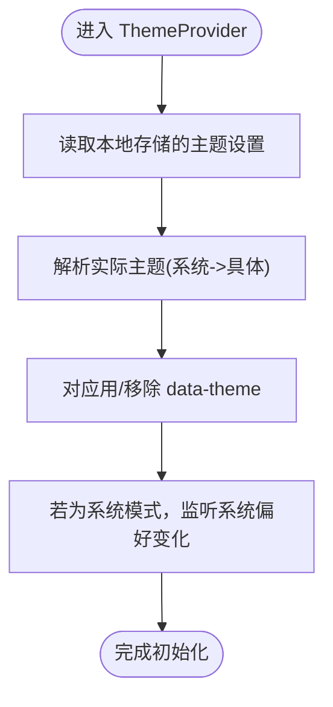
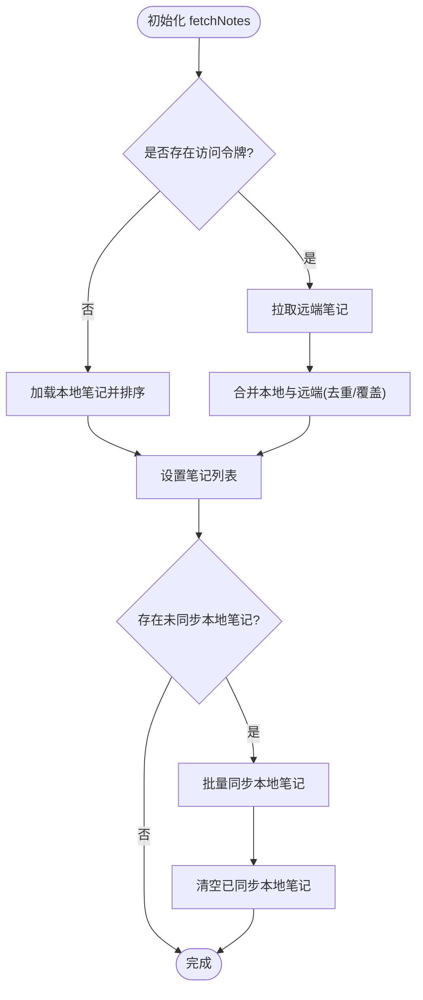
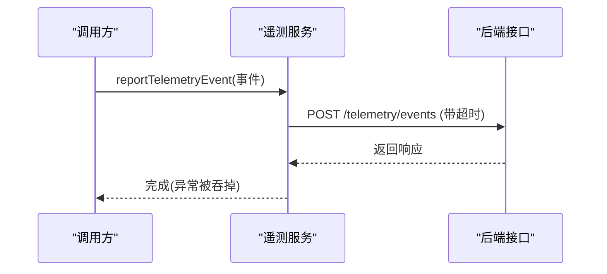
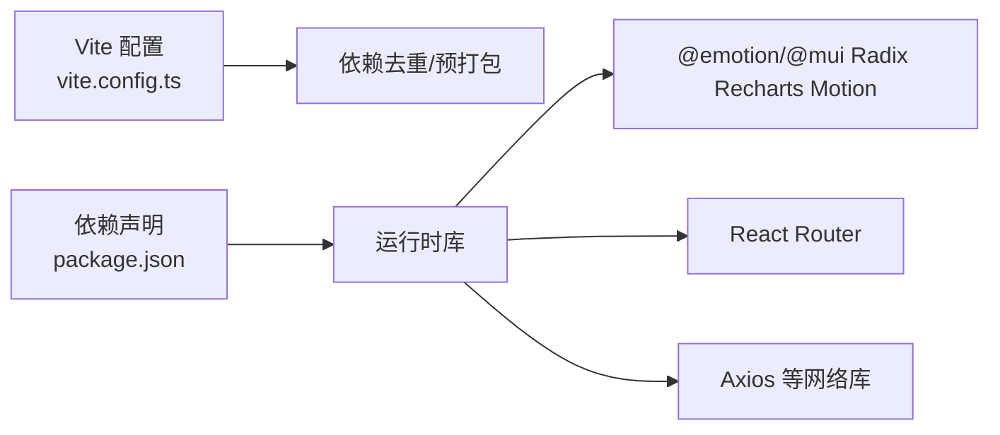

# 性能分析

<cite>
**本文引用的文件**
- [package.json](file://package.json)
- [vite.config.ts](file://vite.config.ts)
- [src/main.tsx](file://src/main.tsx)
- [README.md](file://README.md)
- [src/app/App.tsx](file://src/app/App.tsx)
- [src/app/routes.ts](file://src/app/routes.ts)
- [src/app/services/telemetryService.ts](file://src/app/services/telemetryService.ts)
- [src/app/components/context/NoteContext.tsx](file://src/app/components/context/NoteContext.tsx)
- [src/app/components/context/ThemeContext.tsx](file://src/app/components/context/ThemeContext.tsx)
- [src/app/components/ui/use-mobile.ts](file://src/app/components/ui/use-mobile.ts)
- [src/app/utils/featureFlags.ts](file://src/app/utils/featureFlags.ts)
- [android/.jdk17/jdk-17.0.18+8/Contents/Home/lib/jfr/default.jfc](file://android/.jdk17/jdk-17.0.18+8/Contents/Home/lib/jfr/default.jfc)
- [android/.jdk17/jdk-17.0.18+8/Contents/Home/lib/jfr/profile.jfc](file://android/.jdk17/jdk-17.0.18+8/Contents/Home/lib/jfr/profile.jfc)
</cite>

## 目录
1. [引言](#引言)
2. [项目结构](#项目结构)
3. [核心组件](#核心组件)
4. [架构总览](#架构总览)
5. [详细组件分析](#详细组件分析)
6. [依赖关系分析](#依赖关系分析)
7. [性能考量与优化建议](#性能考量与优化建议)
8. [故障排查指南](#故障排查指南)
9. [结论](#结论)
10. [附录](#附录)

## 引言
本指南面向开发者与性能工程师，围绕该笔记应用前端的性能分析与优化展开，覆盖加载时间、内存使用、CPU 占用等指标的采集与分析；React 应用的组件懒加载、代码分割与状态优化；移动端电池与网络优化；性能监控工具（Web Vitals/Core Web Vitals）的落地；内存泄漏检测与修复；渲染性能优化（虚拟滚动、防抖/节流）；性能基准与回归测试；以及系统化的问题诊断流程。

## 项目结构
该项目采用 Vite + React 18 构建，Capacitor 集成 Android/iOS 原生能力。应用通过路由驱动页面切换，全局上下文提供主题、笔记状态管理，服务层负责遥测上报与 API 交互。

图表来源
- [src/main.tsx:1-7](file://src/main.tsx#L1-L7)
- [src/app/App.tsx:1-17](file://src/app/App.tsx#L1-L17)
- [src/app/routes.ts:1-61](file://src/app/routes.ts#L1-L61)
- [src/app/components/context/ThemeContext.tsx:1-110](file://src/app/components/context/ThemeContext.tsx#L1-L110)
- [src/app/components/context/NoteContext.tsx:1-356](file://src/app/components/context/NoteContext.tsx#L1-L356)
- [src/app/services/telemetryService.ts:1-22](file://src/app/services/telemetryService.ts#L1-L22)
- [vite.config.ts:1-44](file://vite.config.ts#L1-L44)
- [package.json:1-113](file://package.json#L1-L113)

章节来源
- [src/main.tsx:1-7](file://src/main.tsx#L1-L7)
- [src/app/App.tsx:1-17](file://src/app/App.tsx#L1-L17)
- [src/app/routes.ts:1-61](file://src/app/routes.ts#L1-L61)
- [vite.config.ts:1-44](file://vite.config.ts#L1-L44)
- [package.json:1-113](file://package.json#L1-L113)

## 核心组件
- 应用根与路由：应用在根组件中装配主题、笔记与提示上下文，并通过路由提供器承载页面层级。
- 主题上下文：负责系统/浅色/深色主题解析与 DOM 应用，支持系统偏好监听与本地持久化。
- 笔记上下文：统一管理笔记列表、增删改查、本地缓存与同步逻辑，包含加载状态与错误处理。
- 遥测服务：提供事件上报接口，具备超时控制与异常兜底，便于埋点与性能指标采集。
- 构建与依赖：Vite 优化依赖预打包与 React 去重，减少重复实例导致的开销与 Hook 调用异常。

章节来源
- [src/app/App.tsx:1-17](file://src/app/App.tsx#L1-L17)
- [src/app/components/context/ThemeContext.tsx:1-110](file://src/app/components/context/ThemeContext.tsx#L1-L110)
- [src/app/components/context/NoteContext.tsx:1-356](file://src/app/components/context/NoteContext.tsx#L1-L356)
- [src/app/services/telemetryService.ts:1-22](file://src/app/services/telemetryService.ts#L1-L22)
- [vite.config.ts:1-44](file://vite.config.ts#L1-L44)

## 架构总览
下图展示从入口到页面渲染、状态管理与遥测上报的关键路径，帮助识别潜在性能瓶颈与优化切入点。

图表来源
- [src/main.tsx:1-7](file://src/main.tsx#L1-L7)
- [src/app/App.tsx:1-17](file://src/app/App.tsx#L1-L17)
- [src/app/routes.ts:1-61](file://src/app/routes.ts#L1-L61)
- [src/app/components/context/NoteContext.tsx:1-356](file://src/app/components/context/NoteContext.tsx#L1-L356)
- [src/app/components/context/ThemeContext.tsx:1-110](file://src/app/components/context/ThemeContext.tsx#L1-L110)
- [src/app/services/telemetryService.ts:1-22](file://src/app/services/telemetryService.ts#L1-L22)

## 详细组件分析

### 主题上下文（ThemeContext）
- 设计要点
  - 支持“系统/浅色/深色”三种模式，系统模式基于媒体查询动态适配。
  - 使用本地存储持久化用户选择，避免每次刷新重新计算。
  - DOM 应用通过 data-theme 属性与过渡动画降低视觉闪烁。
- 性能影响
  - 媒体查询监听仅在系统模式启用，减少不必要事件处理。
  - DOM 变更集中在根节点，避免深层样式重排。
- 优化建议
  - 将主题切换与页面切换解耦，避免在高频交互中重复应用。
  - 对过渡动画参数进行统一管理，避免过度动画造成卡顿。

图表来源
- [src/app/components/context/ThemeContext.tsx:63-105](file://src/app/components/context/ThemeContext.tsx#L63-L105)

章节来源
- [src/app/components/context/ThemeContext.tsx:1-110](file://src/app/components/context/ThemeContext.tsx#L1-L110)

### 笔记上下文（NoteContext）
- 设计要点
  - 统一管理笔记列表、增删改查与本地缓存合并策略。
  - 登录态缺失时走本地缓存优先，登录后异步同步至服务端。
  - 提供加载状态与错误处理，避免阻塞 UI。
- 性能影响
  - 列表排序与去重操作在内存中进行，注意大数据量时的复杂度。
  - 同步过程使用防重入标记，避免并发请求风暴。
- 优化建议
  - 大列表分页或虚拟滚动，减少一次性渲染节点数。
  - 对频繁变更的字段使用细粒度状态拆分，降低无关重渲染。
  - 在添加/删除时采用乐观更新与回滚策略，提升交互即时性。

图表来源
- [src/app/components/context/NoteContext.tsx:152-218](file://src/app/components/context/NoteContext.tsx#L152-L218)

章节来源
- [src/app/components/context/NoteContext.tsx:1-356](file://src/app/components/context/NoteContext.tsx#L1-L356)

### 遥测服务（TelemetryService）
- 设计要点
  - 事件对象包含名称、时间戳与任意数据载荷。
  - 上报接口带超时控制，异常静默处理，避免阻断主流程。
- 性能影响
  - 网络请求可能阻塞关键路径，需在主线程外排队或延迟发送。
  - 数据载荷过大将增加传输与解析成本。
- 优化建议
  - 采用批处理与去抖策略，合并低频事件。
  - 对敏感字段进行脱敏与裁剪，控制载荷大小。
  - 在弱网环境下降采样或禁用非关键事件。

图表来源
- [src/app/services/telemetryService.ts:9-21](file://src/app/services/telemetryService.ts#L9-L21)

章节来源
- [src/app/services/telemetryService.ts:1-22](file://src/app/services/telemetryService.ts#L1-L22)

### 移动端与网络优化（use-mobile 与功能开关）
- 设计要点
  - 使用媒体查询判断移动端宽度阈值，提供响应式 UI。
  - 功能开关通过环境变量控制，支持按需开启/关闭特性。
- 性能影响
  - 移动端更易受网络波动影响，应结合缓存与降级策略。
  - 功能开关可减少不必要的资源加载与渲染分支。
- 优化建议
  - 在移动端启用轻量化组件与图片懒加载。
  - 对网络状态进行感知，弱网时减少首屏资源与动画。

章节来源
- [src/app/components/ui/use-mobile.ts:1-22](file://src/app/components/ui/use-mobile.ts#L1-L22)
- [src/app/utils/featureFlags.ts:1-14](file://src/app/utils/featureFlags.ts#L1-L14)

## 依赖关系分析
- 构建与打包
  - Vite 通过 optimizeDeps 预打包核心依赖，避免多版本 React 实例引发的 Hook 错误与重复打包。
  - 解析别名 @ 指向 src，提升导入一致性与可维护性。
- 运行时依赖
  - React 18、@emotion、@mui/material、Radix UI、Recharts、Motion 等库带来丰富能力，同时需要关注其体积与渲染开销。
- 平台集成
  - Capacitor 提供跨平台能力，原生插件（如音频录制）需谨慎控制事件频率与内存占用。

图表来源
- [vite.config.ts:27-41](file://vite.config.ts#L27-L41)
- [package.json:10-84](file://package.json#L10-L84)

章节来源
- [vite.config.ts:1-44](file://vite.config.ts#L1-L44)
- [package.json:1-113](file://package.json#L1-L113)

## 性能考量与优化建议

### 性能指标采集与分析
- 加载时间
  - 关键指标：FP、FCP、LCP、FID、CLS、INP。
  - 建议：在页面生命周期钩子与路由切换处埋点，结合遥测服务统一上报。
- 内存使用
  - 关注大对象、闭包、事件监听器与定时器的释放。
  - 建议：使用浏览器 DevTools Memory 面板进行快照对比，定位泄漏。
- CPU 占用
  - 关注主线程长任务与高频率重排/重绘。
  - 建议：使用 Performance 面板分析帧时间线，识别热点函数。

章节来源
- [src/app/services/telemetryService.ts:1-22](file://src/app/services/telemetryService.ts#L1-L22)

### React 应用性能优化
- 组件懒加载与代码分割
  - 使用路由级懒加载，减少首屏包体与解析时间。
  - 对重型组件（如编辑器、图表）按需加载。
- 状态优化
  - 将高频更新的状态局部化，避免全局状态波动导致大面积重渲染。
  - 使用 useMemo/useCallback 缓存计算结果与回调。
- 渲染优化
  - 大列表采用虚拟滚动，限制可视区域节点数量。
  - 图片与富文本内容懒加载，减少初始渲染压力。

章节来源
- [src/app/routes.ts:1-61](file://src/app/routes.ts#L1-L61)
- [src/app/components/context/NoteContext.tsx:1-356](file://src/app/components/context/NoteContext.tsx#L1-L356)

### 移动端性能考量
- 电池消耗
  - 降低后台任务频率，合并网络请求，避免频繁唤醒。
  - 控制动画与重绘，减少 GPU/CPU 活动。
- 网络优化
  - 启用压缩与缓存，弱网降级策略。
  - 对音频/视频等大流量资源采用流式加载与自适应码率。

章节来源
- [README.md:12-41](file://README.md#L12-L41)
- [src/app/utils/featureFlags.ts:1-14](file://src/app/utils/featureFlags.ts#L1-L14)

### 性能监控工具与 Core Web Vitals
- Web Vitals 监控
  - 在关键页面与交互节点埋点，记录 LCP/FID/CLS 等指标。
  - 结合遥测服务统一上报，形成趋势分析。
- Core Web Vitals
  - 关注首屏加载、交互可用性与视觉稳定性的综合表现。
  - 对异常指标进行告警与回放定位。

章节来源
- [src/app/services/telemetryService.ts:1-22](file://src/app/services/telemetryService.ts#L1-L22)

### 内存泄漏检测与修复
- 快照分析
  - 使用 DevTools Memory 面板定期截图，对比新增对象与存活对象。
- 泄漏定位技巧
  - 检查未移除的事件监听器、定时器与闭包引用。
  - 确认组件卸载时清理副作用（useEffect cleanup）。
- 修复实践
  - 使用弱引用或手动释放大对象。
  - 避免在组件外持有组件内部状态引用。

章节来源
- [src/app/components/context/ThemeContext.tsx:84-92](file://src/app/components/context/ThemeContext.tsx#L84-L92)
- [src/app/components/context/NoteContext.tsx:290-340](file://src/app/components/context/NoteContext.tsx#L290-L340)

### 渲染性能优化
- 虚拟滚动
  - 对长列表采用虚拟化方案，仅渲染可视区域节点。
- 防抖与节流
  - 对窗口 resize、滚动、输入等高频事件进行节流/防抖。
- 动画与重绘
  - 使用 transform/opacity 等低成本属性，避免频繁触发布局。

章节来源
- [src/app/components/ui/use-mobile.ts:1-22](file://src/app/components/ui/use-mobile.ts#L1-L22)

### 性能基准与回归测试
- 基准测试
  - 使用 Lighthouse、WebPageTest 或自研脚本测量关键指标。
- 回归测试
  - 将关键指标纳入 CI，设定阈值告警，防止性能退化。

章节来源
- [src/app/services/telemetryService.ts:1-22](file://src/app/services/telemetryService.ts#L1-L22)

## 故障排查指南
- 首屏慢
  - 检查路由懒加载是否生效、关键资源是否过大、是否存在阻塞脚本。
- 交互卡顿
  - 使用 Performance 面板定位长任务，检查主线程阻塞点。
- 内存上涨
  - 对比快照，确认是否存在未释放的监听器或大数组/对象。
- 主题切换异常
  - 检查媒体查询监听与 DOM 应用逻辑，确保只在必要时更新。
- 笔记同步失败
  - 查看网络请求日志与错误处理分支，确认令牌与重试策略。

章节来源
- [src/app/components/context/ThemeContext.tsx:63-105](file://src/app/components/context/ThemeContext.tsx#L63-L105)
- [src/app/components/context/NoteContext.tsx:152-218](file://src/app/components/context/NoteContext.tsx#L152-L218)

## 结论
通过在构建阶段优化依赖、在运行时优化状态与渲染、在移动端关注网络与电池、在监控层面建立指标体系与回归机制，可以系统性地提升应用性能与用户体验。建议以遥测服务为枢纽，串联起性能采集、分析与优化闭环。

## 附录

### Android 性能分析配置参考
- JDK Flight Recorder 配置包含 CPU 负载、线程 CPU 负载、网络利用率、物理内存等事件，可用于分析设备侧性能特征与资源占用。

章节来源
- [android/.jdk17/jdk-17.0.18+8/Contents/Home/lib/jfr/default.jfc:606-649](file://android/.jdk17/jdk-17.0.18+8/Contents/Home/lib/jfr/default.jfc#L606-L649)
- [android/.jdk17/jdk-17.0.18+8/Contents/Home/lib/jfr/profile.jfc:606-937](file://android/.jdk17/jdk-17.0.18+8/Contents/Home/lib/jfr/profile.jfc#L606-L937)