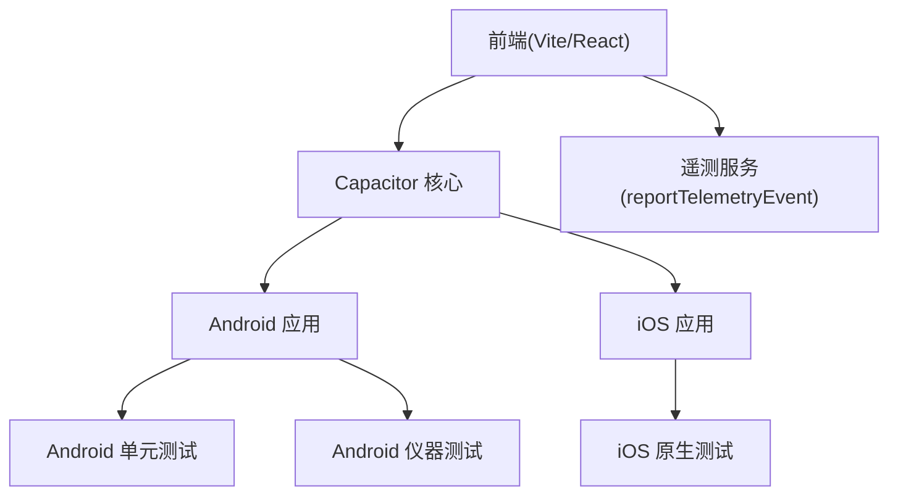
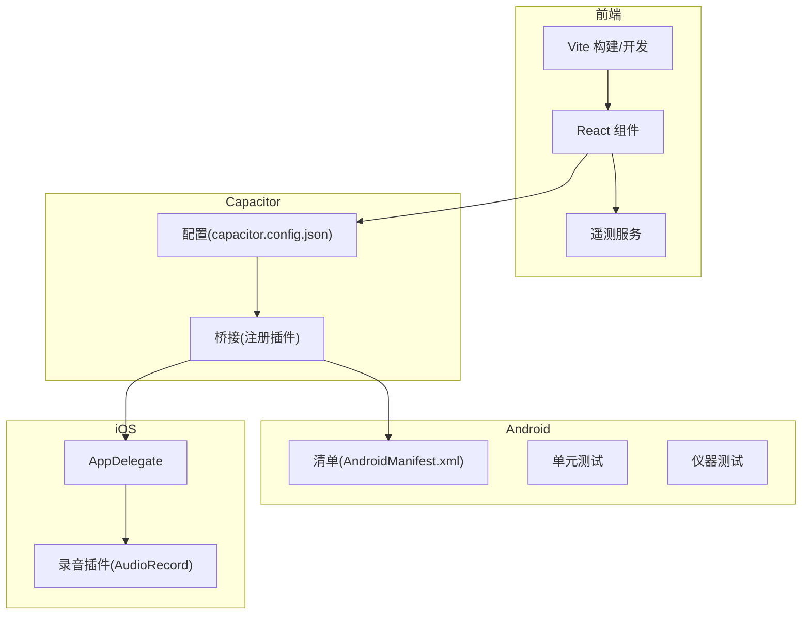
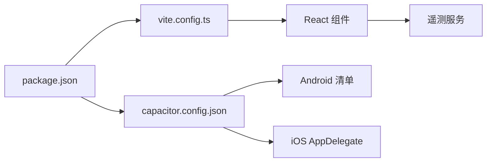

# 测试与调试

<cite>
**本文引用的文件**   
- [package.json](file://package.json)
- [vite.config.ts](file://vite.config.ts)
- [capacitor.config.json](file://capacitor.config.json)
- [android/app/src/main/AndroidManifest.xml](file://android/app/src/main/AndroidManifest.xml)
- [android/app/src/test/java/com/getcapacitor/myapp/ExampleUnitTest.java](file://android/app/src/test/java/com/getcapacitor/myapp/ExampleUnitTest.java)
- [android/app/src/androidTest/java/com/getcapacitor/myapp/ExampleInstrumentedTest.java](file://android/app/src/androidTest/java/com/getcapacitor/myapp/ExampleInstrumentedTest.java)
- [ios/App/App/AppDelegate.swift](file://ios/App/App/AppDelegate.swift)
- [src/app/services/telemetryService.ts](file://src/app/services/telemetryService.ts)
- [src/app/components/ui/use-visual-viewport.ts](file://src/app/components/ui/use-visual-viewport.ts)
- [src/app/pages/HiBrain.tsx](file://src/app/pages/HiBrain.tsx)
- [src/app/pages/Profile.tsx](file://src/app/pages/Profile.tsx)
- [src/app/pages/SiChain.tsx](file://src/app/pages/SiChain.tsx)
</cite>

## 目录
1. [引言](#引言)
2. [项目结构](#项目结构)
3. [核心组件](#核心组件)
4. [架构总览](#架构总览)
5. [详细组件分析](#详细组件分析)
6. [依赖关系分析](#依赖关系分析)
7. [性能考量](#性能考量)
8. [故障排查指南](#故障排查指南)
9. [结论](#结论)
10. [附录](#附录)

## 引言
本指南面向前端与跨平台应用开发者，围绕单元测试、集成测试、端到端测试、移动端平台测试策略、调试工具、性能分析与内存泄漏检测、错误监控与日志记录、以及测试自动化与持续集成流程，提供系统化、可操作的技术建议。项目采用 Capacitor 构建混合应用，前端基于 Vite 与 React 生态，Android 使用原生 Instrumented/Unit 测试，iOS 使用 Swift 原生测试与 Capacitor 插件。

## 项目结构
- 前端工程通过 Vite 管理构建与开发服务器，React 作为视图层，TailwindCSS 用于样式。
- Capacitor 配置定义了应用 ID、Web 打包目录、服务器参数及插件行为（状态栏、键盘、启动屏等）。
- Android 与 iOS 工程分别包含本地单元测试与仪器测试示例，以及 Capacitor 插件桥接与音频录制能力。
- 服务层提供遥测上报接口，页面组件包含与设备视口、键盘、录音相关的交互逻辑。

**图表来源**
- [vite.config.ts:1-44](file://vite.config.ts#L1-L44)
- [capacitor.config.json:1-31](file://capacitor.config.json#L1-L31)
- [android/app/src/main/AndroidManifest.xml:1-39](file://android/app/src/main/AndroidManifest.xml#L1-L39)
- [src/app/services/telemetryService.ts:1-21](file://src/app/services/telemetryService.ts#L1-L21)

**章节来源**
- [vite.config.ts:1-44](file://vite.config.ts#L1-L44)
- [capacitor.config.json:1-31](file://capacitor.config.json#L1-L31)
- [android/app/src/main/AndroidManifest.xml:1-39](file://android/app/src/main/AndroidManifest.xml#L1-L39)

## 核心组件
- 构建与开发环境：Vite 插件链、路径别名与依赖去重优化，减少运行时 Hook 错误风险。
- 跨平台桥接：Capacitor 配置与插件注册，如 iOS 中的自定义录音插件。
- 移动端测试：Android 单元测试与仪器测试骨架；iOS 原生测试入口。
- 遥测与日志：统一事件上报接口，便于在测试与生产中收集行为数据。
- 视口与键盘适配：移动端布局与输入法适配逻辑，影响 UI 测试稳定性。

**章节来源**
- [vite.config.ts:1-44](file://vite.config.ts#L1-L44)
- [capacitor.config.json:1-31](file://capacitor.config.json#L1-L31)
- [android/app/src/test/java/com/getcapacitor/myapp/ExampleUnitTest.java:1-18](file://android/app/src/test/java/com/getcapacitor/myapp/ExampleUnitTest.java#L1-L18)
- [android/app/src/androidTest/java/com/getcapacitor/myapp/ExampleInstrumentedTest.java:1-26](file://android/app/src/androidTest/java/com/getcapacitor/myapp/ExampleInstrumentedTest.java#L1-L26)
- [ios/App/App/AppDelegate.swift:52-252](file://ios/App/App/AppDelegate.swift#L52-L252)
- [src/app/services/telemetryService.ts:1-21](file://src/app/services/telemetryService.ts#L1-L21)
- [src/app/components/ui/use-visual-viewport.ts:1-44](file://src/app/components/ui/use-visual-viewport.ts#L1-L44)

## 架构总览
下图展示前端、Capacitor 桥接与移动端测试的整体关系，以及遥测上报路径。

**图表来源**
- [capacitor.config.json:1-31](file://capacitor.config.json#L1-L31)
- [android/app/src/main/AndroidManifest.xml:1-39](file://android/app/src/main/AndroidManifest.xml#L1-L39)
- [ios/App/App/AppDelegate.swift:52-252](file://ios/App/App/AppDelegate.swift#L52-L252)
- [src/app/services/telemetryService.ts:1-21](file://src/app/services/telemetryService.ts#L1-L21)

## 详细组件分析

### 单元测试与测试覆盖率
- 当前仓库未发现 Jest 或 Vitest 的配置文件与测试脚本，但前端已具备 React/Vite 基础环境。
- 建议新增测试框架与配置：
  - 在 package.json 中添加测试脚本与测试依赖（如 Vitest/Jest 及 React Testing Library），并配置测试入口与覆盖率输出。
  - 对纯函数与业务逻辑进行单元测试，对组件使用快照或渲染断言结合用户交互模拟。
  - 针对遥测服务等副作用模块，使用 Mock 与拦截器隔离网络请求，确保测试稳定与可重复。
- Android 单元测试示例可作为参考模板，快速搭建本地测试骨架。

**章节来源**
- [package.json:1-113](file://package.json#L1-L113)
- [android/app/src/test/java/com/getcapacitor/myapp/ExampleUnitTest.java:1-18](file://android/app/src/test/java/com/getcapacitor/myapp/ExampleUnitTest.java#L1-L18)

### 集成测试与端到端测试
- 集成测试建议覆盖 Capacitor 插件与原生能力交互（如 iOS 录音插件），验证权限、回调与数据流。
- 端到端测试可考虑 Detox（iOS）或 Appium（Android），结合 Vite 开发服务器与 Capacitor 本地预览模式。
- 建议：
  - 在 CI 中以无头/模拟器模式运行 E2E，结合日志与截图归档失败用例。
  - 对关键用户旅程（登录、语音输入、页面切换）建立回归用例集。

**章节来源**
- [ios/App/App/AppDelegate.swift:52-252](file://ios/App/App/AppDelegate.swift#L52-L252)
- [capacitor.config.json:1-31](file://capacitor.config.json#L1-L31)

### Android 平台测试策略
- 单元测试：位于 android/app/src/test，适合逻辑与工具类测试。
- 仪器测试：位于 android/app/src/androidTest，适合与系统服务交互的场景（如 Context 获取、权限检查）。
- 建议：
  - 使用 AndroidJUnit4 与 Espresso 进行 UI 测试，关注页面加载、导航与交互稳定性。
  - 针对 Capacitor WebView 行为，结合 Vite 开发服务器进行端到端联动测试。

**章节来源**
- [android/app/src/test/java/com/getcapacitor/myapp/ExampleUnitTest.java:1-18](file://android/app/src/test/java/com/getcapacitor/myapp/ExampleUnitTest.java#L1-L18)
- [android/app/src/androidTest/java/com/getcapacitor/myapp/ExampleInstrumentedTest.java:1-26](file://android/app/src/androidTest/java/com/getcapacitor/myapp/ExampleInstrumentedTest.java#L1-L26)

### iOS 平台测试策略
- 原生测试：利用 AppDelegate 生命周期与录音插件，验证权限申请、引擎启动与回调分片。
- 建议：
  - 使用 XCTest 编写 UI 与功能测试，结合模拟器与真实设备。
  - 对录音插件进行边界条件测试（采样率、分片大小、权限拒绝）。

**章节来源**
- [ios/App/App/AppDelegate.swift:52-252](file://ios/App/App/AppDelegate.swift#L52-L252)

### 调试工具与技巧
- 浏览器开发者工具：定位 DOM 结构、样式与网络请求，结合 React DevTools 定位组件渲染与状态变化。
- Capacitor 调试：启用 Capacitor 服务器与热重载，配合浏览器调试 WebView 内容；在 Android 上可通过 Chrome DevTools 远程调试 WebView，在 iOS 上通过 Safari Web Inspector。
- 视口与键盘适配：使用 useVisualViewportMetrics 与 Capacitor Keyboard API，避免输入法遮挡与布局抖动，提升 UI 测试稳定性。

**章节来源**
- [src/app/components/ui/use-visual-viewport.ts:1-44](file://src/app/components/ui/use-visual-viewport.ts#L1-L44)
- [capacitor.config.json:1-31](file://capacitor.config.json#L1-L31)

### 性能分析与内存泄漏检测
- Android：可使用 JDK JFR 预设配置进行内存泄漏检测与剖析，结合采样与堆栈跟踪定位问题对象类型与分配路径。
- iOS：结合 Instruments 与 Xcode 分析器，关注主线程阻塞、内存峰值与循环引用。
- 建议：
  - 在测试与 QA 阶段定期采集性能数据，建立基线并追踪回归。
  - 对长任务与高频 UI 更新进行节流与批处理优化。

**章节来源**
- [android/.jdk17/jdk-17.0.18+8/Contents/Home/lib/jfr/default.jfc:1031-1062](file://android/.jdk17/jdk-17.0.18+8/Contents/Home/lib/jfr/default.jfc#L1031-L1062)
- [android/.jdk17/jdk-17.0.18+8/Contents/Home/lib/jfr/profile.jfc:1031-1062](file://android/.jdk17/jdk-17.0.18+8/Contents/Home/lib/jfr/profile.jfc#L1031-L1062)

### 错误监控与日志记录
- 遥测服务：提供统一事件上报接口，支持超时控制与静默失败，便于在测试与生产中收集行为数据。
- 建议：
  - 将测试中的异常与边界条件纳入遥测，形成可观测性闭环。
  - 在 CI 中对遥测上报进行冒烟测试，确保网络与超时配置正确。

**章节来源**
- [src/app/services/telemetryService.ts:1-21](file://src/app/services/telemetryService.ts#L1-L21)

### 测试自动化与持续集成
- 建议流水线阶段：
  - 代码检查与格式化
  - 单元测试与覆盖率统计
  - 集成测试（Android/iOS）
  - 端到端测试（Detox/Appium）
  - 构建与发布
- 产物归档：测试报告、覆盖率、日志与失败截图/视频。

**章节来源**
- [package.json:1-113](file://package.json#L1-L113)

## 依赖关系分析

**图表来源**
- [package.json:1-113](file://package.json#L1-L113)
- [vite.config.ts:1-44](file://vite.config.ts#L1-L44)
- [capacitor.config.json:1-31](file://capacitor.config.json#L1-L31)
- [android/app/src/main/AndroidManifest.xml:1-39](file://android/app/src/main/AndroidManifest.xml#L1-L39)
- [ios/App/App/AppDelegate.swift:52-252](file://ios/App/App/AppDelegate.swift#L52-L252)
- [src/app/services/telemetryService.ts:1-21](file://src/app/services/telemetryService.ts#L1-L21)

**章节来源**
- [package.json:1-113](file://package.json#L1-L113)
- [vite.config.ts:1-44](file://vite.config.ts#L1-L44)
- [capacitor.config.json:1-31](file://capacitor.config.json#L1-L31)

## 性能考量
- 构建优化：Vite 已启用依赖去重与预打包，降低运行时冲突与冷启动时间。
- UI 与交互：移动端输入法与视口变化需在测试中覆盖，避免布局抖动导致的测试不稳定。
- 插件性能：录音插件涉及实时音频处理，应进行长时运行与资源释放的稳定性测试。

**章节来源**
- [vite.config.ts:1-44](file://vite.config.ts#L1-L44)
- [src/app/components/ui/use-visual-viewport.ts:1-44](file://src/app/components/ui/use-visual-viewport.ts#L1-L44)
- [ios/App/App/AppDelegate.swift:52-252](file://ios/App/App/AppDelegate.swift#L52-L252)

## 故障排查指南
- Android 权限与网络
  - 检查清单中是否声明 INTERNET 与 RECORD_AUDIO 权限。
  - 若仪器测试失败，确认目标设备/模拟器权限授予与系统版本兼容。
- iOS 录音插件
  - 确认 AppDelegate 正确注册插件实例，录音前检查麦克风权限状态。
  - 若出现“Already running”或“Permission denied”，检查调用顺序与权限回调。
- 遥测上报
  - 检查超时与静默失败逻辑，确保测试中网络可用且地址可达。
- 视口与键盘
  - 使用 useVisualViewportMetrics 与 Capacitor Keyboard API，避免输入法遮挡与布局错乱。

**章节来源**
- [android/app/src/main/AndroidManifest.xml:1-39](file://android/app/src/main/AndroidManifest.xml#L1-L39)
- [ios/App/App/AppDelegate.swift:52-252](file://ios/App/App/AppDelegate.swift#L52-L252)
- [src/app/services/telemetryService.ts:1-21](file://src/app/services/telemetryService.ts#L1-L21)
- [src/app/components/ui/use-visual-viewport.ts:1-44](file://src/app/components/ui/use-visual-viewport.ts#L1-L44)

## 结论
本指南从测试与调试视角梳理了前端、Capacitor 桥接与移动端平台的实践要点。建议尽快补齐测试框架与配置，完善单元、集成与端到端测试矩阵，并将遥测与性能分析纳入 CI，形成闭环的质量保障体系。

## 附录
- 关键文件索引
  - 构建与开发：[vite.config.ts:1-44](file://vite.config.ts#L1-L44)
  - 跨平台配置：[capacitor.config.json:1-31](file://capacitor.config.json#L1-L31)
  - Android 权限与清单：[android/app/src/main/AndroidManifest.xml:1-39](file://android/app/src/main/AndroidManifest.xml#L1-L39)
  - Android 测试骨架：[ExampleUnitTest.java:1-18](file://android/app/src/test/java/com/getcapacitor/myapp/ExampleUnitTest.java#L1-L18)、[ExampleInstrumentedTest.java:1-26](file://android/app/src/androidTest/java/com/getcapacitor/myapp/ExampleInstrumentedTest.java#L1-L26)
  - iOS 插件与生命周期：[AppDelegate.swift:52-252](file://ios/App/App/AppDelegate.swift#L52-L252)
  - 遥测服务：[telemetryService.ts:1-21](file://src/app/services/telemetryService.ts#L1-L21)
  - 视口与键盘适配：[use-visual-viewport.ts:1-44](file://src/app/components/ui/use-visual-viewport.ts#L1-L44)
  - 页面交互参考：[HiBrain.tsx:920-942](file://src/app/pages/HiBrain.tsx#L920-L942)、[Profile.tsx:1178-1216](file://src/app/pages/Profile.tsx#L1178-L1216)、[SiChain.tsx:316-337](file://src/app/pages/SiChain.tsx#L316-L337)