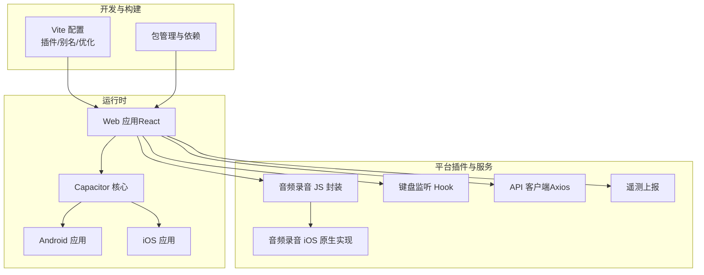
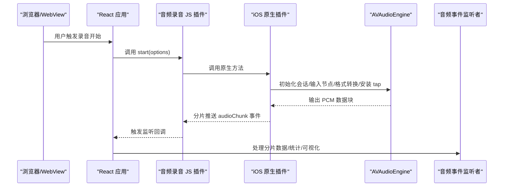
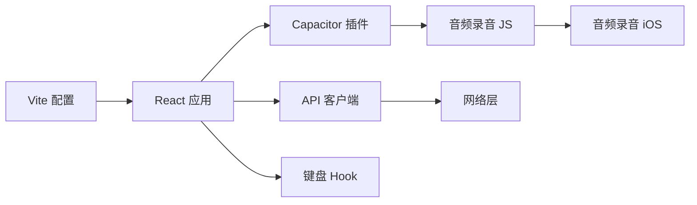

# 调试工具

<cite>
**本文引用的文件**
- [README.md](file://README.md)
- [package.json](file://package.json)
- [capacitor.config.json](file://capacitor.config.json)
- [vite.config.ts](file://vite.config.ts)
- [src/app/services/audioRecordService.ts](file://src/app/services/audioRecordService.ts)
- [src/app/components/ui/use-capacitor-keyboard.ts](file://src/app/components/ui/use-capacitor-keyboard.ts)
- [src/app/services/api.ts](file://src/app/services/api.ts)
- [src/app/services/telemetryService.ts](file://src/app/services/telemetryService.ts)
- [src/app/utils/featureFlags.ts](file://src/app/utils/featureFlags.ts)
- [android/app/src/main/AndroidManifest.xml](file://android/app/src/main/AndroidManifest.xml)
- [ios/App/App/AppDelegate.swift](file://ios/App/App/AppDelegate.swift)
</cite>

## 目录
1. [简介](#简介)
2. [项目结构](#项目结构)
3. [核心组件](#核心组件)
4. [架构总览](#架构总览)
5. [详细组件分析](#详细组件分析)
6. [依赖关系分析](#依赖关系分析)
7. [性能考量](#性能考量)
8. [故障排查指南](#故障排查指南)
9. [结论](#结论)
10. [附录](#附录)

## 简介
本指南面向前端与跨平台应用开发者，围绕浏览器开发者工具、React DevTools、Capacitor 原生与 Web 视图调试、移动端调试（Chrome DevTools 移动设备模式与 Safari Web Inspector）、性能分析（React Profiler 与 Lighthouse 集成建议）、日志与错误追踪（Sentry/Bugsnag 集成思路）、以及断点调试与异步调试等主题，结合本项目的实际代码与配置，给出可操作的调试流程与问题诊断方法。

## 项目结构
本项目采用 Vite + React 技术栈，并通过 Capacitor 构建原生应用（Android/iOS）。关键调试相关点包括：
- 开发服务器与构建配置：Vite 配置与插件、别名与依赖预打包策略
- 容器化与网络：Capacitor 服务器配置、明文流量开关
- 平台能力：音频录音插件（JS/TS 封装 + iOS 原生实现）、键盘监听 Hook
- 网络层：Axios 实例、请求拦截器、响应拦截器与错误翻译
- 遥测上报：轻量级遥测事件上报接口
- 功能开关：基于环境变量的功能开关工具

图表来源
- [vite.config.ts:1-44](file://vite.config.ts#L1-L44)
- [package.json:1-113](file://package.json#L1-L113)
- [capacitor.config.json:1-31](file://capacitor.config.json#L1-L31)
- [src/app/services/audioRecordService.ts:1-35](file://src/app/services/audioRecordService.ts#L1-L35)
- [ios/App/App/AppDelegate.swift:58-252](file://ios/App/App/AppDelegate.swift#L58-L252)
- [src/app/components/ui/use-capacitor-keyboard.ts:1-60](file://src/app/components/ui/use-capacitor-keyboard.ts#L1-L60)
- [src/app/services/api.ts:1-127](file://src/app/services/api.ts#L1-L127)
- [src/app/services/telemetryService.ts:1-22](file://src/app/services/telemetryService.ts#L1-L22)

章节来源
- [vite.config.ts:1-44](file://vite.config.ts#L1-L44)
- [package.json:1-113](file://package.json#L1-L113)
- [capacitor.config.json:1-31](file://capacitor.config.json#L1-L31)

## 核心组件
- 音频录音插件（JS 封装 + iOS 原生）
  - JS 层定义插件接口、事件类型与注册方式
  - iOS 层实现麦克风权限校验、AVAudioEngine 录制、格式转换、分片推送
- 键盘监听 Hook
  - 在原生平台订阅键盘显示/隐藏事件，更新 UI 布局
- API 客户端（Axios）
  - 统一基地址、请求头、超时；请求拦截注入 Token；响应拦截处理 401 刷新与错误翻译
- 遥测上报
  - 轻量事件上报接口，带短超时
- 功能开关
  - 基于环境变量的布尔型功能开关判断

章节来源
- [src/app/services/audioRecordService.ts:1-35](file://src/app/services/audioRecordService.ts#L1-L35)
- [ios/App/App/AppDelegate.swift:58-252](file://ios/App/App/AppDelegate.swift#L58-L252)
- [src/app/components/ui/use-capacitor-keyboard.ts:1-60](file://src/app/components/ui/use-capacitor-keyboard.ts#L1-L60)
- [src/app/services/api.ts:1-127](file://src/app/services/api.ts#L1-L127)
- [src/app/services/telemetryService.ts:1-22](file://src/app/services/telemetryService.ts#L1-L22)
- [src/app/utils/featureFlags.ts:1-14](file://src/app/utils/featureFlags.ts#L1-L14)

## 架构总览
下图展示从浏览器到原生平台的关键调用链路与调试关注点：

图表来源
- [src/app/services/audioRecordService.ts:1-35](file://src/app/services/audioRecordService.ts#L1-L35)
- [ios/App/App/AppDelegate.swift:80-155](file://ios/App/App/AppDelegate.swift#L80-L155)
- [ios/App/App/AppDelegate.swift:201-250](file://ios/App/App/AppDelegate.swift#L201-L250)

## 详细组件分析

### 浏览器开发者工具（Elements/Console/Network）
- Elements 面板
  - 检查 DOM 结构与样式，定位布局问题（如键盘遮挡、视觉视口变化）
  - 结合“在元素上启用调试”查看事件绑定与属性变更
- Console 面板
  - 打印网络请求、插件事件、错误信息与性能指标
  - 使用断点与条件断点捕获异常路径
- Network 面板
  - 过滤 XHR/Fetch，观察请求头、参数、响应体与耗时
  - 关注鉴权失败、超时与错误翻译后的消息

章节来源
- [src/app/services/api.ts:36-127](file://src/app/services/api.ts#L36-L127)
- [src/app/services/audioRecordService.ts:26-31](file://src/app/services/audioRecordService.ts#L26-L31)

### React DevTools（安装与配置）
- 安装
  - 在浏览器扩展商店安装 React DevTools
- 配置
  - 启用“突出显示更新”、“组件树折叠/展开”
  - 在本项目中，优先检查受控组件、列表渲染、事件处理与副作用 Hook 的状态变化
- 组件树检查与状态追踪
  - 对照页面组件（如笔记列表、聊天详情、编辑器）观察 props 与 state 变更
  - 关注 Hook 依赖与重渲染热点（useMemo/useCallback）

### Capacitor 调试（原生与 Web 视图）
- 服务器与明文流量
  - Capacitor 服务器配置允许明文通信，便于本地联调
  - Android Manifest 启用明文流量，避免混合内容问题
- Web 视图调试
  - Android：启用 WebView 调试（Chromium DevTools）
  - iOS：通过 Safari Web Inspector 连接真机/模拟器
- 插件事件与日志
  - 在音频录音插件中，利用事件监听与控制台输出定位分片大小、采样率与时间戳

章节来源
- [capacitor.config.json:5-8](file://capacitor.config.json#L5-L8)
- [android/app/src/main/AndroidManifest.xml:9](file://android/app/src/main/AndroidManifest.xml#L9)
- [src/app/services/audioRecordService.ts:26-31](file://src/app/services/audioRecordService.ts#L26-L31)

### 移动端调试（Chrome DevTools 移动设备模式与 Safari Web Inspector）
- Chrome 移动设备模式
  - 使用设备模式复现触摸交互、媒体查询与键盘遮挡
  - 结合键盘 Hook 的可见性与高度变化进行验证
- Safari Web Inspector（iOS）
  - 在设置 > Safari > 高级 > 启用“Web 检查器”，连接设备后选择页面
  - 用于检查原生 WebView 中的脚本、网络与样式问题

章节来源
- [src/app/components/ui/use-capacitor-keyboard.ts:12-59](file://src/app/components/ui/use-capacitor-keyboard.ts#L12-L59)

### 性能分析（React Profiler 与 Lighthouse 集成建议）
- React Profiler
  - 在开发模式下使用 Profiler 标记组件，测量渲染耗时与重渲染频率
  - 关注编辑器、列表与弹窗组件的渲染热点
- Lighthouse
  - 构建生产包后在 Chrome DevTools 中运行 Lighthouse，关注性能、可访问性与最佳实践
  - 本项目已配置 TailwindCSS 与 React 插件，注意移除未使用样式与优化首屏资源

章节来源
- [vite.config.ts:7-10](file://vite.config.ts#L7-L10)
- [package.json:85-91](file://package.json#L85-L91)

### 日志记录与错误追踪（Sentry/Bugsnag 集成思路）
- 当前实现
  - Axios 响应拦截器统一处理 401 与错误翻译，便于前端统一提示
  - 遥测上报接口支持上报事件，可作为轻量埋点
- 集成建议
  - Sentry：在应用启动时初始化 SDK，自动捕获未处理异常与 XHR/Fetch 错误；结合用户上下文与路由信息
  - Bugsnag：在全局错误边界捕获 React 错误，上报堆栈与上下文
  - 两者均可与 Capacitor 原生异常桥接，确保跨平台一致的错误上报

章节来源
- [src/app/services/api.ts:56-127](file://src/app/services/api.ts#L56-L127)
- [src/app/services/telemetryService.ts:9-21](file://src/app/services/telemetryService.ts#L9-L21)

### 断点调试、条件断点与异步调试
- 断点调试
  - 在事件回调（如音频分片、键盘显示/隐藏）处设置断点，观察入参与上下文
- 条件断点
  - 针对特定采样率、分片大小或错误码设置条件断点，快速定位异常场景
- 异步调试
  - 使用 Promise/async/await 的“遇错暂停”与“拒绝未处理”断点
  - 在长轮询/定时器/事件流中，使用日志与时间戳辅助回溯

章节来源
- [src/app/services/audioRecordService.ts:26-31](file://src/app/services/audioRecordService.ts#L26-L31)
- [src/app/components/ui/use-capacitor-keyboard.ts:20-56](file://src/app/components/ui/use-capacitor-keyboard.ts#L20-L56)

## 依赖关系分析
- 构建与运行
  - Vite 插件与别名解析确保 React 生态一致性，减少重复实例导致的 Hook 错误
- 平台与网络
  - Capacitor 明文配置与 Android 清单明文许可，保证开发联调顺畅
- 插件与服务
  - JS 插件与原生实现解耦，事件驱动的数据流清晰，便于分层调试

图表来源
- [vite.config.ts:11-25](file://vite.config.ts#L11-L25)
- [capacitor.config.json:1-31](file://capacitor.config.json#L1-L31)
- [src/app/services/audioRecordService.ts:1-35](file://src/app/services/audioRecordService.ts#L1-L35)
- [src/app/services/api.ts:36-42](file://src/app/services/api.ts#L36-L42)

章节来源
- [vite.config.ts:11-25](file://vite.config.ts#L11-L25)
- [capacitor.config.json:1-31](file://capacitor.config.json#L1-L31)

## 性能考量
- 构建优化
  - 预打包常用依赖，避免多实例 React 导致的 Hook 错误与体积膨胀
- 网络层
  - 设置合理超时与错误翻译，避免阻塞 UI 交互
- 原生插件
  - 音频分片大小与采样率影响内存与传输效率，需在质量与性能间平衡

章节来源
- [vite.config.ts:27-41](file://vite.config.ts#L27-L41)
- [src/app/services/api.ts:36-42](file://src/app/services/api.ts#L36-L42)
- [ios/App/App/AppDelegate.swift:76-106](file://ios/App/App/AppDelegate.swift#L76-L106)

## 故障排查指南
- 网络问题
  - 检查请求拦截器是否正确附加 Token，响应拦截器是否触发刷新逻辑
  - 若无响应或超时，确认 Capacitor 服务器明文配置与 Android 清单许可
- 音频录音异常
  - 确认麦克风权限已授予；检查分片大小与采样率计算；观察事件回调是否被移除
- 键盘遮挡
  - 使用键盘 Hook 获取高度与可见性，动态调整布局；在移动设备模式下复现
- 功能开关
  - 检查环境变量与开关工具的布尔值判定，避免空字符串或无效值导致默认开启

章节来源
- [src/app/services/api.ts:44-127](file://src/app/services/api.ts#L44-L127)
- [android/app/src/main/AndroidManifest.xml:36-38](file://android/app/src/main/AndroidManifest.xml#L36-L38)
- [src/app/services/audioRecordService.ts:26-31](file://src/app/services/audioRecordService.ts#L26-L31)
- [src/app/components/ui/use-capacitor-keyboard.ts:12-59](file://src/app/components/ui/use-capacitor-keyboard.ts#L12-L59)
- [src/app/utils/featureFlags.ts:7-13](file://src/app/utils/featureFlags.ts#L7-L13)

## 结论
本项目在前端与原生之间提供了清晰的调试边界：浏览器开发者工具负责 Web 层问题定位，React DevTools 与性能分析工具用于组件与性能优化，Capacitor 与移动端调试通道覆盖原生与 WebView 场景。配合 Axios 拦截器、插件事件与 Hook 状态，可形成从请求到渲染的完整调试闭环。

## 附录
- 快速入口
  - 启动开发服务器：参考项目说明
  - Capacitor 服务器明文：参考配置与清单
  - 音频录音插件：参考 JS 封装与 iOS 实现
  - 键盘 Hook：参考键盘事件监听与状态更新
  - API 客户端：参考请求/响应拦截与错误翻译
  - 遥测上报：参考事件上报接口
  - 功能开关：参考环境变量与布尔值判定

章节来源
- [README.md:6-10](file://README.md#L6-L10)
- [capacitor.config.json:5-8](file://capacitor.config.json#L5-L8)
- [android/app/src/main/AndroidManifest.xml:9](file://android/app/src/main/AndroidManifest.xml#L9)
- [src/app/services/audioRecordService.ts:1-35](file://src/app/services/audioRecordService.ts#L1-L35)
- [ios/App/App/AppDelegate.swift:58-252](file://ios/App/App/AppDelegate.swift#L58-L252)
- [src/app/components/ui/use-capacitor-keyboard.ts:1-60](file://src/app/components/ui/use-capacitor-keyboard.ts#L1-L60)
- [src/app/services/api.ts:1-127](file://src/app/services/api.ts#L1-L127)
- [src/app/services/telemetryService.ts:1-22](file://src/app/services/telemetryService.ts#L1-L22)
- [src/app/utils/featureFlags.ts:1-14](file://src/app/utils/featureFlags.ts#L1-L14)