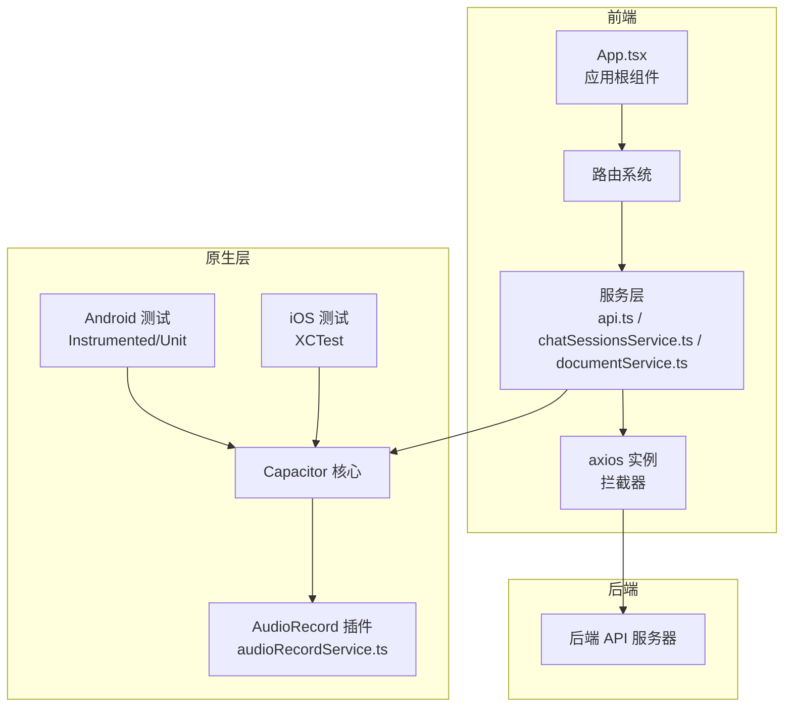
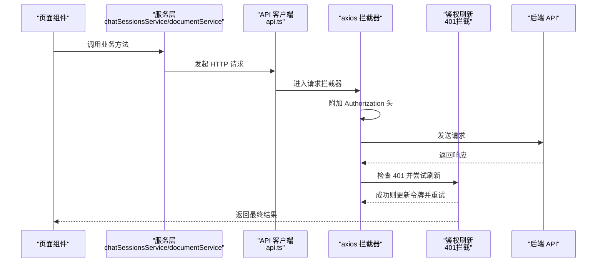
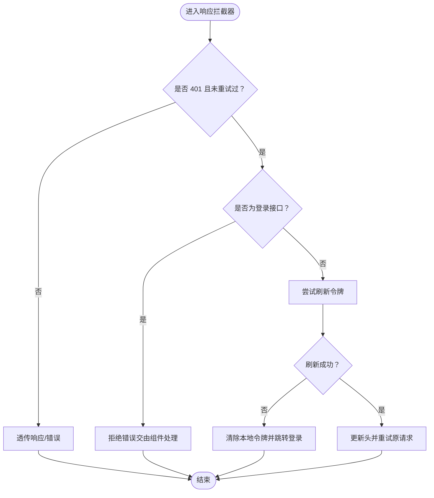
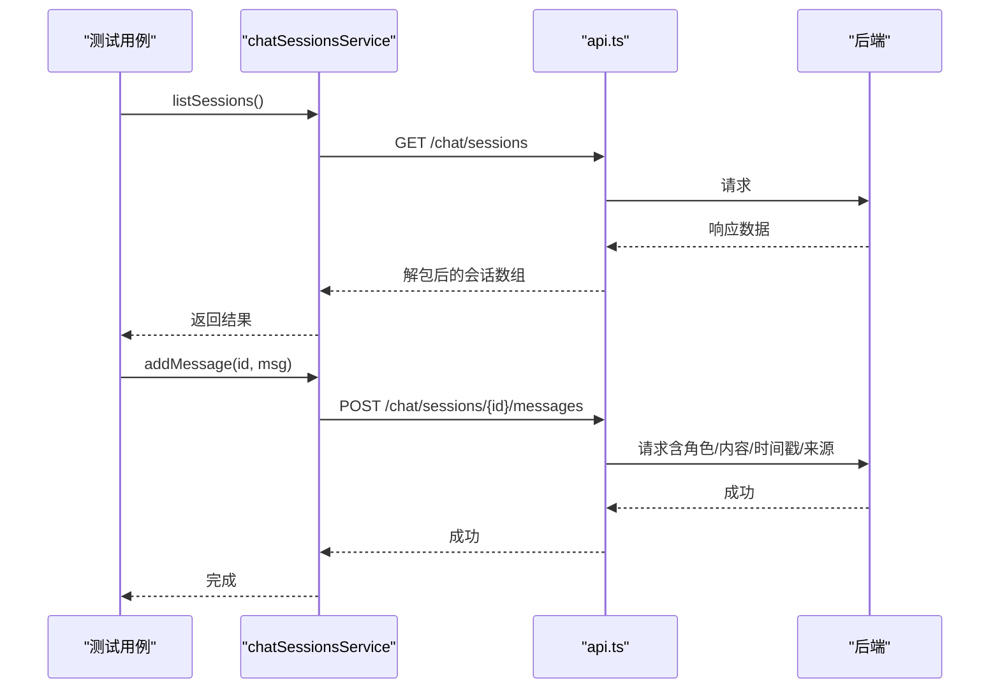
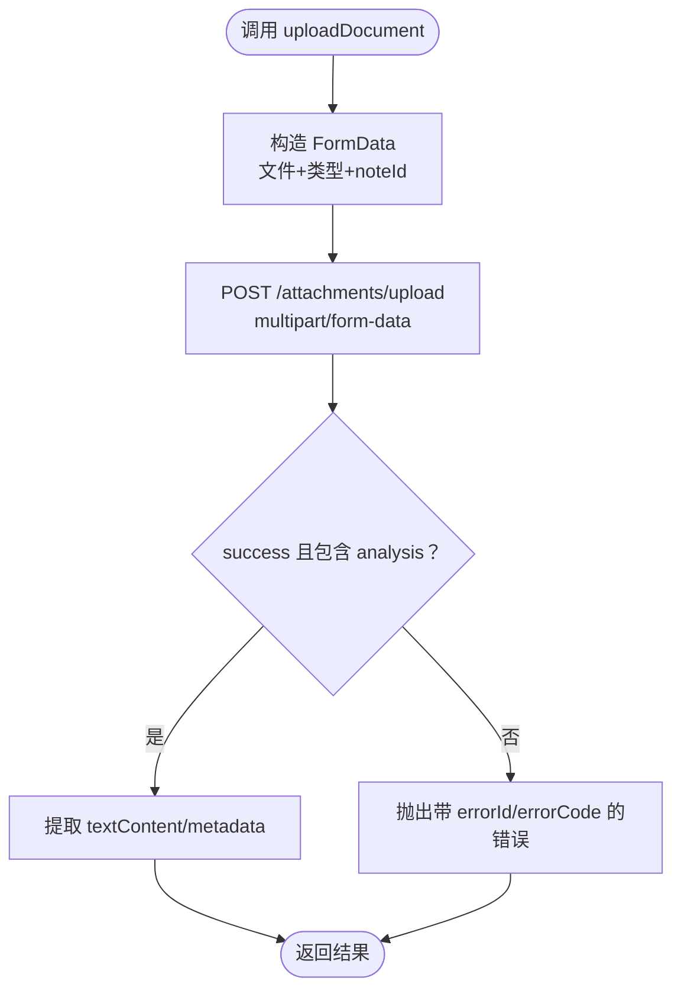
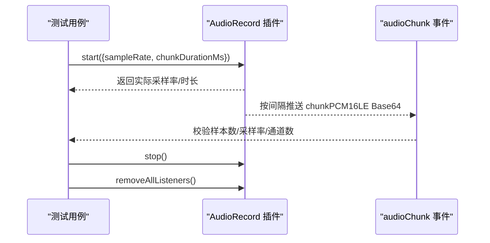
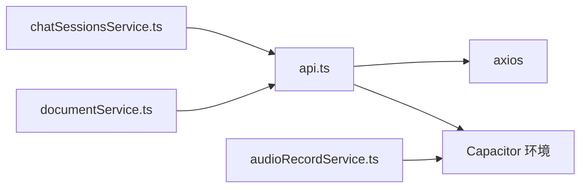

# 集成测试

<cite>
**本文引用的文件**
- [README.md](file://README.md)
- [package.json](file://package.json)
- [capacitor.config.json](file://capacitor.config.json)
- [src/app/services/api.ts](file://src/app/services/api.ts)
- [src/app/services/audioRecordService.ts](file://src/app/services/audioRecordService.ts)
- [src/app/services/chatSessionsService.ts](file://src/app/services/chatSessionsService.ts)
- [src/app/services/documentService.ts](file://src/app/services/documentService.ts)
- [src/app/App.tsx](file://src/app/App.tsx)
- [android/app/src/androidTest/java/com/getcapacitor/myapp/ExampleInstrumentedTest.java](file://android/app/src/androidTest/java/com/getcapacitor/myapp/ExampleInstrumentedTest.java)
- [android/app/src/test/java/com/getcapacitor/myapp/ExampleUnitTest.java](file://android/app/src/test/java/com/getcapacitor/myapp/ExampleUnitTest.java)
</cite>

## 目录
1. [简介](#简介)
2. [项目结构](#项目结构)
3. [核心组件](#核心组件)
4. [架构总览](#架构总览)
5. [详细组件分析](#详细组件分析)
6. [依赖分析](#依赖分析)
7. [性能考虑](#性能考虑)
8. [故障排查指南](#故障排查指南)
9. [结论](#结论)
10. [附录](#附录)

## 简介
本指南面向开发者与测试工程师，提供该前端应用的集成测试实施蓝图。内容覆盖组件间交互与API集成测试、服务层测试与数据库连接测试的替代方案、端到端测试（用户流程与业务逻辑验证）、跨平台测试策略（Android/iOS功能一致性）、测试数据准备与清理（含测试数据库设置与重置）、测试环境配置与管理（开发/测试/生产差异处理）、测试自动化脚本编写与执行，以及设计模式与调试技巧。

## 项目结构
该项目基于 Capacitor 构建的混合应用，前端使用 Vite + React，Capacitor 提供原生能力桥接（如音频录制插件）。测试覆盖分为：
- 前端服务层与API集成：通过 axios 封装统一调用与拦截器，便于在测试中替换 baseURL 或注入 mock。
- 原生插件测试：Android 使用 Instrumented Test 与 Unit Test；iOS 通过 Xcode 工程与 XCTest（仓库包含 iOS 工程文件）。
- 跨平台一致性：通过 Capacitor 统一接口，结合平台特定配置（如 Android cleartext 允许、iOS 权限声明）进行端到端验证。

图表来源
- [src/app/App.tsx:1-17](file://src/app/App.tsx#L1-L17)
- [src/app/services/api.ts:1-127](file://src/app/services/api.ts#L1-L127)
- [src/app/services/audioRecordService.ts:1-35](file://src/app/services/audioRecordService.ts#L1-L35)
- [src/app/services/chatSessionsService.ts:1-126](file://src/app/services/chatSessionsService.ts#L1-L126)
- [src/app/services/documentService.ts:1-48](file://src/app/services/documentService.ts#L1-L48)
- [android/app/src/androidTest/java/com/getcapacitor/myapp/ExampleInstrumentedTest.java:1-27](file://android/app/src/androidTest/java/com/getcapacitor/myapp/ExampleInstrumentedTest.java#L1-L27)
- [android/app/src/test/java/com/getcapacitor/myapp/ExampleUnitTest.java:1-19](file://android/app/src/test/java/com/getcapacitor/myapp/ExampleUnitTest.java#L1-L19)

章节来源
- [README.md:1-41](file://README.md#L1-L41)
- [package.json:1-113](file://package.json#L1-L113)
- [capacitor.config.json:1-31](file://capacitor.config.json#L1-L31)

## 核心组件
- API 客户端与拦截器：统一的 axios 实例，支持动态 baseURL（开发/生产/原生平台）、自动附加 JWT、响应式 401 刷新与全局错误翻译。
- 服务层封装：聊天会话、文档上传等业务服务对 axios 的薄封装，便于替换与测试。
- 原生插件：音频录制插件通过 Capacitor 注册，事件驱动型数据流，适合端到端与平台一致性测试。
- 应用根组件：提供上下文（主题、笔记、通知）与路由，是端到端测试的入口。

章节来源
- [src/app/services/api.ts:1-127](file://src/app/services/api.ts#L1-L127)
- [src/app/services/chatSessionsService.ts:1-126](file://src/app/services/chatSessionsService.ts#L1-L126)
- [src/app/services/documentService.ts:1-48](file://src/app/services/documentService.ts#L1-L48)
- [src/app/services/audioRecordService.ts:1-35](file://src/app/services/audioRecordService.ts#L1-L35)
- [src/app/App.tsx:1-17](file://src/app/App.tsx#L1-L17)

## 架构总览
下图展示从应用到服务层、再到后端 API 的调用链路，以及原生插件与测试路径：

图表来源
- [src/app/services/chatSessionsService.ts:66-125](file://src/app/services/chatSessionsService.ts#L66-L125)
- [src/app/services/documentService.ts:8-47](file://src/app/services/documentService.ts#L8-L47)
- [src/app/services/api.ts:36-126](file://src/app/services/api.ts#L36-L126)

## 详细组件分析

### API 客户端与拦截器（服务层测试重点）
- 动态 baseURL：根据运行环境与 Capacitor 平台动态选择后端地址，便于测试切换。
- 请求拦截：自动附加 Authorization 头，简化业务层认证处理。
- 响应拦截：统一处理 401（刷新令牌）、网络异常与后端错误消息翻译，提升用户体验。
- 测试要点：
  - 替换 baseURL 为测试服务器，断言请求头与重试行为。
  - 模拟 401 场景验证刷新流程与登录跳转。
  - 断言错误翻译与用户提示文案。

图表来源
- [src/app/services/api.ts:56-126](file://src/app/services/api.ts#L56-L126)

章节来源
- [src/app/services/api.ts:1-127](file://src/app/services/api.ts#L1-L127)

### 聊天会话服务（API 集成测试）
- 方法覆盖：列出会话、创建、获取详情、删除、重命名、添加消息。
- 数据解包：统一从响应中提取 data/result 字段，增强健壮性。
- 错误处理：将 axios 错误映射为可读字符串，便于 UI 展示与测试断言。
- 测试建议：
  - 使用 mock 服务器返回不同状态码与负载，验证列表/详情/增删改流程。
  - 断言消息字段（角色、时间戳、来源）正确传递至后端。
  - 验证空数组回退与异常分支。

图表来源
- [src/app/services/chatSessionsService.ts:66-125](file://src/app/services/chatSessionsService.ts#L66-L125)
- [src/app/services/api.ts:36-42](file://src/app/services/api.ts#L36-L42)

章节来源
- [src/app/services/chatSessionsService.ts:1-126](file://src/app/services/chatSessionsService.ts#L1-L126)

### 文档上传服务（API 集成测试）
- 行为：构造 multipart/form-data，上传文件并解析后端返回的分析结果。
- 错误映射：将后端 errorId/errorCode/message 组合为用户可读错误。
- 测试建议：
  - 准备多种文件类型与大小，断言上传成功与错误分支。
  - 验证 metadata 与 textContent 的存在性与完整性。
  - 结合 mock 服务器模拟不同后端响应，覆盖边界场景。

图表来源
- [src/app/services/documentService.ts:8-47](file://src/app/services/documentService.ts#L8-L47)

章节来源
- [src/app/services/documentService.ts:1-48](file://src/app/services/documentService.ts#L1-L48)

### 原生音频录制插件（Android/iOS 一致性测试）
- 插件接口：开始录音、停止、监听 audioChunk 事件、移除监听。
- 数据格式：16kHz PCM16LE 单声道，按 chunkDurationMs 推送 Base64。
- 测试建议：
  - Android：使用 Instrumented Test 在设备上验证事件回调与权限。
  - iOS：在 Xcode 中运行 XCTest，验证相同事件序列与数据格式。
  - 跨平台：对比两次事件数量、采样率、字节数是否一致。

图表来源
- [src/app/services/audioRecordService.ts:19-35](file://src/app/services/audioRecordService.ts#L19-L35)

章节来源
- [src/app/services/audioRecordService.ts:1-35](file://src/app/services/audioRecordService.ts#L1-L35)
- [android/app/src/androidTest/java/com/getcapacitor/myapp/ExampleInstrumentedTest.java:1-27](file://android/app/src/androidTest/java/com/getcapacitor/myapp/ExampleInstrumentedTest.java#L1-L27)
- [android/app/src/test/java/com/getcapacitor/myapp/ExampleUnitTest.java:1-19](file://android/app/src/test/java/com/getcapacitor/myapp/ExampleUnitTest.java#L1-L19)

### 端到端测试（用户流程与业务逻辑）
- 用户流程建议：
  - 登录 → 获取会话列表 → 创建新会话 → 添加消息 → 查看详情 → 删除会话。
  - 上传文档 → 验证文本内容与元数据 → 错误场景（超限/格式不支持）。
- 业务逻辑验证：
  - 401 自动刷新与未登录跳转。
  - 网络异常与后端错误的用户提示。
- 测试数据：
  - 使用 mock 服务器生成稳定数据集，避免依赖真实数据库。
  - 对于需要真实数据的场景，采用“测试专用账号/会话”隔离。

章节来源
- [src/app/services/api.ts:56-126](file://src/app/services/api.ts#L56-L126)
- [src/app/services/chatSessionsService.ts:66-125](file://src/app/services/chatSessionsService.ts#L66-L125)
- [src/app/services/documentService.ts:8-47](file://src/app/services/documentService.ts#L8-L47)

### 跨平台测试策略（Android/iOS）
- Android：
  - 设备/模拟器运行 Instrumented Test，验证插件事件与权限。
  - 使用 Espresso 或 UIAutomator 验证 UI 与业务流程。
- iOS：
  - Xcode 工程已包含，使用 XCTest 验证与 Android 相同的业务流程。
- 一致性校验：
  - 对比同一操作在两个平台上的事件数量、采样率、字节长度与 UI 行为。
  - 关注平台差异（键盘行为、权限弹窗、网络栈）。

章节来源
- [android/app/src/androidTest/java/com/getcapacitor/myapp/ExampleInstrumentedTest.java:1-27](file://android/app/src/androidTest/java/com/getcapacitor/myapp/ExampleInstrumentedTest.java#L1-L27)
- [android/app/src/test/java/com/getcapacitor/myapp/ExampleUnitTest.java:1-19](file://android/app/src/test/java/com/getcapacitor/myapp/ExampleUnitTest.java#L1-L19)
- [capacitor.config.json:1-31](file://capacitor.config.json#L1-L31)

### 测试数据准备与清理
- 测试数据库（后端）：
  - 使用独立的测试数据库实例或容器，确保隔离与可重复性。
  - 在测试前导入种子数据，在测试后执行清理脚本（清表/回滚事务）。
- 前端测试数据：
  - 使用 mock 服务器返回固定响应，或在内存中维护测试数据集合。
  - 对于音频录制，准备固定长度的 Base64 片段以复现事件序列。
- 清理策略：
  - 每个测试用例结束后，清理 localStorage 中的令牌与临时数据。
  - Android 测试中，确保移除所有监听器与释放资源。

章节来源
- [src/app/services/api.ts:44-54](file://src/app/services/api.ts#L44-L54)
- [src/app/services/audioRecordService.ts:29-33](file://src/app/services/audioRecordService.ts#L29-L33)

### 测试环境配置与管理
- 环境变量：
  - VITE_API_URL 控制 baseURL，支持在不同环境切换。
  - VITE_WIKI_ENABLED 可用于功能开关，便于在测试中启用/禁用特性。
- 开发/测试/生产差异：
  - 开发：本地代理或内网地址；允许 cleartext（Android）。
  - 测试：独立测试服务器与数据库；关闭非必要日志。
  - 生产：强制 HTTPS，严格错误翻译与降级策略。
- 配置文件：
  - Capacitor server 配置允许 cleartext，便于本地联调。

章节来源
- [src/app/services/api.ts:4-34](file://src/app/services/api.ts#L4-L34)
- [src/app/utils/featureFlags.ts](file://src/app/utils/featureFlags.ts)
- [capacitor.config.json:5-8](file://capacitor.config.json#L5-L8)

### 测试自动化脚本（编写与执行）
- 前端：
  - 使用 Vitest/Jest 运行单元与集成测试；对服务层与组件进行快照与交互测试。
  - 使用 Playwright/Cypress 进行端到端测试，覆盖用户流程。
- 原生：
  - Android：Gradle 任务运行 Instrumented/Unit 测试。
  - iOS：Xcode Build & Test 或 fastlane/xcodebuild。
- 执行顺序建议：
  - 单测 → 集成测试（服务层）→ 端到端（Web）→ 原生端到端（Android/iOS）→ 跨平台一致性对比。

章节来源
- [package.json:6-9](file://package.json#L6-L9)
- [android/app/src/androidTest/java/com/getcapacitor/myapp/ExampleInstrumentedTest.java:16-25](file://android/app/src/androidTest/java/com/getcapacitor/myapp/ExampleInstrumentedTest.java#L16-L25)

## 依赖分析
- 组件耦合：
  - 服务层依赖 API 客户端；API 客户端依赖 axios 与 Capacitor 环境判断。
  - 插件通过 Capacitor 注册，与服务层松耦合，便于替换与测试。
- 外部依赖：
  - axios：统一 HTTP 与拦截器。
  - Capacitor：原生能力桥接。
- 潜在循环依赖：无明显循环；服务层仅作为薄封装。

图表来源
- [src/app/services/chatSessionsService.ts:1-3](file://src/app/services/chatSessionsService.ts#L1-L3)
- [src/app/services/documentService.ts:1](file://src/app/services/documentService.ts#L1)
- [src/app/services/api.ts:1-6](file://src/app/services/api.ts#L1-L6)
- [src/app/services/audioRecordService.ts:1-3](file://src/app/services/audioRecordService.ts#L1-L3)

章节来源
- [src/app/services/chatSessionsService.ts:1-126](file://src/app/services/chatSessionsService.ts#L1-L126)
- [src/app/services/documentService.ts:1-48](file://src/app/services/documentService.ts#L1-L48)
- [src/app/services/api.ts:1-127](file://src/app/services/api.ts#L1-L127)
- [src/app/services/audioRecordService.ts:1-35](file://src/app/services/audioRecordService.ts#L1-L35)

## 性能考虑
- 请求超时与重试：合理设置超时与重试次数，避免阻塞 UI。
- 事件频率控制：音频录制按 chunkDurationMs 推送，避免 UI 卡顿。
- 缓存与去抖：对频繁触发的 UI 事件进行去抖，减少不必要的请求。
- 资源释放：测试结束后及时移除监听器与清理定时器。

## 故障排查指南
- 401 未刷新：
  - 检查刷新接口是否可达、refresh_token 是否存在、拦截器是否被二次触发。
- 网络异常：
  - 核对 baseURL 与网络权限（Android cleartext），确认代理与证书配置。
- 错误翻译不符合预期：
  - 检查响应结构与错误字段，确保未返回 SQL/JSON 内容。
- 原生插件无事件：
  - 确认权限授予、设备支持与插件注册；对比 Android/iOS 的事件序列。

章节来源
- [src/app/services/api.ts:56-126](file://src/app/services/api.ts#L56-L126)
- [capacitor.config.json:5-8](file://capacitor.config.json#L5-L8)

## 结论
通过统一的 API 客户端与服务层封装，结合 Capacitor 原生能力，可以高效构建覆盖 Web 与移动端的集成测试体系。建议优先保证服务层与拦截器的可测试性，再扩展到端到端与跨平台一致性测试，并以环境隔离与数据清理保障测试稳定性。

## 附录
- 快速清单：
  - 明确测试目标（服务层、API、插件、端到端、跨平台）。
  - 准备 mock 服务器与测试数据库，隔离真实依赖。
  - 编写自动化脚本，覆盖高频用户流程与边界场景。
  - 在 CI 中分层执行：单测 → 集成 → 端到端 → 原生 → 一致性对比。