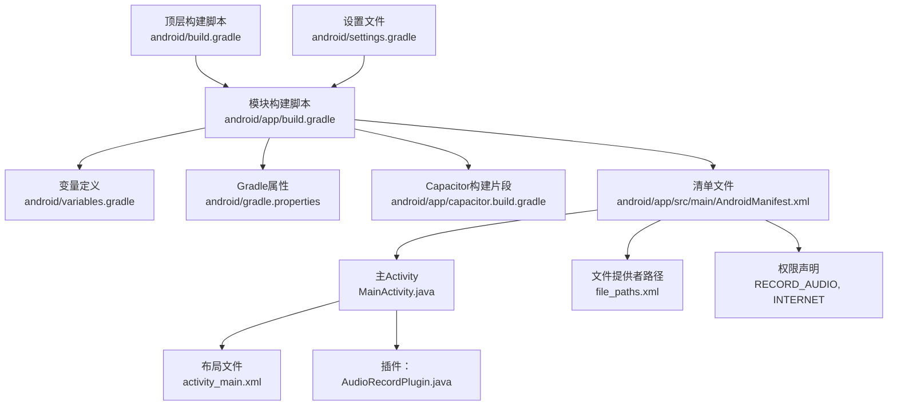
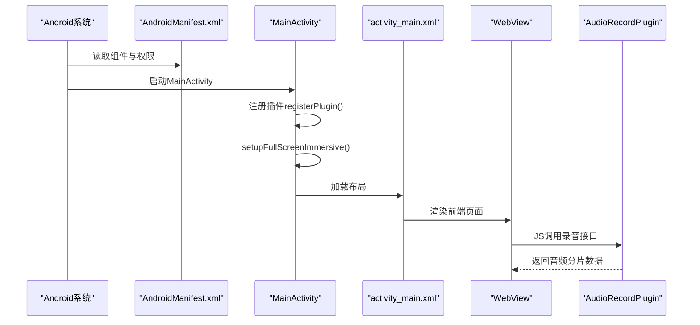
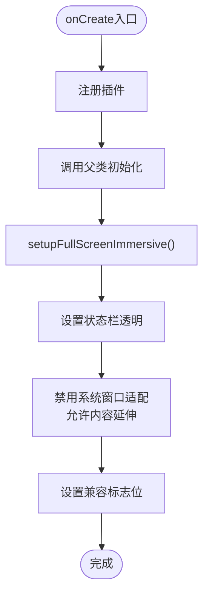
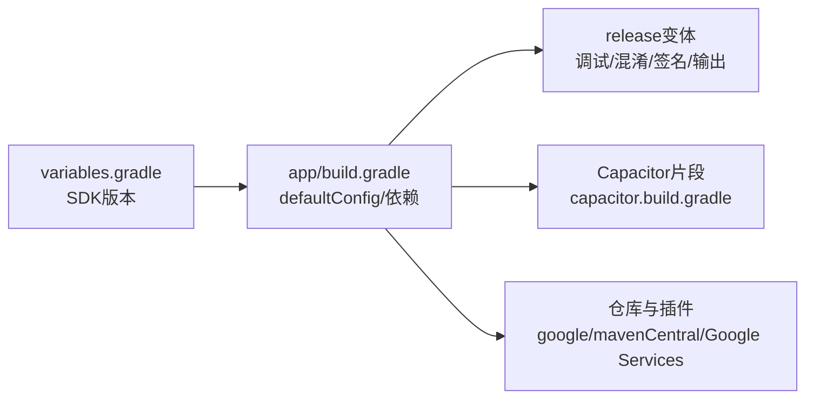
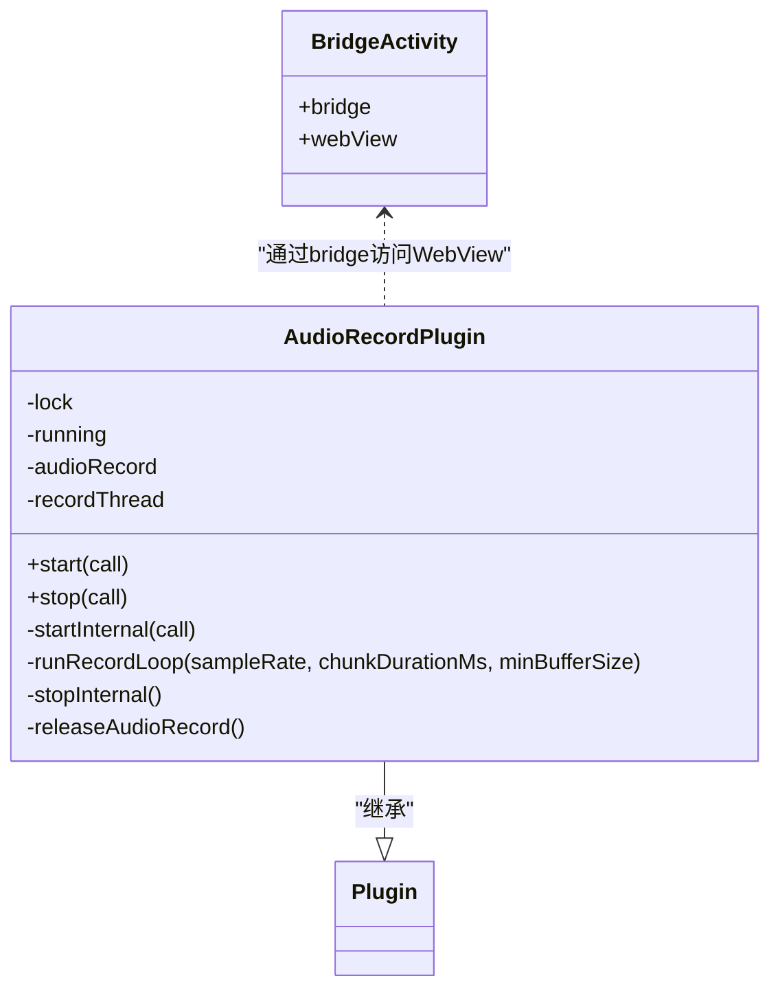
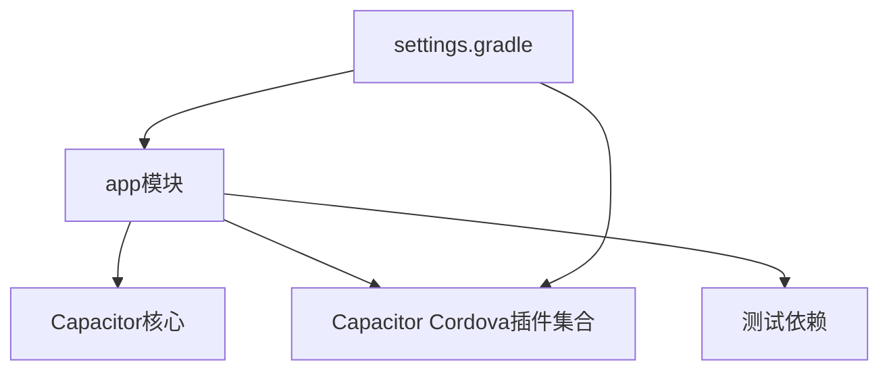

# Android项目配置

<cite>
**本文引用的文件**
- [android/app/src/main/AndroidManifest.xml](file://android/app/src/main/AndroidManifest.xml)
- [android/app/src/main/java/com/shisi/app/v2/MainActivity.java](file://android/app/src/main/java/com/shisi/app/v2/MainActivity.java)
- [android/app/build.gradle](file://android/app/build.gradle)
- [android/build.gradle](file://android/build.gradle)
- [android/gradle.properties](file://android/gradle.properties)
- [android/variables.gradle](file://android/variables.gradle)
- [android/app/proguard-rules.pro](file://android/app/proguard-rules.pro)
- [android/settings.gradle](file://android/settings.gradle)
- [android/app/src/main/res/values/styles.xml](file://android/app/src/main/res/values/styles.xml)
- [android/app/src/main/res/xml/file_paths.xml](file://android/app/src/main/res/xml/file_paths.xml)
- [android/app/src/main/res/values/strings.xml](file://android/app/src/main/res/values/strings.xml)
- [android/app/capacitor.build.gradle](file://android/app/capacitor.build.gradle)
- [android/app/src/main/java/com/shisi/app/v2/plugins/AudioRecordPlugin.java](file://android/app/src/main/java/com/shisi/app/v2/plugins/AudioRecordPlugin.java)
- [android/app/src/main/res/layout/activity_main.xml](file://android/app/src/main/res/layout/activity_main.xml)
</cite>

## 目录
1. [简介](#简介)
2. [项目结构](#项目结构)
3. [核心组件](#核心组件)
4. [架构总览](#架构总览)
5. [详细组件分析](#详细组件分析)
6. [依赖分析](#依赖分析)
7. [性能考虑](#性能考虑)
8. [故障排查指南](#故障排查指南)
9. [结论](#结论)
10. [附录](#附录)

## 简介
本文件面向Android平台的项目配置与实现细节，重点覆盖以下方面：
- MainActivity的全屏沉浸式设置、状态栏配置与系统UI可见性管理
- AndroidManifest.xml中的权限声明、组件注册与应用配置
- Gradle构建配置：依赖管理、构建变体、签名配置与输出命名
- Android特性优化：内存管理、电池优化与性能调优
- 调试工具使用与常见问题解决
- 应用签名、混淆配置与发布准备流程

## 项目结构
该项目采用Capacitor框架，Android端以原生Activity承载WebView运行前端页面，并通过自定义插件扩展功能。核心目录与职责如下：
- android/app/src/main：应用源代码与资源
  - java/com/shisi/app/v2：Java/Kotlin源码，包含MainActivity与自定义插件
  - res：布局、样式、字符串与XML配置
  - AndroidManifest.xml：应用清单与权限声明
- android/app/build.gradle：模块级构建脚本，定义SDK版本、依赖与签名
- android/build.gradle：顶层构建脚本，统一仓库与插件
- android/gradle.properties：全局Gradle属性（如JVM内存）
- android/variables.gradle：集中管理SDK版本与第三方库版本
- android/app/proguard-rules.pro：混淆规则占位文件
- android/settings.gradle：模块包含与Capacitor设置
- android/app/capacitor.build.gradle：由Capacitor生成的构建片段

图表来源
- [android/build.gradle:1-30](file://android/build.gradle#L1-L30)
- [android/app/build.gradle:1-72](file://android/app/build.gradle#L1-L72)
- [android/variables.gradle:1-16](file://android/variables.gradle#L1-L16)
- [android/gradle.properties:1-23](file://android/gradle.properties#L1-L23)
- [android/app/capacitor.build.gradle:1-21](file://android/app/capacitor.build.gradle#L1-L21)
- [android/app/src/main/AndroidManifest.xml:1-39](file://android/app/src/main/AndroidManifest.xml#L1-L39)
- [android/app/src/main/java/com/shisi/app/v2/MainActivity.java:1-35](file://android/app/src/main/java/com/shisi/app/v2/MainActivity.java#L1-L35)
- [android/app/src/main/res/layout/activity_main.xml:1-13](file://android/app/src/main/res/layout/activity_main.xml#L1-L13)
- [android/app/src/main/java/com/shisi/app/v2/plugins/AudioRecordPlugin.java:1-230](file://android/app/src/main/java/com/shisi/app/v2/plugins/AudioRecordPlugin.java#L1-L230)
- [android/app/src/main/res/xml/file_paths.xml:1-5](file://android/app/src/main/res/xml/file_paths.xml#L1-L5)

章节来源
- [android/app/build.gradle:1-72](file://android/app/build.gradle#L1-L72)
- [android/build.gradle:1-30](file://android/build.gradle#L1-L30)
- [android/variables.gradle:1-16](file://android/variables.gradle#L1-L16)
- [android/gradle.properties:1-23](file://android/gradle.properties#L1-L23)
- [android/settings.gradle:1-5](file://android/settings.gradle#L1-L5)

## 核心组件
- MainActivity：继承BridgeActivity，负责注册插件与执行全屏沉浸式UI设置；通过Window与WindowCompat控制状态栏与系统UI可见性
- 布局activity_main.xml：以CoordinatorLayout包裹WebView作为渲染容器
- 权限与组件：在清单中声明INTERNET与RECORD_AUDIO权限，并注册MainActivity与FileProvider
- 构建配置：集中SDK版本于variables.gradle，模块内定义签名、混淆与输出命名；Capacitor构建片段注入额外依赖

章节来源
- [android/app/src/main/java/com/shisi/app/v2/MainActivity.java:11-35](file://android/app/src/main/java/com/shisi/app/v2/MainActivity.java#L11-L35)
- [android/app/src/main/res/layout/activity_main.xml:1-13](file://android/app/src/main/res/layout/activity_main.xml#L1-L13)
- [android/app/src/main/AndroidManifest.xml:11-38](file://android/app/src/main/AndroidManifest.xml#L11-L38)
- [android/app/build.gradle:20-42](file://android/app/build.gradle#L20-L42)
- [android/app/capacitor.build.gradle:1-21](file://android/app/capacitor.build.gradle#L1-L21)

## 架构总览
下图展示从应用启动到界面呈现的关键交互：

图表来源
- [android/app/src/main/AndroidManifest.xml:11-38](file://android/app/src/main/AndroidManifest.xml#L11-L38)
- [android/app/src/main/java/com/shisi/app/v2/MainActivity.java:12-17](file://android/app/src/main/java/com/shisi/app/v2/MainActivity.java#L12-L17)
- [android/app/src/main/res/layout/activity_main.xml:9-11](file://android/app/src/main/res/layout/activity_main.xml#L9-L11)
- [android/app/src/main/java/com/shisi/app/v2/plugins/AudioRecordPlugin.java:39-61](file://android/app/src/main/java/com/shisi/app/v2/plugins/AudioRecordPlugin.java#L39-L61)

## 详细组件分析

### MainActivity：全屏沉浸式与系统UI可见性
- 全屏沉浸式设置要点
  - 状态栏透明：通过Window.setStatusBarColor设置为透明
  - 内容延伸至系统窗口：使用WindowCompat.setDecorFitsSystemWindows(false)，实现Edge-to-Edge效果
  - 兼容旧版API：通过DecorView的SYSTEM_UI_FLAG_LAYOUT_*标志确保布局适配
- 插件注册
  - 在onCreate中注册自定义插件，以便JS侧调用
- 与布局的关系
  - 布局采用CoordinatorLayout包裹WebView，便于与系统UI协同工作

图表来源
- [android/app/src/main/java/com/shisi/app/v2/MainActivity.java:12-33](file://android/app/src/main/java/com/shisi/app/v2/MainActivity.java#L12-L33)

章节来源
- [android/app/src/main/java/com/shisi/app/v2/MainActivity.java:11-35](file://android/app/src/main/java/com/shisi/app/v2/MainActivity.java#L11-L35)
- [android/app/src/main/res/layout/activity_main.xml:2-11](file://android/app/src/main/res/layout/activity_main.xml#L2-L11)

### AndroidManifest.xml：权限、组件与应用配置
- 应用属性
  - 允许备份、图标、主题等基础属性
  - 开放明文流量（用于开发或特定网络场景）
- 组件注册
  - MainActivity：单任务启动模式、调整键盘与窗口尺寸、导出为LAUNCHER
  - FileProvider：用于安全分享外部/缓存路径下的文件
- 权限声明
  - INTERNET：访问网络
  - RECORD_AUDIO：录音能力

章节来源
- [android/app/src/main/AndroidManifest.xml:3-38](file://android/app/src/main/AndroidManifest.xml#L3-L38)

### Gradle构建配置：依赖、变体与签名
- SDK与版本
  - compileSdk/targetSdk/minSdk集中于variables.gradle
  - 模块内defaultConfig定义应用ID、版本号与最低SDK
- 依赖管理
  - 使用AndroidX库与Capacitor子模块
  - 测试依赖与本地AAR/JAR
- 构建变体
  - release开启调试、不启用混淆、指定混淆规则文件、签名配置
  - 输出重命名为固定名称
- 签名配置
  - 使用本地keystore文件与密码
- Capacitor集成
  - 引入capacitor.build.gradle与相关插件依赖

图表来源
- [android/variables.gradle:1-16](file://android/variables.gradle#L1-L16)
- [android/app/build.gradle:6-42](file://android/app/build.gradle#L6-L42)
- [android/app/capacitor.build.gradle:1-21](file://android/app/capacitor.build.gradle#L1-L21)
- [android/build.gradle:4-16](file://android/build.gradle#L4-L16)

章节来源
- [android/app/build.gradle:1-72](file://android/app/build.gradle#L1-L72)
- [android/variables.gradle:1-16](file://android/variables.gradle#L1-L16)
- [android/build.gradle:1-30](file://android/build.gradle#L1-L30)
- [android/app/capacitor.build.gradle:1-21](file://android/app/capacitor.build.gradle#L1-L21)

### 主题与启动页：styles.xml与NoActionBarLaunch
- AppTheme：基于AppCompat的主题定制
- NoActionBar：移除ActionBar与标题，背景为空
- NoActionBarLaunch：启动页主题，白底与过渡到NoActionBar

章节来源
- [android/app/src/main/res/values/styles.xml:4-26](file://android/app/src/main/res/values/styles.xml#L4-L26)

### 文件提供者路径：file_paths.xml
- 配置外部存储与缓存路径，供FileProvider安全共享文件

章节来源
- [android/app/src/main/res/xml/file_paths.xml:2-5](file://android/app/src/main/res/xml/file_paths.xml#L2-L5)

### 字符串资源：strings.xml
- 应用名称、包名与自定义URL Scheme

章节来源
- [android/app/src/main/res/values/strings.xml:3-7](file://android/app/src/main/res/values/strings.xml#L3-L7)

### Capacitor构建片段：capacitor.build.gradle
- Java版本兼容（17）
- 注入额外插件依赖（如语音识别、键盘）

章节来源
- [android/app/capacitor.build.gradle:4-15](file://android/app/capacitor.build.gradle#L4-L15)

### 自定义插件：AudioRecordPlugin
- 功能概述
  - 录音权限申请与回调
  - 初始化AudioRecord、启动录音线程、按块读取PCM数据并编码为Base64
  - 通过事件向JS层推送音频分片
- 关键点
  - 线程优先级设为音频优先
  - 正确释放AudioRecord与停止线程
  - 错误处理与拒绝响应

图表来源
- [android/app/src/main/java/com/shisi/app/v2/plugins/AudioRecordPlugin.java:23-229](file://android/app/src/main/java/com/shisi/app/v2/plugins/AudioRecordPlugin.java#L23-L229)
- [android/app/src/main/java/com/shisi/app/v2/MainActivity.java:8](file://android/app/src/main/java/com/shisi/app/v2/MainActivity.java#L8)

章节来源
- [android/app/src/main/java/com/shisi/app/v2/plugins/AudioRecordPlugin.java:1-230](file://android/app/src/main/java/com/shisi/app/v2/plugins/AudioRecordPlugin.java#L1-L230)

## 依赖分析
- 模块间关系
  - app模块依赖Capacitor核心与cordova插件集合
  - 通过settings.gradle包含capacitor-cordova-android-plugins
- 第三方库
  - AndroidX家族库、协程布局、SplashScreen等
  - 测试框架与Espresso

图表来源
- [android/app/build.gradle:50-60](file://android/app/build.gradle#L50-L60)
- [android/settings.gradle:1-5](file://android/settings.gradle#L1-L5)

章节来源
- [android/app/build.gradle:50-60](file://android/app/build.gradle#L50-L60)
- [android/settings.gradle:1-5](file://android/settings.gradle#L1-L5)

## 性能考虑
- 内存管理
  - Gradle属性中设置JVM最大堆为1536m，适合中大型项目
  - 建议在运行时避免大对象常驻，及时释放Bitmap与媒体资源
- 电池优化
  - 录音线程设置为音频优先级，减少CPU抢占导致的卡顿
  - 录音完成后及时stop与release，避免后台持续占用
- 性能调优
  - WebView渲染由前端主导，建议前端侧进行懒加载与资源压缩
  - 构建阶段保持release不启用混淆，便于定位问题；发布前再评估开启

章节来源
- [android/gradle.properties:12](file://android/gradle.properties#L12)
- [android/app/src/main/java/com/shisi/app/v2/plugins/AudioRecordPlugin.java:139](file://android/app/src/main/java/com/shisi/app/v2/plugins/AudioRecordPlugin.java#L139)
- [android/app/build.gradle:31-34](file://android/app/build.gradle#L31-L34)

## 故障排查指南
- 录音权限被拒
  - 现象：插件回调拒绝并提示未获得录音权限
  - 排查：确认清单已声明RECORD_AUDIO；检查用户授权状态与回调
- 录音初始化失败
  - 现象：创建AudioRecord失败或未进入录制状态
  - 排查：检查采样率、缓冲区大小、设备是否被占用
- WebView显示异常
  - 现象：界面被系统UI遮挡或状态栏影响
  - 排查：确认MainActivity已执行全屏沉浸式设置；检查布局是否正确
- 发布包体积与签名
  - 现象：release包未启用混淆或签名错误
  - 排查：确认signingConfigs与buildTypes配置一致；校验keystore文件存在且密码正确

章节来源
- [android/app/src/main/java/com/shisi/app/v2/plugins/AudioRecordPlugin.java:41-61](file://android/app/src/main/java/com/shisi/app/v2/plugins/AudioRecordPlugin.java#L41-L61)
- [android/app/src/main/java/com/shisi/app/v2/plugins/AudioRecordPlugin.java:92-119](file://android/app/src/main/java/com/shisi/app/v2/plugins/AudioRecordPlugin.java#L92-L119)
- [android/app/src/main/java/com/shisi/app/v2/MainActivity.java:19-33](file://android/app/src/main/java/com/shisi/app/v2/MainActivity.java#L19-L33)
- [android/app/build.gradle:20-42](file://android/app/build.gradle#L20-L42)

## 结论
本项目通过Capacitor实现前端与原生能力的融合，MainActivity承担了全屏沉浸式UI与插件注册的核心职责；清单文件明确了网络与录音权限；Gradle配置集中化、可维护性强。结合本文提供的优化建议与排错指引，可在保证体验的同时提升稳定性与可维护性。

## 附录
- 发布准备步骤（概要）
  - 确认release签名配置与keystore可用
  - 校验混淆规则文件存在且符合需求
  - 执行打包命令生成APK，核对输出文件名与版本信息
  - 进行安装测试与录音功能验证

章节来源
- [android/app/build.gradle:20-42](file://android/app/build.gradle#L20-L42)
- [android/app/proguard-rules.pro:1-22](file://android/app/proguard-rules.pro#L1-L22)