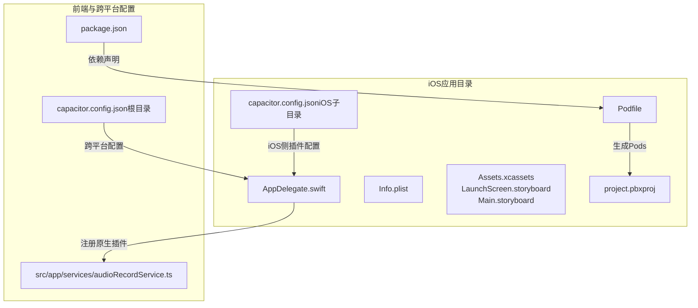
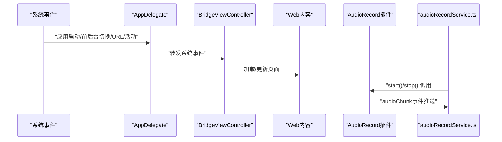
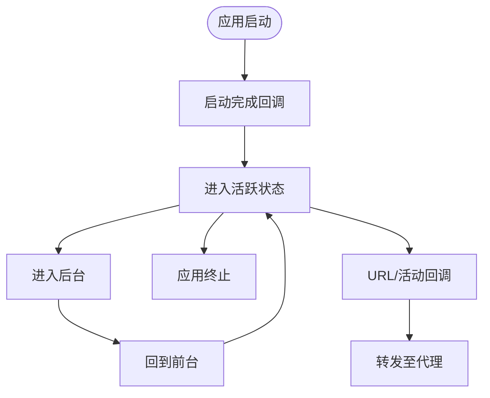
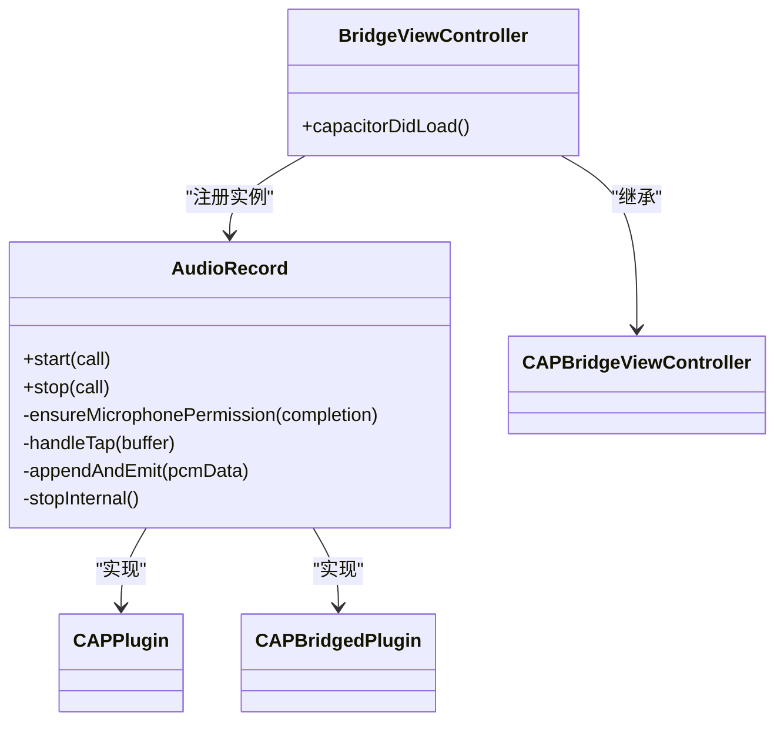
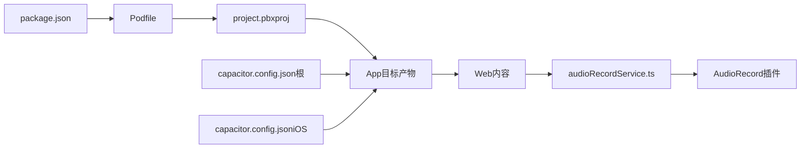

# iOS项目配置

<cite>
**本文引用的文件**
- [AppDelegate.swift](file://ios/App/App/AppDelegate.swift)
- [Info.plist](file://ios/App/App/Info.plist)
- [Podfile](file://ios/App/Podfile)
- [capacitor.config.json（根目录）](file://capacitor.config.json)
- [capacitor.config.json（iOS子目录）](file://ios/App/App/capacitor.config.json)
- [audioRecordService.ts](file://src/app/services/audioRecordService.ts)
- [project.pbxproj](file://ios/App/App.xcodeproj/project.pbxproj)
- [package.json](file://package.json)
</cite>

## 目录
1. [简介](#简介)
2. [项目结构](#项目结构)
3. [核心组件](#核心组件)
4. [架构总览](#架构总览)
5. [组件详解](#组件详解)
6. [依赖关系分析](#依赖关系分析)
7. [性能与优化](#性能与优化)
8. [故障排查指南](#故障排查指南)
9. [结论](#结论)
10. [附录](#附录)

## 简介
本文件面向iOS项目配置与开发，围绕AppDelegate生命周期管理、原生能力集成（如音频录制）、Info.plist系统配置项、CocoaPods与Xcode工作空间、iOS特有优化策略（内存、后台任务、性能监控）、Xcode调试与常见编译问题、以及代码签名与App Store发布流程进行系统化说明。文档同时结合本仓库中的实际配置文件，提供可追溯的来源定位。

## 项目结构
iOS相关源码位于ios/App/App目录，采用Capacitor框架组织，包含应用入口、资源、配置与插件桥接层。Xcode工程文件在App.xcodeproj中，CocoaPods通过Podfile管理第三方依赖。

图表来源
- [AppDelegate.swift](file://ios/App/App/AppDelegate.swift)
- [Info.plist](file://ios/App/App/Info.plist)
- [capacitor.config.json（iOS子目录）](file://ios/App/App/capacitor.config.json)
- [capacitor.config.json（根目录）](file://capacitor.config.json)
- [project.pbxproj](file://ios/App/App.xcodeproj/project.pbxproj)
- [Podfile](file://ios/App/Podfile)
- [package.json](file://package.json)
- [audioRecordService.ts](file://src/app/services/audioRecordService.ts)

章节来源
- [AppDelegate.swift](file://ios/App/App/AppDelegate.swift)
- [Info.plist](file://ios/App/App/Info.plist)
- [capacitor.config.json（iOS子目录）](file://ios/App/App/capacitor.config.json)
- [capacitor.config.json（根目录）](file://capacitor.config.json)
- [project.pbxproj](file://ios/App/App.xcodeproj/project.pbxproj)
- [Podfile](file://ios/App/Podfile)
- [package.json](file://package.json)
- [audioRecordService.ts](file://src/app/services/audioRecordService.ts)

## 核心组件
- 应用入口与生命周期：AppDelegate集中处理应用启动、前后台切换、URL/活动回调等系统事件，并通过BridgeViewController承载Web内容。
- 原生插件：自定义AudioRecord插件通过AVFoundation实现音频流采集与分片推送，配合前端服务接口统一调用。
- 配置中心：Info.plist定义应用元数据与系统权限；iOS侧capacitor.config.json补充插件与包类列表；根目录capacitor.config.json提供跨平台通用配置。
- 依赖与构建：Podfile声明Capacitor及社区插件；Xcode工程通过PBX文件组织资源与目标；package.json声明npm依赖与脚本。

章节来源
- [AppDelegate.swift](file://ios/App/App/AppDelegate.swift)
- [Info.plist](file://ios/App/App/Info.plist)
- [capacitor.config.json（iOS子目录）](file://ios/App/App/capacitor.config.json)
- [capacitor.config.json（根目录）](file://capacitor.config.json)
- [project.pbxproj](file://ios/App/App.xcodeproj/project.pbxproj)
- [Podfile](file://ios/App/Podfile)
- [package.json](file://package.json)
- [audioRecordService.ts](file://src/app/services/audioRecordService.ts)

## 架构总览
下图展示从系统事件到原生插件与前端服务的调用链路，体现Capacitor在iOS端的桥接机制与资源加载路径。

图表来源
- [AppDelegate.swift](file://ios/App/App/AppDelegate.swift)
- [audioRecordService.ts](file://src/app/services/audioRecordService.ts)

## 组件详解

### AppDelegate与应用生命周期
- 启动完成回调：用于应用启动后的自定义初始化。
- 前后台切换：在进入后台时释放共享资源、保存状态；回到前台时恢复界面与任务。
- 终止回调：应用终止前的数据保存。
- URL与活动回调：透传至ApplicationDelegateProxy，确保App API能跟踪URL打开与Universal Links。

图表来源
- [AppDelegate.swift](file://ios/App/App/AppDelegate.swift)

章节来源
- [AppDelegate.swift](file://ios/App/App/AppDelegate.swift)

### 原生插件：AudioRecord
- 插件职责：基于AVAudioSession与AVAudioEngine实现音频采集、格式转换与分片推送。
- 生命周期：在BridgeViewController加载后注册插件实例，保证Web端调用可用。
- 权限控制：运行前检查麦克风权限，未授权直接拒绝调用。
- 数据通道：通过通知监听器向Web端推送Base64编码的音频分片与元信息。
- 并发模型：内部使用串行队列保护状态，回调在主线程resolve/reject，避免线程安全问题。

图表来源
- [AppDelegate.swift](file://ios/App/App/AppDelegate.swift)

章节来源
- [AppDelegate.swift](file://ios/App/App/AppDelegate.swift)
- [audioRecordService.ts](file://src/app/services/audioRecordService.ts)

### Info.plist配置要点
- 应用显示名称与标识：bundle display name、identifier、version等。
- 权限声明：NSMicrophoneUsageDescription用于麦克风访问提示。
- 启动与主界面：UILaunchStoryboardName、UIMainStoryboardFile。
- 设备能力与方向：LSRequiresIPhoneOS、UIRequiredDeviceCapabilities、UISupportedInterfaceOrientations、UISupportedInterfaceOrientations~ipad。
- 状态栏外观：UIViewControllerBasedStatusBarAppearance。

章节来源
- [Info.plist](file://ios/App/App/Info.plist)

### CocoaPods与Xcode工作空间
- 平台与安装：指定iOS平台版本、禁用输入输出路径缓存以避免构建缓存问题。
- 容器化依赖：通过capacitor_pods块引入Capacitor与键盘、语音识别等插件。
- 目标与后置安装：为App目标安装依赖，并在post_install阶段校验部署目标。
- 工程组织：Xcode工程通过PBX文件引用AppDelegate、Info.plist、Storyboard与资源目录；Sources/Resource/Frameworks构建阶段明确资源嵌入与框架链接。

章节来源
- [Podfile](file://ios/App/Podfile)
- [project.pbxproj](file://ios/App/App.xcodeproj/project.pbxproj)

### 跨平台配置与插件映射
- 根目录capacitor.config.json：定义应用ID、名称、Web目录与服务器参数，以及StatusBar、Keyboard、SplashScreen等插件配置。
- iOS子目录capacitor.config.json：补充iOS侧插件与包类列表（如KeyboardPlugin、SpeechRecognition），确保原生插件正确打包与加载。

章节来源
- [capacitor.config.json（根目录）](file://capacitor.config.json)
- [capacitor.config.json（iOS子目录）](file://ios/App/App/capacitor.config.json)

### 前端服务对接
- 类型定义：AudioRecordStartOptions、AudioRecordStartResult与事件类型，确保调用参数与返回值一致。
- 插件注册：通过registerPlugin('AudioRecord')暴露给前端调用。
- 事件监听：addRemoveListeners统一管理audioChunk事件订阅。

章节来源
- [audioRecordService.ts](file://src/app/services/audioRecordService.ts)

## 依赖关系分析
- 依赖来源：package.json声明@capacitor/*系列与社区插件；Podfile声明iOS侧依赖并通过CocoaPods安装。
- 构建耦合：Xcode工程通过PBX文件将AppDelegate、Info.plist、Storyboard与资源纳入目标；[CP]脚本确保Pods一致性。
- 插件桥接：iOS侧capacitor.config.json的packageClassList与前端插件名需匹配，确保原生插件被正确打包。

图表来源
- [package.json](file://package.json)
- [Podfile](file://ios/App/Podfile)
- [project.pbxproj](file://ios/App/App.xcodeproj/project.pbxproj)
- [capacitor.config.json（根目录）](file://capacitor.config.json)
- [capacitor.config.json（iOS子目录）](file://ios/App/App/capacitor.config.json)
- [audioRecordService.ts](file://src/app/services/audioRecordService.ts)
- [AppDelegate.swift](file://ios/App/App/AppDelegate.swift)

章节来源
- [package.json](file://package.json)
- [Podfile](file://ios/App/Podfile)
- [project.pbxproj](file://ios/App/App.xcodeproj/project.pbxproj)
- [capacitor.config.json（根目录）](file://capacitor.config.json)
- [capacitor.config.json（iOS子目录）](file://ios/App/App/capacitor.config.json)
- [audioRecordService.ts](file://src/app/services/audioRecordService.ts)
- [AppDelegate.swift](file://ios/App/App/AppDelegate.swift)

## 性能与优化
- 内存管理
  - 音频采集使用串行队列与轻量级缓冲，避免主线程阻塞与频繁GC。
  - 分片大小按采样率与时长计算，减少单次传输体积，降低内存峰值。
  - 停止时及时移除tap、停止引擎、释放会话与清理缓冲，防止资源泄漏。
- 后台任务处理
  - 在进入后台时释放非必要资源，保存状态；回到前台时恢复界面与任务。
  - 对于持续性任务，建议使用后台执行模式与适当的任务调度，避免被系统回收。
- 性能监控
  - 利用Xcode Instruments进行CPU、内存、网络与能耗分析。
  - Web内容渲染性能可通过Safari远程调试与Timeline面板观察帧率与重绘热点。
- 编译与构建优化
  - 使用CocoaPods禁用输入输出路径缓存以减少构建缓存问题。
  - 保持Podfile.lock与Pods同步，避免“沙盒不同步”错误。

章节来源
- [AppDelegate.swift](file://ios/App/App/AppDelegate.swift)
- [Podfile](file://ios/App/Podfile)

## 故障排查指南
- CocoaPods相关
  - “沙盒不同步”：确保执行pod install或更新CocoaPods安装，并核对Podfile.lock与Manifest.lock一致。
  - 构建缓存问题：启用禁用输入输出路径缓存的安装方式，避免Xcode缓存导致的异常。
- Xcode构建与运行
  - 目标配置：确认目标的Provisioning Style为Automatic，避免签名与设备不匹配。
  - 资源嵌入：检查Resources构建阶段是否包含Storyboard、Assets.xcassets与capacitor配置文件。
  - 插件加载：核对iOS侧capacitor.config.json中的packageClassList与前端插件名一致。
- 原生插件调用
  - 权限缺失：若麦克风权限未授予，start调用会被拒绝；可在系统设置中开启或引导用户授权。
  - 线程安全：确保在主线程resolve/reject，避免异步回调引发的竞态。
- 常见编译错误
  - Swift版本与Xcode版本不匹配：升级Xcode或调整Swift兼容性。
  - 重复符号/链接错误：清理DerivedData与Build Folder，重新安装Pods。
  - 代码签名失败：检查Team、Bundle Identifier与证书有效性。

章节来源
- [Podfile](file://ios/App/Podfile)
- [project.pbxproj](file://ios/App/App.xcodeproj/project.pbxproj)
- [AppDelegate.swift](file://ios/App/App/AppDelegate.swift)

## 结论
本项目基于Capacitor在iOS端实现了稳定的Web与原生桥接，AppDelegate承担系统事件中枢，自定义AudioRecord插件提供高质量音频采集能力。通过Info.plist与capacitor.config.json双轨配置，结合CocoaPods与Xcode工程组织，形成清晰的构建与运行链路。遵循本文的性能优化与故障排查建议，可有效提升应用稳定性与开发效率。

## 附录
- 代码签名与证书配置
  - 在Xcode中选择正确的Team与Provisioning Profile，确保Bundle Identifier与证书匹配。
  - 使用自动签名时，确保已登录Apple ID且具备相应权限。
- App Store发布流程
  - 准备应用图标与启动图，完善应用元数据与隐私清单。
  - 使用Xcode Archive生成IPA，上传至App Store Connect并提交审核。
  - 关注审核政策与权限描述，确保符合App Store Guidelines。