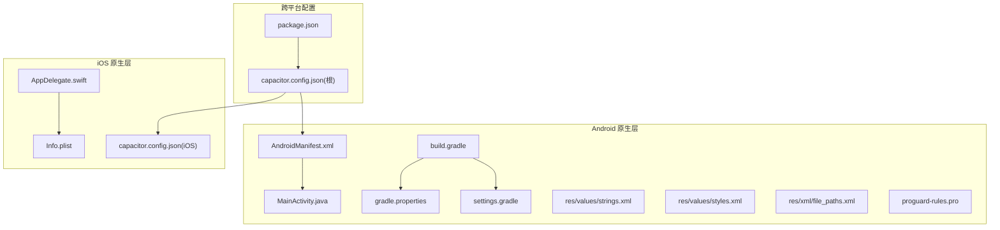
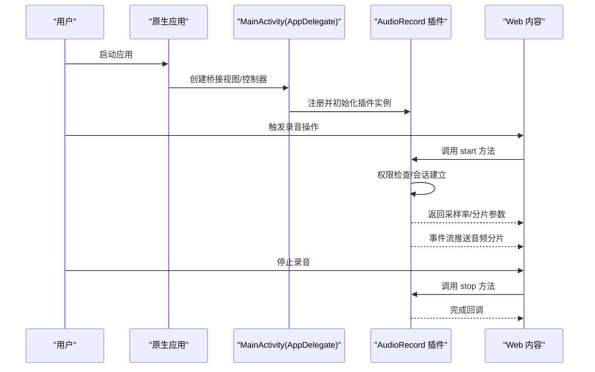
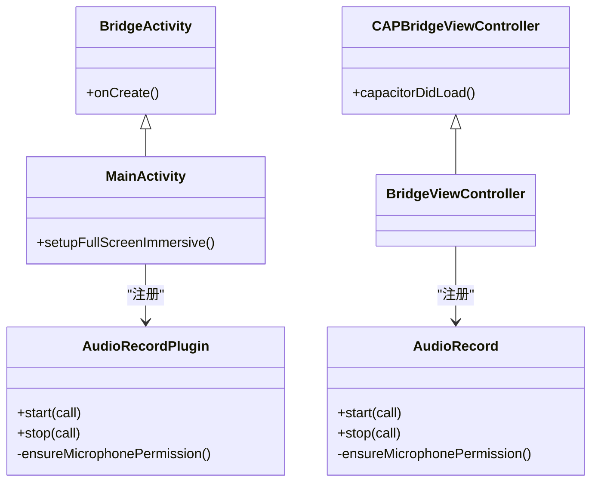
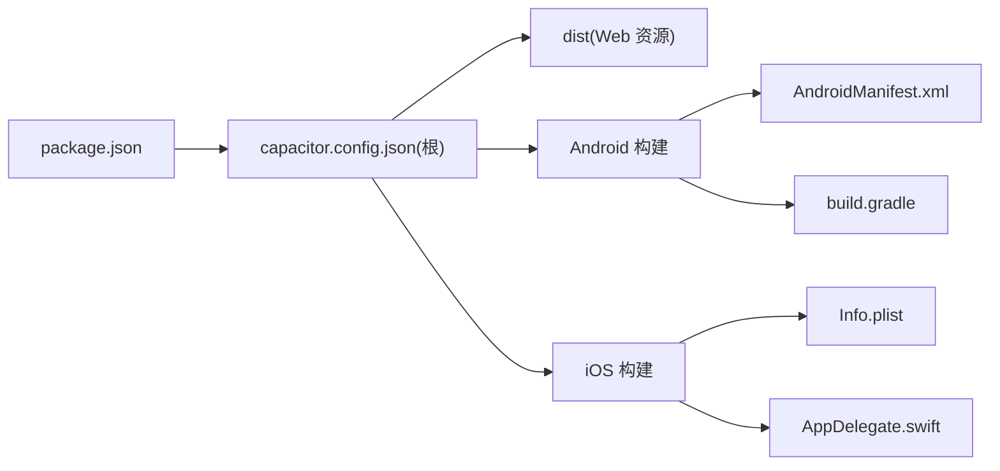

# 移动应用配置

<cite>
**本文引用的文件**
- [AndroidManifest.xml](file://android/app/src/main/AndroidManifest.xml)
- [MainActivity.java](file://android/app/src/main/java/com/shisi/app/v2/MainActivity.java)
- [AudioRecordPlugin.java](file://android/app/src/main/java/com/shisi/app/v2/plugins/AudioRecordPlugin.java)
- [build.gradle](file://android/app/build.gradle)
- [gradle.properties](file://android/gradle.properties)
- [settings.gradle](file://android/settings.gradle)
- [strings.xml](file://android/app/src/main/res/values/strings.xml)
- [styles.xml](file://android/app/src/main/res/values/styles.xml)
- [file_paths.xml](file://android/app/src/main/res/xml/file_paths.xml)
- [proguard-rules.pro](file://android/app/proguard-rules.pro)
- [AppDelegate.swift](file://ios/App/App/AppDelegate.swift)
- [Info.plist](file://ios/App/App/Info.plist)
- [capacitor.config.json（iOS）](file://ios/App/App/capacitor.config.json)
- [capacitor.config.json（根目录）](file://capacitor.config.json)
- [package.json](file://package.json)
</cite>

## 目录
1. [简介](#简介)
2. [项目结构](#项目结构)
3. [核心组件](#核心组件)
4. [架构总览](#架构总览)
5. [详细组件分析](#详细组件分析)
6. [依赖分析](#依赖分析)
7. [性能考虑](#性能考虑)
8. [故障排除指南](#故障排除指南)
9. [结论](#结论)
10. [附录](#附录)

## 简介
本文件面向跨平台移动应用的配置与发布，围绕基于 Capacitor 的 Android/iOS 工程，系统梳理以下主题：
- Android 配置：MainActivity 设置、权限声明、构建配置与签名
- iOS 配置：AppDelegate 实现、Info.plist 设置、插件注册与证书相关注意事项
- 构建与发布：版本管理、签名配置、产物命名与分发策略
- 平台优化：内存管理、电池优化、性能调优建议
- 调试与排障：常见问题定位与修复路径
- 应用商店发布：上架流程、审核要点与用户反馈处理思路

## 项目结构
该工程采用 Capacitor 结构，Android 与 iOS 分别在各自目录下维护原生层配置与资源，前端代码位于根目录并通过 Capacitor 打包为原生应用。

图表来源
- [AndroidManifest.xml:1-39](file://android/app/src/main/AndroidManifest.xml#L1-L39)
- [MainActivity.java:1-35](file://android/app/src/main/java/com/shisi/app/v2/MainActivity.java#L1-L35)
- [build.gradle:1-72](file://android/app/build.gradle#L1-L72)
- [gradle.properties:1-23](file://android/gradle.properties#L1-L23)
- [settings.gradle:1-5](file://android/settings.gradle#L1-L5)
- [strings.xml:1-8](file://android/app/src/main/res/values/strings.xml#L1-L8)
- [styles.xml:1-27](file://android/app/src/main/res/values/styles.xml#L1-L27)
- [file_paths.xml:1-5](file://android/app/src/main/res/xml/file_paths.xml#L1-L5)
- [proguard-rules.pro:1-22](file://android/app/proguard-rules.pro#L1-L22)
- [AppDelegate.swift:1-252](file://ios/App/App/AppDelegate.swift#L1-L252)
- [Info.plist:1-52](file://ios/App/App/Info.plist#L1-L52)
- [capacitor.config.json（iOS）:1-35](file://ios/App/App/capacitor.config.json#L1-L35)
- [capacitor.config.json（根目录）:1-31](file://capacitor.config.json#L1-L31)
- [package.json:1-113](file://package.json#L1-L113)

章节来源
- [AndroidManifest.xml:1-39](file://android/app/src/main/AndroidManifest.xml#L1-L39)
- [build.gradle:1-72](file://android/app/build.gradle#L1-L72)
- [AppDelegate.swift:1-252](file://ios/App/App/AppDelegate.swift#L1-L252)
- [Info.plist:1-52](file://ios/App/App/Info.plist#L1-L52)
- [capacitor.config.json（根目录）:1-31](file://capacitor.config.json#L1-L31)
- [package.json:1-113](file://package.json#L1-L113)

## 核心组件
- Android 主入口与沉浸式体验：MainActivity 负责注册自定义插件与设置沉浸式全屏；通过 AndroidManifest 暴露主 Activity 并声明 FileProvider 用于文件分享。
- 自定义录音插件：Android 提供 Java 插件，iOS 提供 Swift 插件，二者均负责麦克风权限校验、音频录制与分片事件通知。
- 构建与打包：Android 使用 Gradle 配置签名、混淆规则与输出命名；iOS 通过 Info.plist 与 Capacitor 配置控制应用元数据与插件列表。
- 跨平台配置：根目录与 iOS 目录下的 capacitor.config.json 统一前端资源目录与插件行为，确保 Web 内容在原生容器中一致运行。

章节来源
- [MainActivity.java:1-35](file://android/app/src/main/java/com/shisi/app/v2/MainActivity.java#L1-L35)
- [AudioRecordPlugin.java:1-230](file://android/app/src/main/java/com/shisi/app/v2/plugins/AudioRecordPlugin.java#L1-L230)
- [build.gradle:1-72](file://android/app/build.gradle#L1-L72)
- [AppDelegate.swift:52-56](file://ios/App/App/AppDelegate.swift#L52-L56)
- [capacitor.config.json（根目录）:1-31](file://capacitor.config.json#L1-L31)
- [capacitor.config.json（iOS）:1-35](file://ios/App/App/capacitor.config.json#L1-L35)

## 架构总览
下图展示跨平台应用从启动到插件交互的关键流程，体现 Android/iOS 原生层与 Web 层的协作关系。

图表来源
- [MainActivity.java:11-17](file://android/app/src/main/java/com/shisi/app/v2/MainActivity.java#L11-L17)
- [AudioRecordPlugin.java:39-61](file://android/app/src/main/java/com/shisi/app/v2/plugins/AudioRecordPlugin.java#L39-L61)
- [AppDelegate.swift:52-56](file://ios/App/App/AppDelegate.swift#L52-L56)
- [capacitor.config.json（根目录）:1-31](file://capacitor.config.json#L1-L31)

## 详细组件分析

### Android 配置分析
- MainActivity 设置
  - 注册自定义录音插件与沉浸式全屏：在 onCreate 中注册插件并设置状态栏透明、内容延伸至系统窗口，提升视觉一致性。
  - 关键点参考：[MainActivity.java:11-35](file://android/app/src/main/java/com/shisi/app/v2/MainActivity.java#L11-L35)
- 权限声明
  - Manifest 明确声明网络与录音权限，满足录音与在线资源加载需求。
  - 关键点参考：[AndroidManifest.xml:34-38](file://android/app/src/main/AndroidManifest.xml#L34-L38)
- 构建配置
  - 版本号与名称：通过 Gradle defaultConfig 配置 versionCode 与 versionName。
  - 签名配置：release 类型启用签名，指定 keystore 文件与口令。
  - 输出命名：统一 APK 名称为固定前缀，便于分发与识别。
  - 依赖与仓库：引入 Capacitor 与 Cordova 插件，启用 Google Services 插件（若存在配置文件）。
  - 关键点参考：[build.gradle:6-12](file://android/app/build.gradle#L6-L12), [build.gradle:20-40](file://android/app/build.gradle#L20-L40), [build.gradle:50-62](file://android/app/build.gradle#L50-L62)
- 资源与样式
  - 字符串与主题：strings.xml 提供应用名与 URL Scheme；styles.xml 定义启动页主题与无标题栏风格。
  - 关键点参考：[strings.xml:1-8](file://android/app/src/main/res/values/strings.xml#L1-L8), [styles.xml:1-27](file://android/app/src/main/res/values/styles.xml#L1-L27)
- 文件提供者
  - FileProvider 用于外部存储路径映射，配合 file_paths.xml 暴露缓存与外部路径。
  - 关键点参考：[AndroidManifest.xml:25-31](file://android/app/src/main/AndroidManifest.xml#L25-L31), [file_paths.xml:1-5](file://android/app/src/main/res/xml/file_paths.xml#L1-L5)
- 混淆规则
  - 默认保留注释与行号信息，便于调试；可根据需要调整。
  - 关键点参考：[proguard-rules.pro:1-22](file://android/app/proguard-rules.pro#L1-L22)
- Gradle 与设置
  - gradle.properties 控制 JVM 内存与 AndroidX 开关；settings.gradle 引入 Capacitor 插件模块。
  - 关键点参考：[gradle.properties:10-22](file://android/gradle.properties#L10-L22), [settings.gradle:1-5](file://android/settings.gradle#L1-L5)

章节来源
- [MainActivity.java:1-35](file://android/app/src/main/java/com/shisi/app/v2/MainActivity.java#L1-L35)
- [AndroidManifest.xml:1-39](file://android/app/src/main/AndroidManifest.xml#L1-L39)
- [build.gradle:1-72](file://android/app/build.gradle#L1-L72)
- [strings.xml:1-8](file://android/app/src/main/res/values/strings.xml#L1-L8)
- [styles.xml:1-27](file://android/app/src/main/res/values/styles.xml#L1-L27)
- [file_paths.xml:1-5](file://android/app/src/main/res/xml/file_paths.xml#L1-L5)
- [proguard-rules.pro:1-22](file://android/app/proguard-rules.pro#L1-L22)
- [gradle.properties:1-23](file://android/gradle.properties#L1-L23)
- [settings.gradle:1-5](file://android/settings.gradle#L1-L5)

### iOS 配置分析
- AppDelegate 实现
  - 继承 Capacitor UIApplicationDelegate，提供应用生命周期回调；桥接视图中注册自定义录音插件实例。
  - 关键点参考：[AppDelegate.swift:52-56](file://ios/App/App/AppDelegate.swift#L52-L56)
- Info.plist 设置
  - 应用显示名、Bundle 标识、版本号、设备能力与界面方向等；包含麦克风使用说明。
  - 关键点参考：[Info.plist:1-52](file://ios/App/App/Info.plist#L1-L52)
- 插件与配置
  - iOS 端通过 capacitor.config.json 声明插件列表（如键盘、语音识别），并与根目录配置保持一致。
  - 关键点参考：[capacitor.config.json（iOS）:30-34](file://ios/App/App/capacitor.config.json#L30-L34)

章节来源
- [AppDelegate.swift:1-252](file://ios/App/App/AppDelegate.swift#L1-L252)
- [Info.plist:1-52](file://ios/App/App/Info.plist#L1-L52)
- [capacitor.config.json（iOS）:1-35](file://ios/App/App/capacitor.config.json#L1-L35)

### 录音插件对比与实现要点
- Android 插件（Java）
  - 权限请求与回调：通过 Capacitor 注解声明权限，回调中决定是否继续启动录音。
  - 录音循环与分片：在音频线程中读取缓冲区，按设定时长切分为 PCM 分片，Base64 编码后通过事件通道发送给 Web 层。
  - 关键点参考：[AudioRecordPlugin.java:19-67](file://android/app/src/main/java/com/shisi/app/v2/plugins/AudioRecordPlugin.java#L19-L67), [AudioRecordPlugin.java:138-187](file://android/app/src/main/java/com/shisi/app/v2/plugins/AudioRecordPlugin.java#L138-L187)
- iOS 插件（Swift）
  - AVAudioSession 配置：设置录音与测量模式，允许蓝牙与默认扬声器；根据采样率与分片时长计算字节大小。
  - 分片与事件：安装输入节点 Tap，转换 PCM 数据，按 chunkBytes 切片并以 Base64 推送事件。
  - 关键点参考：[AppDelegate.swift:58-251](file://ios/App/App/AppDelegate.swift#L58-L251)

图表来源
- [MainActivity.java:11-17](file://android/app/src/main/java/com/shisi/app/v2/MainActivity.java#L11-L17)
- [AudioRecordPlugin.java:39-61](file://android/app/src/main/java/com/shisi/app/v2/plugins/AudioRecordPlugin.java#L39-L61)
- [AppDelegate.swift:52-56](file://ios/App/App/AppDelegate.swift#L52-L56)
- [AppDelegate.swift:58-199](file://ios/App/App/AppDelegate.swift#L58-L199)

章节来源
- [AudioRecordPlugin.java:1-230](file://android/app/src/main/java/com/shisi/app/v2/plugins/AudioRecordPlugin.java#L1-L230)
- [AppDelegate.swift:1-252](file://ios/App/App/AppDelegate.swift#L1-L252)

### 构建与发布流程
- 版本管理
  - Android：通过 Gradle defaultConfig 的 versionCode 与 versionName 管理版本；iOS：通过 Info.plist 的 CFBundleShortVersionString 与 CFBundleVersion。
  - 参考：[build.gradle:10-11](file://android/app/build.gradle#L10-L11), [Info.plist:21-24](file://ios/App/App/Info.plist#L21-L24)
- 签名配置
  - Android：release 构建类型启用签名，keystore 文件与口令在脚本中硬编码，建议迁移到安全环境变量或 gradle.properties。
  - 参考：[build.gradle:20-27](file://android/app/build.gradle#L20-L27)
- 产物命名与分发
  - Android：统一输出文件名为固定前缀，便于归档与分发。
  - 参考：[build.gradle:35-39](file://android/app/build.gradle#L35-L39)
- 清理与混淆
  - Android：默认关闭混淆与代码压缩，保留行号便于调试；可根据需要开启。
  - 参考：[build.gradle:32-33](file://android/app/build.gradle#L32-L33), [proguard-rules.pro:15-21](file://android/app/proguard-rules.pro#L15-L21)

章节来源
- [build.gradle:1-72](file://android/app/build.gradle#L1-L72)
- [proguard-rules.pro:1-22](file://android/app/proguard-rules.pro#L1-L22)
- [Info.plist:1-52](file://ios/App/App/Info.plist#L1-L52)

### 平台特定优化建议
- Android
  - 内存管理：Gradle JVM 内存上限已设置，建议结合应用实际监控堆内存峰值，必要时调整。
    - 参考：[gradle.properties](file://android/gradle.properties#L12)
  - 电池优化：避免在后台持续录音；合理设置采样率与分片时长，降低 CPU 占用。
    - 参考：[AudioRecordPlugin.java:138-146](file://android/app/src/main/java/com/shisi/app/v2/plugins/AudioRecordPlugin.java#L138-L146)
  - 性能调优：录音线程优先级设为音频优先，减少阻塞；分片大小与缓冲区按采样率动态计算，保证实时性。
    - 参考：[AudioRecordPlugin.java:138-146](file://android/app/src/main/java/com/shisi/app/v2/plugins/AudioRecordPlugin.java#L138-L146)
- iOS
  - 电池优化：AVAudioSession 设置为播放与录音，避免不必要的后台任务；录音结束后及时释放会话。
    - 参考：[AppDelegate.swift:109-112](file://ios/App/App/AppDelegate.swift#L109-L112), [AppDelegate.swift:177-181](file://ios/App/App/AppDelegate.swift#L177-L181)
  - 性能调优：使用高优先级队列处理音频数据，避免主线程阻塞；Tap 回调中进行最小化转换与编码。
    - 参考：[AppDelegate.swift:67-67](file://ios/App/App/AppDelegate.swift#L67-L67), [AppDelegate.swift:201-223](file://ios/App/App/AppDelegate.swift#L201-L223)

章节来源
- [gradle.properties:10-22](file://android/gradle.properties#L10-L22)
- [AudioRecordPlugin.java:138-146](file://android/app/src/main/java/com/shisi/app/v2/plugins/AudioRecordPlugin.java#L138-L146)
- [AppDelegate.swift:109-112](file://ios/App/App/AppDelegate.swift#L109-L112)
- [AppDelegate.swift:177-181](file://ios/App/App/AppDelegate.swift#L177-L181)
- [AppDelegate.swift:201-223](file://ios/App/App/AppDelegate.swift#L201-L223)

### 调试工具与排障
- Android
  - 日志与断点：使用 Logcat 查看应用日志；在录音线程与事件回调处设置断点定位问题。
  - 权限问题：确认 Manifest 权限声明与运行时授权流程；插件回调中拒绝时检查权限状态。
    - 参考：[AndroidManifest.xml:34-38](file://android/app/src/main/AndroidManifest.xml#L34-L38), [AudioRecordPlugin.java:40-61](file://android/app/src/main/java/com/shisi/app/v2/plugins/AudioRecordPlugin.java#L40-L61)
  - 文件访问：FileProvider 与 file_paths.xml 配置错误会导致外部文件无法访问。
    - 参考：[AndroidManifest.xml:25-31](file://android/app/src/main/AndroidManifest.xml#L25-L31), [file_paths.xml:1-5](file://android/app/src/main/res/xml/file_paths.xml#L1-L5)
- iOS
  - 权限问题：Info.plist 中需包含麦克风使用说明；录音前检查 AVAudioSession 权限状态。
    - 参考：[Info.plist:9-10](file://ios/App/App/Info.plist#L9-L10), [AppDelegate.swift:183-199](file://ios/App/App/AppDelegate.swift#L183-L199)
  - 插件注册：确保在桥接视图加载完成后注册插件实例。
    - 参考：[AppDelegate.swift:52-56](file://ios/App/App/AppDelegate.swift#L52-L56)

章节来源
- [AndroidManifest.xml:1-39](file://android/app/src/main/AndroidManifest.xml#L1-L39)
- [AudioRecordPlugin.java:1-230](file://android/app/src/main/java/com/shisi/app/v2/plugins/AudioRecordPlugin.java#L1-L230)
- [file_paths.xml:1-5](file://android/app/src/main/res/xml/file_paths.xml#L1-L5)
- [Info.plist:1-52](file://ios/App/App/Info.plist#L1-L52)
- [AppDelegate.swift:1-252](file://ios/App/App/AppDelegate.swift#L1-L252)

### 应用商店发布与审核要点
- Android
  - 签名与分发：使用 release 签名打包；确保 keystore 安全保存；产物命名规范便于渠道分发。
    - 参考：[build.gradle:20-40](file://android/app/build.gradle#L20-L40), [build.gradle:35-39](file://android/app/build.gradle#L35-L39)
  - 权限说明：Manifest 中的 INTERNET 与 RECORD_AUDIO 权限需在应用描述中说明用途。
    - 参考：[AndroidManifest.xml:34-38](file://android/app/src/main/AndroidManifest.xml#L34-L38)
- iOS
  - 证书与描述文件：确保使用正确的 Distribution 证书与 Provisioning Profile；Bundle 标识与版本号符合要求。
    - 参考：[Info.plist:13-24](file://ios/App/App/Info.plist#L13-L24)
  - 审核清单：麦克风权限需有明确使用场景；应用应具备最小可用功能与稳定性能。
    - 参考：[Info.plist:9-10](file://ios/App/App/Info.plist#L9-L10), [AppDelegate.swift:183-199](file://ios/App/App/AppDelegate.swift#L183-L199)

章节来源
- [build.gradle:1-72](file://android/app/build.gradle#L1-L72)
- [AndroidManifest.xml:1-39](file://android/app/src/main/AndroidManifest.xml#L1-L39)
- [Info.plist:1-52](file://ios/App/App/Info.plist#L1-L52)
- [AppDelegate.swift:1-252](file://ios/App/App/AppDelegate.swift#L1-L252)

## 依赖分析
- 跨平台依赖
  - package.json 声明 Capacitor 核心与平台插件，以及前端 UI 与工具库；根目录与 iOS 目录的 capacitor.config.json 指向同一 WebDir，确保一致的前端构建产物。
  - 参考：[package.json:10-84](file://package.json#L10-L84), [capacitor.config.json（根目录）](file://capacitor.config.json#L4), [capacitor.config.json（iOS）](file://ios/App/App/capacitor.config.json#L4)

图表来源
- [package.json:1-113](file://package.json#L1-L113)
- [capacitor.config.json（根目录）:1-31](file://capacitor.config.json#L1-L31)
- [capacitor.config.json（iOS）:1-35](file://ios/App/App/capacitor.config.json#L1-L35)
- [AndroidManifest.xml:1-39](file://android/app/src/main/AndroidManifest.xml#L1-L39)
- [build.gradle:1-72](file://android/app/build.gradle#L1-L72)
- [Info.plist:1-52](file://ios/App/App/Info.plist#L1-L52)
- [AppDelegate.swift:1-252](file://ios/App/App/AppDelegate.swift#L1-L252)

章节来源
- [package.json:1-113](file://package.json#L1-L113)
- [capacitor.config.json（根目录）:1-31](file://capacitor.config.json#L1-L31)
- [capacitor.config.json（iOS）:1-35](file://ios/App/App/capacitor.config.json#L1-L35)

## 性能考虑
- Android
  - 采样率与分片：采样率越高、分片越小，延迟越低但 CPU 占用越高；建议在 16kHz/800ms 分片作为平衡点。
  - 线程优先级：录音线程设置为音频优先，减少中断与卡顿。
  - 参考：[AudioRecordPlugin.java:138-146](file://android/app/src/main/java/com/shisi/app/v2/plugins/AudioRecordPlugin.java#L138-L146)
- iOS
  - 会话配置：选择适合的 AVAudioSession Category 与 Mode，避免与其他应用冲突。
  - Tap 回调：尽量减少转换步骤，直接处理 PCM 数据，降低主线程压力。
  - 参考：[AppDelegate.swift:110-112](file://ios/App/App/AppDelegate.swift#L110-L112), [AppDelegate.swift:201-223](file://ios/App/App/AppDelegate.swift#L201-L223)

章节来源
- [AudioRecordPlugin.java:138-146](file://android/app/src/main/java/com/shisi/app/v2/plugins/AudioRecordPlugin.java#L138-L146)
- [AppDelegate.swift:110-112](file://ios/App/App/AppDelegate.swift#L110-L112)
- [AppDelegate.swift:201-223](file://ios/App/App/AppDelegate.swift#L201-L223)

## 故障排除指南
- Android
  - 录音无声音：检查权限回调与 AudioRecord 初始化状态；确认分片大小与缓冲区计算正确。
    - 参考：[AudioRecordPlugin.java:69-136](file://android/app/src/main/java/com/shisi/app/v2/plugins/AudioRecordPlugin.java#L69-L136)
  - 文件无法访问：检查 FileProvider authorities 与 file_paths.xml 路径映射。
    - 参考：[AndroidManifest.xml:25-31](file://android/app/src/main/AndroidManifest.xml#L25-L31), [file_paths.xml:1-5](file://android/app/src/main/res/xml/file_paths.xml#L1-L5)
- iOS
  - 权限被拒：检查 Info.plist 的使用说明与录音权限状态；必要时引导用户在系统设置中授权。
    - 参考：[Info.plist:9-10](file://ios/App/App/Info.plist#L9-L10), [AppDelegate.swift:183-199](file://ios/App/App/AppDelegate.swift#L183-L199)
  - 事件不触发：确认桥接视图已注册插件实例并在加载完成后调用。
    - 参考：[AppDelegate.swift:52-56](file://ios/App/App/AppDelegate.swift#L52-L56)

章节来源
- [AudioRecordPlugin.java:1-230](file://android/app/src/main/java/com/shisi/app/v2/plugins/AudioRecordPlugin.java#L1-L230)
- [AndroidManifest.xml:1-39](file://android/app/src/main/AndroidManifest.xml#L1-L39)
- [file_paths.xml:1-5](file://android/app/src/main/res/xml/file_paths.xml#L1-L5)
- [Info.plist:1-52](file://ios/App/App/Info.plist#L1-L52)
- [AppDelegate.swift:1-252](file://ios/App/App/AppDelegate.swift#L1-L252)

## 结论
本项目通过 Capacitor 将 Web 内容封装为原生应用，Android 与 iOS 在权限、插件与配置层面保持一致语义。建议在生产环境中：
- 将 Android 签名凭据移至安全位置或使用 gradle.properties 管理
- 明确应用权限与隐私政策说明
- 根据目标设备性能调整录音参数与 UI 适配
- 建立自动化构建与测试流程，确保版本与签名一致性

## 附录
- 关键配置一览
  - Android：应用标识、版本、权限、签名与输出命名
    - 参考：[build.gradle:6-12](file://android/app/build.gradle#L6-L12), [AndroidManifest.xml:34-38](file://android/app/src/main/AndroidManifest.xml#L34-L38), [build.gradle:20-40](file://android/app/build.gradle#L20-L40), [build.gradle:35-39](file://android/app/build.gradle#L35-L39)
  - iOS：Bundle 标识、版本、权限说明与插件列表
    - 参考：[Info.plist:13-24](file://ios/App/App/Info.plist#L13-L24), [Info.plist:9-10](file://ios/App/App/Info.plist#L9-L10), [capacitor.config.json（iOS）:30-34](file://ios/App/App/capacitor.config.json#L30-L34)