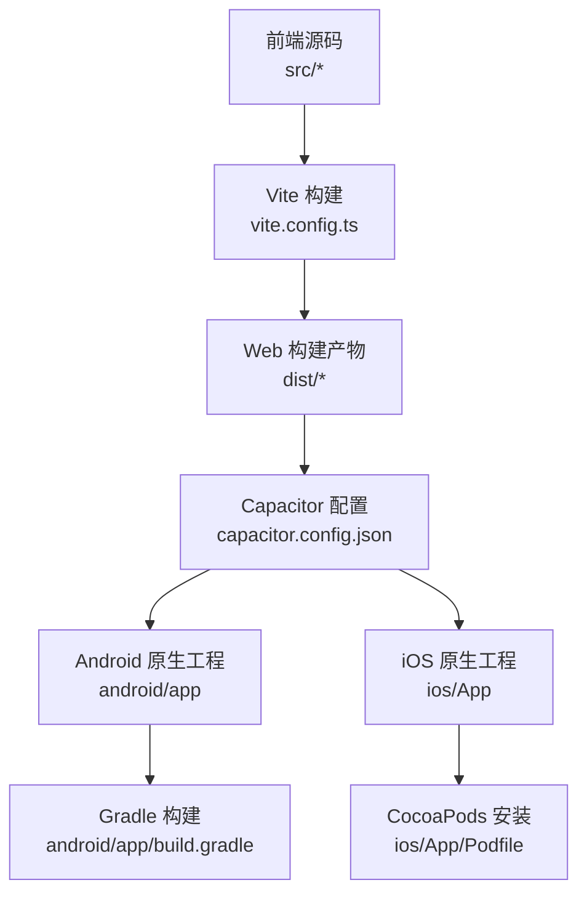
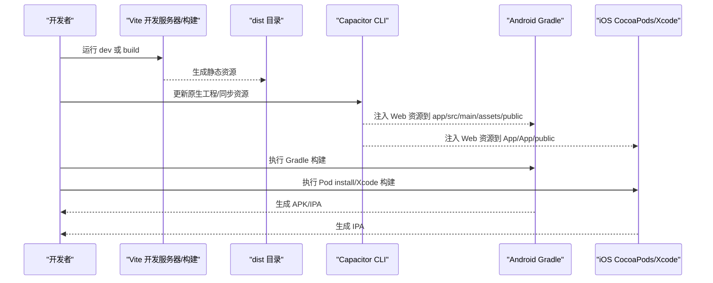
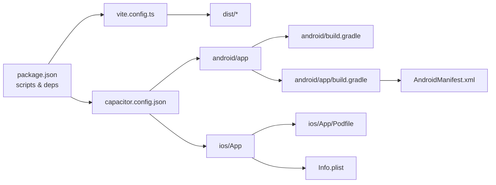

# 跨平台构建流程

<cite>
**本文引用的文件**
- [capacitor.config.json](file://capacitor.config.json)
- [vite.config.ts](file://vite.config.ts)
- [package.json](file://package.json)
- [android/app/src/main/AndroidManifest.xml](file://android/app/src/main/AndroidManifest.xml)
- [ios/App/App/Info.plist](file://ios/App/App/Info.plist)
- [android/build.gradle](file://android/build.gradle)
- [ios/App/Podfile](file://ios/App/Podfile)
- [android/app/build.gradle](file://android/app/build.gradle)
- [android/variables.gradle](file://android/variables.gradle)
- [android/capacitor.settings.gradle](file://android/capacitor.settings.gradle)
- [android/app/capacitor.build.gradle](file://android/app/capacitor.build.gradle)
- [README.md](file://README.md)
</cite>

## 目录
1. [简介](#简介)
2. [项目结构](#项目结构)
3. [核心组件](#核心组件)
4. [架构总览](#架构总览)
5. [详细组件分析](#详细组件分析)
6. [依赖关系分析](#依赖关系分析)
7. [性能考量](#性能考量)
8. [故障排查指南](#故障排查指南)
9. [结论](#结论)
10. [附录](#附录)

## 简介
本文件面向跨平台前端工程（基于 Capacitor + Vite + React），系统化梳理从源码到 Web 构建产物，再到 Android/iOS 原生工程的完整构建流程与配置要点。重点覆盖：
- Capacitor 配置项：应用标识、名称、版本号与平台插件配置
- Vite 构建配置：路径别名、依赖预打包与开发服务器行为
- 构建脚本与执行：Web 资源打包、原生项目生成与平台特定优化
- 版本管理与发布策略：版本号同步、变更日志与发布流程
- 构建环境与 CI/CD 集成：环境变量、缓存与流水线建议
- 构建优化技巧与常见问题定位

## 项目结构
该工程采用“前端源码 + Capacitor 原生桥接”的混合架构：
- 前端层：React + Vite，产物输出至 dist 目录
- 原生层：Android 使用 Gradle 构建，iOS 使用 CocoaPods；通过 Capacitor 将 Web 资源注入原生工程
- 配置层：Capacitor 配置文件统一管理应用元信息与插件；各平台独立的构建脚本与清单文件

图表来源
- [vite.config.ts:1-44](file://vite.config.ts#L1-L44)
- [capacitor.config.json:1-31](file://capacitor.config.json#L1-L31)
- [android/app/build.gradle:1-72](file://android/app/build.gradle#L1-L72)
- [ios/App/Podfile:1-26](file://ios/App/Podfile#L1-L26)

章节来源
- [vite.config.ts:1-44](file://vite.config.ts#L1-L44)
- [capacitor.config.json:1-31](file://capacitor.config.json#L1-L31)
- [android/app/build.gradle:1-72](file://android/app/build.gradle#L1-L72)
- [ios/App/Podfile:1-26](file://ios/App/Podfile#L1-L26)

## 核心组件
- Capacitor 应用配置
  - 应用标识与名称：用于包名与应用显示名
  - Web 目录：指向 Vite 输出目录
  - 服务器参数：Android 清色流量与明文访问
  - 插件：状态栏、键盘、启动页等平台特性
- Vite 构建配置
  - 插件：React、TailwindCSS
  - 路径别名：@ 指向 src
  - 依赖去重与预打包：确保 motion、tiptap 等生态稳定
  - 静态资源包含：SVG、CSV
- 平台构建脚本
  - Android：Gradle 多模块、签名配置、版本号与输出命名
  - iOS：CocoaPods 集成 Capacitor 与插件，Info.plist 版本字段
- 包管理与脚本
  - npm scripts：dev、build
  - 依赖与 overrides：锁定 Vite、React 生态版本

章节来源
- [capacitor.config.json:1-31](file://capacitor.config.json#L1-L31)
- [vite.config.ts:1-44](file://vite.config.ts#L1-L44)
- [package.json:1-113](file://package.json#L1-L113)
- [android/app/build.gradle:1-72](file://android/app/build.gradle#L1-L72)
- [ios/App/App/Info.plist:1-52](file://ios/App/App/Info.plist#L1-L52)

## 架构总览
下图展示从开发到原生打包的整体流程与关键节点：

图表来源
- [vite.config.ts:1-44](file://vite.config.ts#L1-L44)
- [capacitor.config.json:1-31](file://capacitor.config.json#L1-L31)
- [android/app/build.gradle:1-72](file://android/app/build.gradle#L1-L72)
- [ios/App/Podfile:1-26](file://ios/App/Podfile#L1-L26)

## 详细组件分析

### Capacitor 配置详解
- 应用标识与名称
  - appId：用于 Android 包名与 iOS Bundle Identifier 的基础
  - appName：应用在设备上的显示名称
- Web 目录与服务器
  - webDir：指向 Vite 输出目录，确保 Capacitor 同步时读取最新产物
  - server：androidScheme 与 cleartext 控制本地开发网络访问
- 插件配置
  - StatusBar：样式、背景色、是否覆盖 WebView
  - Keyboard：缩放模式、样式、全屏时行为
  - SplashScreen：启动时长、自动隐藏、背景色、全屏沉浸式等

章节来源
- [capacitor.config.json:1-31](file://capacitor.config.json#L1-L31)

### Vite 构建配置详解
- 插件链
  - @vitejs/plugin-react：React 支持
  - @tailwindcss/vite：TailwindCSS 支持
- 路径别名与依赖去重
  - alias：@ 指向 src，便于统一导入
  - dedupe：避免 motion、tiptap 等生态因 ESM/CJS 分割引入重复 React 实例
- 依赖预打包
  - optimizeDeps.include：集中预打包核心依赖，减少运行时拆分
- 静态资源
  - assetsInclude：显式包含 SVG、CSV 等资源类型

章节来源
- [vite.config.ts:1-44](file://vite.config.ts#L1-L44)

### Android 构建配置详解
- Gradle 根配置
  - 仓库源与插件：Google、Maven Central、AGP、Google Services
  - clean 任务：清理构建目录
- 子模块配置
  - namespace 与 applicationId：保持一致
  - SDK 版本：通过 variables.gradle 统一管理
  - 忽略资源规则：优化打包体积
- 签名与构建类型
  - release 签名：keystore 文件、密码、别名
  - 输出命名：固定 APK 名称，便于归档
- 依赖与仓库
  - 本地 libs 与 Capacitor 插件依赖
  - google-services 插件按需启用

章节来源
- [android/build.gradle:1-30](file://android/build.gradle#L1-L30)
- [android/variables.gradle:1-16](file://android/variables.gradle#L1-L16)
- [android/app/build.gradle:1-72](file://android/app/build.gradle#L1-L72)

### iOS 构建配置详解
- Podfile
  - 平台版本与框架模式
  - 安装选项：禁用输入输出路径缓存以避免 Xcode 缓存问题
  - Capacitor 与插件：Capacitor、CapacitorCordova、CapacitorKeyboard、speech-recognition
  - 安装后断言部署目标
- Info.plist
  - 显示名称、Bundle Identifier、版本号与营销版本
  - 设备能力、方向支持、状态栏外观

章节来源
- [ios/App/Podfile:1-26](file://ios/App/Podfile#L1-L26)
- [ios/App/App/Info.plist:1-52](file://ios/App/App/Info.plist#L1-L52)

### 平台特定清单与权限
- AndroidManifest
  - 应用图标、主题、Activity 配置、FileProvider
  - 权限：INTERNET、RECORD_AUDIO
  - 明文流量开关：usesCleartextTraffic
- iOS Info.plist
  - 显示名称、Bundle Identifier、版本号
  - 麦克风使用说明（隐私描述）

章节来源
- [android/app/src/main/AndroidManifest.xml:1-39](file://android/app/src/main/AndroidManifest.xml#L1-L39)
- [ios/App/App/Info.plist:1-52](file://ios/App/App/Info.plist#L1-L52)

### 构建脚本与执行流程
- npm 脚本
  - dev：启动 Vite 开发服务器
  - build：执行 Vite 构建，输出至 dist
- Capacitor 同步
  - 在修改 Capacitor 配置或新增插件后，运行更新命令以生成/同步原生工程资源
  - Android：Capacitor 将 Web 资源注入 app/src/main/assets/public
  - iOS：Capacitor 将 Web 资源注入 App/App/public
- 平台构建
  - Android：Gradle assembleRelease 或安装调试变体
  - iOS：CocoaPods 安装后在 Xcode 中构建

章节来源
- [package.json:6-9](file://package.json#L6-L9)
- [capacitor.config.json:1-31](file://capacitor.config.json#L1-L31)
- [README.md:1-41](file://README.md#L1-L41)

### 版本管理与发布策略
- 版本号来源与同步
  - Android：versionCode（整数）、versionName（字符串）
  - iOS：CFBundleVersion、CFBundleShortVersionString
  - 建议：统一由单一来源（如 package.json 的 version）驱动，构建脚本中替换对应字段
- 变更日志
  - 建议在仓库根目录维护 CHANGELOG.md，记录每次发布的主要变更
- 发布流程
  - 前端构建：vite build
  - 原生同步：capacitor sync/update
  - 平台构建：Android APK/iOS IPA
  - 归档与分发：上传至应用商店或内测平台

章节来源
- [package.json:4](file://package.json#L4)
- [android/app/build.gradle:10-11](file://android/app/build.gradle#L10-L11)
- [ios/App/App/Info.plist:21-24](file://ios/App/App/Info.plist#L21-L24)

### 构建环境与 CI/CD 集成
- 环境准备
  - Node.js 与包管理器（建议 pnpm，已通过 overrides 锁定版本）
  - Android Studio + JDK 17（Gradle 指定）
  - Xcode + CocoaPods
- 缓存与加速
  - 缓存 node_modules 与 Gradle 用户目录
  - Vite 构建缓存位于 .vite（可按需缓存）
- 流水线建议
  - 步骤：安装依赖 → 前端构建 → 原生依赖安装 → 平台构建 → 产物归档
  - 安全：密钥与证书通过受保护变量注入

章节来源
- [package.json:105-111](file://package.json#L105-L111)
- [android/app/capacitor.build.gradle:4-7](file://android/app/capacitor.build.gradle#L4-L7)

## 依赖关系分析

图表来源
- [package.json:6-9](file://package.json#L6-L9)
- [vite.config.ts:1-44](file://vite.config.ts#L1-L44)
- [capacitor.config.json:1-31](file://capacitor.config.json#L1-L31)
- [android/app/build.gradle:1-72](file://android/app/build.gradle#L1-L72)
- [ios/App/Podfile:1-26](file://ios/App/Podfile#L1-L26)
- [android/app/src/main/AndroidManifest.xml:1-39](file://android/app/src/main/AndroidManifest.xml#L1-L39)
- [ios/App/App/Info.plist:1-52](file://ios/App/App/Info.plist#L1-L52)

章节来源
- [package.json:1-113](file://package.json#L1-L113)
- [vite.config.ts:1-44](file://vite.config.ts#L1-L44)
- [capacitor.config.json:1-31](file://capacitor.config.json#L1-L31)
- [android/app/build.gradle:1-72](file://android/app/build.gradle#L1-L72)
- [ios/App/Podfile:1-26](file://ios/App/Podfile#L1-L26)

## 性能考量
- 依赖去重与预打包
  - 通过 dedupe 与 optimizeDeps.include 减少重复 React 实例与拆分包
- 资源包含
  - 显式声明 SVG、CSV 等资源类型，避免运行时动态解析开销
- Android 构建优化
  - 关闭无用混淆与压缩（release 中示例未启用混淆），减少构建时间
  - 固定输出命名，便于缓存与归档
- iOS 构建优化
  - CocoaPods 安装后断言部署目标，避免后续 Xcode 编译失败
- 开发体验
  - Vite dev server 提供快速热更新与按需编译

章节来源
- [vite.config.ts:11-44](file://vite.config.ts#L11-L44)
- [android/app/build.gradle:30-41](file://android/app/build.gradle#L30-L41)
- [ios/App/Podfile:23-25](file://ios/App/Podfile#L23-L25)

## 故障排查指南
- Capacitor 同步后资源未更新
  - 确认 Capacitor 配置中的 webDir 与实际 dist 目录一致
  - 重新执行 Capacitor 同步命令
- Android 无法加载明文 HTTP
  - 检查 AndroidManifest 的 usesCleartextTraffic 与 Capacitor server 配置
- iOS 构建报 Pod 缓存问题
  - 使用禁用缓存的安装选项，清理 DerivedData 后重试
- 依赖冲突（React Hook 报错）
  - 确保 dedupe 列表包含所有相关包，避免多实例
- 版本号不一致
  - 统一由单一来源（如 package.json）驱动，构建脚本中替换 Android/iOS 对应字段

章节来源
- [capacitor.config.json:5-8](file://capacitor.config.json#L5-L8)
- [android/app/src/main/AndroidManifest.xml:9](file://android/app/src/main/AndroidManifest.xml#L9)
- [ios/App/Podfile:9](file://ios/App/Podfile#L9)
- [vite.config.ts:14-21](file://vite.config.ts#L14-L21)
- [package.json:4](file://package.json#L4)

## 结论
本项目通过清晰的配置分层（Vite、Capacitor、Android/iOS）实现了高效的跨平台构建与发布。遵循本文的版本管理策略、构建优化建议与故障排查步骤，可在保证质量的同时提升迭代效率。

## 附录
- 开发与构建常用命令
  - 安装依赖：参考 README 中的安装说明
  - 启动开发服务器：npm run dev
  - 生成生产包：npm run build
  - 同步原生工程：Capacitor 同步命令（见 README）
- 参考文件
  - README.md：项目说明与运行方式
  - Guidelines.md：设计与开发规范（可扩展为团队规范）

章节来源
- [README.md:1-41](file://README.md#L1-L41)
- [guidelines/Guidelines.md:1-62](file://guidelines/Guidelines.md#L1-L62)