# 笔记CRUD操作

<cite>
**本文档引用的文件**
- [NoteContext.tsx](file://src/app/components/context/NoteContext.tsx)
- [api.ts](file://src/app/services/api.ts)
- [NoteCreate.tsx](file://src/app/pages/NoteCreate.tsx)
- [NoteList.tsx](file://src/app/pages/NoteList.tsx)
- [Inbox.tsx](file://src/app/pages/Inbox.tsx)
</cite>

## 目录
1. [简介](#简介)
2. [项目结构](#项目结构)
3. [核心组件](#核心组件)
4. [架构概览](#架构概览)
5. [详细组件分析](#详细组件分析)
6. [依赖关系分析](#依赖关系分析)
7. [性能考虑](#性能考虑)
8. [故障排除指南](#故障排除指南)
9. [结论](#结论)

## 简介

本文件详细说明了笔记应用中的CRUD操作实现，重点覆盖以下核心方法：

- addNote：创建新笔记
- deleteNote：删除笔记
- updateNote：更新笔记
- refreshNotes：刷新笔记列表

同时深入解释了以下关键技术点：

- 乐观更新策略与实现
- 错误处理机制
- 异步操作流程
- 本地ID生成与识别
- 内容验证、标签处理与类型推断
- 字段选择性更新与状态同步
- 本地与远程同步处理

## 项目结构

该笔记应用采用React + TypeScript构建，核心逻辑集中在上下文组件中，通过自定义Hook提供全局状态管理。

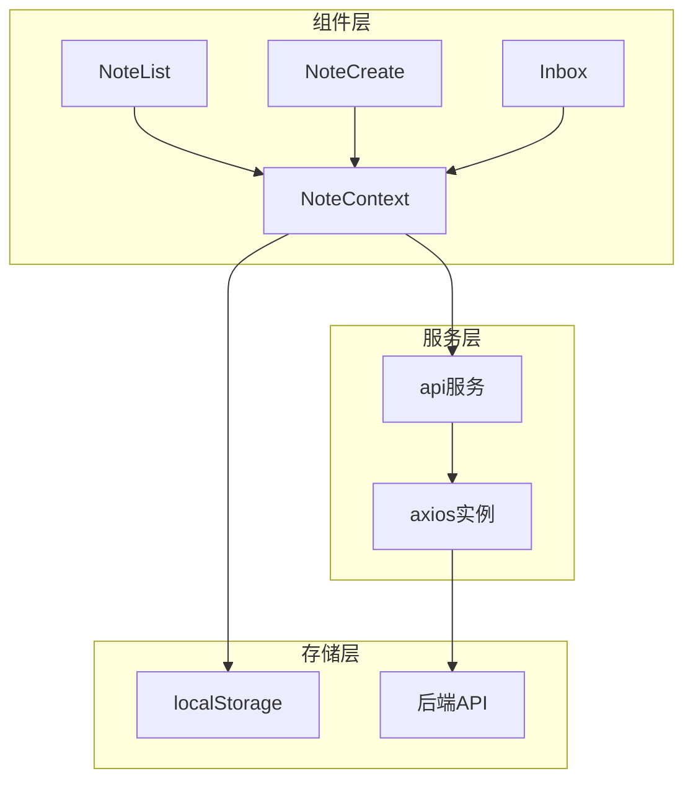

**图表来源**
- [NoteContext.tsx:1-356](file://src/app/components/context/NoteContext.tsx#L1-L356)
- [api.ts:1-127](file://src/app/services/api.ts#L1-L127)

**章节来源**
- [NoteContext.tsx:1-356](file://src/app/components/context/NoteContext.tsx#L1-L356)
- [api.ts:1-127](file://src/app/services/api.ts#L1-L127)

## 核心组件

### NoteContext 组件

NoteContext是整个笔记功能的核心，负责：
- 管理笔记状态（notes、loading、error）
- 提供CRUD操作方法
- 处理本地与远程同步
- 实现内容规范化处理

主要数据结构定义：

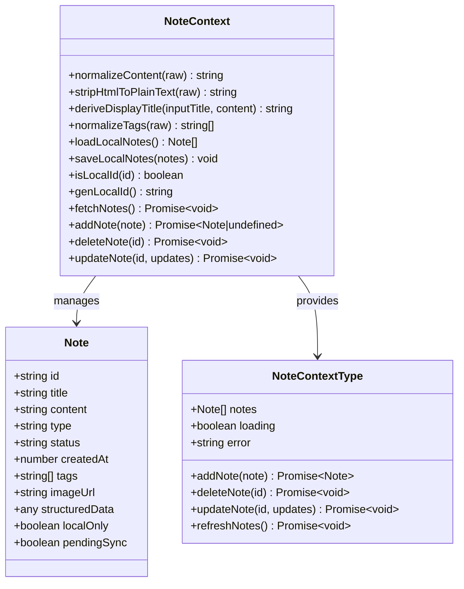

**图表来源**
- [NoteContext.tsx:4-26](file://src/app/components/context/NoteContext.tsx#L4-L26)
- [NoteContext.tsx:89-347](file://src/app/components/context/NoteContext.tsx#L89-L347)

**章节来源**
- [NoteContext.tsx:4-26](file://src/app/components/context/NoteContext.tsx#L4-L26)
- [NoteContext.tsx:89-347](file://src/app/components/context/NoteContext.tsx#L89-L347)

## 架构概览

应用采用分层架构设计，实现了本地优先的离线能力与云端同步机制。

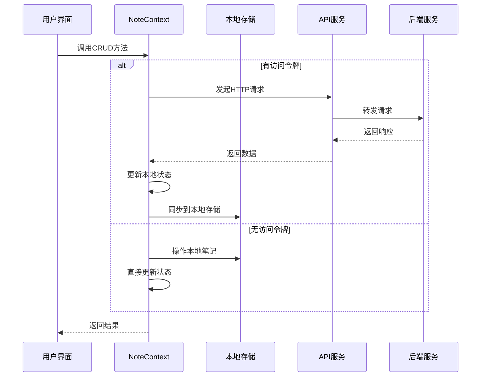

**图表来源**
- [NoteContext.tsx:224-272](file://src/app/components/context/NoteContext.tsx#L224-L272)
- [NoteContext.tsx:274-288](file://src/app/components/context/NoteContext.tsx#L274-L288)
- [NoteContext.tsx:290-340](file://src/app/components/context/NoteContext.tsx#L290-L340)

## 详细组件分析

### addNote 方法实现

addNote负责创建新笔记，实现了完整的验证、规范化和同步流程。

#### 核心流程

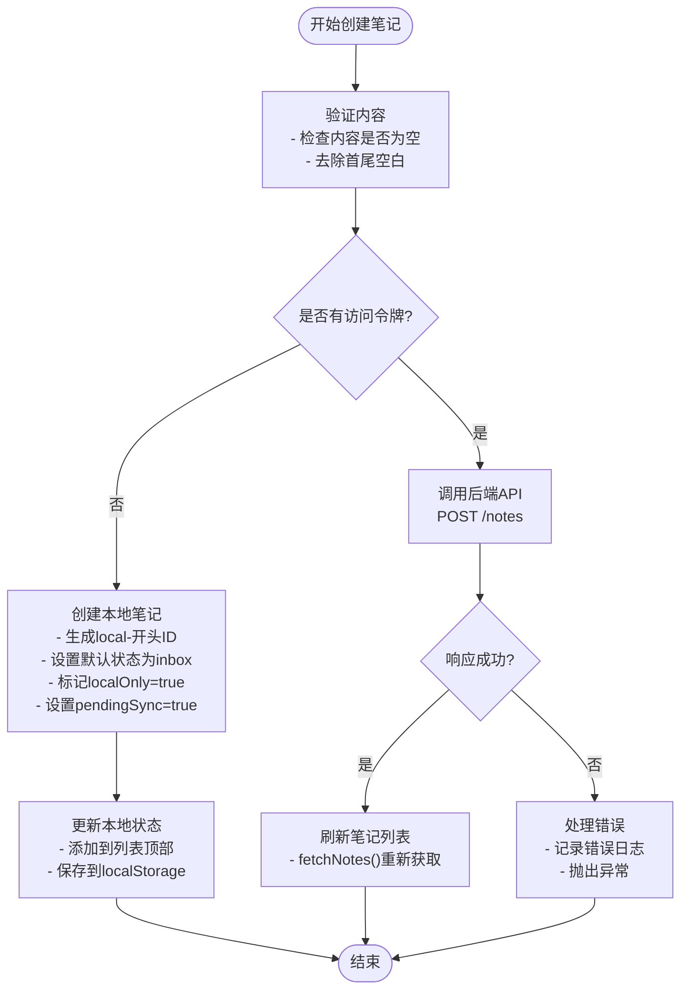

#### 关键实现细节

1. **内容验证**：确保笔记内容不为空，自动去除首尾空白字符
2. **本地ID生成**：使用`genLocalId()`生成以"local-"开头的唯一ID
3. **状态设置**：本地笔记标记`localOnly: true`和`pendingSync: true`
4. **类型推断**：根据内容类型自动推断笔记类型（text/image/mixed）

**图表来源**
- [NoteContext.tsx:224-272](file://src/app/components/context/NoteContext.tsx#L224-L272)
- [NoteContext.tsx:150](file://src/app/components/context/NoteContext.tsx#L150)
- [NoteContext.tsx:233-249](file://src/app/components/context/NoteContext.tsx#L233-L249)

**章节来源**
- [NoteContext.tsx:224-272](file://src/app/components/context/NoteContext.tsx#L224-L272)
- [NoteContext.tsx:150](file://src/app/components/context/NoteContext.tsx#L150)

### deleteNote 方法实现

deleteNote实现了本地和远程两种删除模式的统一处理。

#### 删除流程

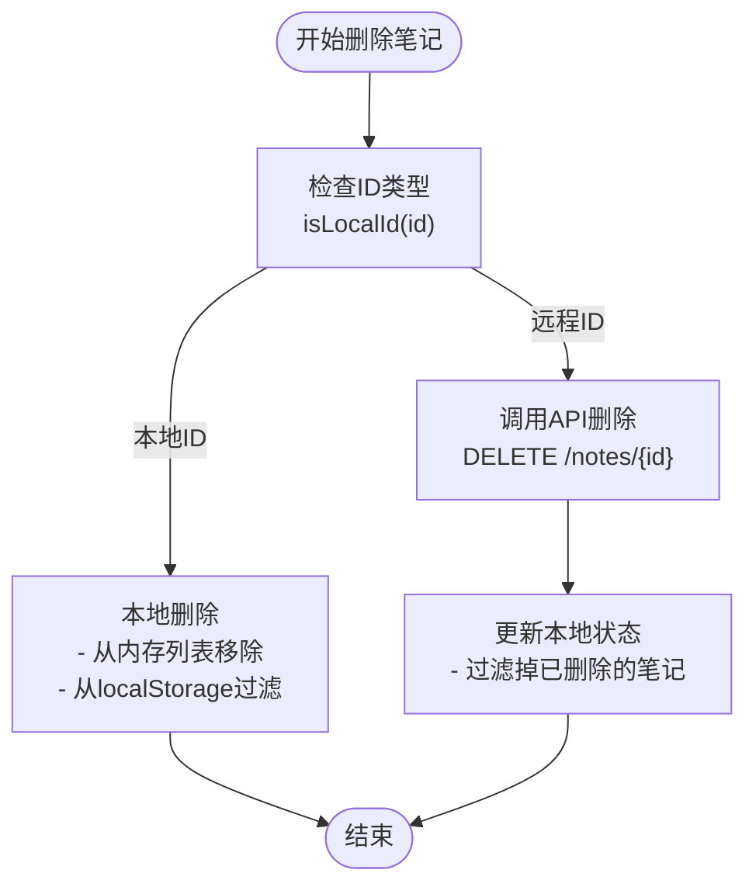

#### 特殊处理

- **本地ID识别**：通过`isLocalId()`方法判断是否为本地生成的ID
- **即时反馈**：本地删除立即反映在UI上，无需等待网络响应
- **一致性保证**：远程删除成功后同步更新本地状态

**图表来源**
- [NoteContext.tsx:274-288](file://src/app/components/context/NoteContext.tsx#L274-L288)
- [NoteContext.tsx:148](file://src/app/components/context/NoteContext.tsx#L148)

**章节来源**
- [NoteContext.tsx:274-288](file://src/app/components/context/NoteContext.tsx#L274-L288)
- [NoteContext.tsx:148](file://src/app/components/context/NoteContext.tsx#L148)

### updateNote 方法实现

updateNote支持字段选择性更新和本地/远程同步。

#### 更新策略

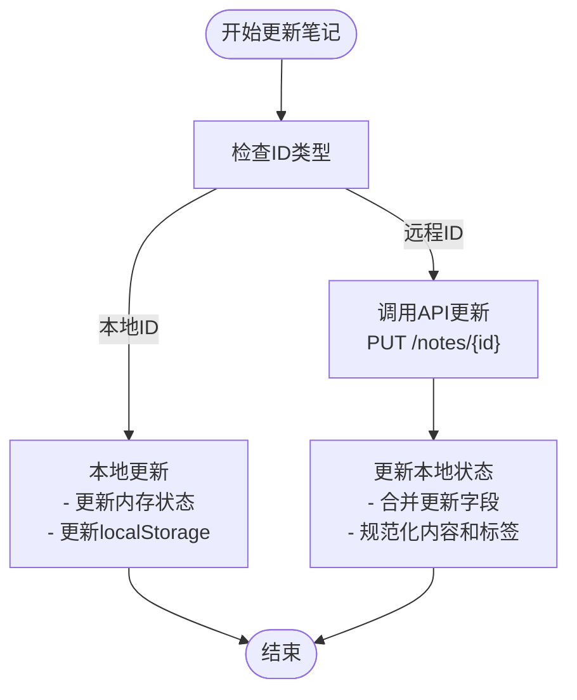

#### 字段选择性更新

- **内容更新**：仅当提供content时才更新
- **标签更新**：支持部分标签更新，使用`normalizeTags()`进行规范化
- **状态更新**：支持状态字段的增量更新

**图表来源**
- [NoteContext.tsx:290-340](file://src/app/components/context/NoteContext.tsx#L290-L340)
- [NoteContext.tsx:317-321](file://src/app/components/context/NoteContext.tsx#L317-L321)

**章节来源**
- [NoteContext.tsx:290-340](file://src/app/components/context/NoteContext.tsx#L290-L340)

### refreshNotes 方法实现

refreshNotes负责刷新笔记列表，实现本地与远程数据的合并同步。

#### 刷新流程

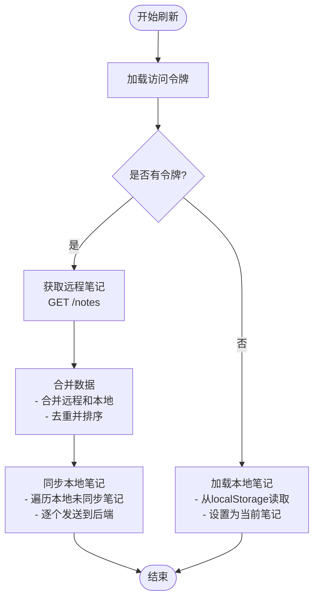

#### 同步机制

- **数据合并**：将远程和本地笔记合并，保持最新数据优先
- **自动同步**：检测到本地未同步笔记时自动尝试同步
- **状态维护**：保持`pendingSync`状态直到同步完成

**图表来源**
- [NoteContext.tsx:152-218](file://src/app/components/context/NoteContext.tsx#L152-L218)
- [NoteContext.tsx:191-210](file://src/app/components/context/NoteContext.tsx#L191-L210)

**章节来源**
- [NoteContext.tsx:152-218](file://src/app/components/context/NoteContext.tsx#L152-L218)

### 本地ID生成与识别

#### ID生成机制

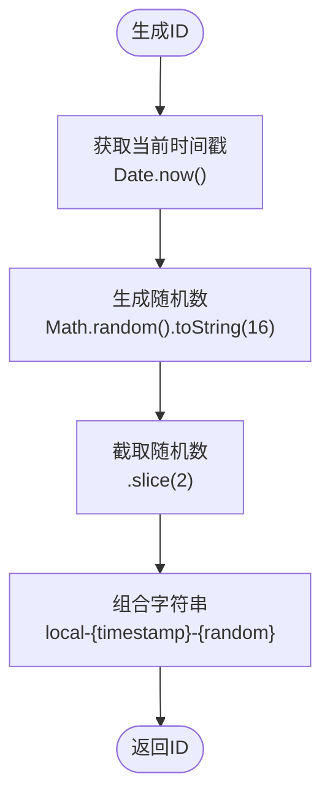

#### ID识别逻辑

- **格式约定**：所有本地ID都以"local-"开头
- **快速判断**：使用`startsWith('local-')`进行高效识别
- **兼容性**：确保与远程ID完全区分，避免冲突

**图表来源**
- [NoteContext.tsx:150](file://src/app/components/context/NoteContext.tsx#L150)
- [NoteContext.tsx:148](file://src/app/components/context/NoteContext.tsx#L148)

**章节来源**
- [NoteContext.tsx:150](file://src/app/components/context/NoteContext.tsx#L150)
- [NoteContext.tsx:148](file://src/app/components/context/NoteContext.tsx#L148)

### 内容验证、标签处理与类型推断

#### 内容规范化

- **空值处理**：null/undefined转换为空字符串
- **类型转换**：非字符串类型转换为字符串
- **HTML清理**：移除样式和脚本标签，保留纯文本

#### 标签处理

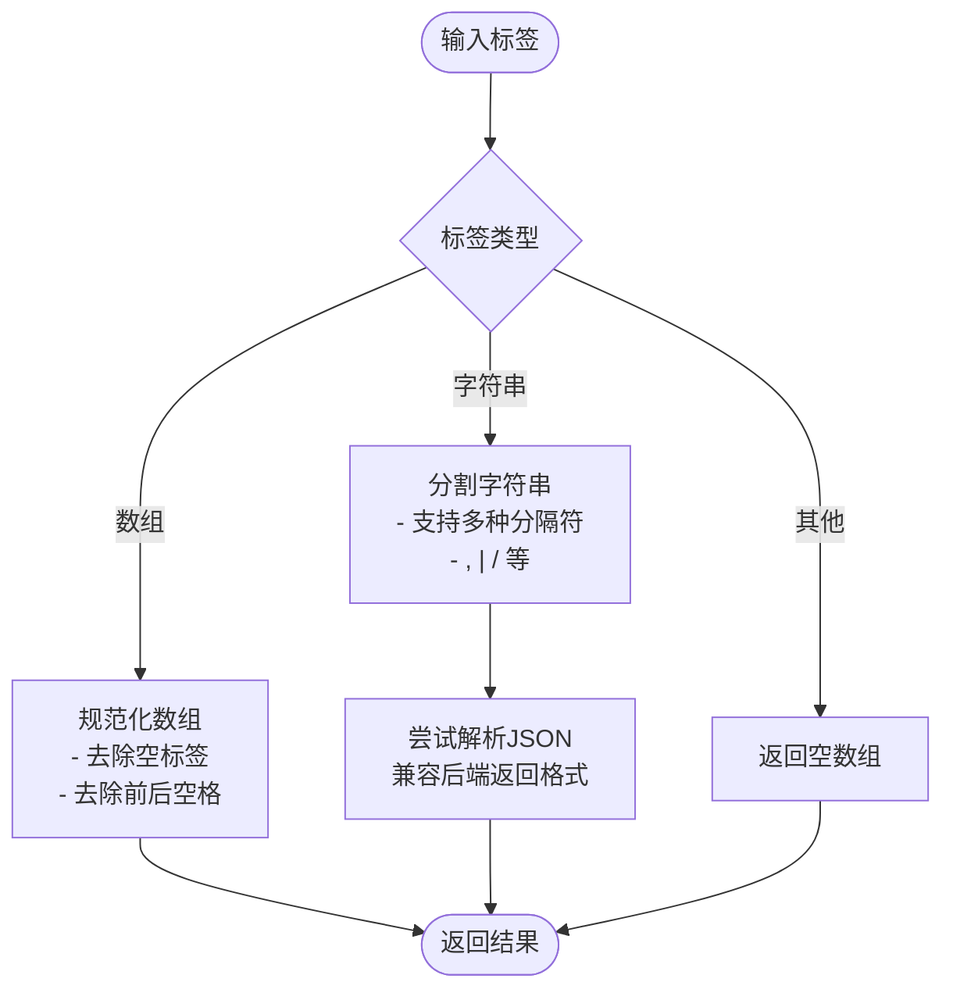

#### 类型推断

- **附件检测**：检查是否有图像附件
- **混合内容**：同时包含文本和图像时标记为mixed
- **默认类型**：无附件时默认为text类型

**图表来源**
- [NoteContext.tsx:30-50](file://src/app/components/context/NoteContext.tsx#L30-L50)
- [NoteContext.tsx:59-87](file://src/app/components/context/NoteContext.tsx#L59-L87)
- [NoteContext.tsx:176-179](file://src/app/components/context/NoteContext.tsx#L176-L179)

**章节来源**
- [NoteContext.tsx:30-50](file://src/app/components/context/NoteContext.tsx#L30-L50)
- [NoteContext.tsx:59-87](file://src/app/components/context/NoteContext.tsx#L59-L87)
- [NoteContext.tsx:176-179](file://src/app/components/context/NoteContext.tsx#L176-L179)

## 依赖关系分析

### 组件间依赖

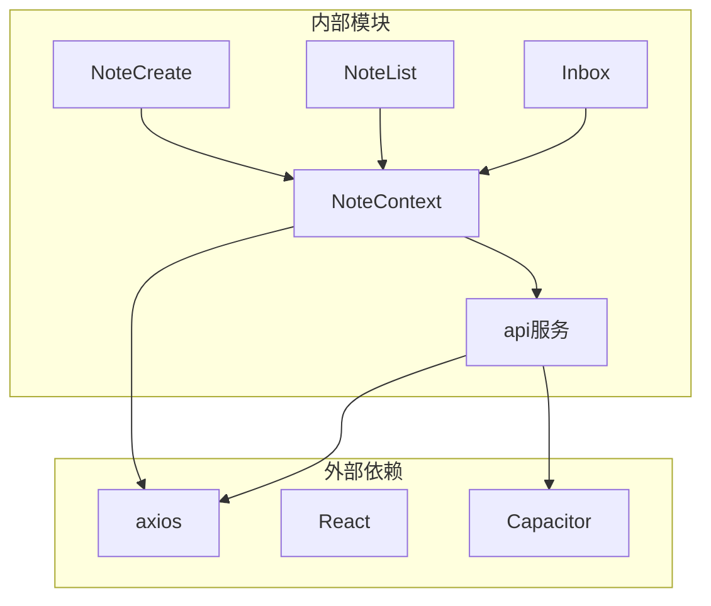

### 数据流依赖

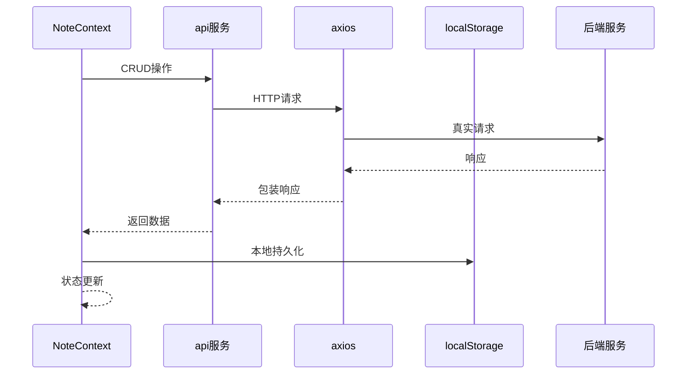

**图表来源**
- [NoteContext.tsx:1-3](file://src/app/components/context/NoteContext.tsx#L1-L3)
- [api.ts:1-127](file://src/app/services/api.ts#L1-L127)

**章节来源**
- [NoteContext.tsx:1-3](file://src/app/components/context/NoteContext.tsx#L1-L3)
- [api.ts:1-127](file://src/app/services/api.ts#L1-L127)

## 性能考虑

### 优化策略

1. **本地优先**：无令牌时直接操作本地存储，减少网络延迟
2. **批量同步**：本地笔记同步时采用顺序处理，避免并发冲突
3. **状态缓存**：使用内存状态减少重复计算
4. **懒加载**：笔记列表按需加载，支持无限滚动

### 内存管理

- **状态清理**：组件卸载时自动清理定时器和事件监听器
- **引用优化**：使用useMemo和useCallback避免不必要的重渲染
- **数据压缩**：本地存储只保存必要字段，减少存储空间占用

## 故障排除指南

### 常见错误类型

#### 网络错误

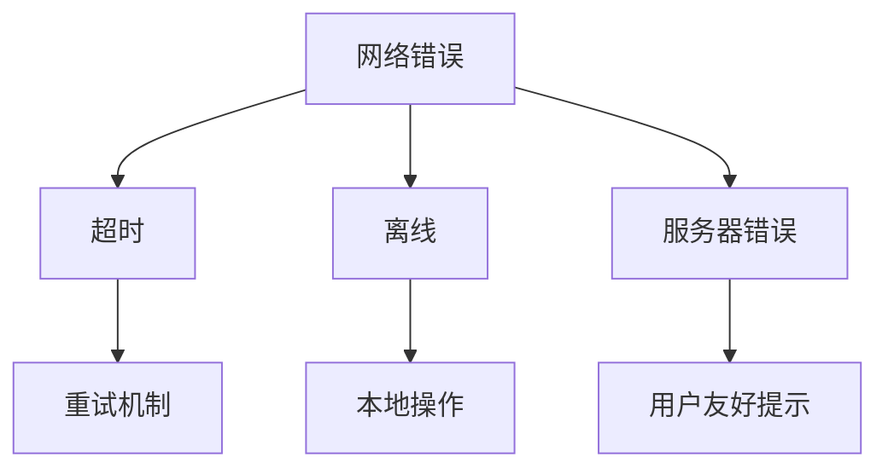

#### 数据错误

- **内容为空**：创建笔记时必须包含有效内容
- **ID冲突**：确保本地ID与远程ID不会冲突
- **格式错误**：标签格式必须符合规范

#### 处理策略

1. **错误捕获**：所有异步操作都包含try-catch块
2. **用户反馈**：通过toast等方式向用户显示错误信息
3. **降级处理**：网络失败时自动切换到本地模式
4. **重试机制**：关键操作支持有限次数的自动重试

**章节来源**
- [NoteContext.tsx:264-271](file://src/app/components/context/NoteContext.tsx#L264-L271)
- [api.ts:108-126](file://src/app/services/api.ts#L108-L126)

## 结论

该笔记应用的CRUD实现展现了现代前端应用的最佳实践：

1. **完整的离线支持**：通过本地ID生成和localStorage实现完全离线可用
2. **优雅的降级机制**：网络异常时自动切换到本地模式
3. **一致的状态管理**：统一的CRUD接口和状态同步机制
4. **健壮的错误处理**：完善的错误捕获和用户反馈系统
5. **可扩展的架构**：清晰的分层设计便于功能扩展

通过这些设计，应用能够在各种网络环境下提供稳定可靠的笔记管理体验，同时保持良好的性能和用户体验。