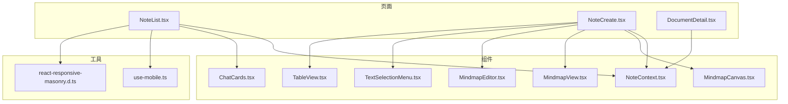
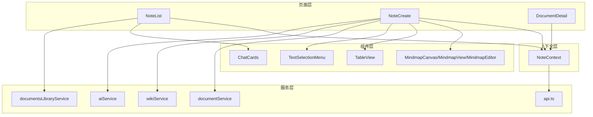
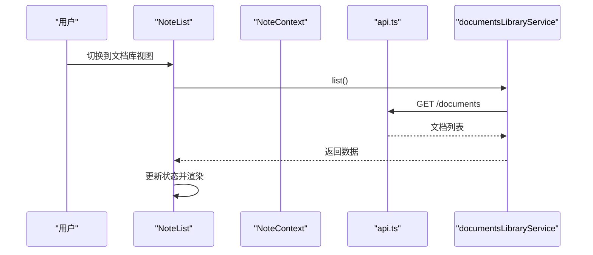
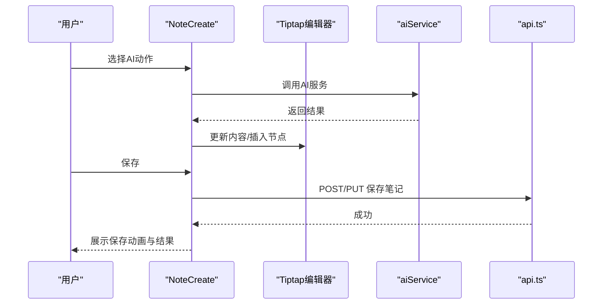
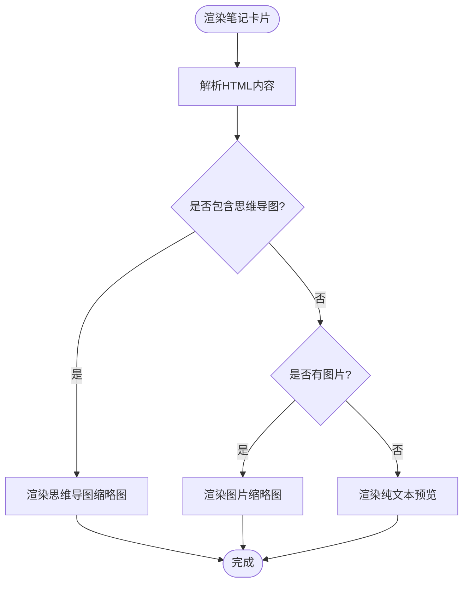
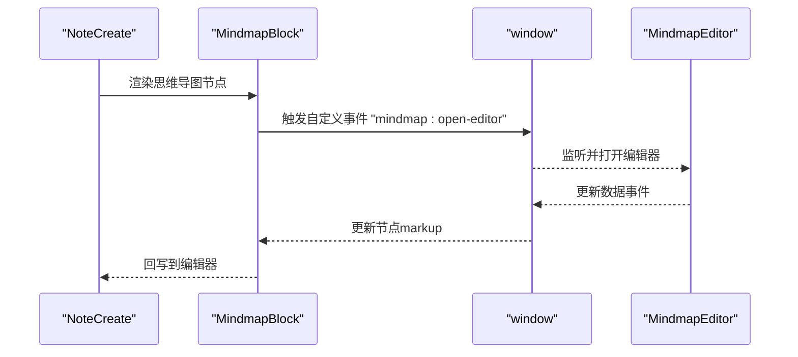
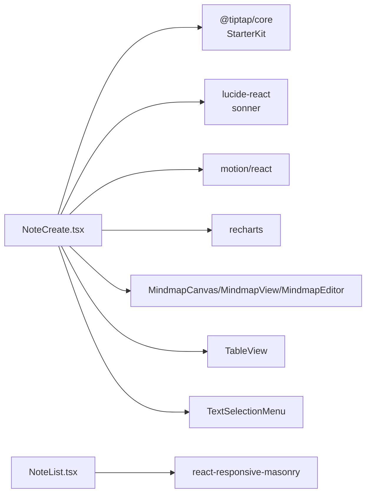

# 笔记UI组件

<cite>
**本文档引用的文件**
- [NoteList.tsx](file://src/app/pages/NoteList.tsx)
- [NoteCreate.tsx](file://src/app/pages/NoteCreate.tsx)
- [NoteContext.tsx](file://src/app/components/context/NoteContext.tsx)
- [DocumentDetail.tsx](file://src/app/pages/DocumentDetail.tsx)
- [MindmapCanvas.tsx](file://src/app/components/MindmapCanvas.tsx)
- [MindmapView.tsx](file://src/app/components/MindmapView.tsx)
- [MindmapEditor.tsx](file://src/app/components/MindmapEditor.tsx)
- [TextSelectionMenu.tsx](file://src/app/components/TextSelectionMenu.tsx)
- [TableView.tsx](file://src/app/components/TableView.tsx)
- [ChatCards.tsx](file://src/app/components/ChatCards.tsx)
- [use-mobile.ts](file://src/app/components/ui/use-mobile.ts)
- [react-responsive-masonry.d.ts](file://src/types/react-responsive-masonry.d.ts)
</cite>

## 目录
1. [简介](#简介)
2. [项目结构](#项目结构)
3. [核心组件](#核心组件)
4. [架构总览](#架构总览)
5. [详细组件分析](#详细组件分析)
6. [依赖关系分析](#依赖关系分析)
7. [性能考虑](#性能考虑)
8. [故障排除指南](#故障排除指南)
9. [结论](#结论)
10. [附录](#附录)

## 简介
本技术文档聚焦于笔记UI组件体系，系统性阐述以下能力与实现细节：
- 笔记列表组件 NoteList：虚拟滚动、无限加载、响应式布局与交互
- 笔记创建表单 NoteCreate：富文本编辑器集成、标签输入与预览、AI辅助与多媒体处理
- 笔记卡片组件展示逻辑：缩略图生成、内容截取与状态指示
- 批量操作：全选、批量删除与状态变更
- 笔记详情页面渲染与交互
- 组件间通信机制、状态传递与事件处理
- 可复用性与可定制性最佳实践

## 项目结构
本项目采用按页面与组件分层组织的结构，笔记相关功能主要分布在 pages 与 components 两个目录中：
- 页面组件：NoteList、NoteCreate、DocumentDetail 等
- 组件库：上下文、UI基础组件、思维导图组件等
- 类型声明：第三方库类型补充

**图表来源**
- [NoteList.tsx](file://src/app/pages/NoteList.tsx)
- [NoteCreate.tsx](file://src/app/pages/NoteCreate.tsx)
- [NoteContext.tsx](file://src/app/components/context/NoteContext.tsx)
- [DocumentDetail.tsx](file://src/app/pages/DocumentDetail.tsx)
- [MindmapCanvas.tsx](file://src/app/components/MindmapCanvas.tsx)
- [MindmapView.tsx](file://src/app/components/MindmapView.tsx)
- [MindmapEditor.tsx](file://src/app/components/MindmapEditor.tsx)
- [TextSelectionMenu.tsx](file://src/app/components/TextSelectionMenu.tsx)
- [TableView.tsx](file://src/app/components/TableView.tsx)
- [ChatCards.tsx](file://src/app/components/ChatCards.tsx)
- [use-mobile.ts](file://src/app/components/ui/use-mobile.ts)
- [react-responsive-masonry.d.ts](file://src/types/react-responsive-masonry.d.ts)

**章节来源**
- [NoteList.tsx](file://src/app/pages/NoteList.tsx)
- [NoteCreate.tsx](file://src/app/pages/NoteCreate.tsx)
- [NoteContext.tsx](file://src/app/components/context/NoteContext.tsx)
- [DocumentDetail.tsx](file://src/app/pages/DocumentDetail.tsx)
- [MindmapCanvas.tsx](file://src/app/components/MindmapCanvas.tsx)
- [MindmapView.tsx](file://src/app/components/MindmapView.tsx)
- [MindmapEditor.tsx](file://src/app/components/MindmapEditor.tsx)
- [TextSelectionMenu.tsx](file://src/app/components/TextSelectionMenu.tsx)
- [TableView.tsx](file://src/app/components/TableView.tsx)
- [ChatCards.tsx](file://src/app/components/ChatCards.tsx)
- [use-mobile.ts](file://src/app/components/ui/use-mobile.ts)
- [react-responsive-masonry.d.ts](file://src/types/react-responsive-masonry.d.ts)

## 核心组件
- NoteList：笔记主界面，负责筛选、搜索、统计、文档库视图切换与上传、发布到社区等
- NoteCreate：笔记编辑页，集成富文本编辑器、AI工具、标签管理、多媒体处理与保存流程
- NoteContext：笔记状态上下文，统一管理笔记的增删改查、本地持久化与云端同步
- DocumentDetail：文档详情页，支持编辑、AI摘要、删除确认等
- Mindmap系列：思维导图画布、视图与编辑器，配合富文本节点使用
- TableView：表格渲染组件
- ChatCards：聊天卡片组件（用于笔记卡片展示逻辑参考）

**章节来源**
- [NoteList.tsx](file://src/app/pages/NoteList.tsx)
- [NoteCreate.tsx](file://src/app/pages/NoteCreate.tsx)
- [NoteContext.tsx](file://src/app/components/context/NoteContext.tsx)
- [DocumentDetail.tsx](file://src/app/pages/DocumentDetail.tsx)
- [MindmapCanvas.tsx](file://src/app/components/MindmapCanvas.tsx)
- [MindmapView.tsx](file://src/app/components/MindmapView.tsx)
- [MindmapEditor.tsx](file://src/app/components/MindmapEditor.tsx)
- [TableView.tsx](file://src/app/components/TableView.tsx)
- [ChatCards.tsx](file://src/app/components/ChatCards.tsx)

## 架构总览
整体采用“页面组件 + 上下文 + 自定义组件”的分层架构：
- 页面组件负责路由与业务编排
- 上下文提供全局状态与数据源
- 自定义组件封装复杂交互与可视化

**图表来源**
- [NoteList.tsx](file://src/app/pages/NoteList.tsx)
- [NoteCreate.tsx](file://src/app/pages/NoteCreate.tsx)
- [NoteContext.tsx](file://src/app/components/context/NoteContext.tsx)
- [DocumentDetail.tsx](file://src/app/pages/DocumentDetail.tsx)
- [MindmapCanvas.tsx](file://src/app/components/MindmapCanvas.tsx)
- [MindmapView.tsx](file://src/app/components/MindmapView.tsx)
- [MindmapEditor.tsx](file://src/app/components/MindmapEditor.tsx)
- [TableView.tsx](file://src/app/components/TableView.tsx)
- [TextSelectionMenu.tsx](file://src/app/components/TextSelectionMenu.tsx)
- [ChatCards.tsx](file://src/app/components/ChatCards.tsx)

## 详细组件分析

### 笔记列表组件 NoteList
- 虚拟滚动与无限加载
  - 使用响应式瀑布流布局，结合滚动容器实现近似虚拟滚动效果
  - 文档库视图通过懒加载触发，首次进入或刷新时拉取文档列表
- 响应式布局
  - 使用移动端断点判断与响应式库，适配不同屏幕尺寸
- 搜索与筛选
  - 支持标题、正文、标签的全文检索；支持按类型与标签过滤
- 统计与今日清单
  - 计算笔记类型分布、标签频率、周活跃度；生成今日笔记列表
- 发布到社区
  - 预览笔记内容后发起发布请求

**图表来源**
- [NoteList.tsx](file://src/app/pages/NoteList.tsx)
- [NoteContext.tsx](file://src/app/components/context/NoteContext.tsx)

**章节来源**
- [NoteList.tsx](file://src/app/pages/NoteList.tsx)
- [NoteContext.tsx](file://src/app/components/context/NoteContext.tsx)
- [use-mobile.ts](file://src/app/components/ui/use-mobile.ts)
- [react-responsive-masonry.d.ts](file://src/types/react-responsive-masonry.d.ts)

### 笔记创建表单 NoteCreate
- 富文本编辑器集成
  - 基于 Tiptap 核心，自定义扩展：TagChip、TableBlock、MindmapBlock
  - 编辑器生命周期管理，避免重复初始化与钩子问题
- 标签输入与预览
  - 支持插入标签芯片节点，标签面板与编辑器互斥编辑
- AI辅助与多媒体处理
  - 图片识别、文档解析、AI扩写、校对、总结、思维导图生成
  - 处理上传失败的草稿清理
- 保存流程与动画反馈
  - 三阶段保存动画：本地保存、成功提示、知识图谱关联进度
- 思维导图编辑
  - 通过自定义节点桥接窗口事件打开编辑器，实时更新节点数据

**图表来源**
- [NoteCreate.tsx](file://src/app/pages/NoteCreate.tsx)
- [MindmapCanvas.tsx](file://src/app/components/MindmapCanvas.tsx)
- [MindmapView.tsx](file://src/app/components/MindmapView.tsx)
- [MindmapEditor.tsx](file://src/app/components/MindmapEditor.tsx)

**章节来源**
- [NoteCreate.tsx](file://src/app/pages/NoteCreate.tsx)
- [MindmapCanvas.tsx](file://src/app/components/MindmapCanvas.tsx)
- [MindmapView.tsx](file://src/app/components/MindmapView.tsx)
- [MindmapEditor.tsx](file://src/app/components/MindmapEditor.tsx)

### 笔记卡片组件展示逻辑
- 缩略图生成
  - 内联SVG生成思维导图缩略图，支持多分支节点与颜色主题
- 内容截取
  - 去除HTML标签后按标题存在与否动态限制行数，避免溢出
- 状态指示
  - AI徽章、时间戳、标签云、点击动效与过渡动画

**图表来源**
- [NoteList.tsx](file://src/app/pages/NoteList.tsx)

**章节来源**
- [NoteList.tsx](file://src/app/pages/NoteList.tsx)

### 批量操作功能
- 全选与批量删除
  - 在笔记列表中通过复选框实现全选与批量删除
- 状态变更
  - 结合上下文提供的更新接口，批量更新笔记状态字段

**章节来源**
- [NoteList.tsx](file://src/app/pages/NoteList.tsx)
- [NoteContext.tsx](file://src/app/components/context/NoteContext.tsx)

### 笔记详情页面渲染与交互
- 文档详情页
  - 支持编辑标题与内容、AI摘要生成、删除确认弹窗
  - JSON结构化摘要解析与展示
- 笔记详情页
  - 通过路由参数加载具体笔记，渲染富文本内容与结构化数据

**章节来源**
- [DocumentDetail.tsx](file://src/app/pages/DocumentDetail.tsx)
- [NoteCreate.tsx](file://src/app/pages/NoteCreate.tsx)

### 组件间通信机制、状态传递与事件处理
- 上下文通信
  - NoteContext 提供笔记的增删改查与刷新方法，页面组件通过 hooks 获取
- 自定义事件
  - 思维导图节点通过 window.CustomEvent 与编辑器通信，实现双向更新
- 路由与导航
  - 使用 React Router 导航至创建页、详情页与外部页面

**图表来源**
- [NoteCreate.tsx](file://src/app/pages/NoteCreate.tsx)
- [MindmapCanvas.tsx](file://src/app/components/MindmapCanvas.tsx)
- [MindmapView.tsx](file://src/app/components/MindmapView.tsx)
- [MindmapEditor.tsx](file://src/app/components/MindmapEditor.tsx)

**章节来源**
- [NoteCreate.tsx](file://src/app/pages/NoteCreate.tsx)
- [MindmapCanvas.tsx](file://src/app/components/MindmapCanvas.tsx)
- [MindmapView.tsx](file://src/app/components/MindmapView.tsx)
- [MindmapEditor.tsx](file://src/app/components/MindmapEditor.tsx)

## 依赖关系分析
- 第三方库
  - 富文本：@tiptap/core、StarterKit、Placeholder、Image
  - 可视化：react-responsive-masonry、motion/react、recharts
  - UI：lucide-react、sonner
- 自定义组件
  - MindmapCanvas、MindmapView、MindmapEditor、TableView、TextSelectionMenu
- 类型与工具
  - 移动端断点检测、第三方类型声明

**图表来源**
- [NoteList.tsx](file://src/app/pages/NoteList.tsx)
- [NoteCreate.tsx](file://src/app/pages/NoteCreate.tsx)
- [MindmapCanvas.tsx](file://src/app/components/MindmapCanvas.tsx)
- [MindmapView.tsx](file://src/app/components/MindmapView.tsx)
- [MindmapEditor.tsx](file://src/app/components/MindmapEditor.tsx)
- [TableView.tsx](file://src/app/components/TableView.tsx)
- [TextSelectionMenu.tsx](file://src/app/components/TextSelectionMenu.tsx)

**章节来源**
- [NoteList.tsx](file://src/app/pages/NoteList.tsx)
- [NoteCreate.tsx](file://src/app/pages/NoteCreate.tsx)
- [MindmapCanvas.tsx](file://src/app/components/MindmapCanvas.tsx)
- [MindmapView.tsx](file://src/app/components/MindmapView.tsx)
- [MindmapEditor.tsx](file://src/app/components/MindmapEditor.tsx)
- [TableView.tsx](file://src/app/components/TableView.tsx)
- [TextSelectionMenu.tsx](file://src/app/components/TextSelectionMenu.tsx)

## 性能考虑
- 虚拟滚动与渲染优化
  - 使用响应式瀑布流减少DOM节点数量，提升滚动性能
  - 对富文本内容进行节流与防抖处理，避免频繁重渲染
- 状态与计算缓存
  - 使用 useMemo 缓存过滤结果、统计信息与今日清单
- 本地持久化与离线体验
  - 本地草稿与延迟同步策略，降低网络依赖
- 动画与过渡
  - 使用轻量级动画库，避免阻塞主线程

## 故障排除指南
- 笔记保存失败
  - 检查编辑器内容是否为空，确认网络状态与权限
- AI功能异常
  - 确认服务端AI接口可用性，查看返回错误信息
- 思维导图编辑无响应
  - 检查自定义事件监听是否正确注册与销毁
- 文档上传失败
  - 查看上传进度与错误提示，必要时清理草稿并重试

**章节来源**
- [NoteCreate.tsx](file://src/app/pages/NoteCreate.tsx)
- [NoteList.tsx](file://src/app/pages/NoteList.tsx)
- [DocumentDetail.tsx](file://src/app/pages/DocumentDetail.tsx)

## 结论
本笔记UI组件体系以页面组件为核心，通过上下文与自定义组件实现强交互与高扩展性。NoteList 提供高效浏览体验，NoteCreate 实现丰富的创作与AI能力，Mindmap系列组件强化结构化表达。整体架构清晰、职责明确，具备良好的可维护性与可扩展性。

## 附录
- 最佳实践
  - 将通用逻辑抽象为自定义Hook与组件，提升复用性
  - 使用类型安全的数据流与严格的错误边界
  - 对关键路径进行性能监控与优化
- 参考实现
  - 笔记卡片渲染与内容截取逻辑
  - 批量操作与状态变更流程
  - 文档详情页的编辑与AI摘要