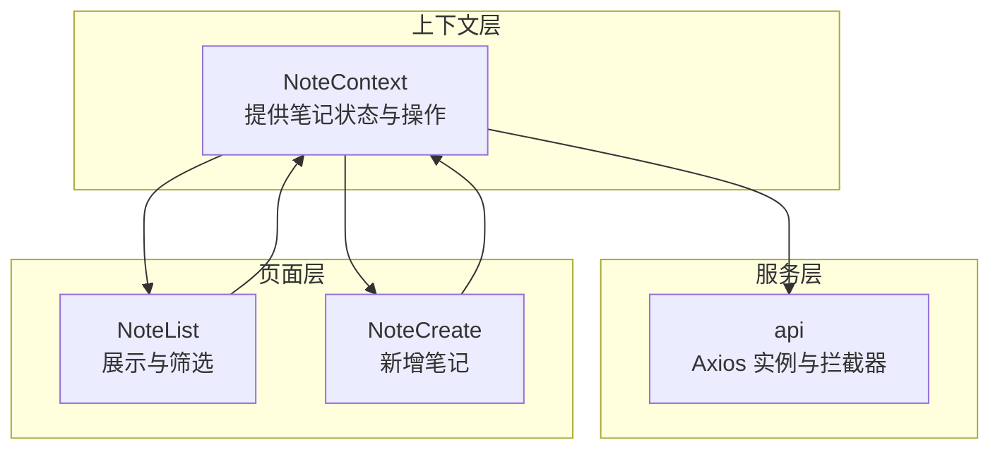
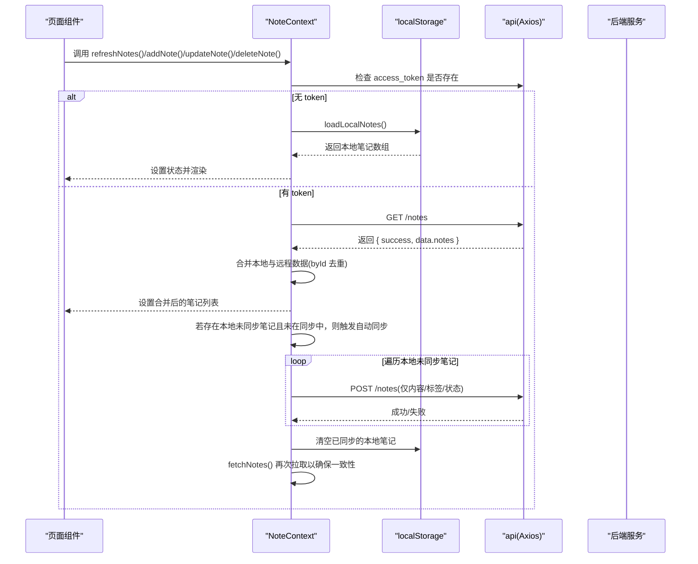
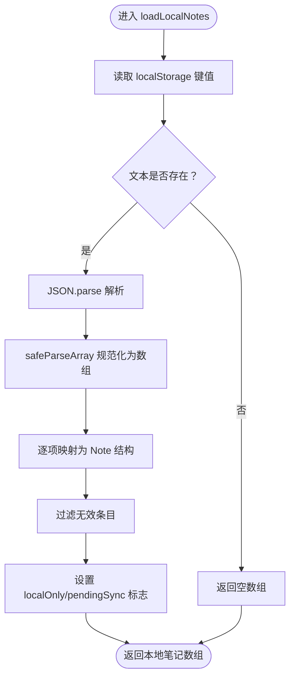
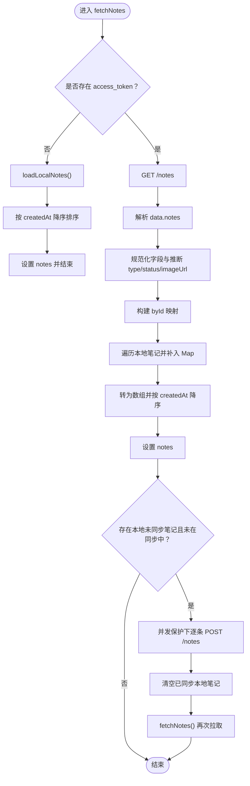
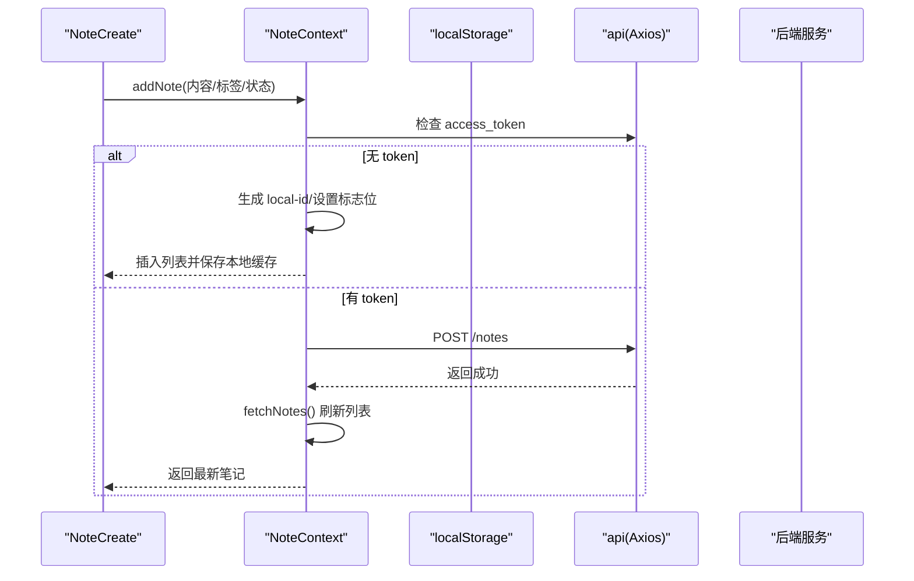
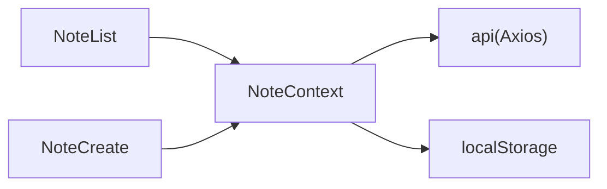

# 笔记持久化与同步

<cite>
**本文引用的文件**
- [NoteContext.tsx](file://src/app/components/context/NoteContext.tsx)
- [api.ts](file://src/app/services/api.ts)
- [NoteList.tsx](file://src/app/pages/NoteList.tsx)
- [NoteCreate.tsx](file://src/app/pages/NoteCreate.tsx)
</cite>

## 目录
1. [简介](#简介)
2. [项目结构](#项目结构)
3. [核心组件](#核心组件)
4. [架构总览](#架构总览)
5. [详细组件分析](#详细组件分析)
6. [依赖关系分析](#依赖关系分析)
7. [性能考量](#性能考量)
8. [故障排查指南](#故障排查指南)
9. [结论](#结论)
10. [附录](#附录)

## 简介
本文件聚焦于笔记应用前端的“本地持久化与同步机制”，围绕以下目标展开：
- 本地存储策略：基于 localStorage 的键值存储、序列化与反序列化流程
- 核心函数实现：loadLocalNotes 与 saveLocalNotes 的数据格式转换与错误处理
- 远程同步流程：fetchNotes 的完整调用链，包含远程数据获取、本地数据合并、自动同步与并发保护
- 数据合并算法：byId 映射、去重与排序规则
- 同步状态管理：pendingSync 标记与并发同步锁
- 数据迁移与版本兼容：本地键名版本化与字段兼容策略
- 性能优化与一致性保障：批量同步、幂等处理与错误恢复

## 项目结构
与笔记持久化与同步直接相关的模块分布如下：
- 上下文层：NoteContext 提供笔记状态、增删改查与刷新能力
- 服务层：api 封装请求拦截器与统一错误处理
- 页面层：NoteList 展示列表；NoteCreate 负责新增笔记

图表来源
- [NoteContext.tsx:89-347](file://src/app/components/context/NoteContext.tsx#L89-L347)
- [api.ts:36-127](file://src/app/services/api.ts#L36-L127)
- [NoteList.tsx:383-800](file://src/app/pages/NoteList.tsx#L383-L800)
- [NoteCreate.tsx:1-200](file://src/app/pages/NoteCreate.tsx#L1-L200)

章节来源
- [NoteContext.tsx:89-347](file://src/app/components/context/NoteContext.tsx#L89-L347)
- [api.ts:36-127](file://src/app/services/api.ts#L36-L127)
- [NoteList.tsx:383-800](file://src/app/pages/NoteList.tsx#L383-L800)
- [NoteCreate.tsx:1-200](file://src/app/pages/NoteCreate.tsx#L1-L200)

## 核心组件
- NoteContext：提供笔记列表、加载状态、错误信息，以及新增、删除、更新、刷新接口；内部实现本地持久化与远程同步
- api：封装 Axios 实例，统一设置基础 URL、超时、请求头，注入 JWT 并处理 401 刷新令牌与全局错误翻译

章节来源
- [NoteContext.tsx:1-356](file://src/app/components/context/NoteContext.tsx#L1-L356)
- [api.ts:1-127](file://src/app/services/api.ts#L1-L127)

## 架构总览
整体流程：登录态检测 → 远程拉取 → 本地合并 → 自动同步 → 更新 UI

图表来源
- [NoteContext.tsx:152-218](file://src/app/components/context/NoteContext.tsx#L152-L218)
- [api.ts:44-127](file://src/app/services/api.ts#L44-L127)

## 详细组件分析

### 本地存储策略与数据模型
- 本地键名：shisi_local_notes_v1，用于区分版本，避免旧数据污染
- 数据结构：Note 类型包含 id、title、content、type、status、createdAt、tags、imageUrl、structuredData、localOnly、pendingSync 等字段
- 序列化与反序列化：统一通过 JSON.stringify/JSON.parse 完成；解析失败时回退为空数组
- 字段兼容：类型、状态、时间戳、标签等均进行安全转换与默认值兜底

章节来源
- [NoteContext.tsx:95-146](file://src/app/components/context/NoteContext.tsx#L95-L146)

### loadLocalNotes：本地加载与数据规范化
- 步骤
  - 从 localStorage 读取键值文本
  - JSON 解析为数组，非数组或空值回退为空数组
  - 对每个元素执行字段规范化：id、title、content、type、status、createdAt、tags、imageUrl、structuredData
  - 过滤掉无效条目（id 或 content 缺失）
  - 统一设置 localOnly=true、pendingSync=true
- 错误处理：异常捕获并返回空数组，保证健壮性

图表来源
- [NoteContext.tsx:103-127](file://src/app/components/context/NoteContext.tsx#L103-L127)

章节来源
- [NoteContext.tsx:103-127](file://src/app/components/context/NoteContext.tsx#L103-L127)

### saveLocalNotes：本地保存与数据裁剪
- 步骤
  - 过滤出 localOnly=true 的笔记
  - 裁剪为仅持久化的字段集合（id、title、content、type、status、createdAt、tags、imageUrl、structuredData）
  - JSON 序列化后写入 localStorage
- 错误处理：异常静默忽略，避免影响主流程

章节来源
- [NoteContext.tsx:129-146](file://src/app/components/context/NoteContext.tsx#L129-L146)

### fetchNotes：远程获取与本地合并
- 登录态判断：若无 access_token，直接加载本地笔记并降序排序
- 远程拉取：GET /notes，成功后解析 data.notes
- 数据规范化：content、tags、id、title 推导、status 默认归档、type 推断（根据附件）、createdAt 转毫秒、imageUrl 取首张图片
- 合并策略：byId 映射（Map），优先保留远程数据，本地缺失则补入
- 排序规则：按 createdAt 降序
- 自动同步触发：若存在本地未同步笔记且当前未处于同步中，则并发保护（ref 标记）下逐条 POST /notes 同步
- 同步完成：清空本地已同步笔记，再次 fetchNotes 以确保一致性

图表来源
- [NoteContext.tsx:152-218](file://src/app/components/context/NoteContext.tsx#L152-L218)

章节来源
- [NoteContext.tsx:152-218](file://src/app/components/context/NoteContext.tsx#L152-L218)

### 新增笔记：本地优先与远程回写
- 无 token：生成本地 id（local- 前缀）、设置 localOnly/pendingSync、插入列表顶部、同时写入本地缓存
- 有 token：调用 POST /notes 创建远程笔记，成功后重新拉取列表以获得服务端 id 并更新 UI

图表来源
- [NoteContext.tsx:224-272](file://src/app/components/context/NoteContext.tsx#L224-L272)

章节来源
- [NoteContext.tsx:224-272](file://src/app/components/context/NoteContext.tsx#L224-L272)

### 删除与更新：本地与远程双写
- 删除：若为本地 id，直接从内存与本地缓存移除；否则调用 DELETE /notes/:id 并更新内存
- 更新：若为本地 id，同时更新内存与本地缓存；否则调用 PUT /notes/:id 并更新内存

章节来源
- [NoteContext.tsx:274-340](file://src/app/components/context/NoteContext.tsx#L274-L340)

### pendingSync 标记与并发同步锁
- pendingSync：标记本地笔记尚未与服务端同步，用于 UI 与业务提示
- 并发保护：syncingLocalRef 作为布尔开关，防止重复触发自动同步任务
- 自动同步：仅在 fetchNotes 中检测到本地未同步笔记且未在同步中时触发，逐条 POST /notes，完成后清空本地缓存并再次拉取

章节来源
- [NoteContext.tsx:93-94](file://src/app/components/context/NoteContext.tsx#L93-L94)
- [NoteContext.tsx:121-122](file://src/app/components/context/NoteContext.tsx#L121-L122)
- [NoteContext.tsx:191-210](file://src/app/components/context/NoteContext.tsx#L191-L210)

### 数据合并算法与排序
- byId 映射：以服务端 id 为键，先写入远程笔记，再遍历本地笔记，若键不存在则补入，从而实现“远程优先、本地补充”的去重策略
- 排序规则：统一按 createdAt 降序排列，确保最新笔记在前

章节来源
- [NoteContext.tsx:185-188](file://src/app/components/context/NoteContext.tsx#L185-L188)

### 请求与错误处理
- 请求拦截：自动附加 Authorization: Bearer token
- 响应拦截：处理 401 刷新令牌、失败重试、全局错误文案翻译，提升用户体验

章节来源
- [api.ts:44-127](file://src/app/services/api.ts#L44-L127)

## 依赖关系分析
- NoteContext 依赖 api 进行远程调用，依赖 localStorage 进行本地持久化
- 页面组件通过上下文消费状态与方法，不直接操作存储
- NoteList 负责展示与筛选，NoteCreate 负责新增

图表来源
- [NoteContext.tsx:1-356](file://src/app/components/context/NoteContext.tsx#L1-L356)
- [api.ts:36-127](file://src/app/services/api.ts#L36-L127)
- [NoteList.tsx:383-800](file://src/app/pages/NoteList.tsx#L383-L800)
- [NoteCreate.tsx:1-200](file://src/app/pages/NoteCreate.tsx#L1-L200)

章节来源
- [NoteContext.tsx:1-356](file://src/app/components/context/NoteContext.tsx#L1-L356)
- [api.ts:36-127](file://src/app/services/api.ts#L36-L127)
- [NoteList.tsx:383-800](file://src/app/pages/NoteList.tsx#L383-L800)
- [NoteCreate.tsx:1-200](file://src/app/pages/NoteCreate.tsx#L1-L200)

## 性能考量
- 批量同步：本地未同步笔记一次性遍历提交，减少多次往返
- 幂等处理：byId 映射天然避免重复键冲突；并发锁避免重复同步
- 降级策略：本地加载失败返回空数组，不影响 UI 初始化
- 本地缓存：新增/更新/删除即时更新内存与本地缓存，降低等待延迟
- 排序与渲染：统一降序，利于首屏展示与滚动体验

## 故障排查指南
- 无法加载笔记
  - 检查 access_token 是否存在；无 token 时会走本地加载路径
  - 查看 localStorage 中 shisi_local_notes_v1 是否存在有效 JSON
- 同步未生效
  - 确认是否处于 syncingLocalRef 并发保护中
  - 检查本地笔记是否仍存在（pendingSync=true）且未被清空
- 错误文案
  - api 响应拦截器会将 5xx、401 与后端错误进行统一翻译，便于用户理解

章节来源
- [NoteContext.tsx:152-218](file://src/app/components/context/NoteContext.tsx#L152-L218)
- [api.ts:56-127](file://src/app/services/api.ts#L56-L127)

## 结论
该实现通过“本地优先 + 远程回写”的策略，在无网络或弱网环境下保证可用性；通过 byId 合并与 pendingSync 标记，兼顾一致性与可追溯性；借助拦截器与并发锁，实现稳健的错误处理与性能优化。整体方案简洁可靠，适合移动端与多端场景。

## 附录
- 版本兼容：本地键名采用版本化前缀，避免跨版本数据污染
- 数据迁移：如需迁移，建议在新版本中读取旧键并转换为新结构后写入新键，随后清理旧键