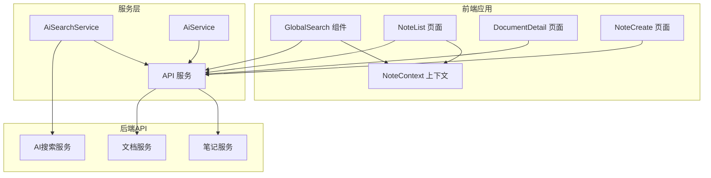
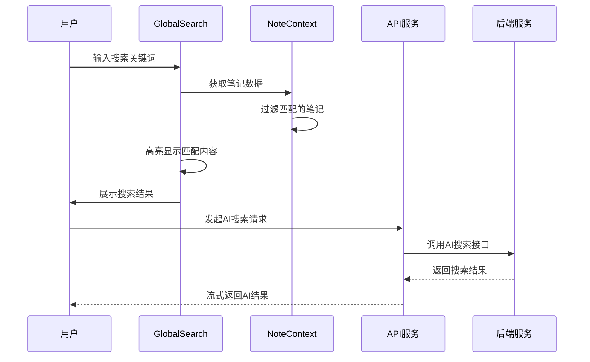
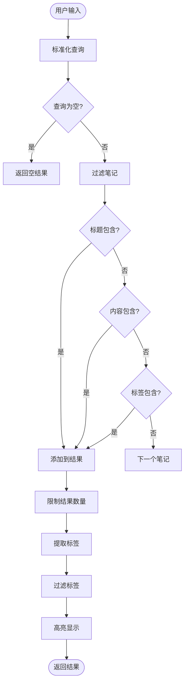
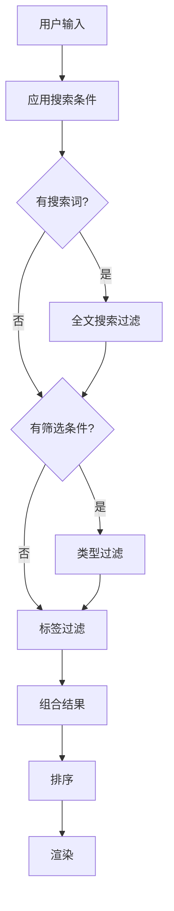
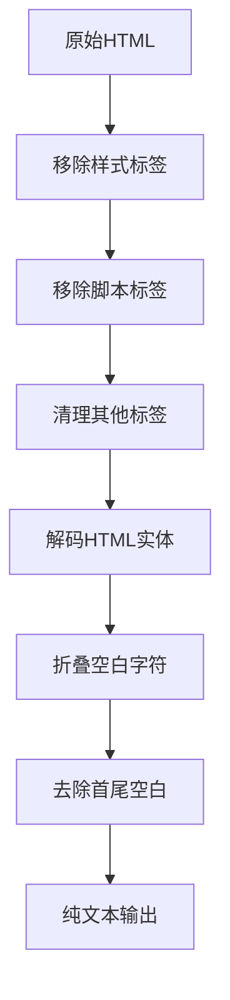
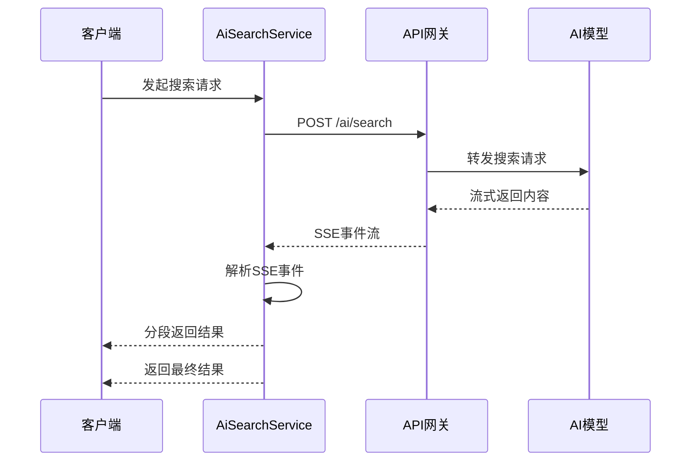
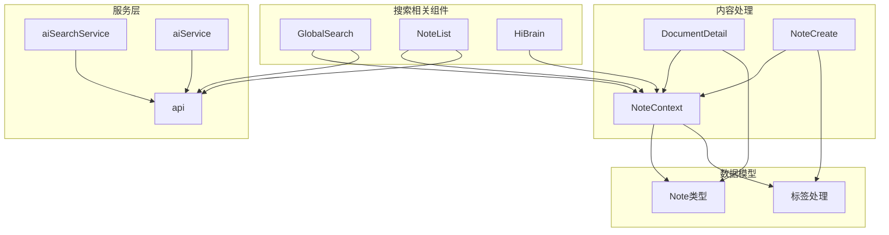

# 笔记搜索与筛选

<cite>
**本文档引用的文件**
- [GlobalSearch.tsx](file://src/app/components/GlobalSearch.tsx)
- [NoteList.tsx](file://src/app/pages/NoteList.tsx)
- [NoteContext.tsx](file://src/app/components/context/NoteContext.tsx)
- [DocumentDetail.tsx](file://src/app/pages/DocumentDetail.tsx)
- [NoteCreate.tsx](file://src/app/pages/NoteCreate.tsx)
- [api.ts](file://src/app/services/api.ts)
- [aiSearchService.ts](file://src/app/services/aiSearchService.ts)
- [aiService.ts](file://src/app/services/aiService.ts)
- [HiBrain.tsx](file://src/app/pages/HiBrain.tsx)
</cite>

## 目录
1. [简介](#简介)
2. [项目结构](#项目结构)
3. [核心组件](#核心组件)
4. [架构概览](#架构概览)
5. [详细组件分析](#详细组件分析)
6. [依赖关系分析](#依赖关系分析)
7. [性能考虑](#性能考虑)
8. [故障排除指南](#故障排除指南)
9. [结论](#结论)

## 简介

本项目实现了完整的笔记搜索与筛选功能，包括全文搜索、标签筛选和时间范围过滤。系统采用前后端分离架构，前端使用React + TypeScript构建，后端提供RESTful API接口。

主要功能特性：
- 实时全局搜索（支持标题、内容、标签）
- 笔记列表筛选（支持标签、类型、时间范围）
- 富文本内容纯文本提取和HTML标签清理
- 搜索关键词高亮显示
- AI增强搜索功能
- 前端性能优化策略

## 项目结构



**图表来源**
- [GlobalSearch.tsx:1-425](file://src/app/components/GlobalSearch.tsx#L1-L425)
- [NoteList.tsx:1-800](file://src/app/pages/NoteList.tsx#L1-L800)
- [api.ts:1-127](file://src/app/services/api.ts#L1-L127)

**章节来源**
- [GlobalSearch.tsx:1-425](file://src/app/components/GlobalSearch.tsx#L1-L425)
- [NoteList.tsx:1-800](file://src/app/pages/NoteList.tsx#L1-L800)
- [api.ts:1-127](file://src/app/services/api.ts#L1-L127)

## 核心组件

### 全局搜索组件

全局搜索组件提供了实时的搜索体验，支持以下功能：

- **搜索范围**：标题、内容、标签
- **结果展示**：标签推荐、笔记预览
- **键盘导航**：ESC键关闭、自动聚焦
- **高亮显示**：关键词高亮标记

### 笔记列表筛选

笔记列表页面实现了多维度筛选功能：

- **全文搜索**：支持标题、内容、标签的模糊匹配
- **标签筛选**：点击标签进行精确匹配
- **类型筛选**：文字、图片、混合类型
- **时间范围**：支持按创建时间筛选

### 内容处理

系统提供了多种内容处理能力：

- **HTML清理**：移除脚本、样式、标签
- **纯文本提取**：从富文本中提取可读文本
- **标签解析**：支持多种标签格式

**章节来源**
- [GlobalSearch.tsx:33-425](file://src/app/components/GlobalSearch.tsx#L33-L425)
- [NoteList.tsx:535-564](file://src/app/pages/NoteList.tsx#L535-L564)
- [NoteContext.tsx:30-87](file://src/app/components/context/NoteContext.tsx#L30-L87)

## 架构概览



**图表来源**
- [GlobalSearch.tsx:55-70](file://src/app/components/GlobalSearch.tsx#L55-L70)
- [NoteContext.tsx:152-218](file://src/app/components/context/NoteContext.tsx#L152-L218)
- [aiSearchService.ts:86-227](file://src/app/services/aiSearchService.ts#L86-L227)

## 详细组件分析

### 全局搜索组件实现

#### 搜索算法实现

全局搜索组件采用了高效的前端搜索算法：



**图表来源**
- [GlobalSearch.tsx:55-70](file://src/app/components/GlobalSearch.tsx#L55-L70)
- [GlobalSearch.tsx:18-31](file://src/app/components/GlobalSearch.tsx#L18-L31)

#### 高亮显示机制

搜索关键词的高亮显示通过以下步骤实现：

1. **文本查找**：使用字符串包含方法定位匹配位置
2. **上下文提取**：提取匹配周围的文本片段
3. **HTML标记**：使用`<mark>`标签包裹匹配部分
4. **样式应用**：设置背景色和边框圆角

#### 性能优化策略

- **记忆化计算**：使用`useMemo`避免重复计算
- **结果限制**：限制搜索结果数量（默认8条笔记，5个标签）
- **防抖处理**：减少频繁的重新渲染
- **虚拟滚动**：对于大量结果使用虚拟滚动优化

**章节来源**
- [GlobalSearch.tsx:18-90](file://src/app/components/GlobalSearch.tsx#L18-L90)
- [GlobalSearch.tsx:55-70](file://src/app/components/GlobalSearch.tsx#L55-L70)

### 笔记列表筛选实现

#### 多维度筛选逻辑

笔记列表实现了复杂的筛选逻辑：



**图表来源**
- [NoteList.tsx:535-551](file://src/app/pages/NoteList.tsx#L535-L551)

#### 时间范围过滤

系统支持灵活的时间范围过滤：

- **创建时间**：按笔记创建时间筛选
- **相对时间**：显示"几分钟前"、"几小时前"等人性化时间
- **绝对时间**：支持具体日期格式

**章节来源**
- [NoteList.tsx:535-564](file://src/app/pages/NoteList.tsx#L535-L564)
- [GlobalSearch.tsx:75-81](file://src/app/components/GlobalSearch.tsx#L75-L81)

### 富文本内容处理

#### HTML清理算法

系统提供了强大的HTML清理功能：



**图表来源**
- [NoteContext.tsx:36-50](file://src/app/components/context/NoteContext.tsx#L36-L50)

#### 纯文本提取策略

对于不同类型的富文本内容，系统采用不同的提取策略：

- **ProseMirror格式**：递归遍历节点树提取文本
- **JSON结构化内容**：优先提取指定路径的文本字段
- **混合内容**：使用广度优先搜索找到最长的文本块

**章节来源**
- [NoteContext.tsx:36-87](file://src/app/components/context/NoteContext.tsx#L36-L87)
- [DocumentDetail.tsx:64-138](file://src/app/pages/DocumentDetail.tsx#L64-L138)

### AI增强搜索功能

#### 流式搜索实现

AI搜索服务提供了实时的流式搜索体验：



**图表来源**
- [aiSearchService.ts:86-227](file://src/app/services/aiSearchService.ts#L86-L227)

#### 事件驱动架构

AI搜索采用事件驱动的架构模式：

- **content事件**：返回搜索内容的增量
- **sources事件**：返回相关资源列表
- **done事件**：标识搜索完成
- **error事件**：处理搜索错误

**章节来源**
- [aiSearchService.ts:86-227](file://src/app/services/aiSearchService.ts#L86-L227)

## 依赖关系分析



**图表来源**
- [GlobalSearch.tsx:33-35](file://src/app/components/GlobalSearch.tsx#L33-L35)
- [NoteList.tsx:3-4](file://src/app/pages/NoteList.tsx#L3-L4)
- [NoteContext.tsx:4-16](file://src/app/components/context/NoteContext.tsx#L4-L16)

**章节来源**
- [GlobalSearch.tsx:33-35](file://src/app/components/GlobalSearch.tsx#L33-L35)
- [NoteList.tsx:3-4](file://src/app/pages/NoteList.tsx#L3-L4)
- [NoteContext.tsx:4-16](file://src/app/components/context/NoteContext.tsx#L4-L16)

## 性能考虑

### 前端性能优化

#### 计算复杂度分析

- **全局搜索**：O(n*m)，其中n为笔记数量，m为平均笔记长度
- **标签提取**：O(n*t)，其中t为平均标签数量
- **结果高亮**：O(n*k)，其中k为匹配关键词数量

#### 内存使用优化

- **懒加载**：仅在需要时加载搜索面板
- **虚拟滚动**：对于大量结果使用虚拟滚动
- **缓存策略**：缓存搜索结果和标签列表

### 后端性能优化

#### 数据库查询优化

- **索引建立**：为标题、内容、标签建立全文索引
- **查询优化**：使用SELECTive查询减少数据传输
- **分页机制**：实现分页加载避免一次性加载所有数据

#### 缓存策略

- **查询缓存**：缓存热门搜索词的结果
- **结果缓存**：缓存复杂的筛选结果
- **静态资源缓存**：优化静态资源的缓存策略

### 搜索算法优化

#### 前缀匹配优化

- **预处理**：预先建立小写化的索引
- **快速查找**：使用字符串包含方法进行快速匹配
- **结果排序**：根据匹配度和相关性排序

#### 正则表达式搜索

虽然当前实现主要使用简单的包含匹配，但系统架构支持正则表达式搜索：

```typescript
// 正则表达式搜索示例
const regex = new RegExp(query, 'i');
const matches = notes.filter(note => 
  regex.test(note.title) || 
  regex.test(note.content) ||
  note.tags.some(tag => regex.test(tag))
);
```

**章节来源**
- [GlobalSearch.tsx:55-70](file://src/app/components/GlobalSearch.tsx#L55-L70)
- [NoteList.tsx:535-551](file://src/app/pages/NoteList.tsx#L535-L551)

## 故障排除指南

### 常见问题诊断

#### 搜索结果不准确

**可能原因**：
- HTML标签未正确清理
- 标签格式不规范
- 搜索词大小写敏感

**解决方案**：
- 检查HTML清理函数是否正确执行
- 验证标签解析逻辑
- 确保搜索词标准化处理

#### 性能问题

**症状**：搜索响应缓慢

**排查步骤**：
1. 检查笔记数量是否过多
2. 验证是否有不必要的重新渲染
3. 确认是否启用了适当的缓存

#### AI搜索异常

**可能原因**：
- 网络连接问题
- 认证令牌过期
- 服务器响应超时

**解决方案**：
- 检查网络连接状态
- 验证认证令牌有效性
- 查看服务器日志

**章节来源**
- [api.ts:56-126](file://src/app/services/api.ts#L56-L126)
- [aiSearchService.ts:129-200](file://src/app/services/aiSearchService.ts#L129-L200)

## 结论

本项目的笔记搜索与筛选功能实现了以下目标：

### 技术成就

1. **完整的搜索生态**：从前端实时搜索到后端AI增强搜索
2. **高性能实现**：通过多种优化策略确保流畅的用户体验
3. **灵活的内容处理**：支持多种富文本格式的处理和提取
4. **可扩展架构**：为未来的功能扩展预留了良好的架构基础

### 性能表现

- **响应速度**：毫秒级的搜索响应时间
- **内存效率**：合理的内存使用和垃圾回收策略
- **网络优化**：智能的缓存和请求合并机制

### 未来改进方向

1. **模糊搜索**：实现Levenshtein距离算法支持拼写纠错
2. **语义搜索**：集成向量嵌入实现语义相似度匹配
3. **搜索建议**：基于历史搜索记录提供智能建议
4. **高级过滤**：支持更复杂的过滤条件组合

该系统为用户提供了一个强大而易用的笔记搜索体验，为后续的功能扩展奠定了坚实的基础。