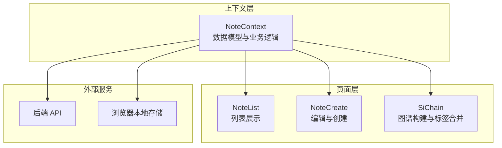
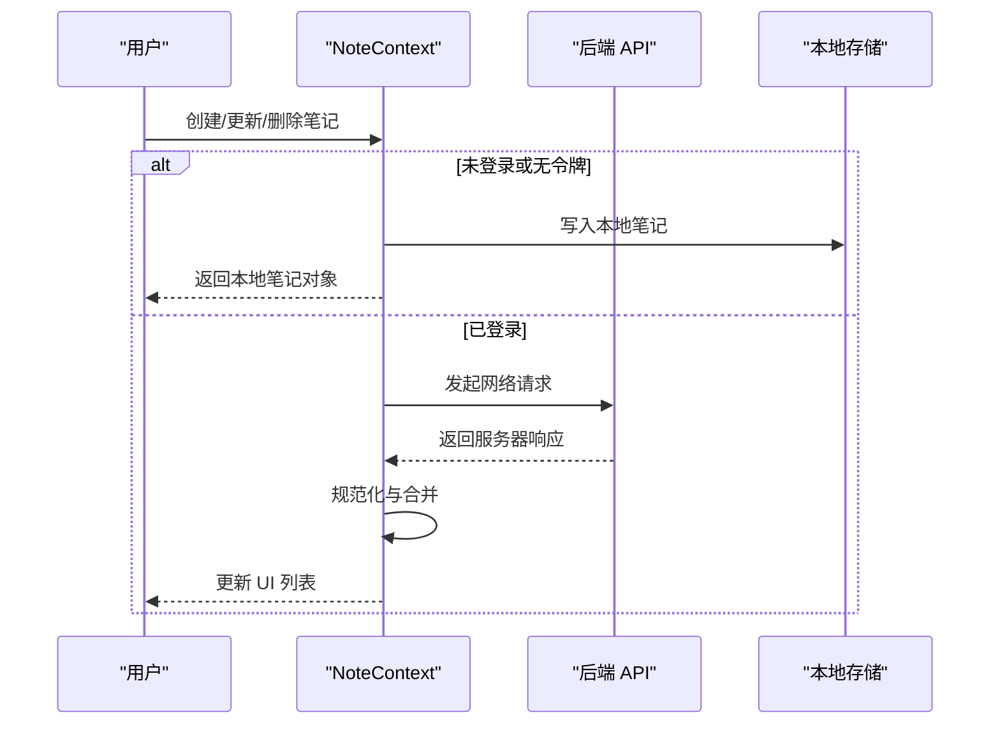
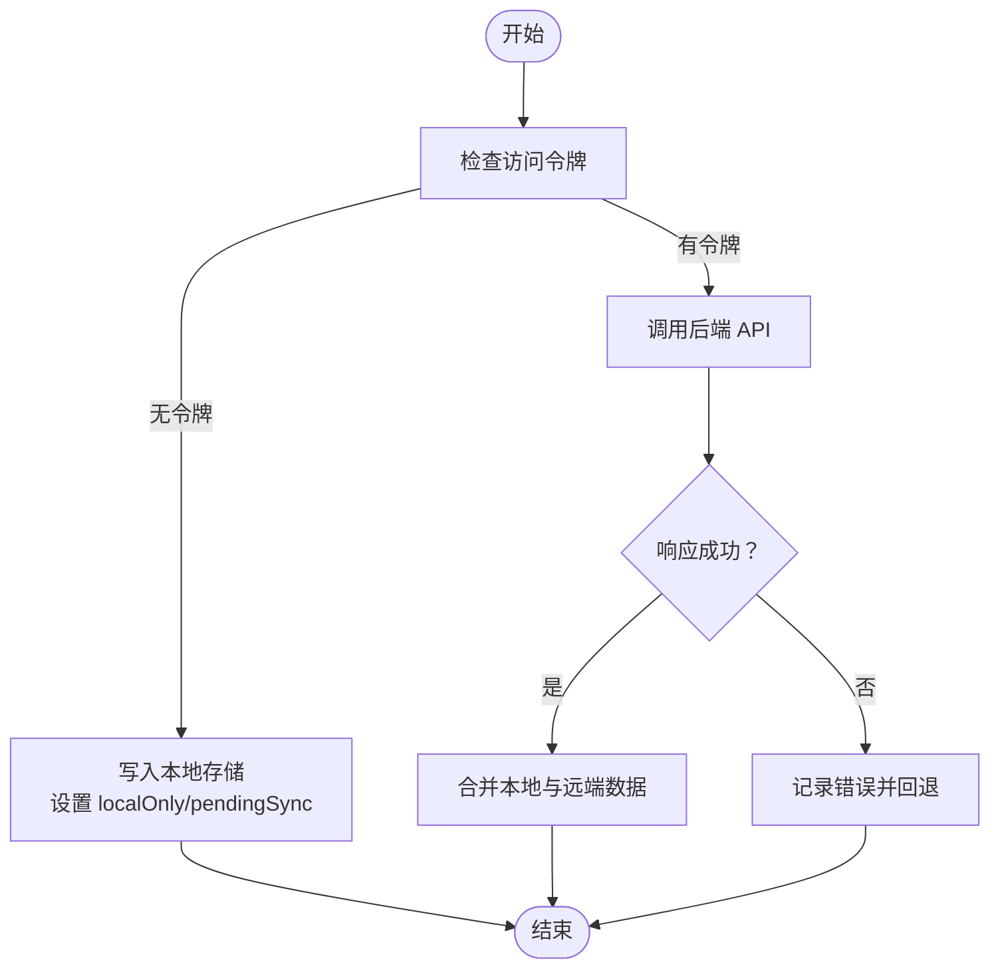
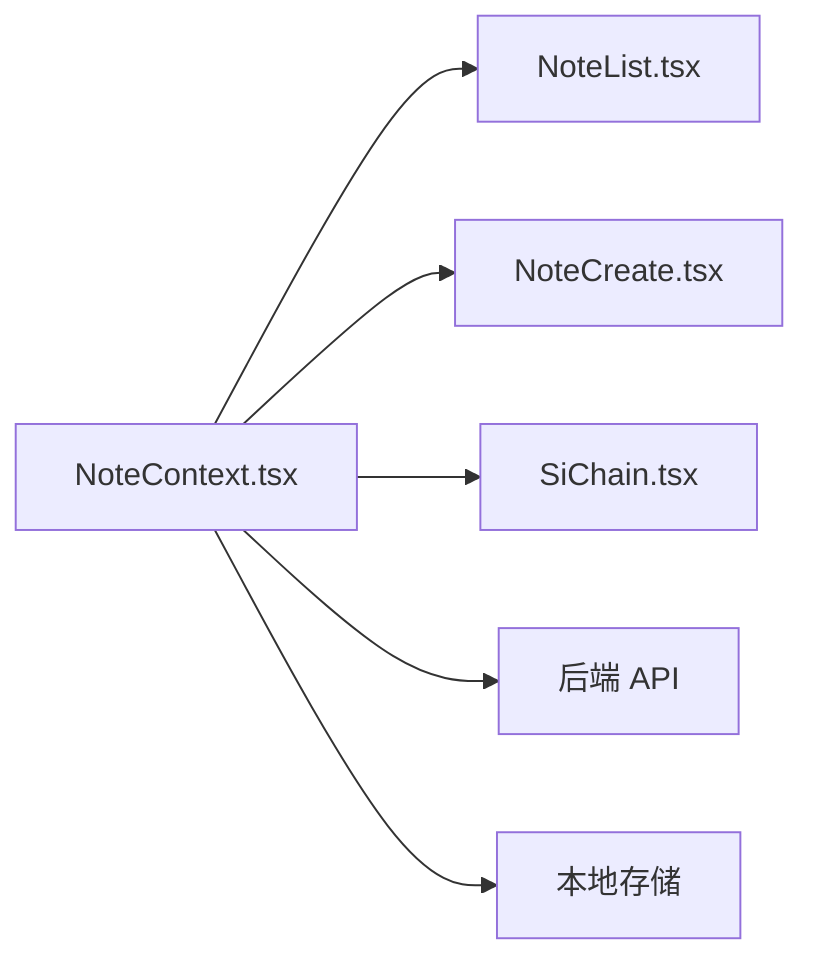

# 笔记数据模型

<cite>
**本文档引用的文件**
- [NoteContext.tsx](file://src/app/components/context/NoteContext.tsx)
- [SiChain.tsx](file://src/app/pages/SiChain.tsx)
- [NoteList.tsx](file://src/app/pages/NoteList.tsx)
- [NoteCreate.tsx](file://src/app/pages/NoteCreate.tsx)
</cite>

## 目录
1. [简介](#简介)
2. [项目结构](#项目结构)
3. [核心组件](#核心组件)
4. [架构总览](#架构总览)
5. [详细组件分析](#详细组件分析)
6. [依赖分析](#依赖分析)
7. [性能考虑](#性能考虑)
8. [故障排除指南](#故障排除指南)
9. [结论](#结论)
10. [附录](#附录)

## 简介
本文件系统性阐述笔记数据模型的设计与实现，重点围绕 Note 接口的字段语义、类型约束、状态管理、本地与远程数据同步机制，以及数据规范化与清洗函数的工作原理与使用场景。同时提供扩展与自定义字段的实践指导，帮助开发者在不破坏现有行为的前提下安全地演进数据模型。

## 项目结构
笔记数据模型主要集中在上下文模块中，配合页面层的展示与编辑组件共同完成数据的读取、创建、更新与删除，并通过本地存储与后端 API 实现离线与在线能力的统一。

**图表来源**
- [NoteContext.tsx:1-356](file://src/app/components/context/NoteContext.tsx#L1-L356)
- [NoteList.tsx:1-200](file://src/app/pages/NoteList.tsx#L1-L200)
- [NoteCreate.tsx:1-800](file://src/app/pages/NoteCreate.tsx#L1-L800)
- [SiChain.tsx:558-585](file://src/app/pages/SiChain.tsx#L558-L585)

**章节来源**
- [NoteContext.tsx:1-356](file://src/app/components/context/NoteContext.tsx#L1-L356)
- [NoteList.tsx:1-200](file://src/app/pages/NoteList.tsx#L1-L200)
- [NoteCreate.tsx:1-800](file://src/app/pages/NoteCreate.tsx#L1-L800)
- [SiChain.tsx:558-585](file://src/app/pages/SiChain.tsx#L558-L585)

## 核心组件
- Note 数据模型：定义了笔记的核心字段、可选字段及默认值策略。
- 规范化与清洗函数：确保输入数据的类型一致性与可读性。
- 同步与状态管理：结合本地存储与后端 API，实现离线优先与在线同步。
- 图谱与标签：在图谱构建中对标签进行归一化与合并。

**章节来源**
- [NoteContext.tsx:4-16](file://src/app/components/context/NoteContext.tsx#L4-L16)
- [NoteContext.tsx:30-87](file://src/app/components/context/NoteContext.tsx#L30-L87)
- [NoteContext.tsx:89-340](file://src/app/components/context/NoteContext.tsx#L89-L340)
- [SiChain.tsx:558-585](file://src/app/pages/SiChain.tsx#L558-L585)

## 架构总览
下图展示了从用户操作到数据持久化的整体流程，包括本地优先与远程同步的关键节点。

**图表来源**
- [NoteContext.tsx:152-218](file://src/app/components/context/NoteContext.tsx#L152-L218)
- [NoteContext.tsx:224-272](file://src/app/components/context/NoteContext.tsx#L224-L272)
- [NoteContext.tsx:274-340](file://src/app/components/context/NoteContext.tsx#L274-L340)

## 详细组件分析

### Note 接口定义与字段说明
- id: 唯一标识符，字符串。本地生成时以特定前缀区分；服务端返回时强制转为字符串。
- title: 可选标题，最终显示标题由派生函数决定。
- content: 笔记正文，必填且会进行规范化与清洗。
- type: 笔记类型，枚举值："text" | "image" | "mixed"。根据附件是否存在与类型推断。
- status: 状态，枚举值："inbox" | "archived"。默认值依据来源而定。
- createdAt: 创建时间戳，数字。用于排序与展示。
- tags: 标签数组，支持多种输入格式并进行归一化。
- imageUrl: 首张图片附件的 URL，若存在则映射到该字段。
- structuredData: 结构化数据，用于 AI 生成内容的标记。
- localOnly: 本地生成的笔记标记，仅存在于本地存储。
- pendingSync: 待同步标记，表示本地笔记尚未上传至服务器。

字段约束与默认值策略
- content 必填且非空；空内容将触发错误。
- type 默认为 "text"，当存在图片附件时推断为 "image" 或 "mixed"。
- status 默认为 "inbox"（本地）或 "archived"（服务端），确保状态合法。
- tags 支持数组、字符串（含 JSON 字符串数组）与分隔符（逗号、空格、竖线、斜杠）。
- imageUrl 仅在存在图片附件时设置。
- localOnly/pendingSync 仅在本地模式下生效。

**章节来源**
- [NoteContext.tsx:4-16](file://src/app/components/context/NoteContext.tsx#L4-L16)
- [NoteContext.tsx:110-123](file://src/app/components/context/NoteContext.tsx#L110-L123)
- [NoteContext.tsx:168-184](file://src/app/components/context/NoteContext.tsx#L168-L184)
- [NoteContext.tsx:232-250](file://src/app/components/context/NoteContext.tsx#L232-L250)

### 笔记类型与状态管理
- 类型推断
  - 若存在附件且至少一个为图片，则类型为 "image"；否则若存在非图片附件则为 "mixed"；否则为 "text"。
- 状态默认
  - 本地笔记默认 "inbox"，服务端笔记默认 "archived"，确保一致性。
- 展示标题派生
  - 若标题存在且非空，截断至 20 字；否则从正文提取纯文本并截断至 20 字；若均为空则使用默认标题。

**章节来源**
- [NoteContext.tsx:176-179](file://src/app/components/context/NoteContext.tsx#L176-L179)
- [NoteContext.tsx:174-175](file://src/app/components/context/NoteContext.tsx#L174-L175)
- [NoteContext.tsx:52-57](file://src/app/components/context/NoteContext.tsx#L52-L57)

### 本地与远程数据标识机制
- 本地 ID 识别
  - 以特定前缀标识本地生成的笔记，便于区分与路由到本地存储。
- 本地存储键名
  - 使用固定键名保存本地笔记数组，包含必要字段以便离线可用。
- 同步策略
  - 未登录时所有变更写入本地存储；登录后自动尝试批量上传本地笔记至服务端，并清空本地缓存。
- 删除与更新
  - 对本地笔记直接修改本地存储；对服务端笔记调用对应 API 并刷新本地状态。

**图表来源**
- [NoteContext.tsx:152-218](file://src/app/components/context/NoteContext.tsx#L152-L218)
- [NoteContext.tsx:191-210](file://src/app/components/context/NoteContext.tsx#L191-L210)
- [NoteContext.tsx:274-340](file://src/app/components/context/NoteContext.tsx#L274-L340)

**章节来源**
- [NoteContext.tsx:95-146](file://src/app/components/context/NoteContext.tsx#L95-L146)
- [NoteContext.tsx:148-150](file://src/app/components/context/NoteContext.tsx#L148-L150)
- [NoteContext.tsx:191-210](file://src/app/components/context/NoteContext.tsx#L191-L210)

### 数据规范化与清洗函数

#### normalizeContent
- 作用：确保 content 为字符串，null/undefined 转为空字符串，其他类型转为字符串。
- 使用场景：统一输入类型，避免渲染与存储异常。

**章节来源**
- [NoteContext.tsx:30-34](file://src/app/components/context/NoteContext.tsx#L30-L34)

#### stripHtmlToPlainText
- 作用：移除 HTML 样式与脚本标签，保留可见文本，替换常见实体，压缩空白字符。
- 使用场景：派生显示标题、正文预览、全文检索索引构建。

**章节来源**
- [NoteContext.tsx:36-50](file://src/app/components/context/NoteContext.tsx#L36-L50)

#### deriveDisplayTitle
- 作用：优先使用标题派生显示标题，否则从正文清洗后的内容派生，长度限制并提供默认值。
- 使用场景：卡片标题、列表项标题、搜索结果标题。

**章节来源**
- [NoteContext.tsx:52-57](file://src/app/components/context/NoteContext.tsx#L52-L57)

#### normalizeTags
- 作用：支持数组、字符串（含 JSON 字符串数组）、分隔符（逗号、空格、竖线、斜杠）；去除空标签与空白字符；兼容后端返回的 JSON 字符串数组。
- 使用场景：标签输入标准化、去重与长度控制、图谱标签合并。

**章节来源**
- [NoteContext.tsx:59-87](file://src/app/components/context/NoteContext.tsx#L59-L87)

#### 图谱中的标签归一化
- 在图谱构建中，同样提供一套等价的标签归一化函数，保证与上下文一致的行为。
- 合并策略：将原始标签与后端实体标签合并，去重并限制数量。

**章节来源**
- [SiChain.tsx:558-585](file://src/app/pages/SiChain.tsx#L558-L585)
- [SiChain.tsx:581-585](file://src/app/pages/SiChain.tsx#L581-L585)

### 数据验证规则、类型转换与错误处理
- 输入验证
  - content 非空校验：创建笔记时若内容为空，抛出明确错误。
  - 标签与正文清洗：通过规范化函数确保类型与格式一致。
- 类型转换
  - id 强制字符串化；createdAt 转换为毫秒时间戳；status 与 type 进行合法化。
- 错误处理
  - 网络请求失败时记录错误并向上抛出；本地存储异常静默处理以保证功能可用。

**章节来源**
- [NoteContext.tsx:226-229](file://src/app/components/context/NoteContext.tsx#L226-L229)
- [NoteContext.tsx:168-184](file://src/app/components/context/NoteContext.tsx#L168-L184)
- [NoteContext.tsx:212-217](file://src/app/components/context/NoteContext.tsx#L212-L217)
- [NoteContext.tsx:336-339](file://src/app/components/context/NoteContext.tsx#L336-L339)

### 扩展与自定义字段指导
- 新增字段建议
  - 在 Note 接口中声明新字段，并在本地存储序列化/反序列化处同步处理。
  - 若涉及后端交互，需在 API 请求与响应映射处一并更新。
- 兼容性保障
  - 为新字段提供默认值与类型转换逻辑，避免旧版本数据导致异常。
  - 保持 normalizeContent/normalizeTags 等函数对新字段的兼容处理。
- 渐进式迁移
  - 通过可选字段与默认值策略，允许新旧版本共存，逐步清理历史数据。

**章节来源**
- [NoteContext.tsx:4-16](file://src/app/components/context/NoteContext.tsx#L4-L16)
- [NoteContext.tsx:129-146](file://src/app/components/context/NoteContext.tsx#L129-L146)
- [NoteContext.tsx:168-184](file://src/app/components/context/NoteContext.tsx#L168-L184)

## 依赖分析
- NoteContext 作为核心上下文，被多个页面组件依赖：
  - NoteList：用于展示与筛选笔记。
  - NoteCreate：用于编辑与创建笔记。
  - SiChain：用于图谱构建与标签合并。
- 外部依赖：
  - 后端 API：提供笔记的增删改查与图谱数据。
  - 浏览器本地存储：提供离线能力与本地笔记持久化。

**图表来源**
- [NoteContext.tsx:1-356](file://src/app/components/context/NoteContext.tsx#L1-L356)
- [NoteList.tsx:1-200](file://src/app/pages/NoteList.tsx#L1-L200)
- [NoteCreate.tsx:1-800](file://src/app/pages/NoteCreate.tsx#L1-L800)
- [SiChain.tsx:558-585](file://src/app/pages/SiChain.tsx#L558-L585)

**章节来源**
- [NoteContext.tsx:1-356](file://src/app/components/context/NoteContext.tsx#L1-L356)
- [NoteList.tsx:1-200](file://src/app/pages/NoteList.tsx#L1-L200)
- [NoteCreate.tsx:1-800](file://src/app/pages/NoteCreate.tsx#L1-L800)
- [SiChain.tsx:558-585](file://src/app/pages/SiChain.tsx#L558-L585)

## 性能考虑
- 规范化与清洗
  - 在渲染前进行一次性规范化，避免重复计算。
  - 标签归一化与去重在图谱构建阶段执行，注意控制标签数量上限。
- 合并与排序
  - 合并本地与远端数据时使用 Map 去重，再统一排序，减少不必要的渲染。
- 本地存储
  - 仅保存必要字段，避免冗余数据占用存储空间。
- 网络同步
  - 批量上传本地笔记，减少请求次数；并发控制与重试策略可按需增强。

[本节为通用性能建议，无需具体文件引用]

## 故障排除指南
- 创建笔记失败
  - 检查 content 是否为空；确认访问令牌是否存在；查看网络请求错误信息。
- 标题显示异常
  - 确认标题是否为空；检查 HTML 清洗是否正确；确认派生逻辑是否符合预期。
- 标签不显示或重复
  - 检查标签输入格式（数组、JSON 字符串、分隔符）；确认归一化与去重逻辑。
- 本地笔记未同步
  - 确认已登录并具备访问令牌；检查批量上传流程是否执行；查看本地存储是否被清空。

**章节来源**
- [NoteContext.tsx:226-229](file://src/app/components/context/NoteContext.tsx#L226-L229)
- [NoteContext.tsx:264-271](file://src/app/components/context/NoteContext.tsx#L264-L271)
- [NoteContext.tsx:336-339](file://src/app/components/context/NoteContext.tsx#L336-L339)

## 结论
本数据模型通过严格的字段定义、完善的规范化与清洗函数、清晰的本地/远程同步策略，实现了稳定可靠的笔记管理能力。开发者可在不破坏现有行为的前提下，安全地扩展字段与优化性能，进一步提升用户体验与系统健壮性。

## 附录
- 关键函数路径参考
  - [normalizeContent:30-34](file://src/app/components/context/NoteContext.tsx#L30-L34)
  - [stripHtmlToPlainText:36-50](file://src/app/components/context/NoteContext.tsx#L36-L50)
  - [deriveDisplayTitle:52-57](file://src/app/components/context/NoteContext.tsx#L52-L57)
  - [normalizeTags:59-87](file://src/app/components/context/NoteContext.tsx#L59-L87)
  - [图谱标签归一化:558-585](file://src/app/pages/SiChain.tsx#L558-L585)