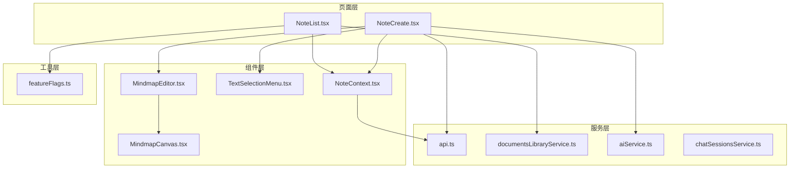
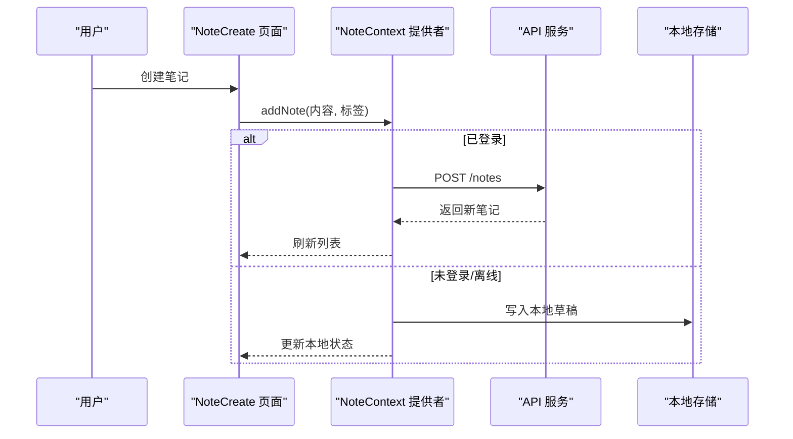
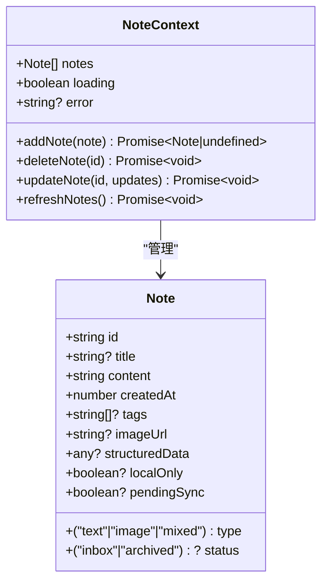
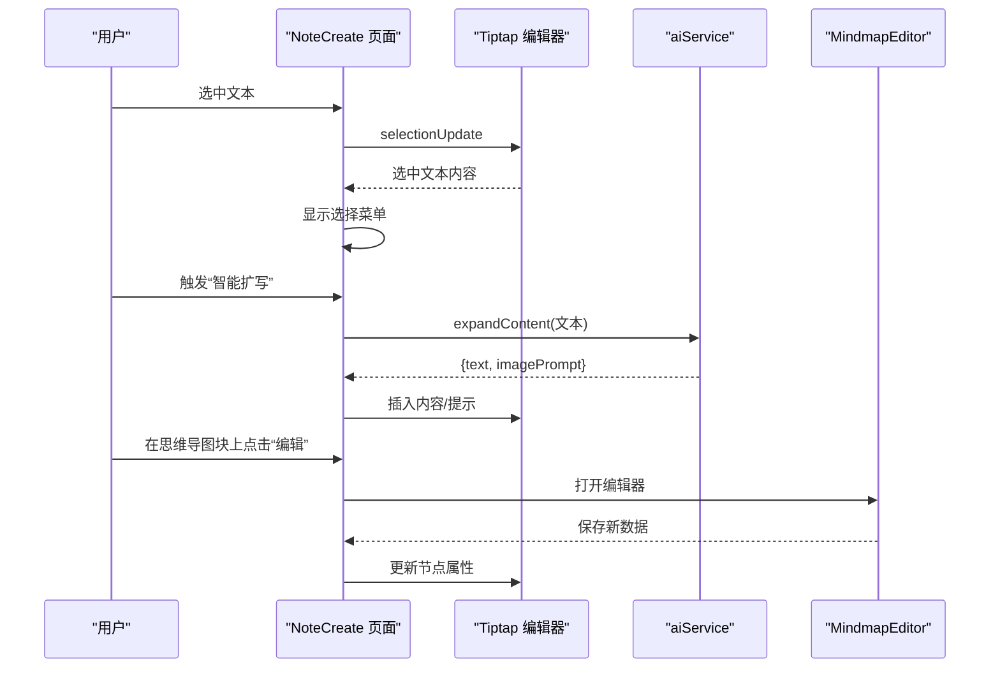
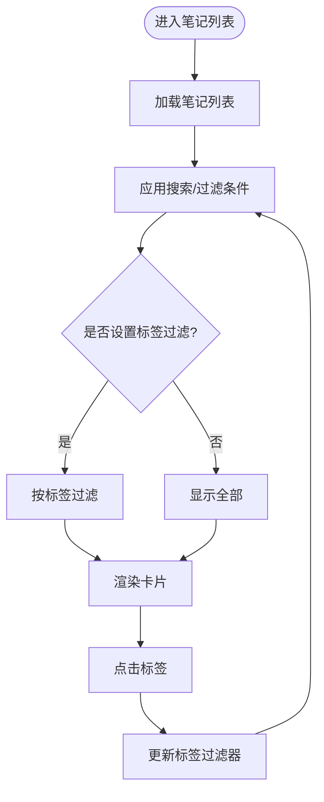
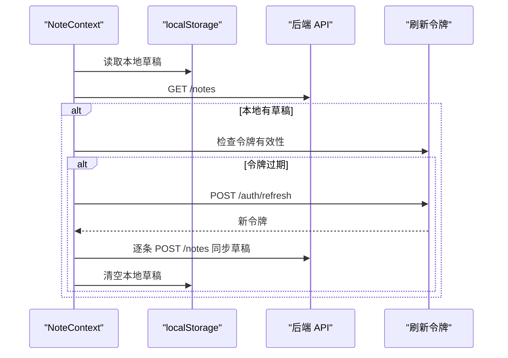
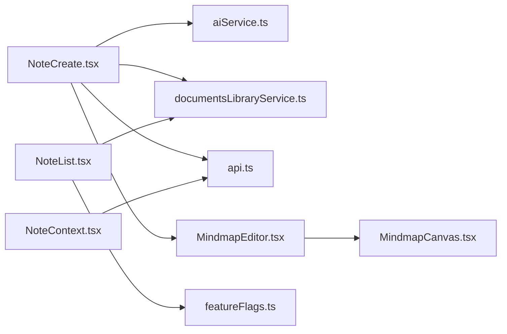

# 笔记管理系统

<cite>
**本文引用的文件**
- [README.md](file://README.md)
- [NoteContext.tsx](file://src/app/components/context/NoteContext.tsx)
- [NoteList.tsx](file://src/app/pages/NoteList.tsx)
- [NoteCreate.tsx](file://src/app/pages/NoteCreate.tsx)
- [api.ts](file://src/app/services/api.ts)
- [documentsLibraryService.ts](file://src/app/services/documentsLibraryService.ts)
- [aiService.ts](file://src/app/services/aiService.ts)
- [TextSelectionMenu.tsx](file://src/app/components/TextSelectionMenu.tsx)
- [MindmapEditor.tsx](file://src/app/components/MindmapEditor.tsx)
- [MindmapCanvas.tsx](file://src/app/components/MindmapCanvas.tsx)
- [chatSessionsService.ts](file://src/app/services/chatSessionsService.ts)
- [featureFlags.ts](file://src/app/utils/featureFlags.ts)
</cite>

## 目录
1. [简介](#简介)
2. [项目结构](#项目结构)
3. [核心组件](#核心组件)
4. [架构总览](#架构总览)
5. [详细组件分析](#详细组件分析)
6. [依赖分析](#依赖分析)
7. [性能考虑](#性能考虑)
8. [故障排除指南](#故障排除指南)
9. [结论](#结论)
10. [附录](#附录)

## 简介
本项目是一个现代化的笔记管理系统前端应用，采用 React + TypeScript 构建，集成了富文本编辑器（Tiptap）、AI 辅助功能、本地与远程同步、标签与分类管理、以及文档库等功能。系统通过上下文提供者统一管理笔记状态，支持离线本地草稿与在线同步，提供流畅的创作体验与强大的内容组织能力。

## 项目结构
项目采用按功能域分层的组织方式：
- 组件层：页面组件、UI 组件、上下文提供者
- 服务层：API 封装、AI 服务、文档库服务、聊天会话服务
- 工具层：特性开关、类型定义
- 页面层：笔记列表、笔记创建、文档库等入口页面

图表来源
- [NoteList.tsx](file://src/app/pages/NoteList.tsx)
- [NoteCreate.tsx](file://src/app/pages/NoteCreate.tsx)
- [NoteContext.tsx](file://src/app/components/context/NoteContext.tsx)
- [TextSelectionMenu.tsx](file://src/app/components/TextSelectionMenu.tsx)
- [MindmapEditor.tsx](file://src/app/components/MindmapEditor.tsx)
- [MindmapCanvas.tsx](file://src/app/components/MindmapCanvas.tsx)
- [api.ts](file://src/app/services/api.ts)
- [documentsLibraryService.ts](file://src/app/services/documentsLibraryService.ts)
- [aiService.ts](file://src/app/services/aiService.ts)
- [chatSessionsService.ts](file://src/app/services/chatSessionsService.ts)
- [featureFlags.ts](file://src/app/utils/featureFlags.ts)

章节来源
- [README.md](file://README.md)
- [NoteList.tsx](file://src/app/pages/NoteList.tsx)
- [NoteCreate.tsx](file://src/app/pages/NoteCreate.tsx)
- [NoteContext.tsx](file://src/app/components/context/NoteContext.tsx)

## 核心组件
- 笔记上下文提供者：统一管理笔记的增删改查、本地与远程同步、加载与错误状态。
- 富文本编辑器：基于 Tiptap，支持自定义节点（标签芯片、表格块、思维导图块），提供格式化工具栏与选择菜单。
- AI 辅助：提供智能扩写、智能校对、AI 总结、生成表格、生成思维导图等能力。
- 文档库：支持文档上传、检索、标签管理与概要生成。
- 特性开关：根据环境变量控制功能启用状态（如 Wiki）。

章节来源
- [NoteContext.tsx](file://src/app/components/context/NoteContext.tsx)
- [NoteCreate.tsx](file://src/app/pages/NoteCreate.tsx)
- [aiService.ts](file://src/app/services/aiService.ts)
- [documentsLibraryService.ts](file://src/app/services/documentsLibraryService.ts)
- [featureFlags.ts](file://src/app/utils/featureFlags.ts)

## 架构总览
系统采用“上下文 + 服务”的架构模式：
- 上下文提供者集中管理状态与业务逻辑，负责与后端 API 交互与本地存储协调。
- 服务模块封装网络请求、AI 能力与第三方集成。
- 页面组件通过 hooks 使用上下文与服务，实现视图与数据的解耦。

图表来源
- [NoteCreate.tsx](file://src/app/pages/NoteCreate.tsx)
- [NoteContext.tsx](file://src/app/components/context/NoteContext.tsx)
- [api.ts](file://src/app/services/api.ts)

## 详细组件分析

### 笔记数据模型与上下文
- 数据模型（Note）字段定义
  - id: 字符串，唯一标识
  - title?: 字符串，标题（可空）
  - content: 字符串，富文本内容
  - type: 枚举 "text" | "image" | "mixed"，笔记类型
  - status?: 枚举 "inbox" | "archived"，状态
  - createdAt: 数字（时间戳），创建时间
  - tags?: 字符串数组，标签集合
  - imageUrl?: 字符串，封面图链接
  - structuredData?: 任意对象，结构化数据（如 AI 生成内容）
  - localOnly?: 布尔，是否仅本地存在
  - pendingSync?: 布尔，是否待同步

- 关系映射
  - 类型推断：当存在附件且包含图片时标记为 image 或 mixed；否则为 text
  - 标题派生：优先使用标题字段，其次从内容纯文本提取前若干字符
  - 标签归一化：支持数组、字符串（含 JSON 字符串）与分隔符（逗号、空格、竖线、斜杠）

- 同步策略
  - 本地草稿：未登录时生成以 local- 开头的临时 ID，并写入 localStorage
  - 远程同步：登录后自动尝试同步本地草稿至后端，成功后清空本地草稿
  - 合并策略：后端返回的笔记与本地草稿按 ID 合并，保持最新数据

- CRUD 实现细节
  - 新增：校验内容非空；若无令牌则写入本地草稿；否则调用后端接口
  - 删除：若为本地草稿直接更新本地；否则调用后端删除
  - 更新：本地草稿与远端分别更新本地状态并持久化

图表来源
- [NoteContext.tsx](file://src/app/components/context/NoteContext.tsx)

章节来源
- [NoteContext.tsx](file://src/app/components/context/NoteContext.tsx)

### 富文本编辑器与 Tiptap 集成
- 编辑器核心能力
  - 基础扩展：StarterKit、Placeholder、Image
  - 自定义节点
    - 标签芯片（TagChip）：内联原子节点，渲染为紫色胶囊标签
    - 表格块（TableBlock）：只读块级节点，嵌入结构化表格
    - 思维导图块（MindmapBlock）：只读块级节点，嵌入 SVG 预览与编辑入口
  - 工具栏：标题层级、粗体、斜体、列表、引用线等
  - 选择菜单：针对选中文本提供智能扩写、校对、总结、生成脑图

- 编辑器扩展点
  - 自定义节点渲染：使用原生 DOM 渲染避免重复实例化
  - 事件桥接：思维导图块通过 window CustomEvent 与编辑器通信
  - 选择监听：动态计算按钮可用性与样式

图表来源
- [NoteCreate.tsx](file://src/app/pages/NoteCreate.tsx)
- [TextSelectionMenu.tsx](file://src/app/components/TextSelectionMenu.tsx)
- [MindmapEditor.tsx](file://src/app/components/MindmapEditor.tsx)
- [MindmapCanvas.tsx](file://src/app/components/MindmapCanvas.tsx)
- [aiService.ts](file://src/app/services/aiService.ts)

章节来源
- [NoteCreate.tsx](file://src/app/pages/NoteCreate.tsx)
- [TextSelectionMenu.tsx](file://src/app/components/TextSelectionMenu.tsx)
- [MindmapEditor.tsx](file://src/app/components/MindmapEditor.tsx)
- [MindmapCanvas.tsx](file://src/app/components/MindmapCanvas.tsx)
- [aiService.ts](file://src/app/services/aiService.ts)

### 笔记列表与搜索、分类、标签管理
- 列表展示
  - 支持网格布局与瀑布流布局
  - 卡片预览：标题、图片缩略图、思维导图缩略图、纯文本摘要
  - 标签与时间显示，支持点击标签过滤

- 搜索与筛选
  - 支持标题、内容、标签的多字段搜索
  - 过滤器：全部、文字、图片、有标签
  - 标签过滤：点击任意卡片上的标签即可筛选

- 批量操作
  - 通过标签点击实现快速筛选
  - 文档库支持上传、列表、详情、更新、删除

图表来源
- [NoteList.tsx](file://src/app/pages/NoteList.tsx)

章节来源
- [NoteList.tsx](file://src/app/pages/NoteList.tsx)

### 数据持久化与远程同步
- 本地存储
  - 使用 localStorage 存储本地草稿，键名固定
  - 结构化保存：仅保存本地字段，便于后续同步
  - 加载与合并：启动时读取本地草稿并与后端数据合并

- 远程同步
  - 登录态：通过 Authorization 头携带 JWT
  - Token 刷新：拦截 401 错误，调用刷新接口并重试原请求
  - 同步流程：首次登录后遍历本地草稿逐条创建，成功后清空本地缓存

图表来源
- [NoteContext.tsx](file://src/app/components/context/NoteContext.tsx)
- [api.ts](file://src/app/services/api.ts)

章节来源
- [NoteContext.tsx](file://src/app/components/context/NoteContext.tsx)
- [api.ts](file://src/app/services/api.ts)

### AI 功能与扩展
- 能力清单
  - 智能扩写：为现有内容生成扩展文本与图像提示词
  - 智能校对：修正常见标点与空格问题
  - 生成表格：将文本转换为结构化表格
  - AI 总结：对文本或文档进行结构化总结
  - 生成思维导图：基于文本生成中心主题与分支节点

- 错误处理
  - 对后端错误进行结构化解析，提供可读的错误信息
  - 包含状态码、错误 ID、错误码等辅助信息

章节来源
- [aiService.ts](file://src/app/services/aiService.ts)

### 文档库与聊天会话
- 文档库
  - 支持 PDF、DOC、TXT、MD 等格式上传
  - 提供列表、详情、更新、删除等操作
  - 重复检测与错误提示

- 聊天会话
  - 支持会话列表、创建、删除、重命名
  - 支持消息添加，包含来源与网页引用

章节来源
- [documentsLibraryService.ts](file://src/app/services/documentsLibraryService.ts)
- [chatSessionsService.ts](file://src/app/services/chatSessionsService.ts)

## 依赖分析
- 外部依赖
  - axios：HTTP 客户端，统一拦截器处理认证与错误
  - @tiptap/*：富文本编辑器生态，包含核心、扩展与节点
  - lucide-react：图标库
  - motion/react：动画库
  - react-responsive-masonry：响应式瀑布流

- 内部依赖
  - NoteContext 依赖 api.ts 进行网络请求
  - NoteCreate 依赖 aiService、documentsLibraryService、chatSessionsService
  - MindmapEditor 依赖 MindmapCanvas 进行可视化编辑
  - NoteList 依赖 documentsLibraryService 与 featureFlags

图表来源
- [NoteCreate.tsx](file://src/app/pages/NoteCreate.tsx)
- [NoteList.tsx](file://src/app/pages/NoteList.tsx)
- [NoteContext.tsx](file://src/app/components/context/NoteContext.tsx)
- [MindmapEditor.tsx](file://src/app/components/MindmapEditor.tsx)
- [MindmapCanvas.tsx](file://src/app/components/MindmapCanvas.tsx)
- [api.ts](file://src/app/services/api.ts)
- [documentsLibraryService.ts](file://src/app/services/documentsLibraryService.ts)
- [aiService.ts](file://src/app/services/aiService.ts)
- [featureFlags.ts](file://src/app/utils/featureFlags.ts)

章节来源
- [NoteCreate.tsx](file://src/app/pages/NoteCreate.tsx)
- [NoteList.tsx](file://src/app/pages/NoteList.tsx)
- [NoteContext.tsx](file://src/app/components/context/NoteContext.tsx)

## 性能考虑
- 渲染优化
  - 使用 useMemo 与 memo 化减少不必要的重渲染
  - 动画组件按需加载，避免全局引入
  - 瀑布流布局按需渲染，减少 DOM 节点数量

- 网络优化
  - 请求拦截器统一注入认证头，减少重复代码
  - 超时与错误翻译，提升用户体验
  - 令牌刷新避免频繁登录

- 本地存储
  - 仅保存必要字段，降低序列化成本
  - 合并策略避免重复数据

- 富文本编辑器
  - 自定义节点使用原生 DOM 渲染，避免 React 重复实例化
  - 事件桥接通过 window CustomEvent，减少跨组件通信开销

## 故障排除指南
- 登录态异常
  - 现象：401 未授权
  - 处理：自动触发刷新令牌，失败则跳转登录页
  - 参考：[api.ts](file://src/app/services/api.ts)

- 本地草稿无法同步
  - 现象：创建后未见线上记录
  - 处理：确认已登录；检查本地草稿是否被清空；查看网络状态
  - 参考：[NoteContext.tsx](file://src/app/components/context/NoteContext.tsx)

- 编辑器节点渲染异常
  - 现象：表格/思维导图块不显示或闪烁
  - 处理：确保自定义节点正确注册；检查节点属性 JSON 序列化
  - 参考：[NoteCreate.tsx](file://src/app/pages/NoteCreate.tsx)

- 文档上传失败
  - 现象：上传后无返回或报重复
  - 处理：检查文件格式与大小；确认无重复；查看后端错误信息
  - 参考：[documentsLibraryService.ts](file://src/app/services/documentsLibraryService.ts)

章节来源
- [api.ts](file://src/app/services/api.ts)
- [NoteContext.tsx](file://src/app/components/context/NoteContext.tsx)
- [NoteCreate.tsx](file://src/app/pages/NoteCreate.tsx)
- [documentsLibraryService.ts](file://src/app/services/documentsLibraryService.ts)

## 结论
该笔记管理系统通过清晰的上下文与服务分离、完善的富文本编辑器扩展、可靠的本地与远程同步机制，提供了从创作到组织的全链路体验。AI 辅助功能与文档库进一步增强了内容生产与管理能力。建议在后续迭代中完善批处理操作、导入导出与更细粒度的权限控制。

## 附录
- 开发与运行
  - 安装依赖：npm i
  - 启动开发服务器：npm run dev
  - 参考：[README.md](file://README.md)

- 音频录制插件（Capacitor）
  - JS/TS 封装位于 src/app/services/audioRecordService.ts
  - 事件 audioChunk 每 800ms 推送一次 16kHz PCM16LE mono（Base64）
  - 参考：[README.md](file://README.md)