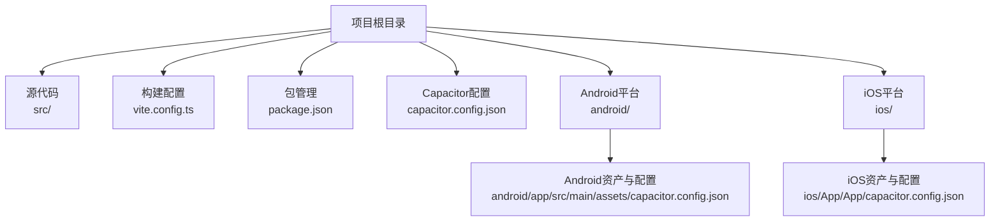
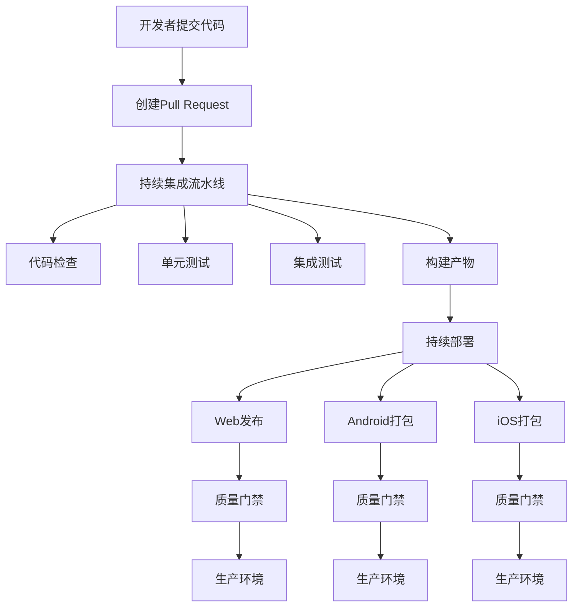
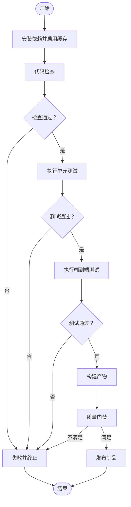
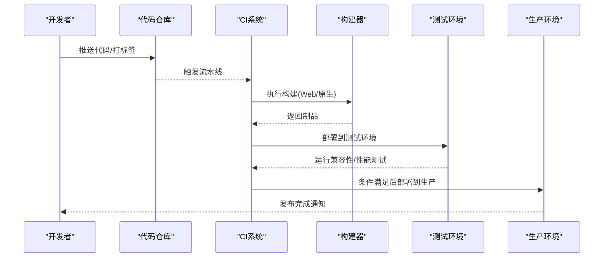
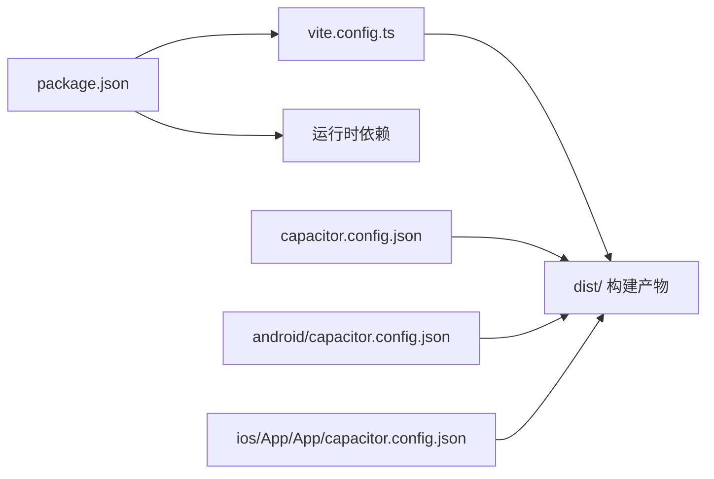

# CI/CD自动化流水线

<cite>
**本文档引用的文件**
- [package.json](file://package.json)
- [vite.config.ts](file://vite.config.ts)
- [capacitor.config.json](file://capacitor.config.json)
- [android/app/src/main/assets/capacitor.config.json](file://android/app/src/main/assets/capacitor.config.json)
- [ios/App/App/capacitor.config.json](file://ios/App/App/capacitor.config.json)
- [README.md](file://README.md)
</cite>

## 目录
1. [简介](#简介)
2. [项目结构](#项目结构)
3. [核心组件](#核心组件)
4. [架构总览](#架构总览)
5. [详细组件分析](#详细组件分析)
6. [依赖关系分析](#依赖关系分析)
7. [性能考虑](#性能考虑)
8. [故障排除指南](#故障排除指南)
9. [结论](#结论)
10. [附录](#附录)

## 简介
本指南面向Note-taking app前端项目，提供从持续集成到持续部署的完整实施路径。项目基于Vite构建工具与Capacitor跨平台框架，支持Web与原生应用（Android/iOS）打包。文档覆盖以下主题：
- 持续集成：代码检查、单元测试、集成测试的自动化执行
- 持续部署：自动构建、测试验证、部署触发机制
- 平台配置：以GitHub Actions为例的工作流定义、环境变量与密钥管理
- 自动化测试：端到端测试、性能测试、兼容性测试的集成方案
- 部署环境管理：开发、测试、生产环境的隔离与切换
- 最佳实践与故障排除

## 项目结构
该项目采用前端单页应用架构，结合Capacitor进行原生能力封装与打包。关键目录与文件如下：
- 根目录包含包管理与构建配置：package.json、vite.config.ts
- Capacitor配置：根级与各平台配置文件（capacitor.config.json、android与ios对应配置）
- 源码与资源：src目录存放React组件、服务、类型与样式；dist用于构建输出
- 平台工程：android与ios目录分别包含原生工程与插件配置

**图表来源**
- [package.json:1-113](file://package.json#L1-L113)
- [vite.config.ts:1-44](file://vite.config.ts#L1-L44)
- [capacitor.config.json:1-31](file://capacitor.config.json#L1-L31)
- [android/app/src/main/assets/capacitor.config.json:1-31](file://android/app/src/main/assets/capacitor.config.json#L1-L31)
- [ios/App/App/capacitor.config.json:1-35](file://ios/App/App/capacitor.config.json#L1-L35)

**章节来源**
- [package.json:1-113](file://package.json#L1-L113)
- [vite.config.ts:1-44](file://vite.config.ts#L1-L44)
- [capacitor.config.json:1-31](file://capacitor.config.json#L1-L31)
- [android/app/src/main/assets/capacitor.config.json:1-31](file://android/app/src/main/assets/capacitor.config.json#L1-L31)
- [ios/App/App/capacitor.config.json:1-35](file://ios/App/App/capacitor.config.json#L1-L35)

## 核心组件
- 构建与打包
  - Vite作为构建工具，负责开发服务器、资源优化与产物生成
  - Capacitor配置决定Web目录与原生插件行为
- 脚本与依赖
  - package.json中定义了构建与开发脚本，以及运行时与开发时依赖
- 平台适配
  - Android/iOS平台各自维护Capacitor配置，确保Web资源正确嵌入与加载

**章节来源**
- [package.json:6-11](file://package.json#L6-L11)
- [vite.config.ts:6-44](file://vite.config.ts#L6-L44)
- [capacitor.config.json:4](file://capacitor.config.json#L4)

## 架构总览
下图展示了从代码提交到多平台发布的整体流程，包括CI阶段的检查与测试，以及CD阶段的构建与部署。

## 详细组件分析

### 持续集成流水线设计
- 触发条件
  - 推送到默认分支或PR更新时触发
  - 支持按标签或分支模式过滤
- 步骤分解
  - 环境准备：安装依赖（建议使用缓存策略）
  - 代码检查：静态分析与格式校验
  - 单元测试：覆盖率统计与失败即停
  - 集成测试：端到端测试与兼容性测试
  - 构建产物：生成Web与原生应用包
- 质量门禁
  - 失败直接阻断后续步骤
  - 可选：覆盖率阈值与安全扫描

### 持续部署策略
- 构建阶段
  - Web：Vite构建生成dist目录
  - 原生：Capacitor同步Web资源并生成平台工程
- 测试验证
  - 在预发布环境运行兼容性与性能测试
- 部署触发
  - 合并主分支或打标签触发
  - 使用环境变量控制目标环境与发布策略

### GitHub Actions工作流配置要点
- 工作流文件位置：.github/workflows
- 关键要素
  - 触发器：push、pull_request、release
  - 环境变量：通过仓库设置或加密密钥管理
  - 缓存策略：加速依赖安装
  - 并行任务：检查、测试、构建分阶段执行
  - 安全：避免在日志中打印敏感信息

### 环境变量与密钥管理
- 环境变量
  - API端点、第三方SDK密钥等通过仓库设置注入
- 密钥管理
  - 使用加密密钥存储证书与签名材料
  - 限制访问范围与轮换周期

### 自动化测试集成方案
- 单元测试
  - 使用测试框架与覆盖率工具
  - 与CI集成，失败即停
- 端到端测试
  - 在真实浏览器或移动设备上运行
  - 覆盖关键用户路径与交互
- 性能测试
  - 页面加载时间、首屏渲染、内存占用
- 兼容性测试
  - 不同浏览器、操作系统版本与屏幕尺寸
  - 原生平台：Android/iOS不同版本

### 部署环境管理
- 环境隔离
  - 开发：快速迭代与本地调试
  - 测试：模拟生产数据与流程
  - 生产：严格的质量门禁与回滚策略
- 切换机制
  - 通过分支策略与标签控制发布节奏
  - 使用环境变量区分配置

## 依赖关系分析
- 构建链路
  - package.json中的脚本驱动Vite构建
  - Capacitor配置决定Web目录与原生插件行为
- 依赖耦合
  - Vite插件与TailwindCSS、React等存在强耦合
  - Capacitor与平台配置文件需保持一致

**图表来源**
- [package.json:6-11](file://package.json#L6-L11)
- [vite.config.ts:6-44](file://vite.config.ts#L6-L44)
- [capacitor.config.json:4](file://capacitor.config.json#L4)
- [android/app/src/main/assets/capacitor.config.json:4](file://android/app/src/main/assets/capacitor.config.json#L4)
- [ios/App/App/capacitor.config.json:4](file://ios/App/App/capacitor.config.json#L4)

**章节来源**
- [package.json:6-11](file://package.json#L6-L11)
- [vite.config.ts:6-44](file://vite.config.ts#L6-L44)
- [capacitor.config.json:4](file://capacitor.config.json#L4)

## 性能考虑
- 构建性能
  - 启用Vite依赖预打包与去重策略
  - 使用缓存减少重复安装与编译时间
- 测试性能
  - 并行执行测试用例，缩短总耗时
  - 选择代表性测试集，平衡覆盖率与速度
- 部署性能
  - 分离构建与部署阶段，避免重复构建
  - 使用CDN与缓存策略提升发布效率

## 故障排除指南
- 构建失败
  - 检查Vite配置与依赖版本一致性
  - 确认Capacitor配置与Web目录匹配
- 测试异常
  - 校验测试环境与浏览器版本
  - 查看测试报告与日志定位问题
- 部署问题
  - 确认环境变量与密钥配置正确
  - 回滚至上一稳定版本并逐步排查

## 结论
通过将代码检查、单元测试、集成测试与构建部署整合到统一的CI/CD流水线中，并结合环境隔离与质量门禁，可显著提升交付效率与软件质量。建议从最小可行流水线起步，逐步完善测试覆盖与自动化策略。

## 附录
- 快速参考
  - 构建命令：参见package.json中的构建脚本
  - 开发服务器：参见package.json中的开发脚本
  - Capacitor配置：参见根级与平台配置文件

**章节来源**
- [README.md:6-10](file://README.md#L6-L10)
- [package.json:6-11](file://package.json#L6-L11)