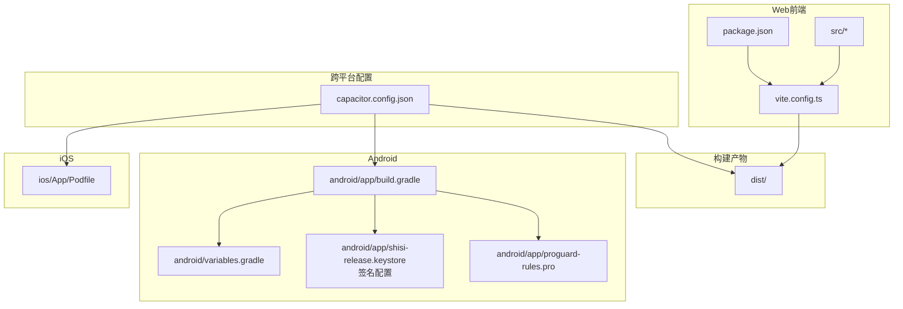
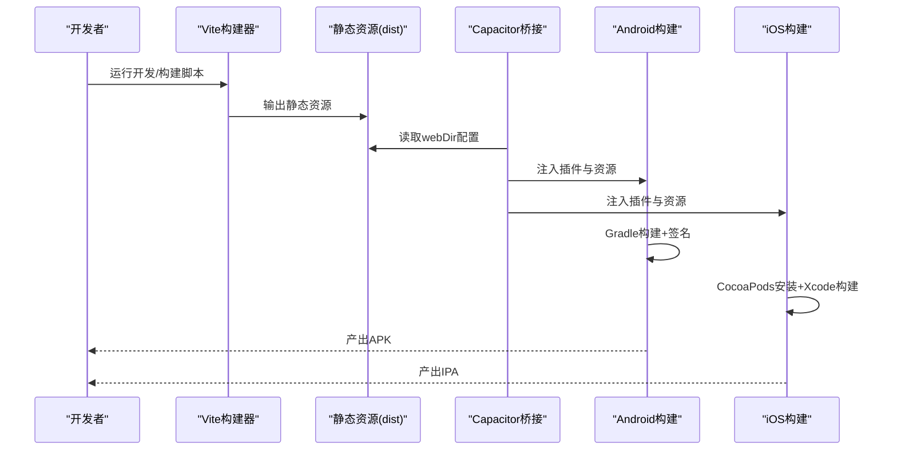
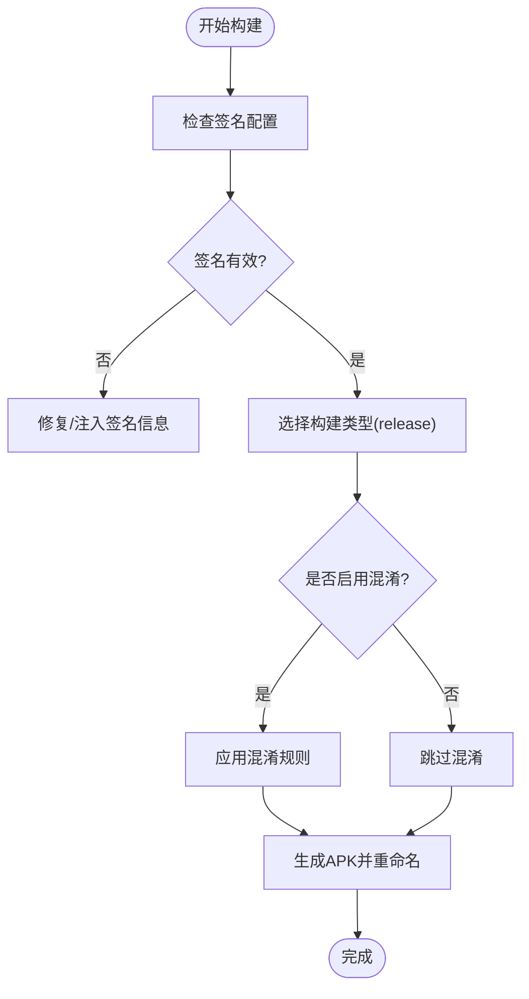
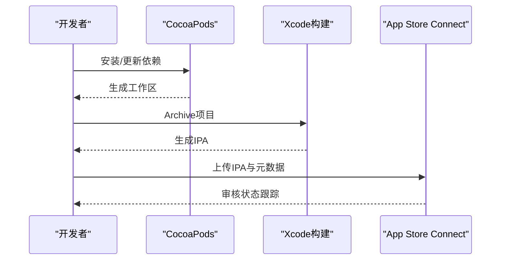
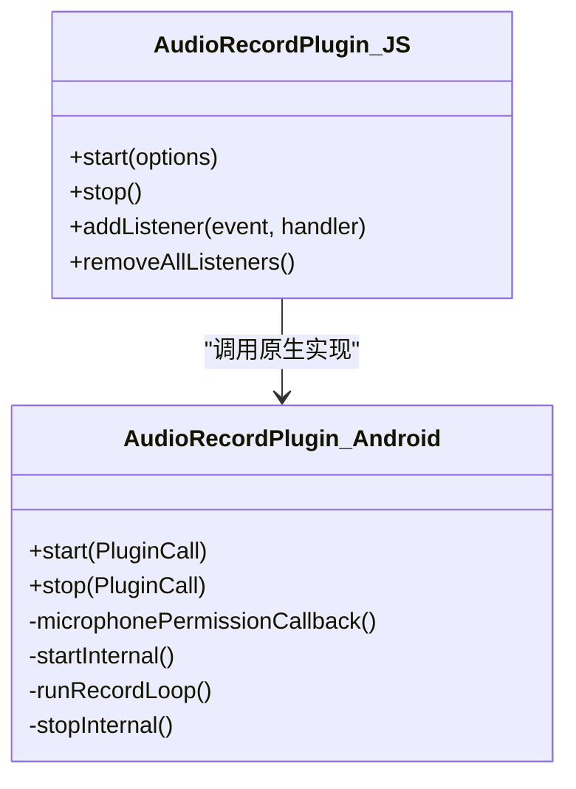
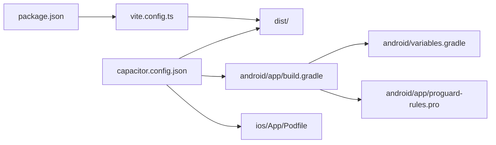

# 多平台部署策略

<cite>
**本文引用的文件**
- [package.json](file://package.json)
- [vite.config.ts](file://vite.config.ts)
- [capacitor.config.json](file://capacitor.config.json)
- [README.md](file://README.md)
- [android/build.gradle](file://android/build.gradle)
- [android/app/build.gradle](file://android/app/build.gradle)
- [android/app/proguard-rules.pro](file://android/app/proguard-rules.pro)
- [android/app/capacitor.build.gradle](file://android/app/capacitor.build.gradle)
- [android/variables.gradle](file://android/variables.gradle)
- [ios/App/Podfile](file://ios/App/Podfile)
- [src/main.tsx](file://src/main.tsx)
- [src/app/App.tsx](file://src/app/App.tsx)
- [src/app/services/audioRecordService.ts](file://src/app/services/audioRecordService.ts)
- [android/app/src/main/java/com/shisi/app/v2/plugins/AudioRecordPlugin.java](file://android/app/src/main/java/com/shisi/app/v2/plugins/AudioRecordPlugin.java)
</cite>

## 目录
1. [简介](#简介)
2. [项目结构](#项目结构)
3. [核心组件](#核心组件)
4. [架构总览](#架构总览)
5. [详细组件分析](#详细组件分析)
6. [依赖关系分析](#依赖关系分析)
7. [性能考虑](#性能考虑)
8. [故障排除指南](#故障排除指南)
9. [结论](#结论)
10. [附录](#附录)

## 简介
本指南面向需要在Web与移动端（Android/iOS）进行多平台部署的团队，围绕以下目标展开：  
- Web应用的部署流程：静态资源托管、域名配置、CDN优化  
- Android平台的APK构建与发布：签名配置、混淆设置、性能优化  
- iOS平台的IPA构建与App Store发布：证书与描述文件、审核准备  
- 跨平台一致性保障：版本同步、功能对齐、用户体验统一  
- 平台特定配置与优化：原生能力集成与权限管理  
- 最佳实践与常见问题解决方案  

本项目采用前端框架与跨平台容器（Capacitor）结合的方式，通过Vite构建Web资源，再由Capacitor桥接到Android与iOS原生环境。

## 项目结构
该仓库包含Web前端源码、Android与iOS工程以及跨平台配置文件。关键目录与职责如下：
- src：React前端源码，包含页面、组件、服务与类型定义
- dist：Vite构建输出的静态资源目录（用于Web托管与Capacitor webDir）
- android：Android工程，含Gradle配置、签名配置、ProGuard规则、Capacitor桥接
- ios：iOS工程，含CocoaPods配置、Capacitor桥接
- 根目录配置：包管理与构建脚本、跨平台配置、音频录制插件示例

图表来源
- [vite.config.ts:1-44](file://vite.config.ts#L1-L44)
- [package.json:1-113](file://package.json#L1-L113)
- [capacitor.config.json:1-31](file://capacitor.config.json#L1-L31)
- [android/app/build.gradle:1-72](file://android/app/build.gradle#L1-L72)
- [android/variables.gradle:1-16](file://android/variables.gradle#L1-L16)
- [android/app/proguard-rules.pro:1-22](file://android/app/proguard-rules.pro#L1-L22)
- [ios/App/Podfile:1-26](file://ios/App/Podfile#L1-L26)

章节来源
- [package.json:1-113](file://package.json#L1-L113)
- [vite.config.ts:1-44](file://vite.config.ts#L1-L44)
- [capacitor.config.json:1-31](file://capacitor.config.json#L1-L31)
- [android/app/build.gradle:1-72](file://android/app/build.gradle#L1-L72)
- [android/variables.gradle:1-16](file://android/variables.gradle#L1-L16)
- [android/app/proguard-rules.pro:1-22](file://android/app/proguard-rules.pro#L1-L22)
- [ios/App/Podfile:1-26](file://ios/App/Podfile#L1-L26)

## 核心组件
- 构建与打包
  - Vite配置：启用React与TailwindCSS插件，路径别名与依赖预打包，确保React实例唯一性
  - 包管理：脚本定义构建与开发命令，依赖与覆盖版本声明
- 跨平台配置
  - Capacitor配置：应用ID、应用名、Web目录、服务器参数、插件行为（状态栏、键盘、启动页）
- 原生能力示例
  - 音频录制插件：JS接口与Android原生实现，支持麦克风权限与PCM16LE分片推送

章节来源
- [vite.config.ts:1-44](file://vite.config.ts#L1-L44)
- [package.json:6-11](file://package.json#L6-L11)
- [capacitor.config.json:1-31](file://capacitor.config.json#L1-L31)
- [src/app/services/audioRecordService.ts:1-35](file://src/app/services/audioRecordService.ts#L1-L35)

## 架构总览
下图展示从源码到多平台产物的关键流程：  
- 开发阶段：Vite热更新与依赖优化  
- 构建阶段：打包静态资源至dist  
- 集成阶段：Capacitor读取dist作为Web内容，注入原生插件  
- 发布阶段：Android生成签名APK；iOS生成IPA并提交审核

图表来源
- [package.json:6-11](file://package.json#L6-L11)
- [vite.config.ts:1-44](file://vite.config.ts#L1-L44)
- [capacitor.config.json:4](file://capacitor.config.json#L4)
- [android/app/build.gradle:1-72](file://android/app/build.gradle#L1-L72)
- [ios/App/Podfile:1-26](file://ios/App/Podfile#L1-L26)

## 详细组件分析

### Web应用部署策略（静态资源托管、域名与CDN）
- 静态资源托管
  - 使用Vite构建输出的dist目录作为静态站点根目录
  - 将dist上传至CDN或静态托管服务（如对象存储直传、GitHub Pages、Vercel等）
- 域名配置
  - 在CDN或托管平台绑定自定义域名
  - 配置HTTPS证书（Let’s Encrypt或平台托管证书）
- CDN优化
  - 启用缓存策略：静态资源长缓存、HTML短缓存
  - 启用压缩（Gzip/Brotli）、图片优化（WebP/SVG）、按需加载与懒加载
  - 预连接关键域名（fonts.googleapis.com、cdn.jsdelivr.net等）

章节来源
- [vite.config.ts:1-44](file://vite.config.ts#L1-L44)
- [capacitor.config.json:4](file://capacitor.config.json#L4)

### Android平台：APK构建与发布
- 版本与构建
  - 版本号与名称：在模块级Gradle中维护
  - 构建类型：release开启调试标志以便测试，输出文件名固定
- 签名配置
  - 使用独立keystore文件与密码，避免硬编码在仓库
  - 在CI中安全注入密钥与密码
- 混淆与优化
  - 当前未启用混淆；如需混淆可启用并维护规则文件
  - 保留必要的类与成员以适配运行时反射需求
- 性能优化
  - 启动页与键盘行为：通过Capacitor插件配置提升体验
  - 资源裁剪：忽略不必要的资源，减少APK体积

图表来源
- [android/app/build.gradle:20-42](file://android/app/build.gradle#L20-L42)
- [android/app/proguard-rules.pro:1-22](file://android/app/proguard-rules.pro#L1-L22)

章节来源
- [android/app/build.gradle:1-72](file://android/app/build.gradle#L1-L72)
- [android/app/proguard-rules.pro:1-22](file://android/app/proguard-rules.pro#L1-L22)
- [android/variables.gradle:1-16](file://android/variables.gradle#L1-L16)
- [android/app/capacitor.build.gradle:1-21](file://android/app/capacitor.build.gradle#L1-L21)

### iOS平台：IPA构建与App Store发布
- 依赖与插件
  - 使用CocoaPods安装Capacitor与相关插件
  - 确保最低系统版本与构建设置一致
- 构建与分发
  - 使用Xcode Archive生成IPA
  - 通过Application Loader或Xcode上传至App Store Connect
- 审核准备
  - 准备隐私清单、截图与元数据
  - 确保权限请求文案与隐私政策合规

图表来源
- [ios/App/Podfile:1-26](file://ios/App/Podfile#L1-L26)

章节来源
- [ios/App/Podfile:1-26](file://ios/App/Podfile#L1-L26)

### 跨平台一致性保障
- 版本同步
  - 统一在Android与iOS工程中维护版本号与名称，确保发布记录一致
- 功能对齐
  - 通过Capacitor插件抽象原生能力，保持JS层API一致
  - 对不支持的特性提供降级提示或条件渲染
- 用户体验统一
  - 通过Capacitor插件统一状态栏、键盘与启动页行为
  - 在Web端与原生端保持路由与主题上下文一致

章节来源
- [capacitor.config.json:1-31](file://capacitor.config.json#L1-L31)
- [src/app/App.tsx:1-17](file://src/app/App.tsx#L1-L17)
- [src/main.tsx:1-7](file://src/main.tsx#L1-L7)

### 平台特定配置与优化
- Android
  - SDK版本与依赖变量集中管理
  - 通过Capacitor桥接第三方插件（如语音识别）
- iOS
  - Podfile声明插件与最低系统版本
  - 构建后断言部署目标，避免兼容性问题
- 权限管理
  - 音频录制使用麦克风权限，需在运行时申请并处理拒绝场景
  - 在Android与iOS分别配置权限与说明文案

图表来源
- [src/app/services/audioRecordService.ts:1-35](file://src/app/services/audioRecordService.ts#L1-L35)
- [android/app/src/main/java/com/shisi/app/v2/plugins/AudioRecordPlugin.java:1-230](file://android/app/src/main/java/com/shisi/app/v2/plugins/AudioRecordPlugin.java#L1-L230)

章节来源
- [android/variables.gradle:1-16](file://android/variables.gradle#L1-L16)
- [ios/App/Podfile:1-26](file://ios/App/Podfile#L1-L26)
- [src/app/services/audioRecordService.ts:1-35](file://src/app/services/audioRecordService.ts#L1-L35)
- [android/app/src/main/java/com/shisi/app/v2/plugins/AudioRecordPlugin.java:1-230](file://android/app/src/main/java/com/shisi/app/v2/plugins/AudioRecordPlugin.java#L1-L230)

## 依赖关系分析
- 构建链路
  - package.json中的脚本驱动Vite构建
  - Vite配置决定资源打包与优化策略
  - Capacitor配置决定Web内容目录与插件行为
- 平台链路
  - Android：Gradle聚合构建，签名与混淆规则控制产物质量
  - iOS：CocoaPods安装插件，Xcode负责最终IPA生成

图表来源
- [package.json:6-11](file://package.json#L6-L11)
- [vite.config.ts:1-44](file://vite.config.ts#L1-L44)
- [capacitor.config.json:1-31](file://capacitor.config.json#L1-L31)
- [android/app/build.gradle:1-72](file://android/app/build.gradle#L1-L72)
- [android/variables.gradle:1-16](file://android/variables.gradle#L1-L16)
- [android/app/proguard-rules.pro:1-22](file://android/app/proguard-rules.pro#L1-L22)
- [ios/App/Podfile:1-26](file://ios/App/Podfile#L1-L26)

章节来源
- [package.json:1-113](file://package.json#L1-L113)
- [vite.config.ts:1-44](file://vite.config.ts#L1-L44)
- [capacitor.config.json:1-31](file://capacitor.config.json#L1-L31)
- [android/app/build.gradle:1-72](file://android/app/build.gradle#L1-L72)
- [android/variables.gradle:1-16](file://android/variables.gradle#L1-L16)
- [android/app/proguard-rules.pro:1-22](file://android/app/proguard-rules.pro#L1-L22)
- [ios/App/Podfile:1-26](file://ios/App/Podfile#L1-L26)

## 性能考虑
- Web端
  - 依赖预打包与去重，降低运行时包体膨胀风险
  - 图片与媒体资源优先使用现代格式，配合CDN缓存策略
- 原生端
  - 启动页与键盘行为优化，缩短感知等待时间
  - APK/IPA体积控制：移除未使用资源、启用压缩与摇树优化

## 故障排除指南
- 构建失败（Android）
  - 签名配置缺失：确认keystore路径与密码正确，避免硬编码到仓库
  - SDK版本不匹配：统一compile/target/minSdk版本
  - 插件冲突：检查Cordova插件与Capacitor插件的兼容性
- 构建失败（iOS）
  - CocoaPods未安装：执行安装并重新生成工作区
  - 最低系统版本不满足：调整Podfile与项目设置
- 运行时异常（权限）
  - 麦克风权限被拒：引导用户前往设置授权，或提供降级逻辑
- Capacitor桥接问题
  - 插件未生效：确认插件已添加到Capacitor配置并重新构建

章节来源
- [android/app/build.gradle:20-42](file://android/app/build.gradle#L20-L42)
- [android/variables.gradle:1-16](file://android/variables.gradle#L1-L16)
- [ios/App/Podfile:1-26](file://ios/App/Podfile#L1-L26)
- [src/app/services/audioRecordService.ts:1-35](file://src/app/services/audioRecordService.ts#L1-L35)
- [android/app/src/main/java/com/shisi/app/v2/plugins/AudioRecordPlugin.java:40-61](file://android/app/src/main/java/com/shisi/app/v2/plugins/AudioRecordPlugin.java#L40-L61)

## 结论
本项目通过Vite与Capacitor实现了Web与原生的高效融合。遵循本文档的部署策略与最佳实践，可在Web、Android与iOS平台上稳定交付一致的用户体验。建议在持续集成中自动化签名、混淆与审核元数据准备流程，进一步提升发布效率与质量。

## 附录
- 快速检查清单
  - Web：dist目录可访问、CDN缓存与HTTPS配置完成
  - Android：签名有效、混淆规则完备、最小SDK版本符合预期
  - iOS：CocoaPods安装成功、最低系统版本与构建设置一致
  - 权限：麦克风等敏感权限在两端均正确申请与提示