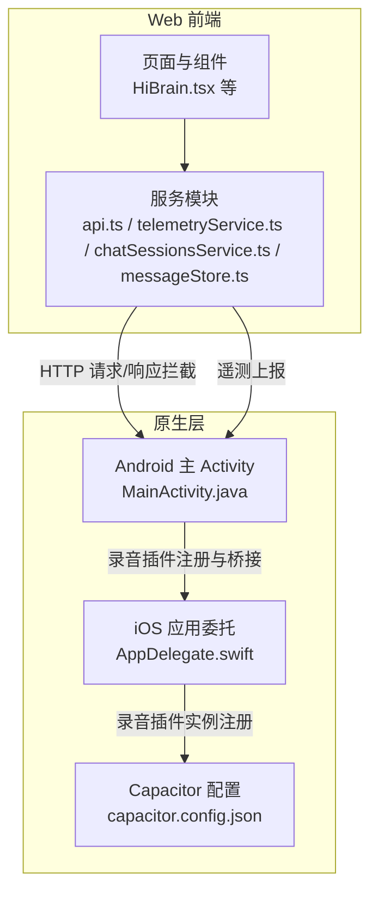
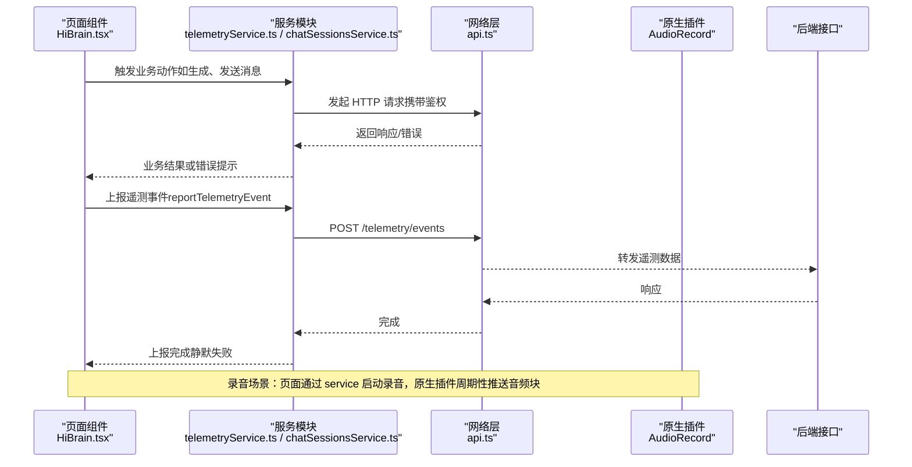
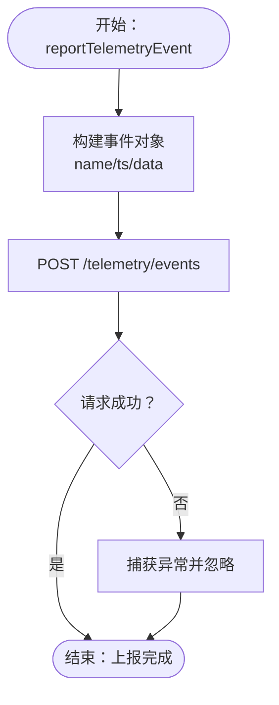
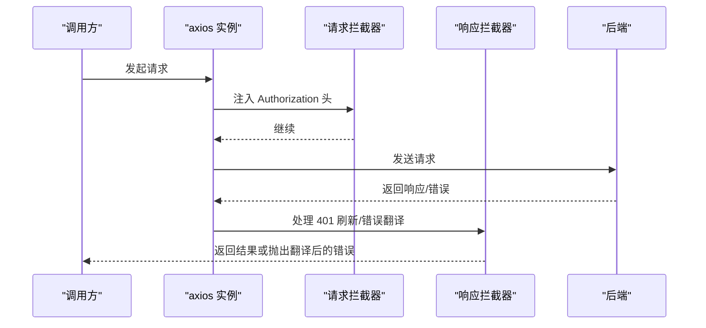
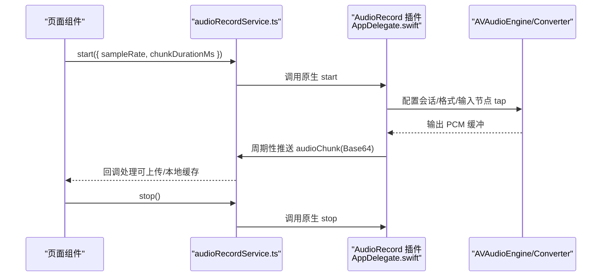
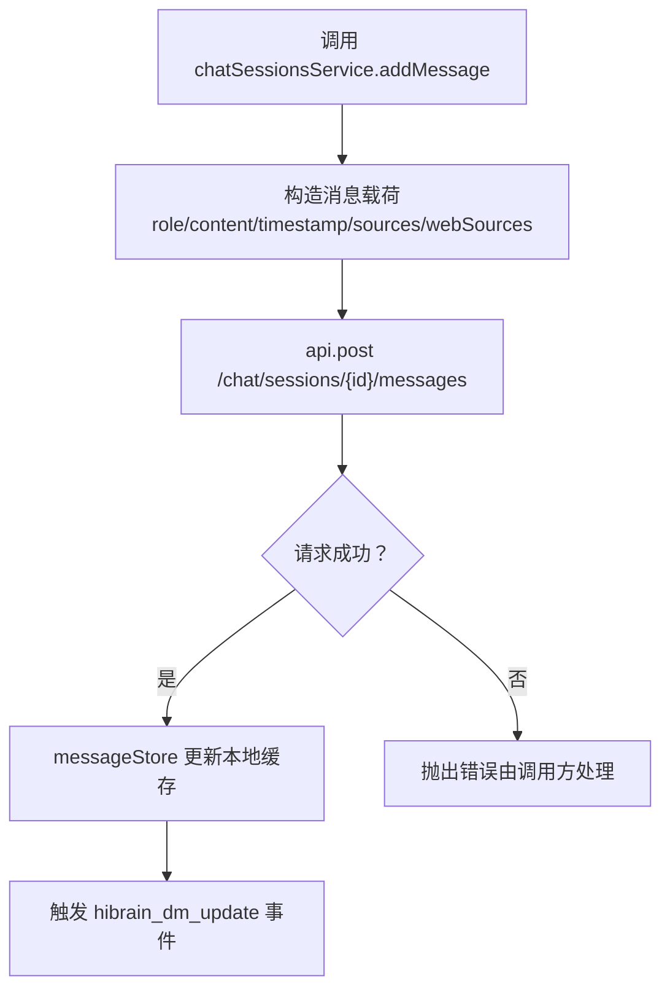
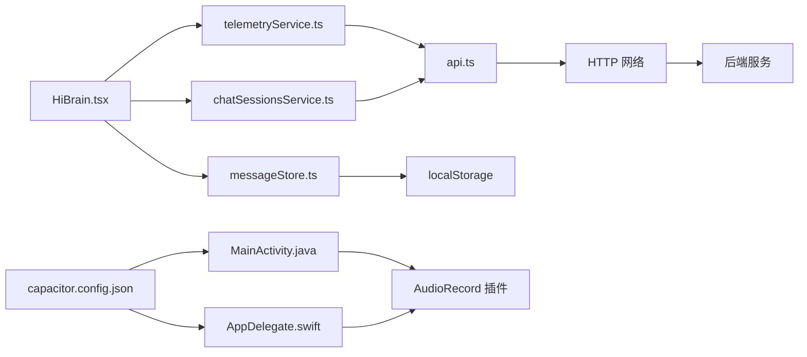

# 性能监控与运维

<cite>
**本文引用的文件**
- [README.md](file://README.md)
- [telemetryService.ts](file://src/app/services/telemetryService.ts)
- [api.ts](file://src/app/services/api.ts)
- [audioRecordService.ts](file://src/app/services/audioRecordService.ts)
- [MainActivity.java](file://android/app/src/main/java/com/shisi/app/v2/MainActivity.java)
- [AppDelegate.swift](file://ios/App/App/AppDelegate.swift)
- [capacitor.config.json](file://capacitor.config.json)
- [HiBrain.tsx](file://src/app/pages/HiBrain.tsx)
- [chatSessionsService.ts](file://src/app/services/chatSessionsService.ts)
- [messageStore.ts](file://src/app/services/messageStore.ts)
</cite>

## 目录
1. [引言](#引言)
2. [项目结构](#项目结构)
3. [核心组件](#核心组件)
4. [架构总览](#架构总览)
5. [详细组件分析](#详细组件分析)
6. [依赖分析](#依赖分析)
7. [性能考虑](#性能考虑)
8. [故障排查指南](#故障排查指南)
9. [结论](#结论)
10. [附录](#附录)

## 引言
本指南面向运维与开发团队，围绕前端性能监控与运维管理提供系统化实践路径。结合当前仓库中的遥测上报、音频录音插件、网络请求拦截与错误翻译、以及原生桥接能力，给出以下主题的落地建议：关键指标定义与采集、性能基准建立、告警配置、用户行为与使用统计、崩溃与错误追踪、用户反馈与问题定位、日志与健康检查、以及自动扩缩容等运维自动化思路。

## 项目结构
前端采用 Capacitor 跨平台架构，包含 Web 层与原生层（Android/iOS）。Web 层通过服务模块封装 API 请求与遥测上报；原生层通过插件扩展能力（如录音），并在应用生命周期中注册插件实例。

图表来源
- [api.ts:1-127](file://src/app/services/api.ts#L1-L127)
- [telemetryService.ts:1-22](file://src/app/services/telemetryService.ts#L1-L22)
- [audioRecordService.ts:1-35](file://src/app/services/audioRecordService.ts#L1-L35)
- [MainActivity.java:1-35](file://android/app/src/main/java/com/shisi/app/v2/MainActivity.java#L1-L35)
- [AppDelegate.swift:1-252](file://ios/App/App/AppDelegate.swift#L1-L252)
- [capacitor.config.json:1-31](file://capacitor.config.json#L1-L31)

章节来源
- [README.md:1-41](file://README.md#L1-L41)
- [capacitor.config.json:1-31](file://capacitor.config.json#L1-L31)

## 核心组件
- 遥测上报服务：提供统一事件上报接口，支持自定义事件名、时间戳与附加数据，并内置短超时以降低阻塞风险。
- 网络请求与错误处理：集中化请求/响应拦截，统一注入鉴权头、刷新令牌、全局错误文案翻译与兜底提示。
- 音频录音插件：提供跨平台录音能力，按固定时长切片推送 PCM 数据，便于流式处理与传输。
- 页面与服务：页面组件负责触发业务动作，服务模块负责与后端交互与本地存储。

章节来源
- [telemetryService.ts:1-22](file://src/app/services/telemetryService.ts#L1-L22)
- [api.ts:1-127](file://src/app/services/api.ts#L1-L127)
- [audioRecordService.ts:1-35](file://src/app/services/audioRecordService.ts#L1-L35)
- [HiBrain.tsx:1-200](file://src/app/pages/HiBrain.tsx#L1-L200)

## 架构总览
下图展示从页面到服务、再到原生插件与后端的整体调用链路与关键监控点。

图表来源
- [HiBrain.tsx:1-200](file://src/app/pages/HiBrain.tsx#L1-L200)
- [telemetryService.ts:1-22](file://src/app/services/telemetryService.ts#L1-L22)
- [api.ts:1-127](file://src/app/services/api.ts#L1-L127)
- [audioRecordService.ts:1-35](file://src/app/services/audioRecordService.ts#L1-L35)
- [AppDelegate.swift:52-56](file://ios/App/App/AppDelegate.swift#L52-L56)

## 详细组件分析

### 组件一：遥测事件上报（telemetryService）
- 功能职责：封装遥测事件上报，统一字段（名称、时间戳、附加数据），设置短超时，异常静默处理，避免影响主线程。
- 关键点：事件名与数据结构可扩展；上报失败不影响主流程；适合记录用户行为、功能使用次数、页面停留等。

图表来源
- [telemetryService.ts:1-22](file://src/app/services/telemetryService.ts#L1-L22)

章节来源
- [telemetryService.ts:1-22](file://src/app/services/telemetryService.ts#L1-L22)

### 组件二：网络请求与错误处理（api.ts）
- 功能职责：集中化请求/响应拦截，注入鉴权头、刷新令牌、全局错误文案翻译与兜底提示。
- 关键点：请求超时、鉴权头、401 自动刷新、错误信息友好化，提升用户体验与可观测性。

图表来源
- [api.ts:1-127](file://src/app/services/api.ts#L1-L127)

章节来源
- [api.ts:1-127](file://src/app/services/api.ts#L1-L127)

### 组件三：音频录音插件（audioRecordService + 原生桥接）
- 功能职责：JS 封装录音插件接口，原生层通过 AVAudioEngine 采集、转换、分片推送 PCM 数据，支持权限校验与错误处理。
- 关键点：固定时长切片（默认 800ms）、PCM16LE 单声道、Base64 传输，便于后端实时处理与存储。

图表来源
- [audioRecordService.ts:1-35](file://src/app/services/audioRecordService.ts#L1-L35)
- [AppDelegate.swift:58-252](file://ios/App/App/AppDelegate.swift#L58-L252)

章节来源
- [audioRecordService.ts:1-35](file://src/app/services/audioRecordService.ts#L1-L35)
- [AppDelegate.swift:58-252](file://ios/App/App/AppDelegate.swift#L58-L252)
- [MainActivity.java:11-17](file://android/app/src/main/java/com/shisi/app/v2/MainActivity.java#L11-L17)

### 组件四：聊天会话与消息存储（chatSessionsService / messageStore）
- 功能职责：会话列表、创建、查询、删除、重命名、新增消息；消息本地存储（localStorage），提供种子数据与分组显示。
- 关键点：消息持久化与更新事件派发；与后端接口解耦，便于前端性能优化与离线体验。

图表来源
- [chatSessionsService.ts:1-126](file://src/app/services/chatSessionsService.ts#L1-L126)
- [messageStore.ts:1-162](file://src/app/services/messageStore.ts#L1-L162)

章节来源
- [chatSessionsService.ts:1-126](file://src/app/services/chatSessionsService.ts#L1-L126)
- [messageStore.ts:1-162](file://src/app/services/messageStore.ts#L1-L162)

### 组件五：页面与健康检查（HiBrain.tsx）
- 功能职责：页面包含“健康检查”按钮与加载动画，用于触发后端健康探测并展示结果。
- 关键点：UI 反馈与结果展示，便于快速验证服务可用性。

章节来源
- [HiBrain.tsx:114-185](file://src/app/pages/HiBrain.tsx#L114-L185)

## 依赖分析
- Web 层依赖关系：页面组件依赖服务模块；服务模块依赖网络层与本地存储；遥测服务依赖网络层。
- 原生层依赖关系：MainActivity 注册录音插件；AppDelegate 在桥接时注册插件实例；Capacitor 配置控制 WebView 行为与插件启用。

图表来源
- [HiBrain.tsx:1-200](file://src/app/pages/HiBrain.tsx#L1-L200)
- [telemetryService.ts:1-22](file://src/app/services/telemetryService.ts#L1-L22)
- [chatSessionsService.ts:1-126](file://src/app/services/chatSessionsService.ts#L1-L126)
- [messageStore.ts:1-162](file://src/app/services/messageStore.ts#L1-L162)
- [api.ts:1-127](file://src/app/services/api.ts#L1-L127)
- [MainActivity.java:1-35](file://android/app/src/main/java/com/shisi/app/v2/MainActivity.java#L1-L35)
- [AppDelegate.swift:52-56](file://ios/App/App/AppDelegate.swift#L52-L56)
- [capacitor.config.json:1-31](file://capacitor.config.json#L1-L31)

章节来源
- [README.md:1-41](file://README.md#L1-L41)
- [capacitor.config.json:1-31](file://capacitor.config.json#L1-L31)

## 性能考虑
- 请求与响应拦截
  - 使用统一超时与鉴权头，减少重复逻辑与错误分支。
  - 对 401 场景进行自动刷新，避免频繁登录导致的性能损耗。
- 遥测上报
  - 短超时与静默失败，避免阻塞主线程；建议对高频事件做采样或批量上报。
- 音频录音
  - 固定时长切片与 PCM16LE 单声道，降低 CPU 与带宽压力；建议在弱网环境下降采样或禁用实时传输。
- 本地存储
  - localStorage 写入需注意容量限制与同步阻塞；建议分批写入与去抖。
- UI 渲染
  - 大量动画与滚动场景建议使用轻量动画库与虚拟列表，避免过度重排。

## 故障排查指南
- 网络错误与 401 刷新
  - 若出现“网络开小差”或“服务器打了个盹”，检查网络层拦截器的错误翻译与重试策略。
  - 若 401 刷新失败，确认刷新令牌存在且未被篡改，必要时引导用户重新登录。
- 遥测上报失败
  - 上报静默失败，建议在调试模式下开启日志输出，核对事件字段与后端接口。
- 录音权限与异常
  - iOS 需确保麦克风权限已授予；原生层对无效参数与运行中重复启动进行拒绝处理。
  - Android 需在 MainActivity 中注册插件，避免无法初始化。
- 健康检查
  - 页面“健康检查”按钮可快速验证后端可用性；若失败，查看返回结果并结合后端日志定位。

章节来源
- [api.ts:56-126](file://src/app/services/api.ts#L56-L126)
- [telemetryService.ts:9-21](file://src/app/services/telemetryService.ts#L9-L21)
- [audioRecordService.ts:26-35](file://src/app/services/audioRecordService.ts#L26-L35)
- [AppDelegate.swift:183-199](file://ios/App/App/AppDelegate.swift#L183-L199)
- [MainActivity.java:11-17](file://android/app/src/main/java/com/shisi/app/v2/MainActivity.java#L11-L17)
- [HiBrain.tsx:114-185](file://src/app/pages/HiBrain.tsx#L114-L185)

## 结论
本指南基于现有代码库梳理了前端性能监控与运维的关键路径：统一的网络层与遥测上报、原生插件桥接与权限管理、以及页面侧的健康检查与错误兜底。建议在此基础上进一步完善指标体系、告警策略与自动化运维流程，持续提升稳定性与用户体验。

## 附录
- 运维自动化建议（概念性）
  - 日志管理：统一结构化日志输出，区分级别与标签，接入集中式日志平台。
  - 健康检查：在页面与后台任务中定期探测关键接口，失败告警并自动回滚。
  - 自动扩缩容：基于请求延迟、错误率与资源使用率动态调整实例数量。
  - 用户反馈：在页面增加一键反馈入口，收集上下文信息与截图，辅助问题定位。