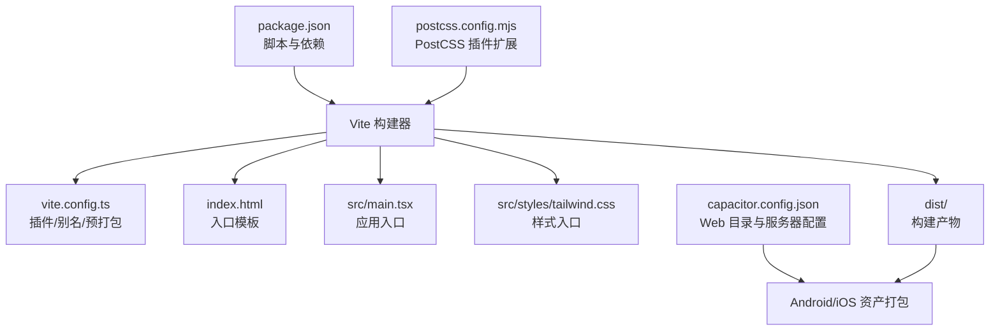
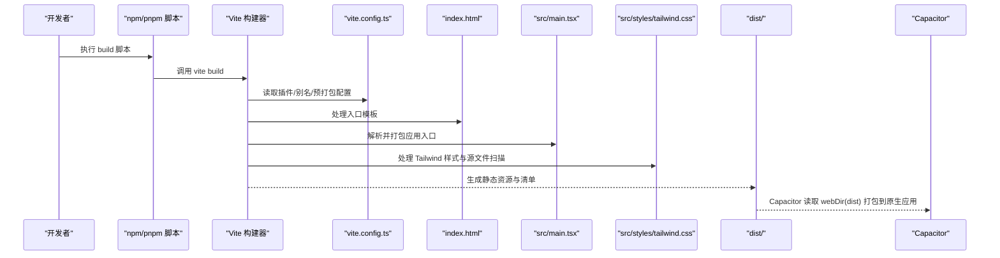
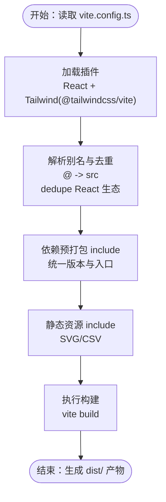
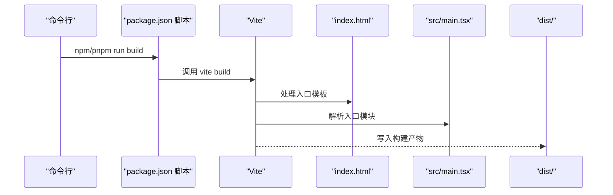
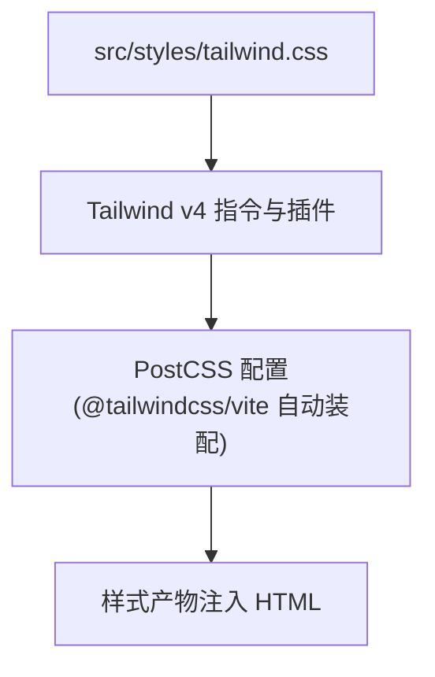
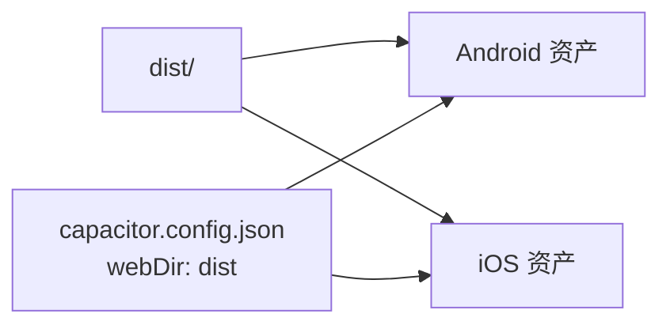
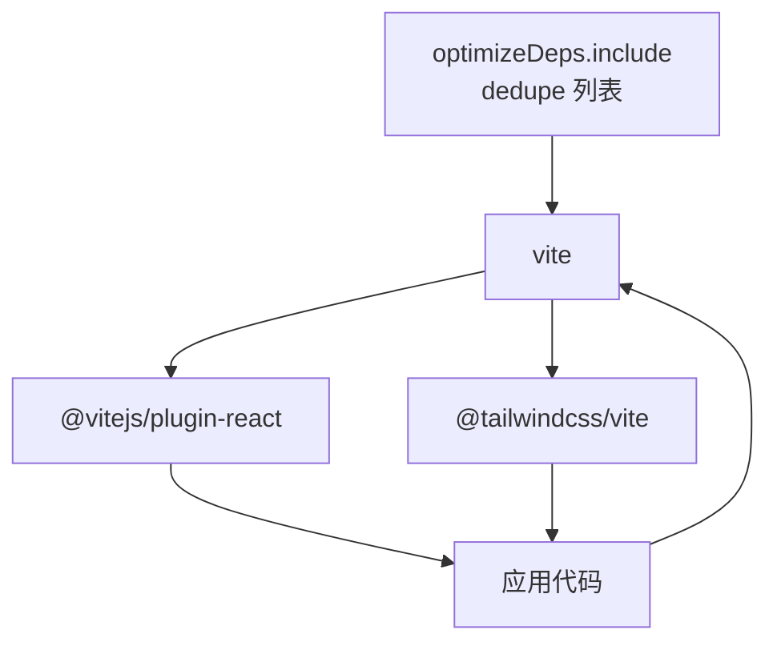

# 构建流程配置

<cite>
**本文引用的文件**
- [vite.config.ts](file://vite.config.ts)
- [package.json](file://package.json)
- [postcss.config.mjs](file://postcss.config.mjs)
- [capacitor.config.json](file://capacitor.config.json)
- [index.html](file://index.html)
- [src/main.tsx](file://src/main.tsx)
- [src/styles/tailwind.css](file://src/styles/tailwind.css)
</cite>

## 目录
1. [简介](#简介)
2. [项目结构](#项目结构)
3. [核心组件](#核心组件)
4. [架构总览](#架构总览)
5. [详细组件分析](#详细组件分析)
6. [依赖分析](#依赖分析)
7. [性能考虑](#性能考虑)
8. [故障排查指南](#故障排查指南)
9. [结论](#结论)
10. [附录](#附录)

## 简介
本文件面向开发者与运维人员，系统化梳理本项目的构建流程配置与优化策略。重点覆盖以下方面：
- Vite 构建工具的配置项与优化策略（生产构建参数、代码分割、资源优化）
- 构建脚本执行流程（从源码编译到产物生成）
- 构建期环境变量、路径别名与模块解析规则
- 构建产物结构与优化手段（压缩、Tree Shaking、资源内联）
- 性能优化最佳实践（并行构建、缓存、增量构建）
- 常见问题排查与性能调优建议

## 项目结构
本项目采用 Vite + Capacitor 的混合架构，前端以 Vite 构建，Capacitor 将 Web 资产打包进原生应用。关键目录与文件如下：
- 配置层：vite.config.ts、postcss.config.mjs、capacitor.config.json
- 入口与页面：index.html、src/main.tsx
- 样式与主题：src/styles/tailwind.css
- 包管理与脚本：package.json

图表来源
- [package.json](file://package.json)
- [vite.config.ts](file://vite.config.ts)
- [index.html](file://index.html)
- [src/main.tsx](file://src/main.tsx)
- [src/styles/tailwind.css](file://src/styles/tailwind.css)
- [postcss.config.mjs](file://postcss.config.mjs)
- [capacitor.config.json](file://capacitor.config.json)

章节来源
- [package.json](file://package.json)
- [vite.config.ts](file://vite.config.ts)
- [index.html](file://index.html)
- [src/main.tsx](file://src/main.tsx)
- [src/styles/tailwind.css](file://src/styles/tailwind.css)
- [postcss.config.mjs](file://postcss.config.mjs)
- [capacitor.config.json](file://capacitor.config.json)

## 核心组件
- Vite 配置与插件
  - 插件：React 与 Tailwind CSS（通过 @tailwindcss/vite）
  - 模块解析：路径别名 @ 指向 src；dedupe React 生态避免重复实例
  - 依赖预打包：将 React 生态与部分第三方库纳入 optimizeDeps.include，确保统一版本与 ESM/CJS 一致性
  - 静态资源：显式包含 SVG、CSV 等类型
- 构建脚本与产物
  - scripts.build 指向 vite build；产物输出至 dist
  - Capacitor 配置 webDir 指向 dist，用于将 Web 资产打入原生应用
- 样式体系
  - Tailwind CSS v4 通过 CSS 指令声明配置与源文件扫描范围
  - PostCSS 配置为空，由 @tailwindcss/vite 自动装配所需插件

章节来源
- [vite.config.ts](file://vite.config.ts)
- [package.json](file://package.json)
- [capacitor.config.json](file://capacitor.config.json)
- [src/styles/tailwind.css](file://src/styles/tailwind.css)
- [postcss.config.mjs](file://postcss.config.mjs)

## 架构总览
下图展示从源码到最终产物的关键流程，以及与 Capacitor 的集成点。

图表来源
- [package.json](file://package.json)
- [vite.config.ts](file://vite.config.ts)
- [index.html](file://index.html)
- [src/main.tsx](file://src/main.tsx)
- [src/styles/tailwind.css](file://src/styles/tailwind.css)
- [capacitor.config.json](file://capacitor.config.json)

## 详细组件分析

### Vite 配置与优化策略
- 插件体系
  - React 插件：启用 JSX/TSX 编译与开发体验优化
  - Tailwind CSS 插件：通过 @tailwindcss/vite 自动装配必要 PostCSS 插件，无需手动维护 tailwind.config.js
- 路径别名与模块解析
  - 别名 @ 指向 src，便于统一导入路径
  - dedupe 列表包含 react、react-dom 及 motion、tiptap 等生态库，避免多实例导致的 Hook 错误
- 依赖预打包与去重
  - optimizeDeps.include 显式声明 React 生态与 tiptap 相关包，确保统一入口与 ESM/CJS 一致性
  - 结合 dedupe，减少运行时重复实例带来的体积与稳定性风险
- 静态资源处理
  - assetsInclude 显式包含 SVG、CSV，避免被忽略导致运行时报错
- 生产构建参数与优化
  - 当前仓库未显式设置 rollupOptions 或其他生产优化项，建议结合业务场景补充：
    - external 与 output.manualChunks 控制代码分割
    - terser 或 esbuild 压缩器配置
    - 资源内联阈值与公共 CDN 引入策略
    - sourcemap 生成策略（开发/生产）

图表来源
- [vite.config.ts](file://vite.config.ts)

章节来源
- [vite.config.ts](file://vite.config.ts)

### 构建脚本与执行流程
- 脚本定义
  - build：vite build
  - dev：vite（开发服务器）
- 入口与模板
  - index.html 提供挂载点与入口脚本
  - src/main.tsx 作为应用根入口，渲染 App 组件
- 产物位置
  - dist 为默认输出目录，Capacitor 读取 webDir 指向该目录

图表来源
- [package.json](file://package.json)
- [index.html](file://index.html)
- [src/main.tsx](file://src/main.tsx)

章节来源
- [package.json](file://package.json)
- [index.html](file://index.html)
- [src/main.tsx](file://src/main.tsx)

### 样式与主题配置
- Tailwind CSS v4
  - 使用 CSS 指令声明配置与源文件扫描范围，自动按需生成样式
  - 引入 typography 插件与 tw-animate-css 动画库
- PostCSS
  - 当前为空配置，由 @tailwindcss/vite 自动装配所需插件
  - 如需额外插件（如嵌套），可在 postcss.config.mjs 中扩展

图表来源
- [src/styles/tailwind.css](file://src/styles/tailwind.css)
- [postcss.config.mjs](file://postcss.config.mjs)

章节来源
- [src/styles/tailwind.css](file://src/styles/tailwind.css)
- [postcss.config.mjs](file://postcss.config.mjs)

### Capacitor 集成与构建产物
- Capacitor 配置
  - webDir 指向 dist，确保构建产物可被原生应用访问
  - 服务器配置（androidScheme、cleartext）影响开发与调试行为
- 产物分发
  - Android/iOS 资产目录中包含 dist 产出的 index.html 与 JS/CSS 资源
  - 产物命名含哈希后缀（如 web-xxxxxx.js），利于缓存与更新

图表来源
- [capacitor.config.json](file://capacitor.config.json)

章节来源
- [capacitor.config.json](file://capacitor.config.json)

## 依赖分析
- 构建期依赖
  - vite、@vitejs/plugin-react、@tailwindcss/vite
- 运行期依赖
  - React 生态、Radix UI、Material-UI、Tiptap、Motion、Emotion 等
- 优化相关
  - optimizeDeps.include 与 dedupe 降低重复依赖与运行时错误
  - assetsInclude 确保静态资源可用性

图表来源
- [vite.config.ts](file://vite.config.ts)
- [package.json](file://package.json)

章节来源
- [vite.config.ts](file://vite.config.ts)
- [package.json](file://package.json)

## 性能考虑
- 并行与缓存
  - Vite 默认使用 Rollup 打包，具备良好的并发与缓存能力
  - 建议开启浏览器缓存与长效缓存策略（基于产物哈希命名）
- 代码分割
  - 在 vite.config.ts 中通过 output.manualChunks 或 external 控制第三方库拆分
  - 将稳定不变的依赖（如 React 生态）独立分包，提升缓存命中率
- Tree Shaking 与压缩
  - 使用 esbuild 或 Terser 压缩器，按需移除未使用代码
  - 确保模块采用 ESM 导出，提升摇树效率
- 资源优化
  - 图片与字体按需引入，避免全量打包
  - SVG/CSV 已通过 assetsInclude 显式包含，避免遗漏
- 开发体验
  - dev 脚本使用 Vite 开发服务器，热更新与快速启动
  - 生产构建前进行本地预检，确保无明显体积回归

## 故障排查指南
- “Invalid hook call”或 React 多实例报错
  - 检查 vite.config.ts 的 dedupe 列表是否包含相关库（如 motion、tiptap）
  - 确认 optimizeDeps.include 是否包含对应包，避免 CJS/ESM 混用
- 静态资源 404
  - 确认 assetsInclude 是否包含所需类型（当前已包含 SVG/CSV）
  - 检查资源路径是否正确，避免相对路径与别名混用导致解析失败
- 样式未生效或按需失效
  - 确认 src/styles/tailwind.css 的 @source 范围覆盖到目标源文件
  - 若使用额外 PostCSS 插件，检查 postcss.config.mjs 的配置
- Capacitor 无法加载页面
  - 确认 capacitor.config.json 的 webDir 指向 dist
  - 检查 dist 是否包含 index.html 与哈希命名的 JS/CSS 文件
- 构建体积异常增大
  - 使用打包分析工具定位大体积依赖（如 motion、tiptap、emotion）
  - 合理拆分 vendor chunk，启用 Tree Shaking 与压缩

章节来源
- [vite.config.ts](file://vite.config.ts)
- [src/styles/tailwind.css](file://src/styles/tailwind.css)
- [postcss.config.mjs](file://postcss.config.mjs)
- [capacitor.config.json](file://capacitor.config.json)

## 结论
本项目以 Vite 为核心构建工具，配合 @tailwindcss/vite 实现现代化样式管线，Capacitor 将 Web 资产无缝集成到原生应用。通过路径别名、模块去重与依赖预打包，有效降低了运行时错误与体积膨胀风险。建议在现有基础上进一步完善生产构建参数（代码分割、压缩、资源内联）与缓存策略，持续监控构建体积与启动性能，确保在多端的一致体验。

## 附录
- 关键配置一览
  - vite.config.ts：插件、别名、去重、预打包、静态资源
  - package.json：脚本与依赖
  - postcss.config.mjs：PostCSS 扩展位
  - capacitor.config.json：webDir 与服务器配置
  - index.html：入口模板
  - src/main.tsx：应用入口
  - src/styles/tailwind.css：样式入口与插件

章节来源
- [vite.config.ts](file://vite.config.ts)
- [package.json](file://package.json)
- [postcss.config.mjs](file://postcss.config.mjs)
- [capacitor.config.json](file://capacitor.config.json)
- [index.html](file://index.html)
- [src/main.tsx](file://src/main.tsx)
- [src/styles/tailwind.css](file://src/styles/tailwind.css)