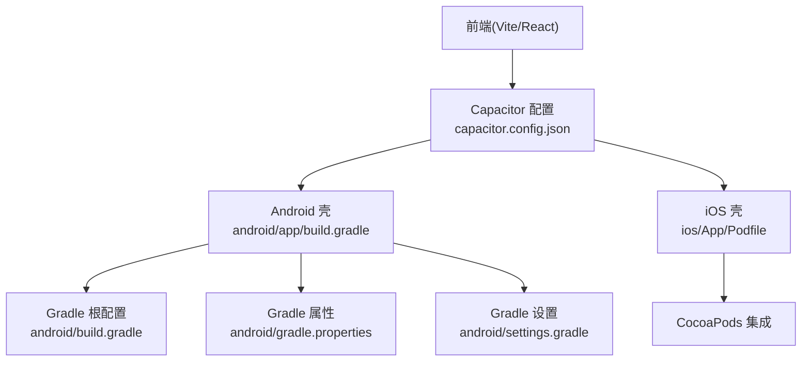
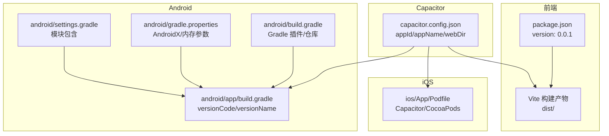
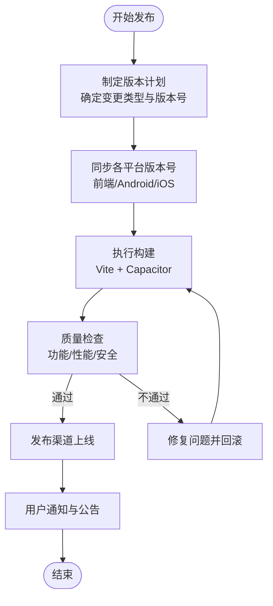
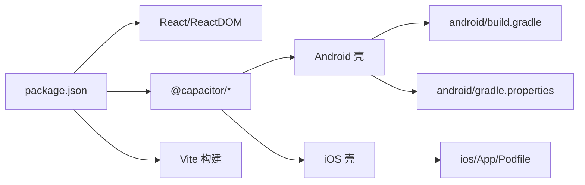

# 版本管理与发布流程

<cite>
**本文档引用的文件**
- [package.json](file://package.json)
- [android/app/build.gradle](file://android/app/build.gradle)
- [android/build.gradle](file://android/build.gradle)
- [android/gradle.properties](file://android/gradle.properties)
- [android/settings.gradle](file://android/settings.gradle)
- [ios/App/Podfile](file://ios/App/Podfile)
- [capacitor.config.json](file://capacitor.config.json)
- [README.md](file://README.md)
- [src/app/pages/Profile.tsx](file://src/app/pages/Profile.tsx)
- [guidelines/Guidelines.md](file://guidelines/Guidelines.md)
</cite>

## 目录
1. [简介](#简介)
2. [项目结构](#项目结构)
3. [核心组件](#核心组件)
4. [架构总览](#架构总览)
5. [详细组件分析](#详细组件分析)
6. [依赖关系分析](#依赖关系分析)
7. [性能考量](#性能考量)
8. [故障排除指南](#故障排除指南)
9. [结论](#结论)
10. [附录](#附录)

## 简介
本指南面向产品与工程团队，系统阐述该跨平台前端应用的版本管理与发布流程。项目采用 Capacitor 构建 Android/iOS 原生壳，并通过 Vite 进行前端构建。当前仓库未内置自动化变更日志与版本标记工具链，但已具备基础的版本号配置位置与多平台打包能力。本指南在现有基础上提出可落地的版本管理策略与发布规范，覆盖语义化版本、变更类型分类、版本规划、发布流程、多平台一致性、回滚与热修复、质量检查清单以及最佳实践。

## 项目结构
该项目为跨平台前端应用，包含以下关键目录与文件：
- 前端与构建：Vite 配置、React 组件、服务层与工具模块
- Android 壳：Gradle 工程、签名配置、构建产物命名
- iOS 壳：CocoaPods 集成、Capacitor 插件声明
- 跨平台配置：Capacitor 配置文件
- 文档与规范：README、设计与开发规范文档

图表来源
- [capacitor.config.json:1-31](file://capacitor.config.json#L1-L31)
- [android/app/build.gradle:1-72](file://android/app/build.gradle#L1-L72)
- [android/build.gradle:1-30](file://android/build.gradle#L1-L30)
- [android/gradle.properties:1-23](file://android/gradle.properties#L1-L23)
- [android/settings.gradle:1-5](file://android/settings.gradle#L1-L5)
- [ios/App/Podfile:1-26](file://ios/App/Podfile#L1-L26)

章节来源
- [README.md:1-41](file://README.md#L1-L41)
- [capacitor.config.json:1-31](file://capacitor.config.json#L1-L31)
- [android/app/build.gradle:1-72](file://android/app/build.gradle#L1-L72)
- [ios/App/Podfile:1-26](file://ios/App/Podfile#L1-L26)

## 核心组件
- 包版本与脚本：前端包版本与构建脚本定义于 package.json
- Android 版本号：在 android/app/build.gradle 中配置 versionCode 与 versionName
- iOS 平台：通过 Podfile 声明 Capacitor 与相关插件，版本由依赖管理器统一约束
- 跨平台配置：Capacitor 配置文件集中管理应用标识、名称与资源目录
- 用户界面展示：版本信息在 Profile 页面中以“版本 1.0.0”形式呈现

章节来源
- [package.json:1-113](file://package.json#L1-L113)
- [android/app/build.gradle:10-11](file://android/app/build.gradle#L10-L11)
- [ios/App/Podfile:11-21](file://ios/App/Podfile#L11-L21)
- [capacitor.config.json:1-31](file://capacitor.config.json#L1-L31)
- [src/app/pages/Profile.tsx:2028-2042](file://src/app/pages/Profile.tsx#L2028-L2042)

## 架构总览
下图展示了版本号在多平台中的位置与关联关系，以及构建与打包的关键节点。

图表来源
- [package.json:1-113](file://package.json#L1-L113)
- [capacitor.config.json:1-31](file://capacitor.config.json#L1-L31)
- [android/app/build.gradle:1-72](file://android/app/build.gradle#L1-L72)
- [android/build.gradle:1-30](file://android/build.gradle#L1-L30)
- [android/gradle.properties:1-23](file://android/gradle.properties#L1-L23)
- [android/settings.gradle:1-5](file://android/settings.gradle#L1-L5)
- [ios/App/Podfile:1-26](file://ios/App/Podfile#L1-L26)

## 详细组件分析

### 语义化版本控制策略
- 版本号规则
  - 前端包版本：当前为 0.0.1，建议遵循语义化版本（主.次.补丁），用于 npm 发布与内部迭代标识
  - Android 版本号：使用 versionCode（整数递增）与 versionName（语义化版本字符串），二者需保持一致的升级节奏
  - iOS 版本号：当前未在仓库中直接配置，通常由 CocoaPods 与 Capacitor 插件版本共同决定；建议通过 Podfile 或 CI 注入方式统一管理
- 变更类型分类
  - feat：新增功能或特性
  - fix：缺陷修复
  - perf：性能优化
  - docs：文档更新
  - refactor：重构（不改变行为）
  - chore：构建流程、依赖更新等维护任务
- 版本规划
  - 小版本（次版本号）：向后兼容的功能新增
  - 热修复（补丁号）：向后兼容的问题修复
  - 大版本（主版本号）：破坏性变更或重大重构

章节来源
- [package.json:4-4](file://package.json#L4-L4)
- [android/app/build.gradle:10-11](file://android/app/build.gradle#L10-L11)
- [ios/App/Podfile:1-26](file://ios/App/Podfile#L1-L26)

### 发布流程标准化
- 版本标记
  - 在 Git 上打标签：建议使用 v{version} 形式，例如 v0.1.0
  - 同步更新各平台版本号：前端包版本、Android versionName、iOS 版本号
- 变更日志生成
  - 建议引入 conventional-changelog 生态工具链，基于提交信息自动生成变更日志
  - 参考仓库中已存在的相关依赖（conventional-changelog-*、conventional-changelog-writer 等）
- 发布说明编写
  - 概述本次版本的主要变更与影响范围
  - 列出已知问题与规避措施
  - 提供升级指引与回滚路径

章节来源
- [package.json:105-111](file://package.json#L105-L111)
- [README.md:1-41](file://README.md#L1-L41)

### 多平台版本同步策略
- Android
  - versionCode 必须严格递增；versionName 建议与前端包版本保持一致的升级节奏
  - 构建产物命名固定为 shisi-{versionName}.apk，便于归档与分发
- iOS
  - 当前未在仓库中直接配置版本号，建议通过 CI 注入或 Podfile 扩展实现与前端版本的联动
  - 使用 Capacitor 插件时，其版本升级应纳入版本规划
- 统一策略
  - 建立“版本同步矩阵”：记录各平台版本号映射关系
  - 在 CI 中校验版本号一致性，失败则阻断发布

图表来源
- [package.json:1-113](file://package.json#L1-L113)
- [android/app/build.gradle:10-11](file://android/app/build.gradle#L10-L11)
- [ios/App/Podfile:1-26](file://ios/App/Podfile#L1-L26)

章节来源
- [android/app/build.gradle:10-11](file://android/app/build.gradle#L10-L11)
- [android/app/build.gradle:35-39](file://android/app/build.gradle#L35-L39)

### 版本回滚与热修复应急处理
- 紧急发布流程
  - 快速定位问题根因，准备最小化修复补丁
  - 在 CI 中快速构建并进行自动化测试
  - 通过热修复版本号（补丁号）发布，确保与主版本号一致
- 用户通知策略
  - 在应用内弹窗或公告区提示更新
  - 在应用商店/分发平台补充说明与风险提示
- 回滚策略
  - 若热修复版本仍存在问题，立即回滚至上一个稳定版本
  - 记录回滚原因与影响范围，形成复盘报告

章节来源
- [src/app/pages/Profile.tsx:2028-2042](file://src/app/pages/Profile.tsx#L2028-L2042)

### 发布前质量检查清单
- 功能验证
  - 关键路径用例回归（登录、笔记、语音识别等）
  - 多设备/多分辨率验证
- 性能测试
  - 冷启动时间、页面加载时间、内存占用
- 安全审查
  - 依赖漏洞扫描（npm audit / SCA 工具）
  - 敏感信息与证书管理（Android keystore）
- 兼容性
  - Android 最低版本与目标版本覆盖
  - iOS 平台最低版本与插件兼容性

章节来源
- [android/app/build.gradle:20-27](file://android/app/build.gradle#L20-L27)
- [android/gradle.properties:22-22](file://android/gradle.properties#L22-L22)

## 依赖关系分析
- 前端依赖与版本
  - React 与 ReactDOM 的版本通过 pnpm overrides 对齐，避免运行时冲突
  - Capacitor 生态（@capacitor/*）版本统一，保证与原生壳兼容
- Android 构建依赖
  - Gradle 插件与 Google Services 版本在根构建脚本中集中管理
  - AndroidX 开关与 JVM 参数在 gradle.properties 中统一配置
- iOS 构建依赖
  - 通过 Podfile 声明 Capacitor 与相关插件，版本由 npm 管理器约束

图表来源
- [package.json:105-111](file://package.json#L105-L111)
- [android/build.gradle:3-16](file://android/build.gradle#L3-L16)
- [android/gradle.properties:22-22](file://android/gradle.properties#L22-L22)
- [ios/App/Podfile:11-21](file://ios/App/Podfile#L11-L21)

章节来源
- [package.json:105-111](file://package.json#L105-L111)
- [android/build.gradle:3-16](file://android/build.gradle#L3-L16)
- [android/gradle.properties:22-22](file://android/gradle.properties#L22-L22)
- [ios/App/Podfile:11-21](file://ios/App/Podfile#L11-L21)

## 性能考量
- 构建性能
  - 合理设置 Gradle JVM 内存参数，避免构建超时
  - 使用并行构建与增量编译，缩短构建时间
- 运行性能
  - 控制前端包体积，启用按需加载与懒加载
  - 在 Android 中合理配置混淆与资源压缩策略

## 故障排除指南
- 版本号不一致
  - 现象：Android 与前端版本号不同步
  - 处理：统一在版本发布前检查并修正
- 构建失败
  - 现象：Android 构建报错或签名配置错误
  - 处理：核对 keystore 文件与密码、清理缓存并重试
- 依赖冲突
  - 现象：React/ReactDOM 版本不匹配导致运行异常
  - 处理：通过 overrides 对齐版本，重新安装依赖

章节来源
- [android/app/build.gradle:20-27](file://android/app/build.gradle#L20-L27)
- [android/gradle.properties:12-12](file://android/gradle.properties#L12-L12)
- [package.json:105-111](file://package.json#L105-L111)

## 结论
本指南在现有项目结构与配置的基础上，提出了可操作的版本管理与发布流程。建议尽快引入变更日志与版本标记工具链，建立多平台版本同步机制与发布前质量检查清单，完善回滚与热修复应急响应，以提升发布效率与稳定性。

## 附录
- 设计与开发规范参考：guidelines/Guidelines.md
- 应用版本信息展示：Profile 页面中的版本徽章

章节来源
- [guidelines/Guidelines.md:1-62](file://guidelines/Guidelines.md#L1-L62)
- [src/app/pages/Profile.tsx:2028-2042](file://src/app/pages/Profile.tsx#L2028-L2042)