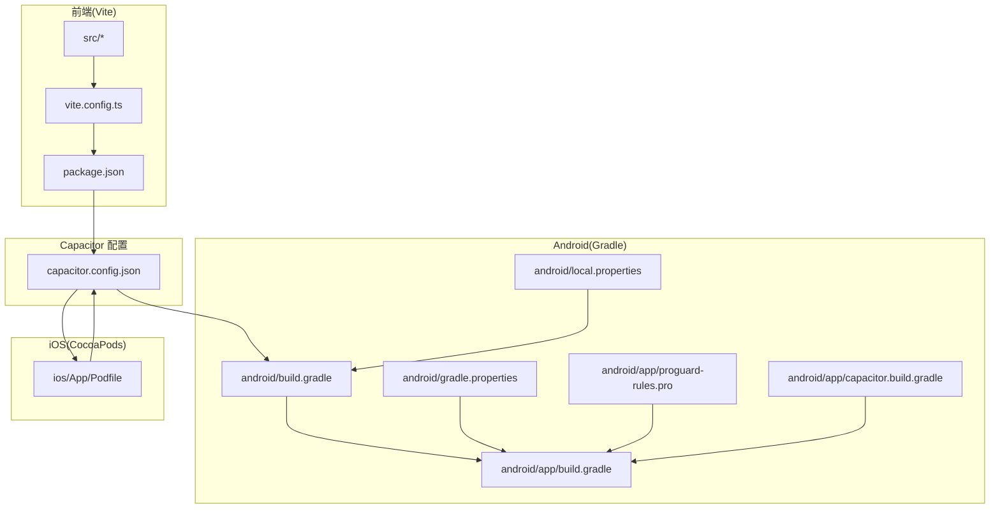
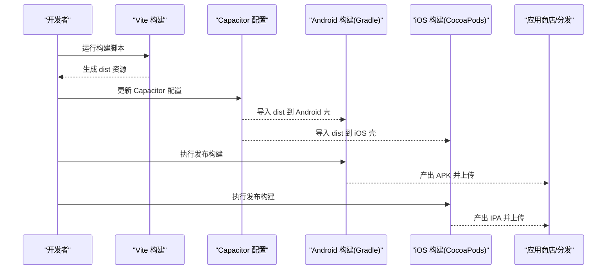
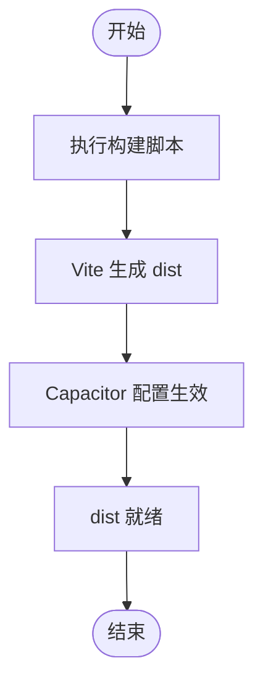
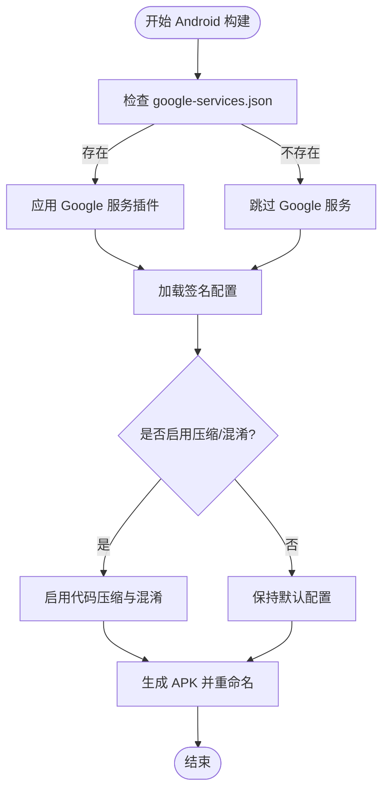
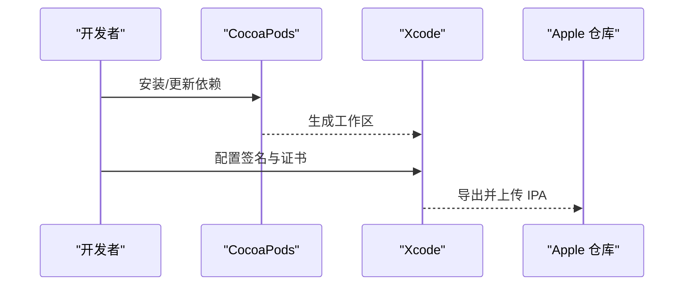
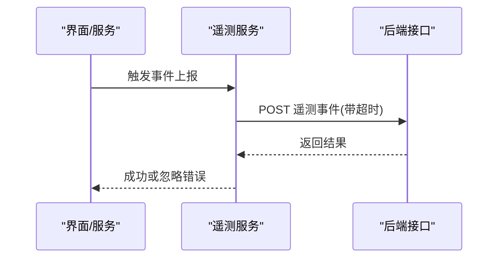
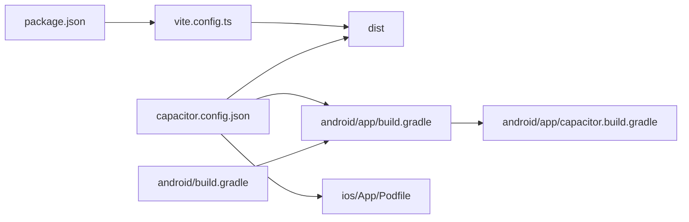

# 部署与发布

<cite>
**本文引用的文件**
- [package.json](file://package.json)
- [vite.config.ts](file://vite.config.ts)
- [capacitor.config.json](file://capacitor.config.json)
- [android/build.gradle](file://android/build.gradle)
- [android/gradle.properties](file://android/gradle.properties)
- [android/local.properties](file://android/local.properties)
- [android/app/build.gradle](file://android/app/build.gradle)
- [android/app/proguard-rules.pro](file://android/app/proguard-rules.pro)
- [android/app/capacitor.build.gradle](file://android/app/capacitor.build.gradle)
- [ios/App/Podfile](file://ios/App/Podfile)
- [src/app/services/telemetryService.ts](file://src/app/services/telemetryService.ts)
- [README.md](file://README.md)
</cite>

## 目录
1. [简介](#简介)
2. [项目结构](#项目结构)
3. [核心组件](#核心组件)
4. [架构总览](#架构总览)
5. [详细组件分析](#详细组件分析)
6. [依赖关系分析](#依赖关系分析)
7. [性能考虑](#性能考虑)
8. [故障排查指南](#故障排查指南)
9. [结论](#结论)
10. [附录](#附录)

## 简介
本指南面向开发者与运维人员，系统性阐述该跨端笔记应用前端的部署与发布流程，覆盖以下主题：
- 构建流程配置与优化：生产构建、代码压缩与资源优化
- 多平台发布策略：Web 部署、Android APK、iOS IPA 构建与上架准备
- CI/CD 流水线建议：自动化测试、构建与部署
- 版本管理与发布流程：语义化版本与变更日志
- 应用签名、证书与安全配置
- 性能监控与用户反馈收集
- 回滚策略、热修复与紧急发布流程
- 最佳实践与运维管理建议

## 项目结构
该项目采用 Capacitor 跨端框架，前端使用 Vite 构建，Android 使用 Gradle，iOS 使用 CocoaPods。核心产物为 Web 资源（dist），通过 Capacitor 注入到原生壳中。

**图表来源**
- [vite.config.ts:1-44](file://vite.config.ts#L1-L44)
- [capacitor.config.json:1-31](file://capacitor.config.json#L1-L31)
- [android/build.gradle:1-30](file://android/build.gradle#L1-L30)
- [android/app/build.gradle:1-72](file://android/app/build.gradle#L1-L72)
- [android/gradle.properties:1-23](file://android/gradle.properties#L1-L23)
- [android/local.properties:1-12](file://android/local.properties#L1-L12)
- [android/app/proguard-rules.pro:1-22](file://android/app/proguard-rules.pro#L1-L22)
- [android/app/capacitor.build.gradle:1-21](file://android/app/capacitor.build.gradle#L1-L21)
- [ios/App/Podfile:1-26](file://ios/App/Podfile#L1-L26)

**章节来源**
- [vite.config.ts:1-44](file://vite.config.ts#L1-L44)
- [capacitor.config.json:1-31](file://capacitor.config.json#L1-L31)
- [android/build.gradle:1-30](file://android/build.gradle#L1-L30)
- [android/app/build.gradle:1-72](file://android/app/build.gradle#L1-L72)
- [ios/App/Podfile:1-26](file://ios/App/Podfile#L1-L26)

## 核心组件
- 前端构建与打包：基于 Vite 的开发与生产构建，配合 Capacitor 将 dist 注入原生壳
- 容器配置：Capacitor 配置定义应用 ID、应用名、Web 目录与插件行为
- Android 构建：Gradle 多模块工程，包含签名、混淆规则与输出命名
- iOS 构建：CocoaPods 管理依赖，集成 Capacitor 与语音识别等插件
- 性能监控：遥测上报服务，支持事件上报与超时保护

**章节来源**
- [package.json:6-9](file://package.json#L6-L9)
- [vite.config.ts:1-44](file://vite.config.ts#L1-L44)
- [capacitor.config.json:1-31](file://capacitor.config.json#L1-L31)
- [android/app/build.gradle:20-41](file://android/app/build.gradle#L20-L41)
- [ios/App/Podfile:11-21](file://ios/App/Podfile#L11-L21)
- [src/app/services/telemetryService.ts:1-21](file://src/app/services/telemetryService.ts#L1-L21)

## 架构总览
下图展示从代码到多平台产物的关键路径与交互：

**图表来源**
- [package.json:6-9](file://package.json#L6-L9)
- [capacitor.config.json:1-31](file://capacitor.config.json#L1-L31)
- [android/app/build.gradle:29-41](file://android/app/build.gradle#L29-L41)
- [ios/App/Podfile:11-21](file://ios/App/Podfile#L11-L21)

## 详细组件分析

### 构建与打包流程（Web/跨端）
- 生产构建
  - 使用 Vite 生产构建生成 dist 目录，作为 Capacitor 的 webDir
  - 通过 Capacitor 配置指定 webDir 与服务器参数
- 依赖预优化与别名
  - 通过 optimizeDeps 与 resolve.alias 提升启动与打包效率
- 资源包含
  - assetsInclude 包含 SVG/CVS 等静态资源，确保在构建后可用

**图表来源**
- [package.json:6-9](file://package.json#L6-L9)
- [vite.config.ts:11-44](file://vite.config.ts#L11-L44)
- [capacitor.config.json:4](file://capacitor.config.json#L4)

**章节来源**
- [package.json:6-9](file://package.json#L6-L9)
- [vite.config.ts:11-44](file://vite.config.ts#L11-L44)
- [capacitor.config.json:4](file://capacitor.config.json#L4)

### Android 发布策略与签名
- 版本与签名
  - 版本号与版本名称在 app 层配置；release 构建启用签名配置
  - 输出文件名固定为应用版本命名的 APK
- 混淆与压缩
  - 当前未启用代码压缩与混淆；如需增强可开启并维护混淆规则
- 依赖与插件
  - 通过本地 libs 与子模块引入 Capacitor 及 Cordova 插件
- Google 服务
  - 检测 google-services.json 存在则应用 Google 服务插件（推送通知等）

**图表来源**
- [android/app/build.gradle:20-41](file://android/app/build.gradle#L20-L41)
- [android/app/proguard-rules.pro:1-22](file://android/app/proguard-rules.pro#L1-L22)
- [android/app/build.gradle:64-72](file://android/app/build.gradle#L64-L72)

**章节来源**
- [android/app/build.gradle:10-41](file://android/app/build.gradle#L10-L41)
- [android/app/proguard-rules.pro:1-22](file://android/app/proguard-rules.pro#L1-L22)
- [android/app/build.gradle:64-72](file://android/app/build.gradle#L64-L72)

### iOS 发布策略与依赖
- 平台与依赖
  - 指定最低 iOS 版本，使用 CocoaPods 管理 Capacitor 与语音识别等插件
  - 通过 post_install 校验部署目标
- 构建与上架
  - 在 Xcode 中完成签名、证书与描述文件配置后导出 IPA

**图表来源**
- [ios/App/Podfile:3-25](file://ios/App/Podfile#L3-L25)

**章节来源**
- [ios/App/Podfile:3-25](file://ios/App/Podfile#L3-L25)

### 版本管理与发布流程
- 版本号
  - Android 层维护 versionCode 与 versionName，用于应用商店标识与版本演进
- 建议的版本策略
  - 采用语义化版本（主.次.修订），结合变更日志记录功能、修复与破坏性变更
  - 发布前进行回归测试与性能验证，发布后监控关键指标

**章节来源**
- [android/app/build.gradle:10-11](file://android/app/build.gradle#L10-L11)

### 性能监控与用户反馈
- 遥测上报
  - 提供遥测事件上报接口，支持自定义事件名、时间戳与数据载荷
  - 上报请求带超时保护，失败静默处理以避免影响主线程
- 建议
  - 结合业务关键路径埋点，设置采样率与去重策略，定期分析异常与性能瓶颈

**图表来源**
- [src/app/services/telemetryService.ts:9-21](file://src/app/services/telemetryService.ts#L9-L21)

**章节来源**
- [src/app/services/telemetryService.ts:1-21](file://src/app/services/telemetryService.ts#L1-L21)

### 回滚策略、热修复与紧急发布
- 回滚策略
  - 保留最近 N 个版本的 APK/IPA 与对应构建工件，快速回滚至稳定版本
- 热修复
  - 优先通过云端配置开关与后端修复；若必须热更，走最小化变更并严格灰度
- 紧急发布
  - 建立紧急通道，仅允许关键修复进入；发布后自动触发健康检查与遥测告警

[本节为通用实践说明，不直接分析具体文件，故无“章节来源”]

## 依赖关系分析
- 前端与 Capacitor
  - package.json 中的构建脚本与 Vite 配置共同决定 dist 产物
  - Capacitor 配置将 dist 作为 webDir 注入原生壳
- Android 工程
  - 顶层 build.gradle 统一仓库与插件，app 层负责签名、混淆与输出命名
  - capacitor.build.gradle 保证编译兼容性
- iOS 工程
  - Podfile 声明平台与插件依赖，安装后由 Xcode 管理签名与构建

**图表来源**
- [package.json:6-9](file://package.json#L6-L9)
- [vite.config.ts:1-44](file://vite.config.ts#L1-L44)
- [capacitor.config.json:1-31](file://capacitor.config.json#L1-L31)
- [android/app/build.gradle:1-72](file://android/app/build.gradle#L1-L72)
- [android/build.gradle:1-30](file://android/build.gradle#L1-L30)
- [android/app/capacitor.build.gradle:1-21](file://android/app/capacitor.build.gradle#L1-L21)
- [ios/App/Podfile:1-26](file://ios/App/Podfile#L1-L26)

**章节来源**
- [package.json:6-9](file://package.json#L6-L9)
- [vite.config.ts:1-44](file://vite.config.ts#L1-L44)
- [capacitor.config.json:1-31](file://capacitor.config.json#L1-L31)
- [android/app/build.gradle:1-72](file://android/app/build.gradle#L1-L72)
- [android/build.gradle:1-30](file://android/build.gradle#L1-L30)
- [android/app/capacitor.build.gradle:1-21](file://android/app/capacitor.build.gradle#L1-L21)
- [ios/App/Podfile:1-26](file://ios/App/Podfile#L1-L26)

## 性能考虑
- 构建阶段
  - 启用 optimizeDeps 与 alias，减少重复依赖与解析开销
  - 预打包关键依赖，降低冷启动与二次打包成本
- 运行阶段
  - 控制静态资源体积，按需加载与懒加载
  - 对音频/富文本等大资源进行压缩与缓存策略优化
- Android
  - 如启用压缩/混淆，需完善 proguard 规则并进行稳定性验证
- iOS
  - 关注包体增长与启动时间，避免不必要的框架与资源

[本节为通用性能建议，不直接分析具体文件，故无“章节来源”]

## 故障排查指南
- 构建失败
  - 检查 Vite 配置与依赖版本一致性；确认 Capacitor 配置的 webDir 正确
- Android 签名问题
  - 确认 keystore 文件路径、密码与别名正确；release 构建已启用签名配置
- iOS 构建问题
  - 确认 CocoaPods 安装完成且 Xcode 工作区有效；检查部署目标与签名配置
- 遥测不上报
  - 检查网络与超时设置；确认后端接口可达与返回状态

**章节来源**
- [capacitor.config.json:4](file://capacitor.config.json#L4)
- [android/app/build.gradle:20-41](file://android/app/build.gradle#L20-L41)
- [ios/App/Podfile:11-21](file://ios/App/Podfile#L11-L21)
- [src/app/services/telemetryService.ts:9-21](file://src/app/services/telemetryService.ts#L9-L21)

## 结论
本指南提供了从构建到多平台发布的完整方法论与实操要点。建议在现有基础上进一步完善 CI/CD、变更日志与版本策略，强化安全与性能监控，并建立标准化的回滚与热修复流程，以保障高质量、可持续的交付。

## 附录
- 快速参考
  - 构建命令：参见构建脚本定义
  - 开发环境：参见 README 的运行说明
  - Capacitor 配置：参见配置文件中的应用信息与插件设置

**章节来源**
- [package.json:6-9](file://package.json#L6-L9)
- [README.md:6-11](file://README.md#L6-L11)
- [capacitor.config.json:1-31](file://capacitor.config.json#L1-L31)