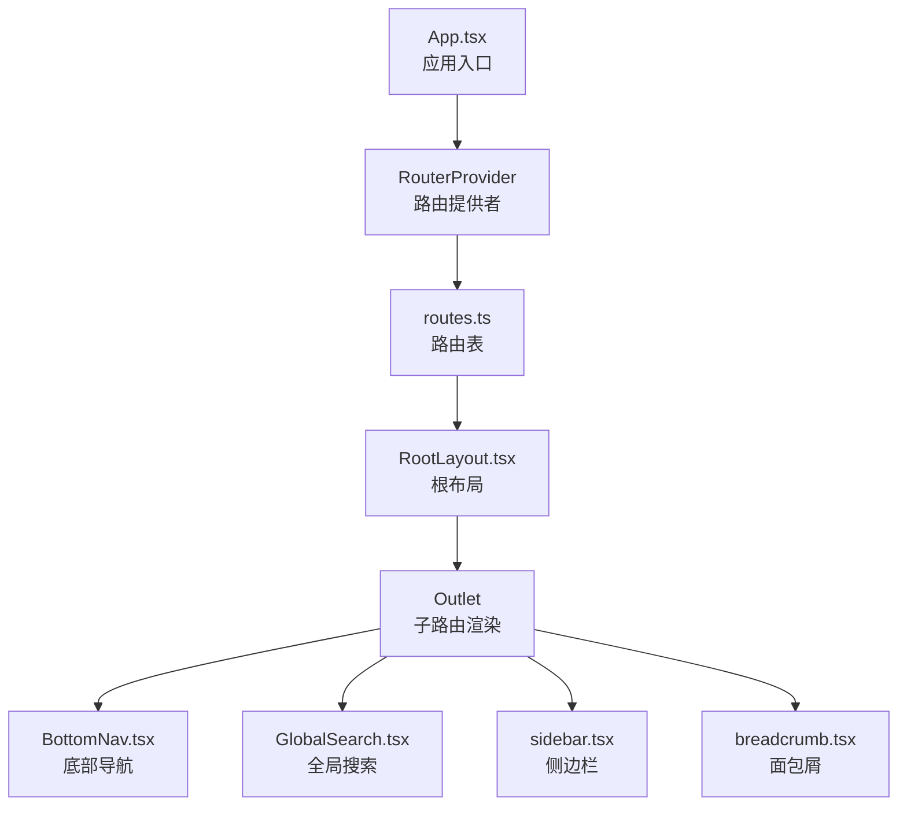
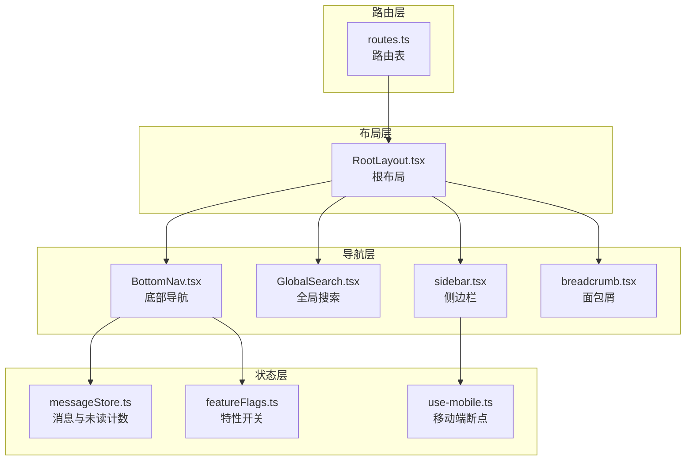
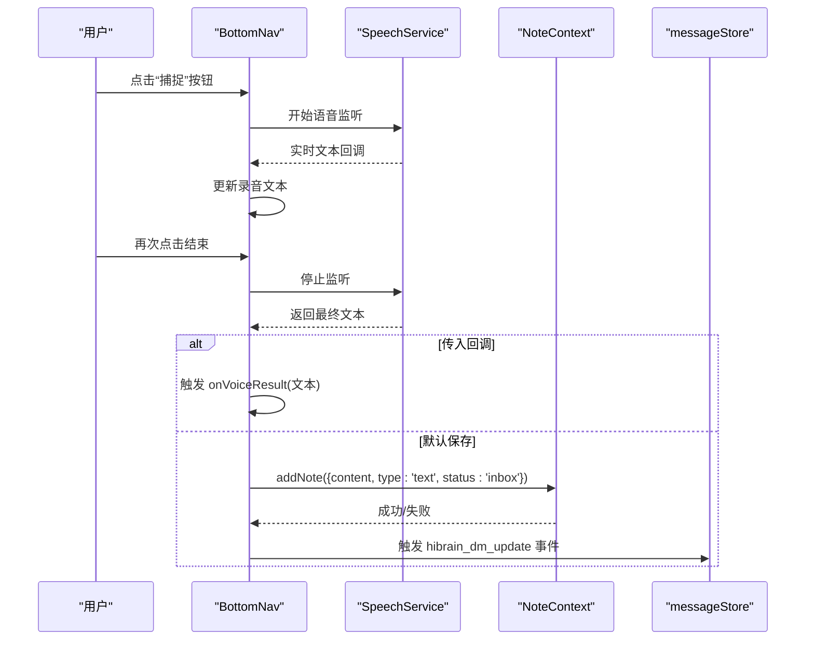
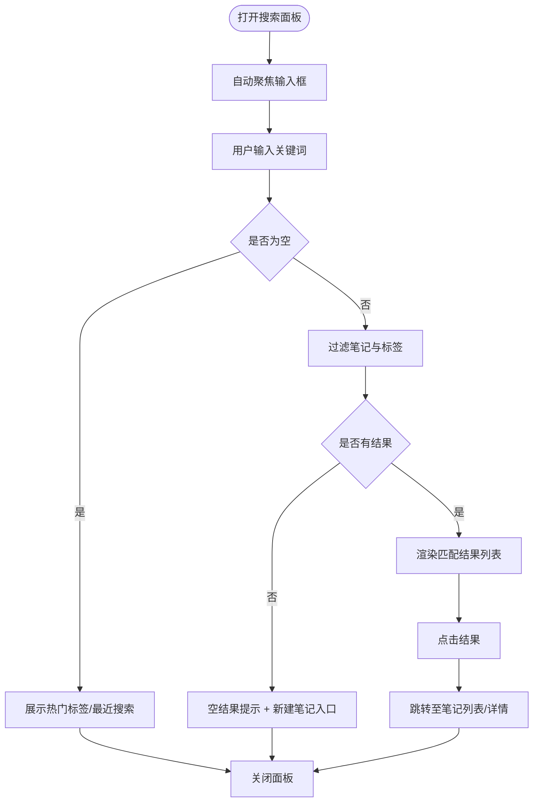
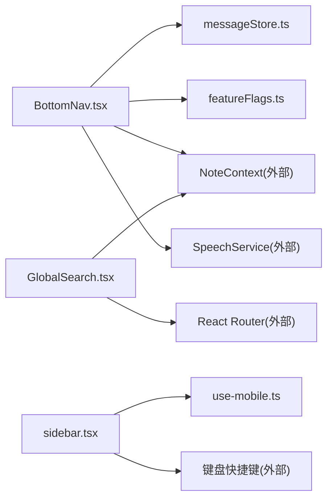

# 导航逻辑与状态管理

<cite>
**本文档引用的文件**
- [src/app/routes.ts](file://src/app/routes.ts)
- [src/app/App.tsx](file://src/app/App.tsx)
- [src/app/components/BottomNav.tsx](file://src/app/components/BottomNav.tsx)
- [src/app/components/GlobalSearch.tsx](file://src/app/components/GlobalSearch.tsx)
- [src/app/components/ui/breadcrumb.tsx](file://src/app/components/ui/breadcrumb.tsx)
- [src/app/components/ui/sidebar.tsx](file://src/app/components/ui/sidebar.tsx)
- [src/app/components/RootLayout.tsx](file://src/app/components/RootLayout.tsx)
- [src/app/services/messageStore.ts](file://src/app/services/messageStore.ts)
- [src/app/utils/featureFlags.ts](file://src/app/utils/featureFlags.ts)
- [src/app/components/ui/use-mobile.ts](file://src/app/components/ui/use-mobile.ts)
</cite>

## 目录
1. [简介](#简介)
2. [项目结构](#项目结构)
3. [核心组件](#核心组件)
4. [架构总览](#架构总览)
5. [详细组件分析](#详细组件分析)
6. [依赖关系分析](#依赖关系分析)
7. [性能考量](#性能考量)
8. [故障排查指南](#故障排查指南)
9. [结论](#结论)

## 简介
本文件系统性梳理该笔记应用前端的导航逻辑与状态管理，覆盖以下主题：
- 路由与布局：基于 React Router 的路由配置与根布局注入
- 底部导航：移动端常驻导航条，含动态菜单项与语音捕获能力
- 全局搜索：跨笔记与标签的即时搜索面板
- 面包屑：可复用的导航层级展示组件
- 侧边栏导航：响应式侧边栏，支持移动端抽屉与桌面端展开/折叠
- 导航状态同步：消息未读数联动、功能开关控制、本地存储同步
- 程序化导航与导航守卫：路由跳转、条件跳转与页面级交互
- 移动端与桌面端差异：断点适配、键盘快捷键、手势与抽屉行为
- 性能优化与体验提升：防抖、记忆化、动画与无障碍

## 项目结构
应用采用“路由驱动 + 组件化”的组织方式，路由集中定义于 routes.ts，根布局负责注入视口与主题色元信息，底部导航与全局搜索作为通用 UI 组件贯穿多页面。

图表来源
- [src/app/App.tsx:1-17](file://src/app/App.tsx#L1-L17)
- [src/app/routes.ts:1-61](file://src/app/routes.ts#L1-L61)
- [src/app/components/RootLayout.tsx:1-52](file://src/app/components/RootLayout.tsx#L1-L52)
- [src/app/components/BottomNav.tsx:1-387](file://src/app/components/BottomNav.tsx#L1-L387)
- [src/app/components/GlobalSearch.tsx:1-425](file://src/app/components/GlobalSearch.tsx#L1-L425)
- [src/app/components/ui/sidebar.tsx:1-200](file://src/app/components/ui/sidebar.tsx#L1-L200)
- [src/app/components/ui/breadcrumb.tsx:1-110](file://src/app/components/ui/breadcrumb.tsx#L1-L110)

章节来源
- [src/app/App.tsx:1-17](file://src/app/App.tsx#L1-L17)
- [src/app/routes.ts:1-61](file://src/app/routes.ts#L1-L61)
- [src/app/components/RootLayout.tsx:1-52](file://src/app/components/RootLayout.tsx#L1-L52)

## 核心组件
- 路由与布局
  - 路由表集中声明所有页面路径与嵌套关系，支持特性开关控制的动态路由（如 Wiki）
  - 根布局负责注入 viewport-fit、主题色与背景色，确保移动端沉浸式体验
- 底部导航
  - 常驻导航条，包含首页、笔记库、知识链、我的等主入口；支持动态插入“思圈”入口
  - 内置语音捕获按钮，支持连续录音、实时文本回显与结束保存为收件箱
  - 通过自定义事件与 localStorage 同步导航状态（如是否显示“思圈”）
- 全局搜索
  - 弹层式搜索面板，支持热词、最近搜索、标签与笔记结果
  - 输入框 Esc 关闭、自动聚焦、高亮匹配片段、结果跳转
- 面包屑
  - 可组合的 Breadcrumb 组件，支持分隔符、省略号与当前页标识
- 侧边栏导航
  - 响应式侧边栏，移动端以抽屉形式出现，桌面端支持展开/折叠与 Cookie 记忆
  - 提供键盘快捷键（Ctrl/Cmd + B）快速切换

章节来源
- [src/app/routes.ts:26-60](file://src/app/routes.ts#L26-L60)
- [src/app/components/RootLayout.tsx:10-30](file://src/app/components/RootLayout.tsx#L10-L30)
- [src/app/components/BottomNav.tsx:96-387](file://src/app/components/BottomNav.tsx#L96-L387)
- [src/app/components/GlobalSearch.tsx:33-425](file://src/app/components/GlobalSearch.tsx#L33-L425)
- [src/app/components/ui/breadcrumb.tsx:7-109](file://src/app/components/ui/breadcrumb.tsx#L7-L109)
- [src/app/components/ui/sidebar.tsx:28-152](file://src/app/components/ui/sidebar.tsx#L28-L152)

## 架构总览
整体导航架构围绕“路由 + 布局 + 通用导航组件”的模式构建，路由负责页面级导航，布局负责全局样式与主题，通用导航组件负责不同场景下的导航与交互。

图表来源
- [src/app/routes.ts:26-60](file://src/app/routes.ts#L26-L60)
- [src/app/components/RootLayout.tsx:10-30](file://src/app/components/RootLayout.tsx#L10-L30)
- [src/app/components/BottomNav.tsx:96-133](file://src/app/components/BottomNav.tsx#L96-L133)
- [src/app/components/GlobalSearch.tsx:33-70](file://src/app/components/GlobalSearch.tsx#L33-L70)
- [src/app/components/ui/sidebar.tsx:28-152](file://src/app/components/ui/sidebar.tsx#L28-L152)
- [src/app/services/messageStore.ts:131-136](file://src/app/services/messageStore.ts#L131-L136)
- [src/app/utils/featureFlags.ts:7-13](file://src/app/utils/featureFlags.ts#L7-L13)
- [src/app/components/ui/use-mobile.ts:3-21](file://src/app/components/ui/use-mobile.ts#L3-L21)

## 详细组件分析

### 底部导航（BottomNav）
- 功能要点
  - 主入口：首页、笔记库、知识链、我的
  - 动态入口：根据特性开关决定是否插入“思圈”，并计算插入位置
  - 语音捕获：内置录音按钮，支持开始/停止、实时文本回显、结束时保存为收件箱
  - 未读数：监听消息存储变更事件，更新“我的”入口徽标
  - 状态同步：通过自定义事件与 localStorage 同步“思圈”显示状态
  - 激活态判断：对“笔记库/知识链”类路径使用前缀匹配，其余使用精确匹配
- 状态管理
  - 本地状态：录音状态、录音文本、是否显示“思圈”
  - 外部状态：消息未读数、笔记上下文、主题变量
- 交互流程（录音保存）

图表来源
- [src/app/components/BottomNav.tsx:135-215](file://src/app/components/BottomNav.tsx#L135-L215)
- [src/app/components/BottomNav.tsx:192-204](file://src/app/components/BottomNav.tsx#L192-L204)
- [src/app/services/messageStore.ts:29-32](file://src/app/services/messageStore.ts#L29-L32)

章节来源
- [src/app/components/BottomNav.tsx:96-387](file://src/app/components/BottomNav.tsx#L96-L387)
- [src/app/services/messageStore.ts:131-136](file://src/app/services/messageStore.ts#L131-L136)
- [src/app/utils/featureFlags.ts:7-13](file://src/app/utils/featureFlags.ts#L7-L13)

### 全局搜索（GlobalSearch）
- 功能要点
  - 自动聚焦与 Esc 关闭
  - 结果聚合：笔记标题/内容/标签匹配，标签去重与计数
  - 高亮匹配片段与摘要截取
  - 空结果提示与“新建笔记”直达
- 性能要点
  - 使用 useMemo 缓存搜索结果，避免每次输入都重新计算
  - 对笔记内容与标签进行预处理与索引式过滤
- 交互流程（搜索与跳转）

图表来源
- [src/app/components/GlobalSearch.tsx:33-70](file://src/app/components/GlobalSearch.tsx#L33-L70)
- [src/app/components/GlobalSearch.tsx:352-411](file://src/app/components/GlobalSearch.tsx#L352-L411)

章节来源
- [src/app/components/GlobalSearch.tsx:33-425](file://src/app/components/GlobalSearch.tsx#L33-L425)

### 面包屑（Breadcrumb）
- 组件能力
  - 支持链接、当前页标识、分隔符与省略号
  - 语义化结构，便于无障碍访问
- 使用建议
  - 在需要展示层级路径的页面（如笔记详情、分类列表）按需引入
  - 与路由参数配合，动态生成层级链接

章节来源
- [src/app/components/ui/breadcrumb.tsx:7-109](file://src/app/components/ui/breadcrumb.tsx#L7-L109)

### 侧边栏导航（Sidebar）
- 响应式策略
  - 移动端：抽屉式侧边栏，支持手势滑开/关闭
  - 桌面端：可展开/折叠，支持 Cookie 记忆状态
- 交互与快捷键
  - 键盘快捷键 Ctrl/Cmd + B 切换侧边栏
  - 状态变化通过 Cookie 保持，刷新后恢复
- 与导航的关系
  - 侧边栏通常承载更细粒度的导航项，与底部导航形成互补

章节来源
- [src/app/components/ui/sidebar.tsx:28-152](file://src/app/components/ui/sidebar.tsx#L28-L152)
- [src/app/components/ui/use-mobile.ts:3-21](file://src/app/components/ui/use-mobile.ts#L3-L21)

### 路由与布局
- 路由表
  - 定义根路径与子路由，支持通配符与别名
  - 根据特性开关动态注入 Wiki 路由
- 根布局
  - 注入 viewport-fit、主题色与背景色
  - 渲染 Outlet 并统一 Toast 展示

章节来源
- [src/app/routes.ts:26-60](file://src/app/routes.ts#L26-L60)
- [src/app/components/RootLayout.tsx:10-30](file://src/app/components/RootLayout.tsx#L10-L30)

## 依赖关系分析
- 组件耦合
  - BottomNav 依赖消息存储（未读数）、特性开关（Wiki）、笔记上下文（默认保存）、语音服务
  - GlobalSearch 依赖笔记上下文（数据源）、路由跳转（导航）
  - Sidebar 依赖移动端断点检测与键盘快捷键
- 外部依赖
  - React Router（路由与导航）
  - motion/react（动画）
  - Radix UI（语义化组件）
  - Capacitor（移动端能力，如键盘与视口）

图表来源
- [src/app/components/BottomNav.tsx:96-133](file://src/app/components/BottomNav.tsx#L96-L133)
- [src/app/components/GlobalSearch.tsx:33-70](file://src/app/components/GlobalSearch.tsx#L33-L70)
- [src/app/components/ui/sidebar.tsx:28-152](file://src/app/components/ui/sidebar.tsx#L28-L152)
- [src/app/utils/featureFlags.ts:7-13](file://src/app/utils/featureFlags.ts#L7-L13)
- [src/app/services/messageStore.ts:131-136](file://src/app/services/messageStore.ts#L131-L136)
- [src/app/components/ui/use-mobile.ts:3-21](file://src/app/components/ui/use-mobile.ts#L3-L21)

## 性能考量
- 搜索性能
  - 使用 useMemo 缓存搜索结果，减少重复计算
  - 对笔记内容与标签进行小写化与子串匹配，限制返回数量
- 动画与渲染
  - 使用 motion/react 的 AnimatePresence 控制面板进出动画，避免不必要的重排
  - 底部导航的激活态切换使用 layoutId，保证过渡流畅
- 状态同步
  - 通过自定义事件与 localStorage 同步导航状态，避免全局状态风暴
  - 侧边栏状态持久化于 Cookie，减少初始化成本
- 无障碍与可访问性
  - 面包屑使用语义化结构与 aria 标签
  - 搜索面板提供 Esc 关闭与自动聚焦，提升键盘可达性

## 故障排查指南
- 未读数不更新
  - 检查消息存储是否正确触发 hibrain_dm_update 事件
  - 确认 BottomNav 是否监听该事件并更新状态
- “思圈”入口未显示
  - 检查特性开关值（VITE_WIKI_ENABLED），确认 isWikiEnabled 返回预期
  - 确认 localStorage 中 shisi_nav_show_sicircle 的值
- 录音无法停止或保存失败
  - 检查 SpeechService 的错误回调与异常分支
  - 确认 NoteContext 的 addNote 是否抛出异常
- 搜索结果异常
  - 检查笔记上下文是否正确加载
  - 确认输入框焦点与 Esc 事件绑定
- 侧边栏状态丢失
  - 检查 Cookie 是否被浏览器禁用或清理
  - 确认键盘快捷键是否被其他插件占用

章节来源
- [src/app/services/messageStore.ts:29-32](file://src/app/services/messageStore.ts#L29-L32)
- [src/app/components/BottomNav.tsx:116-133](file://src/app/components/BottomNav.tsx#L116-L133)
- [src/app/utils/featureFlags.ts:7-13](file://src/app/utils/featureFlags.ts#L7-L13)
- [src/app/components/GlobalSearch.tsx:33-70](file://src/app/components/GlobalSearch.tsx#L33-L70)
- [src/app/components/ui/sidebar.tsx:86-88](file://src/app/components/ui/sidebar.tsx#L86-L88)

## 结论
该导航体系以路由为核心，结合根布局与通用导航组件，实现了移动端与桌面端的差异化体验。通过特性开关、本地存储与自定义事件，实现了灵活的状态同步与扩展能力。建议在后续迭代中进一步完善：
- 导航守卫：在路由层增加鉴权与权限校验
- 面包屑生成：基于路由层级自动生成面包屑
- 导航历史：记录最近访问路径，支持前进/后退增强
- 性能监控：对关键导航操作添加埋点与性能指标