# 路由参数与动态路由

<cite>
**本文档引用的文件**
- [src/app/routes.ts](file://src/app/routes.ts)
- [src/app/App.tsx](file://src/app/App.tsx)
- [src/app/pages/NoteCreate.tsx](file://src/app/pages/NoteCreate.tsx)
- [src/app/pages/DocumentDetail.tsx](file://src/app/pages/DocumentDetail.tsx)
- [src/app/pages/UserProfile.tsx](file://src/app/pages/UserProfile.tsx)
- [src/app/pages/ConversationDetail.tsx](file://src/app/pages/ConversationDetail.tsx)
- [src/app/pages/NoteList.tsx](file://src/app/pages/NoteList.tsx)
- [src/app/components/context/NoteContext.tsx](file://src/app/components/context/NoteContext.tsx)
- [src/app/services/api.ts](file://src/app/services/api.ts)
</cite>

## 目录
1. [简介](#简介)
2. [项目结构](#项目结构)
3. [核心组件](#核心组件)
4. [架构概览](#架构概览)
5. [详细组件分析](#详细组件分析)
6. [依赖分析](#依赖分析)
7. [性能考虑](#性能考虑)
8. [故障排除指南](#故障排除指南)
9. [结论](#结论)

## 简介

本文档深入分析了该笔记应用前端项目中的路由参数与动态路由实现。项目采用 React Router v6 的现代路由系统，实现了丰富的动态路由参数处理机制，包括路径参数、查询参数和状态管理。

该应用通过动态路由参数实现了以下核心功能：
- 笔记详情的动态路由参数获取与处理
- 用户资料的动态路由参数传递
- 对话详情的动态路由参数管理
- 查询参数的解析与状态管理
- 参数变化时的组件重新渲染和数据刷新策略

## 项目结构

项目采用基于功能的模块化组织方式，路由配置集中在独立的路由文件中，页面组件按照功能域进行分类：

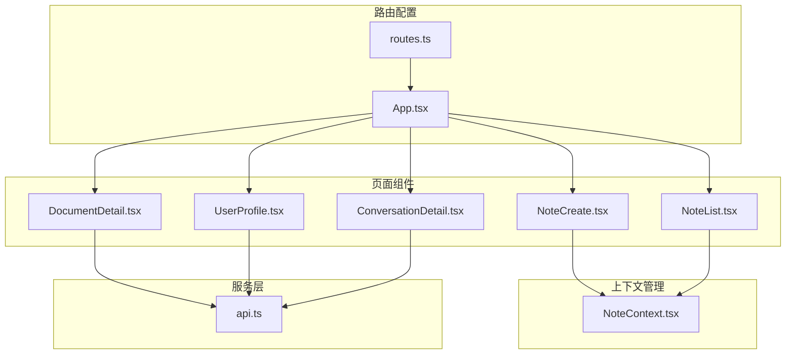

**图表来源**
- [src/app/routes.ts:26-60](file://src/app/routes.ts#L26-L60)
- [src/app/App.tsx:1-17](file://src/app/App.tsx#L1-L17)

**章节来源**
- [src/app/routes.ts:1-61](file://src/app/routes.ts#L1-L61)
- [src/app/App.tsx:1-17](file://src/app/App.tsx#L1-L17)

## 核心组件

### 路由配置系统

项目使用 `createBrowserRouter` 创建了完整的路由配置，支持多种动态路由参数类型：

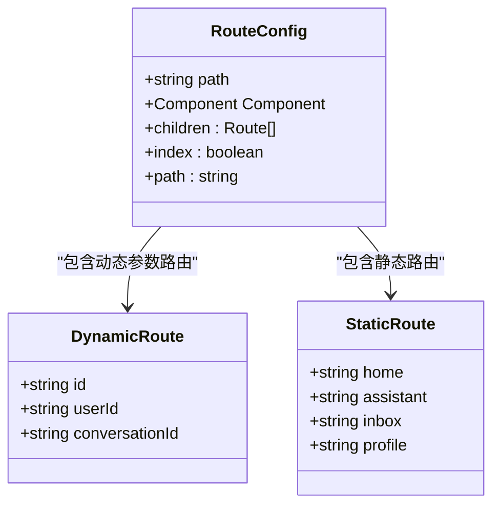

**图表来源**
- [src/app/routes.ts:26-60](file://src/app/routes.ts#L26-L60)

### 动态路由参数类型

项目实现了三种主要的动态路由参数类型：

1. **路径参数**：`:id` 形式的参数，用于标识资源
2. **查询参数**：URL 查询字符串中的参数
3. **状态参数**：通过 `location.state` 传递的组件状态

**章节来源**
- [src/app/routes.ts:39-44](file://src/app/routes.ts#L39-L44)
- [src/app/pages/NoteList.tsx:404-411](file://src/app/pages/NoteList.tsx#L404-L411)

## 架构概览

应用的路由架构采用了分层设计，实现了参数获取、验证、转换和状态管理的完整流程：

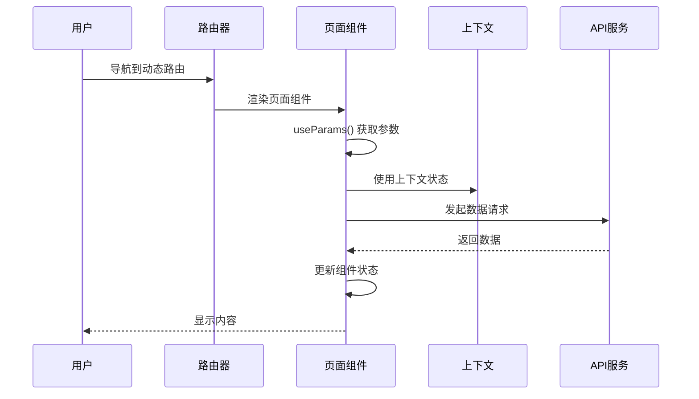

**图表来源**
- [src/app/pages/DocumentDetail.tsx:171-231](file://src/app/pages/DocumentDetail.tsx#L171-L231)
- [src/app/pages/UserProfile.tsx:671-761](file://src/app/pages/UserProfile.tsx#L671-L761)

## 详细组件分析

### 动态路由参数获取与处理

#### 笔记创建页面的动态参数处理

笔记创建页面同时支持两种路由模式：
- 新建模式：`/siku/create`
- 编辑模式：`/siku/:id`

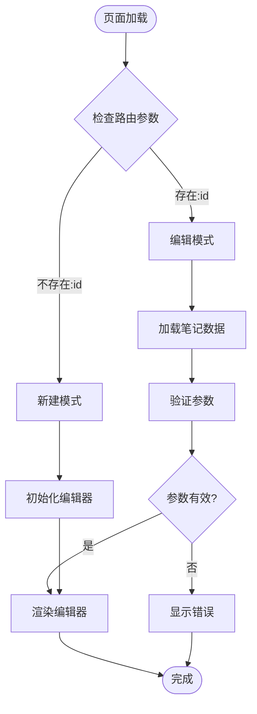

**图表来源**
- [src/app/pages/NoteCreate.tsx:1-800](file://src/app/pages/NoteCreate.tsx#L1-L800)

#### 文档详情页面的参数处理

文档详情页面实现了完整的参数验证和数据加载流程：

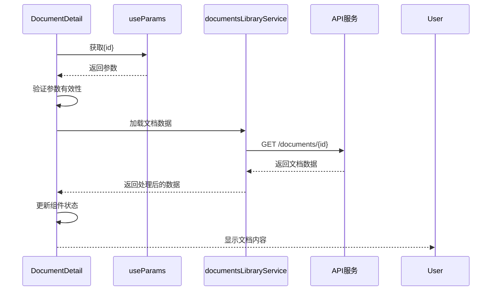

**图表来源**
- [src/app/pages/DocumentDetail.tsx:171-231](file://src/app/pages/DocumentDetail.tsx#L171-L231)

**章节来源**
- [src/app/pages/DocumentDetail.tsx:171-231](file://src/app/pages/DocumentDetail.tsx#L171-L231)

### 用户资料页面的动态参数处理

用户资料页面展示了复杂的动态参数处理和状态管理：

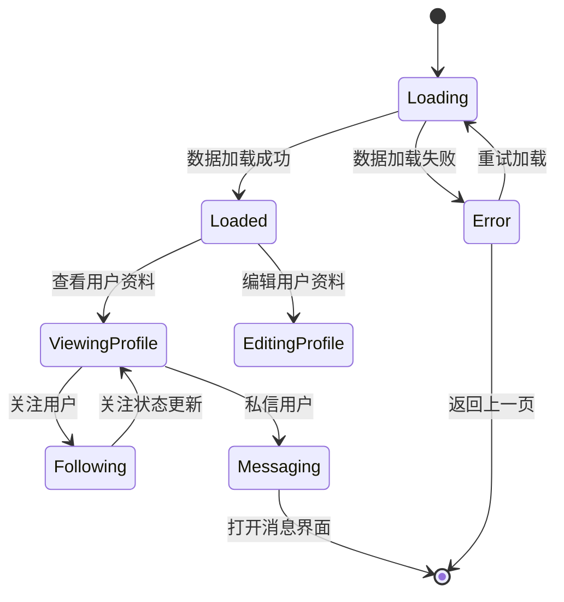

**图表来源**
- [src/app/pages/UserProfile.tsx:671-761](file://src/app/pages/UserProfile.tsx#L671-L761)

**章节来源**
- [src/app/pages/UserProfile.tsx:671-761](file://src/app/pages/UserProfile.tsx#L671-L761)

### 对话详情页面的参数处理

对话详情页面实现了实时消息处理和参数验证：

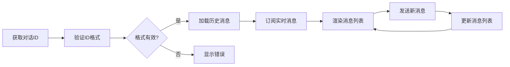

**图表来源**
- [src/app/pages/ConversationDetail.tsx:44-94](file://src/app/pages/ConversationDetail.tsx#L44-L94)

**章节来源**
- [src/app/pages/ConversationDetail.tsx:44-94](file://src/app/pages/ConversationDetail.tsx#L44-L94)

### 查询参数解析与状态管理

笔记列表页面展示了查询参数的完整处理流程：

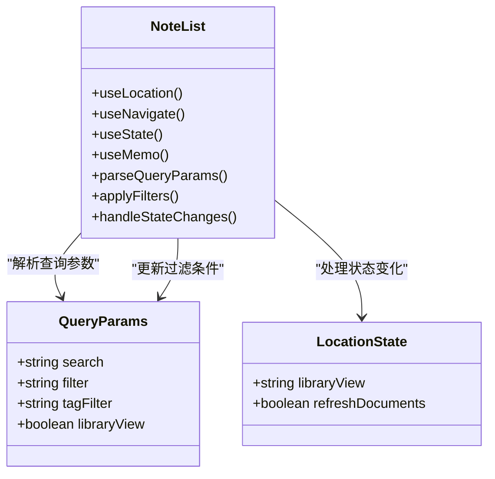

**图表来源**
- [src/app/pages/NoteList.tsx:383-411](file://src/app/pages/NoteList.tsx#L383-L411)

**章节来源**
- [src/app/pages/NoteList.tsx:383-411](file://src/app/pages/NoteList.tsx#L383-L411)

## 依赖分析

### 组件耦合关系

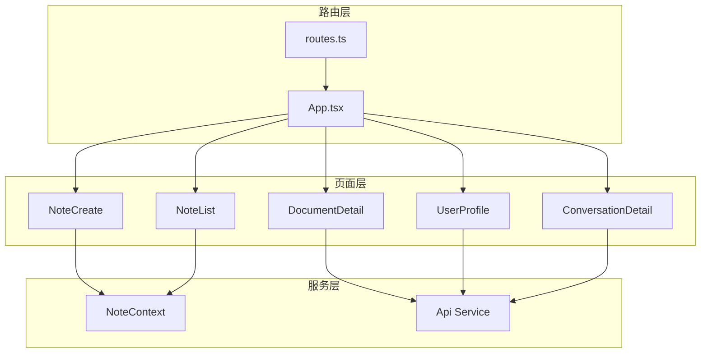

**图表来源**
- [src/app/routes.ts:26-60](file://src/app/routes.ts#L26-L60)
- [src/app/App.tsx:1-17](file://src/app/App.tsx#L1-L17)

### 参数验证机制

项目实现了多层次的参数验证机制：

1. **类型验证**：确保参数类型符合预期
2. **格式验证**：验证参数格式的有效性
3. **存在性验证**：检查必需参数是否存在
4. **业务验证**：验证参数在业务逻辑中的有效性

**章节来源**
- [src/app/pages/DocumentDetail.tsx:193-231](file://src/app/pages/DocumentDetail.tsx#L193-L231)
- [src/app/pages/ConversationDetail.tsx:54-68](file://src/app/pages/ConversationDetail.tsx#L54-L68)

## 性能考虑

### 路由参数缓存策略

项目采用了智能的参数缓存和更新策略：

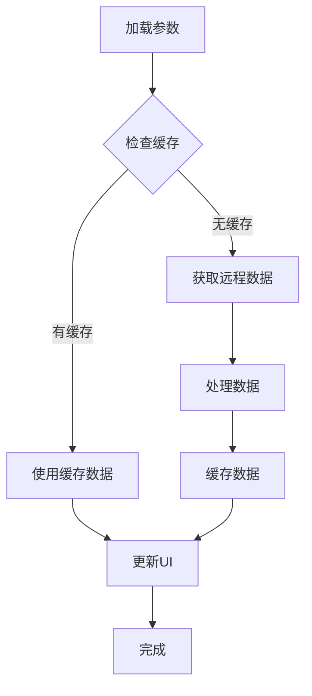

### 异步数据加载优化

- **并发加载**：使用 `Promise.all` 并行加载多个数据源
- **防抖处理**：对频繁的参数变化进行防抖处理
- **增量更新**：只更新发生变化的数据部分
- **内存管理**：及时清理不再使用的数据引用

**章节来源**
- [src/app/pages/UserProfile.tsx:695-757](file://src/app/pages/UserProfile.tsx#L695-L757)
- [src/app/pages/NoteList.tsx:404-437](file://src/app/pages/NoteList.tsx#L404-L437)

## 故障排除指南

### 常见路由参数问题

1. **参数为空或未定义**
   - 检查路由配置中的参数名称
   - 验证导航时是否正确传递参数
   - 实现默认参数处理逻辑

2. **参数类型错误**
   - 在组件中添加参数类型验证
   - 提供类型转换函数
   - 实现错误边界处理

3. **参数验证失败**
   - 添加详细的错误提示
   - 提供回退方案
   - 记录错误日志

### 错误处理机制

项目实现了完善的错误处理机制：

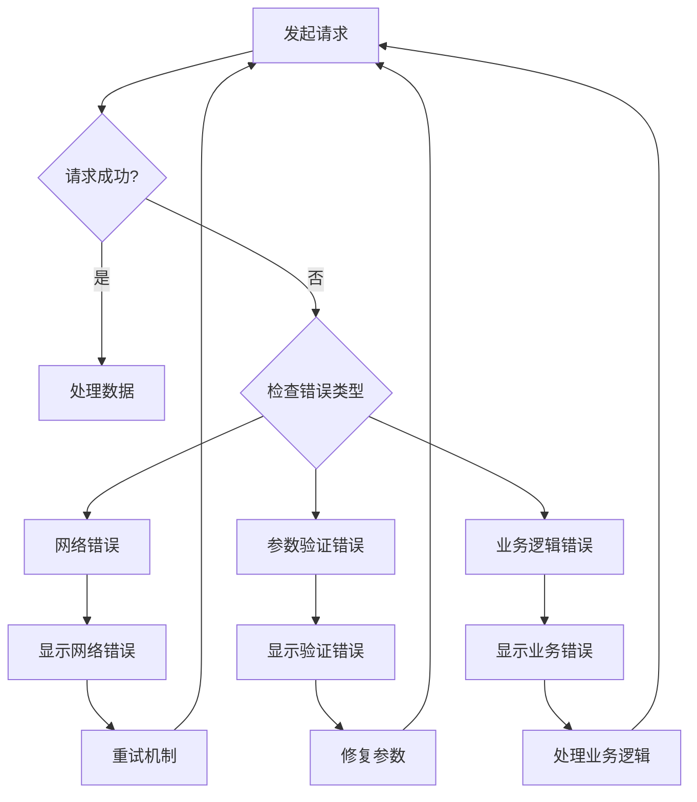

**图表来源**
- [src/app/services/api.ts:69-106](file://src/app/services/api.ts#L69-L106)

**章节来源**
- [src/app/services/api.ts:69-126](file://src/app/services/api.ts#L69-L126)

## 结论

该笔记应用前端项目展现了现代 React 路由系统的最佳实践，特别是在动态路由参数处理方面：

### 主要优势

1. **完整的参数处理链路**：从路由配置到组件处理的全链路实现
2. **多层次验证机制**：类型、格式、存在性和业务验证的完整体系
3. **智能状态管理**：参数变化时的自动状态更新和数据刷新
4. **完善的错误处理**：针对各种异常情况的处理策略

### 最佳实践建议

1. **参数验证前置**：在组件接收参数时立即进行验证
2. **默认值处理**：为可选参数提供合理的默认值
3. **错误边界设计**：为参数处理添加适当的错误边界
4. **性能优化**：使用缓存和防抖技术优化参数处理性能
5. **类型安全**：利用 TypeScript 实现参数类型的编译时检查

### 扩展建议

1. **参数序列化**：实现参数的序列化和反序列化机制
2. **参数版本控制**：支持参数格式的版本演进
3. **参数审计**：记录参数变更的历史记录
4. **参数共享**：实现跨组件的参数共享机制

通过这些实践，项目实现了稳定、高效的动态路由参数处理系统，为用户提供流畅的使用体验。