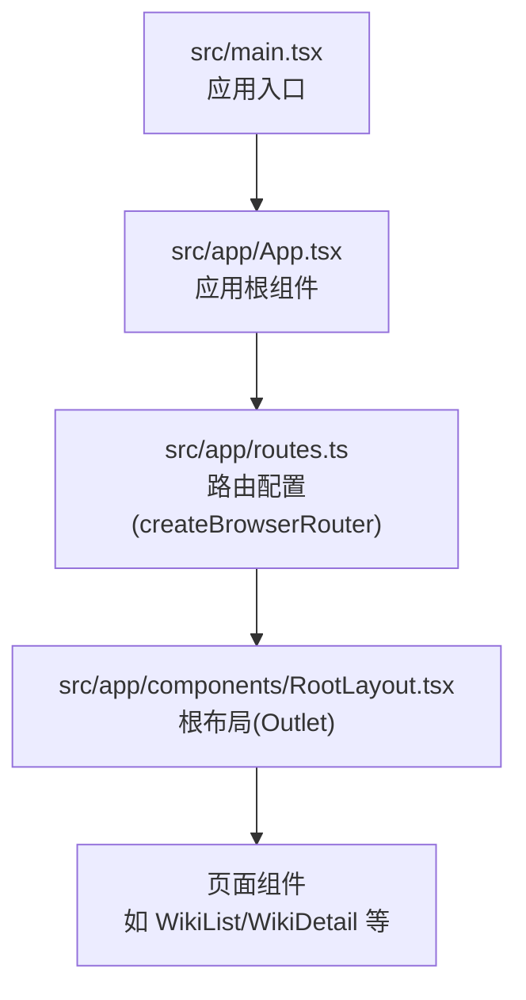
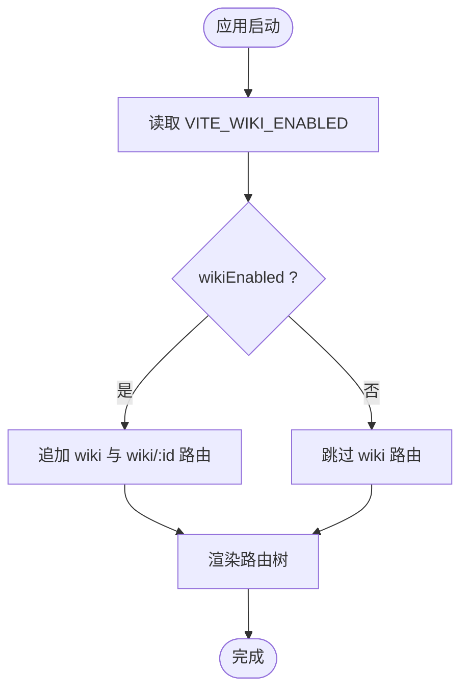
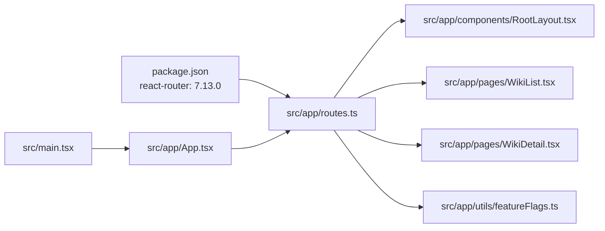

# 路由配置与定义

<cite>
**本文引用的文件**
- [src/app/routes.ts](file://src/app/routes.ts)
- [src/app/App.tsx](file://src/app/App.tsx)
- [src/app/components/RootLayout.tsx](file://src/app/components/RootLayout.tsx)
- [src/app/pages/WikiList.tsx](file://src/app/pages/WikiList.tsx)
- [src/app/pages/WikiDetail.tsx](file://src/app/pages/WikiDetail.tsx)
- [src/app/utils/featureFlags.ts](file://src/app/utils/featureFlags.ts)
- [src/main.tsx](file://src/main.tsx)
- [package.json](file://package.json)
</cite>

## 目录
1. [简介](#简介)
2. [项目结构](#项目结构)
3. [核心组件](#核心组件)
4. [架构总览](#架构总览)
5. [详细组件分析](#详细组件分析)
6. [依赖关系分析](#依赖关系分析)
7. [性能考量](#性能考量)
8. [故障排查指南](#故障排查指南)
9. [结论](#结论)
10. [附录](#附录)

## 简介
本文件系统化梳理本项目中基于 React Router v6 的路由配置与定义，重点覆盖：
- createBrowserRouter 的使用与路由树结构设计
- 根布局 RootLayout 的作用与嵌套路由实现原理
- 路由路径定义、组件映射与索引路由的使用
- 条件路由（如 Wiki 功能开关）的实现方式
- 路由别名的设计理念与向后兼容性考虑
- 路由配置的最佳实践与性能优化建议

## 项目结构
本项目采用“按功能域分层”的组织方式，路由配置集中在 src/app/routes.ts 中，通过 RouterProvider 注入到应用根组件中；根布局 RootLayout 负责注入全局上下文与 Outlet 渲染子路由内容；各页面组件按功能划分在 src/app/pages 下。

图表来源
- [src/main.tsx:1-7](file://src/main.tsx#L1-L7)
- [src/app/App.tsx:1-17](file://src/app/App.tsx#L1-L17)
- [src/app/routes.ts:1-61](file://src/app/routes.ts#L1-L61)
- [src/app/components/RootLayout.tsx:1-52](file://src/app/components/RootLayout.tsx#L1-L52)

章节来源
- [src/app/routes.ts:1-61](file://src/app/routes.ts#L1-L61)
- [src/app/App.tsx:1-17](file://src/app/App.tsx#L1-L17)
- [src/main.tsx:1-7](file://src/main.tsx#L1-L7)

## 核心组件
- 路由配置与树结构
  - 使用 createBrowserRouter 定义根路径 "/"，其子路由构成完整的页面导航树。
  - 子路由包含多个业务页面路径与参数化路由（如 siku/:id、wiki/:id），以及索引路由 index: true 指定默认子页面。
- 根布局 RootLayout
  - 通过 Outlet 渲染当前匹配的子路由组件，同时注入主题色、视口元信息等全局行为。
- 页面组件
  - WikiList 与 WikiDetail 分别对应 wiki 列表与详情页，支持动态参数 id。
- 功能开关与条件路由
  - 通过 isWikiEnabled() 动态决定是否渲染 wiki 相关路由，实现功能开关与灰度发布。

章节来源
- [src/app/routes.ts:26-60](file://src/app/routes.ts#L26-L60)
- [src/app/components/RootLayout.tsx:10-51](file://src/app/components/RootLayout.tsx#L10-L51)
- [src/app/pages/WikiList.tsx:10-276](file://src/app/pages/WikiList.tsx#L10-L276)
- [src/app/pages/WikiDetail.tsx:12-234](file://src/app/pages/WikiDetail.tsx#L12-L234)
- [src/app/utils/featureFlags.ts:7-13](file://src/app/utils/featureFlags.ts#L7-L13)

## 架构总览
下图展示路由树与组件渲染的关系，以及条件路由对路由树的影响。

```mermaid
graph TB
subgraph "应用根"
R["RouterProvider(router)"]
end
subgraph "根布局"
RL["RootLayout<br/>Outlet"]
end
subgraph "路由树"
ROOT["'/' 根路径"]
IDX["index: true -> Splash"]
AUTH["'auth' -> Auth"]
HOME["'home' -> ShisiHome"]
ASSIST["'assistant' -> HiBrain"]
INBOX["'inbox' -> Inbox"]
REVIEW["'review/today' -> DailyReview"]
SIKU["'siku' -> NoteList"]
SIKUCRT["'siku/create' -> NoteCreate"]
SIKUID["'siku/:id' -> NoteCreate"]
DOC["'documents/:id' -> DocumentDetail"]
SICHAIN["'sichain' -> SiChain"]
SICIRCLE["'sicircle' -> SiCircle"]
PROFILE["'profile' -> Profile"]
USER["'user/:id' -> UserProfile"]
MSGS["'messages' -> Messages"]
MSGSD["'messages/:id' -> ConversationDetail"]
MYHP["'my-homepage' -> MyHomepage"]
TOAST["'toast-demo' -> ToastDemo"]
LEGACY1["'notes' -> NoteList"]
LEGACY2["'create' -> NoteCreate"]
LEGACY3["'notes/:id' -> NoteCreate"]
WILD["'*' -> Splash"]
end
subgraph "条件路由(Wiki)"
WLIST["'wiki' -> WikiList"]
WDET["'wiki/:id' -> WikiDetail"]
end
R --> RL
RL --> ROOT
ROOT --> IDX
ROOT --> AUTH
ROOT --> HOME
ROOT --> ASSIST
ROOT --> INBOX
ROOT --> REVIEW
ROOT --> SIKU
ROOT --> SIKUCRT
ROOT --> SIKUID
ROOT --> DOC
ROOT --> SICHAIN
ROOT --> SICIRCLE
ROOT --> PROFILE
ROOT --> USER
ROOT --> MSGS
ROOT --> MSGSD
ROOT --> MYHP
ROOT --> TOAST
ROOT --> LEGACY1
ROOT --> LEGACY2
ROOT --> LEGACY3
ROOT --> WILD
ROOT -. wikiEnabled? .-> WLIST
ROOT -. wikiEnabled? .-> WDET
```

图表来源
- [src/app/routes.ts:26-60](file://src/app/routes.ts#L26-L60)
- [src/app/components/RootLayout.tsx:32-50](file://src/app/components/RootLayout.tsx#L32-L50)

章节来源
- [src/app/routes.ts:26-60](file://src/app/routes.ts#L26-L60)

## 详细组件分析

### 路由配置与树结构设计
- createBrowserRouter 的使用
  - 在 src/app/routes.ts 中集中声明路由树，统一管理路径、组件映射与嵌套关系。
- 根布局与嵌套路由
  - RootLayout 作为根路径 "/" 的组件，内部通过 Outlet 接收并渲染子路由组件，形成标准的嵌套路由模式。
- 索引路由与默认页面
  - index: true 指定根路径下的默认子页面为 Splash，实现“首页”跳转逻辑。
- 参数化路由
  - 如 siku/:id、wiki/:id 等，用于承载动态参数并在页面组件中通过 useParams 获取。
- 通配符与兜底
  - "*" 路由兜底至 Splash，保证未知路径的安全回退。
- 路由别名与向后兼容
  - 提供 notes、create、notes/:id 等别名，确保旧链接仍可访问，提升向后兼容性。

章节来源
- [src/app/routes.ts:26-60](file://src/app/routes.ts#L26-L60)
- [src/app/components/RootLayout.tsx:32-34](file://src/app/components/RootLayout.tsx#L32-L34)

### 根布局 RootLayout 的作用与实现原理
- 作用
  - 注入移动端 viewport 元信息，设置主题色与背景色，统一全局样式与交互体验。
  - 通过 Outlet 渲染当前匹配的子路由组件，维持 RouterProvider 上下文。
- 实现原理
  - 组件挂载时动态更新 meta viewport、theme-color，并根据主题状态设置 body 背景色。
  - 渲染子路由内容时保持与 RouterProvider 的上下文一致，避免上下文丢失。

章节来源
- [src/app/components/RootLayout.tsx:10-51](file://src/app/components/RootLayout.tsx#L10-L51)

### Wiki 功能的条件路由实现
- 功能开关
  - 通过 isWikiEnabled() 读取环境变量 VITE_WIKI_ENABLED，判断是否启用 Wiki 路由。
- 路由树中的条件分支
  - 当 wikiEnabled 为真时，追加 wiki 与 wiki/:id 两条路由；否则不渲染。
- 页面组件联动
  - WikiList 与 WikiDetail 通过 useNavigate 与 useParams 实现导航与参数传递。

图表来源
- [src/app/utils/featureFlags.ts:7-13](file://src/app/utils/featureFlags.ts#L7-L13)
- [src/app/routes.ts:49-52](file://src/app/routes.ts#L49-L52)

章节来源
- [src/app/utils/featureFlags.ts:7-13](file://src/app/utils/featureFlags.ts#L7-L13)
- [src/app/routes.ts:49-52](file://src/app/routes.ts#L49-L52)
- [src/app/pages/WikiList.tsx:10-276](file://src/app/pages/WikiList.tsx#L10-L276)
- [src/app/pages/WikiDetail.tsx:12-234](file://src/app/pages/WikiDetail.tsx#L12-L234)

### 路由路径定义、组件映射与索引路由
- 路径与组件映射
  - 每条路由明确绑定到具体页面组件，如 home -> ShisiHome、assistant -> HiBrain 等。
- 索引路由
  - index: true 指定根路径下的默认页面为 Splash，确保首次进入应用时显示欢迎页。
- 参数化路由
  - siku/:id 与 wiki/:id 支持动态参数，页面组件通过 useParams 获取 id 并进行数据加载或导航。

章节来源
- [src/app/routes.ts:30-57](file://src/app/routes.ts#L30-L57)
- [src/app/pages/WikiDetail.tsx:12-234](file://src/app/pages/WikiDetail.tsx#L12-L234)

### 路由别名的设计理念与向后兼容性
- 设计理念
  - 以 notes、create、notes/:id 等别名为旧版路径提供映射，降低迁移成本。
- 向后兼容性
  - 即使业务路径演进为新的命名（如 siku、siku/create），旧链接仍可正常工作，保障用户与外部系统的稳定性。

章节来源
- [src/app/routes.ts:53-56](file://src/app/routes.ts#L53-L56)

### 应用入口与路由注入
- 应用入口
  - src/main.tsx 创建根节点并渲染 App。
- 路由注入
  - App.tsx 通过 RouterProvider 注入 router，完成路由体系的挂载。

章节来源
- [src/main.tsx:1-7](file://src/main.tsx#L1-L7)
- [src/app/App.tsx:1-17](file://src/app/App.tsx#L1-L17)

## 依赖关系分析
- 外部依赖
  - react-router 版本：7.13.0（与 v6 的 API 保持兼容）
- 内部依赖
  - routes.ts 依赖 RootLayout、各页面组件与 featureFlags
  - App.tsx 依赖 routes.ts 与 Provider 层（主题、上下文、通知）

图表来源
- [package.json:76](file://package.json#L76)
- [src/app/routes.ts:1-22](file://src/app/routes.ts#L1-L22)
- [src/app/App.tsx:1-5](file://src/app/App.tsx#L1-L5)
- [src/main.tsx:1-7](file://src/main.tsx#L1-L7)

章节来源
- [package.json:76](file://package.json#L76)
- [src/app/routes.ts:1-22](file://src/app/routes.ts#L1-L22)
- [src/app/App.tsx:1-5](file://src/app/App.tsx#L1-L5)
- [src/main.tsx:1-7](file://src/main.tsx#L1-L7)

## 性能考量
- 路由懒加载与代码分割
  - 建议将大型页面组件改为动态导入，减少首屏包体与初次渲染时间。
- 条件路由的运行时开销
  - isWikiEnabled() 仅在应用启动时计算一次，对运行时性能影响极小。
- 嵌套路由与 Outlet
  - RootLayout 仅负责注入上下文与渲染 Outlet，逻辑轻量，不会造成额外渲染负担。
- 通配符兜底
  - "*" 路由兜底至 Splash，避免无效路径导致的错误状态与重渲染。

[本节为通用性能建议，无需特定文件来源]

## 故障排查指南
- 路由无法匹配
  - 检查路径拼写与大小写，确认是否遗漏斜杠或参数占位符。
  - 确认是否存在通配符 "*" 覆盖导致的意外命中。
- 参数路由未生效
  - 确认页面组件中是否正确使用 useParams 获取参数。
  - 检查路由定义中是否使用了正确的参数占位符（如 :id）。
- 功能开关未生效
  - 检查环境变量 VITE_WIKI_ENABLED 是否正确设置，确认 isWikiEnabled() 返回值符合预期。
- 根布局样式异常
  - 确认 RootLayout 中 meta viewport、theme-color 设置逻辑是否被覆盖。
  - 检查主题上下文是否正确提供。

章节来源
- [src/app/routes.ts:49-57](file://src/app/routes.ts#L49-L57)
- [src/app/utils/featureFlags.ts:7-13](file://src/app/utils/featureFlags.ts#L7-L13)
- [src/app/components/RootLayout.tsx:13-30](file://src/app/components/RootLayout.tsx#L13-L30)

## 结论
本项目采用清晰的路由树结构与根布局模式，结合条件路由与路由别名，实现了良好的可维护性与向后兼容性。通过在应用启动阶段评估功能开关，既保证了灵活性，又避免了运行时的复杂判断。建议后续引入动态导入与路由级懒加载，进一步优化首屏性能。

[本节为总结性内容，无需特定文件来源]

## 附录
- 最佳实践清单
  - 将大型页面组件动态导入，减少首屏体积
  - 使用索引路由明确默认页面，避免歧义
  - 为重要路径提供别名，保障向后兼容
  - 在根布局中集中处理全局样式与元信息
  - 对条件路由进行集中管理，便于灰度与回滚
- 性能优化建议
  - 路由级懒加载与代码分割
  - 避免在路由树中引入重型副作用
  - 通配符兜底仅用于错误页，避免覆盖有效路径

[本节为通用建议，无需特定文件来源]