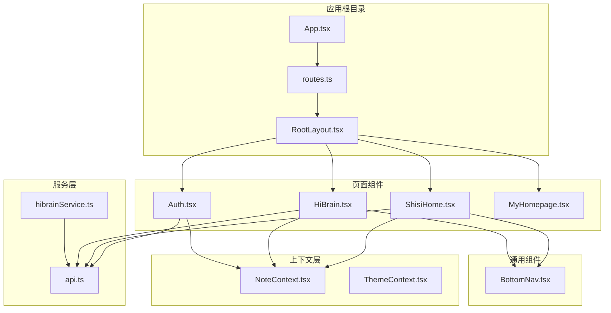
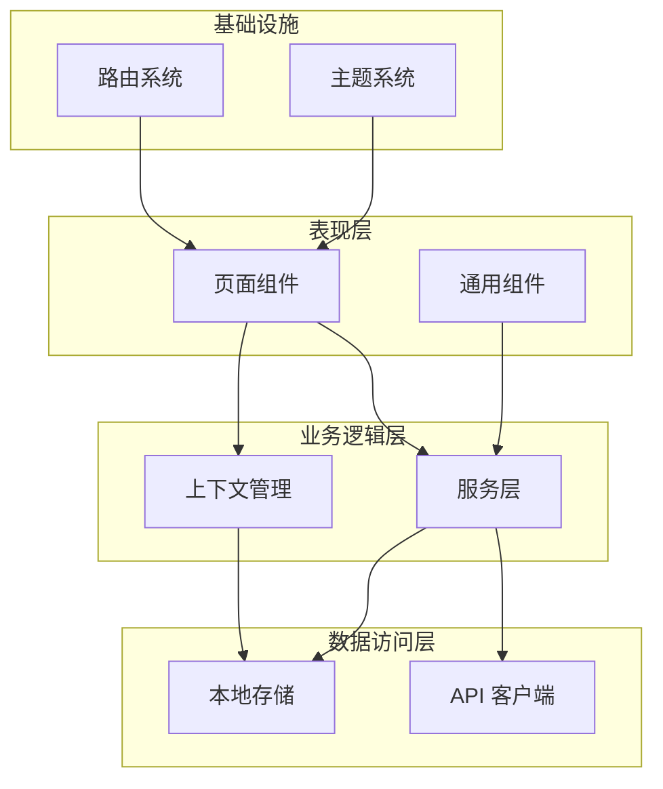
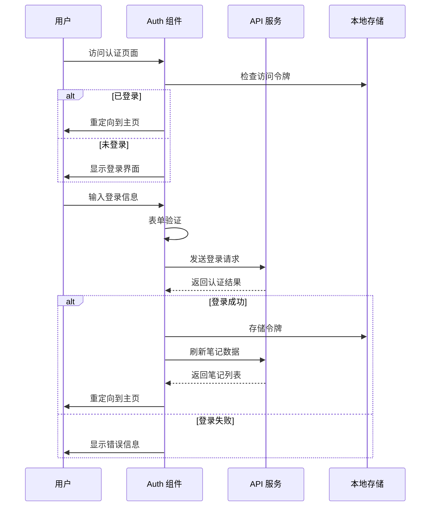
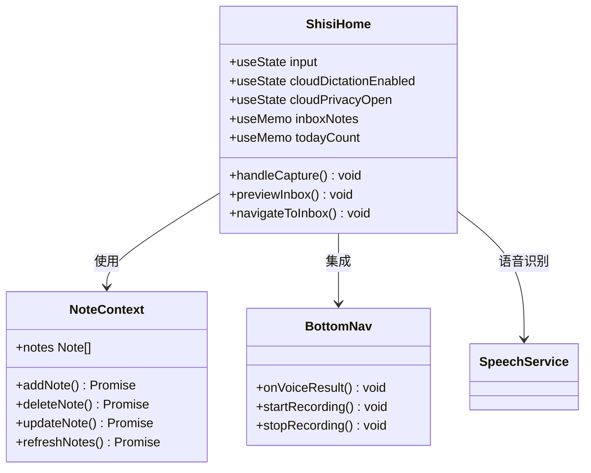
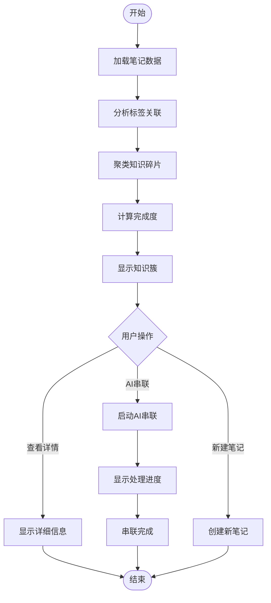
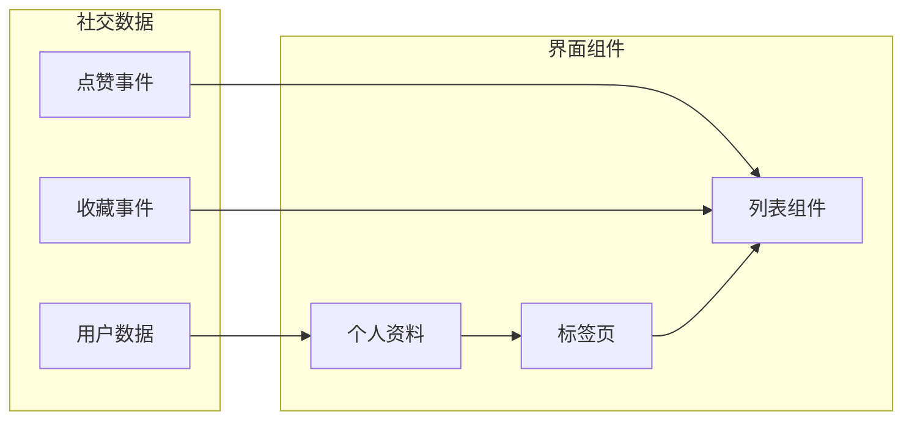
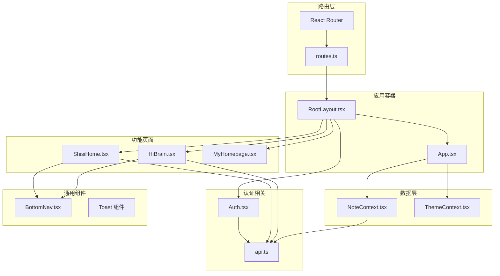

# 页面组件设计

<cite>
**本文档引用的文件**
- [Auth.tsx](file://src/app/pages/Auth.tsx)
- [ShisiHome.tsx](file://src/app/pages/ShisiHome.tsx)
- [HiBrain.tsx](file://src/app/pages/HiBrain.tsx)
- [App.tsx](file://src/app/App.tsx)
- [routes.ts](file://src/app/routes.ts)
- [NoteContext.tsx](file://src/app/components/context/NoteContext.tsx)
- [RootLayout.tsx](file://src/app/components/RootLayout.tsx)
- [BottomNav.tsx](file://src/app/components/BottomNav.tsx)
- [ThemeContext.tsx](file://src/app/components/context/ThemeContext.tsx)
- [api.ts](file://src/app/services/api.ts)
- [hibrainService.ts](file://src/app/services/hibrainService.ts)
- [MyHomepage.tsx](file://src/app/pages/MyHomepage.tsx)
</cite>

## 目录
1. [引言](#引言)
2. [项目结构](#项目结构)
3. [核心组件](#核心组件)
4. [架构概览](#架构概览)
5. [详细组件分析](#详细组件分析)
6. [依赖关系分析](#依赖关系分析)
7. [性能考虑](#性能考虑)
8. [故障排除指南](#故障排除指南)
9. [结论](#结论)

## 引言

本文档为页面组件设计的技术文档，详细说明了应用中各个页面组件的功能定位、实现特点和最佳实践。重点覆盖以下核心页面组件：

- **Auth 认证页面**：负责用户登录、注册、第三方登录等功能，提供完整的身份认证体验
- **ShisiHome 主页**：应用的核心入口页面，集成了笔记记录、收件箱、知识增长等功能
- **HiBrain 智能助手**：AI 驱动的知识管理助手，提供智能问答、知识串联、思维导图等功能

文档还涵盖了页面组件的生命周期管理、状态初始化、参数传递与数据共享机制、代码组织结构与命名规范、复用模式与组合策略，以及开发最佳实践和常见问题解决方案。

## 项目结构

应用采用基于路由的页面组件架构，主要目录结构如下：

**图表来源**
- [App.tsx:1-17](file://src/app/App.tsx#L1-L17)
- [routes.ts:1-61](file://src/app/routes.ts#L1-L61)
- [RootLayout.tsx:1-52](file://src/app/components/RootLayout.tsx#L1-L52)

**章节来源**
- [App.tsx:1-17](file://src/app/App.tsx#L1-L17)
- [routes.ts:1-61](file://src/app/routes.ts#L1-L61)
- [RootLayout.tsx:1-52](file://src/app/components/RootLayout.tsx#L1-L52)

## 核心组件

### 应用容器与布局

应用使用 React Router 提供的路由系统，通过 `App.tsx` 作为根组件，注入全局上下文：

- **ThemeProvider**：提供主题切换功能，支持系统、浅色、深色三种主题模式
- **NoteProvider**：管理笔记数据状态，提供 CRUD 操作和本地存储同步
- **ToastProvider**：统一的提示消息管理

### 路由配置

路由系统定义了完整的页面导航结构：

- **根路径**：Splash 启动页
- **认证相关**：Auth 登录页
- **主页系列**：ShisiHome 主页、MyHomepage 个人主页
- **功能页面**：HiBrain 智能助手、NoteList 笔记列表、SiChain 思链等
- **工具页面**：Inbox 收件箱、DailyReview 日常回顾等

**章节来源**
- [App.tsx:1-17](file://src/app/App.tsx#L1-L17)
- [routes.ts:1-61](file://src/app/routes.ts#L1-L61)

## 架构概览

应用采用分层架构设计，各层职责清晰：

**图表来源**
- [App.tsx:1-17](file://src/app/App.tsx#L1-L17)
- [NoteContext.tsx:1-356](file://src/app/components/context/NoteContext.tsx#L1-L356)
- [api.ts:1-127](file://src/app/services/api.ts#L1-L127)

### 数据流管理

应用实现了完整的数据流管理机制：

1. **状态提升**：核心状态集中在 `NoteContext` 中，避免状态分散
2. **单向数据流**：通过 props 和回调函数传递数据，确保数据流向清晰
3. **本地优先**：支持离线操作，数据延迟同步到服务器
4. **缓存策略**：合理使用 localStorage 缓存，提升用户体验

**章节来源**
- [NoteContext.tsx:1-356](file://src/app/components/context/NoteContext.tsx#L1-L356)
- [api.ts:1-127](file://src/app/services/api.ts#L1-L127)

## 详细组件分析

### Auth 认证页面

#### 功能特性

Auth 页面提供了完整的用户认证体验：

- **双模式登录**：支持手机号验证码登录和邮箱/用户名密码登录
- **多种注册方式**：手机号短信注册、邮箱注册、微信一键注册、支付宝注册
- **动画效果**：使用 Framer Motion 实现流畅的页面切换和状态变化
- **表单验证**：实时表单验证和错误提示
- **第三方集成**：模拟微信和支付宝登录流程

#### 生命周期管理

**图表来源**
- [Auth.tsx:414-550](file://src/app/pages/Auth.tsx#L414-L550)
- [api.ts:44-127](file://src/app/services/api.ts#L44-L127)

#### 状态管理

Auth 组件维护了复杂的状态管理系统：

- **登录状态**：tab、method、showPwd、loading、success 等
- **注册状态**：regMode、phoneStep、emailStep、otp、regCd 等
- **模态框状态**：wechatOpen、alipayOpen、modalIsReg 等
- **表单状态**：errors、form、regForm 等

#### 最佳实践

1. **状态分离**：将登录和注册状态完全分离，避免相互干扰
2. **防抖处理**：对计时器和异步操作进行适当的清理
3. **错误处理**：提供友好的错误提示和恢复机制
4. **安全性**：敏感信息（如密码）不进行不必要的状态暴露

**章节来源**
- [Auth.tsx:1-800](file://src/app/pages/Auth.tsx#L1-L800)

### ShisiHome 主页

#### 功能定位

ShisiHome 是应用的核心主页，集成了以下核心功能：

- **笔记记录**：提供便捷的一句话记录功能
- **收件箱管理**：展示和管理待处理的闪念
- **知识增长**：基于笔记标签的智能知识串联
- **语音输入**：支持语音转文字的云听写功能
- **社交互动**：提供思圈浏览和日常回顾功能

#### 组件架构

**图表来源**
- [ShisiHome.tsx:45-457](file://src/app/pages/ShisiHome.tsx#L45-L457)
- [NoteContext.tsx:18-356](file://src/app/components/context/NoteContext.tsx#L18-L356)
- [BottomNav.tsx:96-387](file://src/app/components/BottomNav.tsx#L96-L387)

#### 状态初始化

主页的状态初始化遵循以下原则：

1. **懒加载**：只在需要时加载和计算数据
2. **记忆化**：使用 `useMemo` 缓存昂贵的计算结果
3. **条件渲染**：根据用户认证状态动态显示功能
4. **本地优先**：优先使用本地存储的数据

#### 数据共享机制

主页通过以下方式实现数据共享：

- **全局上下文**：所有页面共享笔记数据
- **事件通信**：底部导航通过事件与主页通信
- **路由状态**：通过路由状态传递初始参数

**章节来源**
- [ShisiHome.tsx:1-457](file://src/app/pages/ShisiHome.tsx#L1-L457)

### HiBrain 智能助手

#### 功能特性

HiBrain 提供了强大的 AI 助手功能：

- **智能问答**：基于 RAG 的知识问答系统
- **知识串联**：自动分析笔记标签，生成知识图谱
- **思维导图**：可视化展示知识结构
- **多模态输入**：支持文本、图片、语音等多种输入方式
- **个性化推荐**：根据用户知识结构提供学习建议

#### 知识增长面板

**图表来源**
- [HiBrain.tsx:68-98](file://src/app/pages/HiBrain.tsx#L68-L98)
- [HiBrain.tsx:701-798](file://src/app/pages/HiBrain.tsx#L701-L798)

#### AI 串联流程

HiBrain 的 AI 串联功能实现了以下流程：

1. **碎片识别**：自动识别相关的知识碎片
2. **主题提取**：从碎片中提取核心主题
3. **内容补全**：使用 AI 补充缺失的知识点
4. **结构优化**：生成完整的知识结构图
5. **可视化展示**：提供多种视图模式

#### 组件复用策略

HiBrain 实现了良好的组件复用：

- **ClusterCard**：可复用的知识簇卡片组件
- **StrategyViewPanel**：可复用的策略视图面板
- **ChatCards**：可复用的聊天卡片组件
- **InlineSearch**：可复用的内联搜索组件

**章节来源**
- [HiBrain.tsx:1-800](file://src/app/pages/HiBrain.tsx#L1-L800)

### MyHomepage 个人主页

#### 功能定位

MyHomepage 提供了用户的个人资料和社交功能：

- **个人资料展示**：头像、昵称、简介等基本信息
- **社交互动**：粉丝管理、点赞统计、收藏统计
- **内容管理**：用户发布的笔记列表
- **数据分析**：基于用户行为的统计分析

#### 社交功能实现

**图表来源**
- [MyHomepage.tsx:1-702](file://src/app/pages/MyHomepage.tsx#L1-L702)

#### 数据模型

个人主页使用了以下数据模型：

- **MockUser**：模拟用户数据结构
- **LikeEvent**：点赞事件数据结构  
- **BookmarkEvent**：收藏事件数据结构
- **Note**：笔记数据结构（继承自 NoteContext）

**章节来源**
- [MyHomepage.tsx:1-702](file://src/app/pages/MyHomepage.tsx#L1-L702)

## 依赖关系分析

### 组件依赖图

**图表来源**
- [routes.ts:1-61](file://src/app/routes.ts#L1-L61)
- [App.tsx:1-17](file://src/app/App.tsx#L1-L17)
- [NoteContext.tsx:1-356](file://src/app/components/context/NoteContext.tsx#L1-L356)

### 服务层依赖

应用的服务层实现了清晰的依赖关系：

- **api.ts**：统一的 API 客户端，处理认证和错误处理
- **hibrainService.ts**：HiBrain 特定的服务封装
- **speechService.ts**：语音识别服务
- **messageStore.ts**：消息存储服务

**章节来源**
- [api.ts:1-127](file://src/app/services/api.ts#L1-L127)
- [hibrainService.ts:1-118](file://src/app/services/hibrainService.ts#L1-L118)

## 性能考虑

### 渲染优化

1. **懒加载**：使用 `useMemo` 和 `useCallback` 优化昂贵的计算和回调
2. **虚拟滚动**：对于大量数据的列表使用虚拟滚动技术
3. **分割渲染**：将复杂的页面拆分为多个独立的渲染单元
4. **防抖节流**：对高频事件（如窗口大小变化、滚动事件）使用防抖节流

### 网络优化

1. **请求缓存**：合理使用 HTTP 缓存头和客户端缓存
2. **并发控制**：限制同时进行的网络请求数量
3. **增量更新**：支持部分数据的增量更新，减少全量刷新
4. **离线支持**：提供完整的离线数据同步机制

### 内存管理

1. **状态清理**：及时清理定时器、事件监听器和订阅
2. **组件卸载**：在组件卸载时清理所有副作用
3. **大对象优化**：对大数据对象使用引用而非拷贝
4. **垃圾回收**：避免创建不必要的闭包和对象

## 故障排除指南

### 常见问题及解决方案

#### 认证相关问题

**问题**：登录后无法跳转到主页
**解决方案**：
1. 检查 `access_token` 是否正确存储
2. 验证 `refreshNotes()` 函数是否正常执行
3. 确认路由配置是否正确

**问题**：第三方登录无法完成
**解决方案**：
1. 检查微信和支付宝的回调地址配置
2. 验证模拟登录流程的日志输出
3. 确认 `localStorage` 中的认证状态

#### 数据同步问题

**问题**：离线状态下数据不同步
**解决方案**：
1. 检查 `syncingLocalRef` 状态
2. 验证网络连接状态
3. 查看同步队列的执行情况

**问题**：笔记数据丢失
**解决方案**：
1. 检查 `LOCAL_NOTES_KEY` 的存储状态
2. 验证 `saveLocalNotes()` 和 `loadLocalNotes()` 函数
3. 确认本地存储的权限设置

#### 性能问题

**问题**：页面加载缓慢
**解决方案**：
1. 使用浏览器开发者工具分析性能瓶颈
2. 检查是否有不必要的重渲染
3. 优化大型列表的渲染性能

**问题**：内存泄漏
**解决方案**：
1. 检查所有组件的 `useEffect` 清理函数
2. 验证事件监听器是否正确移除
3. 确认定时器是否正确清理

**章节来源**
- [Auth.tsx:468-473](file://src/app/pages/Auth.tsx#L468-L473)
- [NoteContext.tsx:220-222](file://src/app/components/context/NoteContext.tsx#L220-L222)
- [api.ts:56-126](file://src/app/services/api.ts#L56-L126)

## 结论

本文档详细介绍了页面组件设计的技术实现，涵盖了从架构设计到具体实现的各个方面。通过合理的组件划分、清晰的依赖关系和完善的错误处理机制，应用实现了良好的可维护性和扩展性。

关键的设计原则包括：

1. **单一职责**：每个组件专注于特定的功能领域
2. **状态集中**：核心状态通过上下文进行集中管理
3. **数据流清晰**：采用单向数据流，确保数据流向可追踪
4. **性能优化**：通过多种技术手段优化渲染和网络性能
5. **错误处理**：提供完善的错误处理和用户反馈机制

这些设计模式和最佳实践为后续的功能扩展和维护奠定了坚实的基础。建议在开发新功能时遵循相同的设计原则，确保系统的整体质量和一致性。