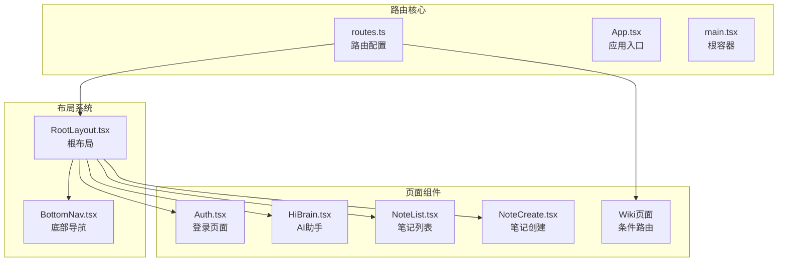
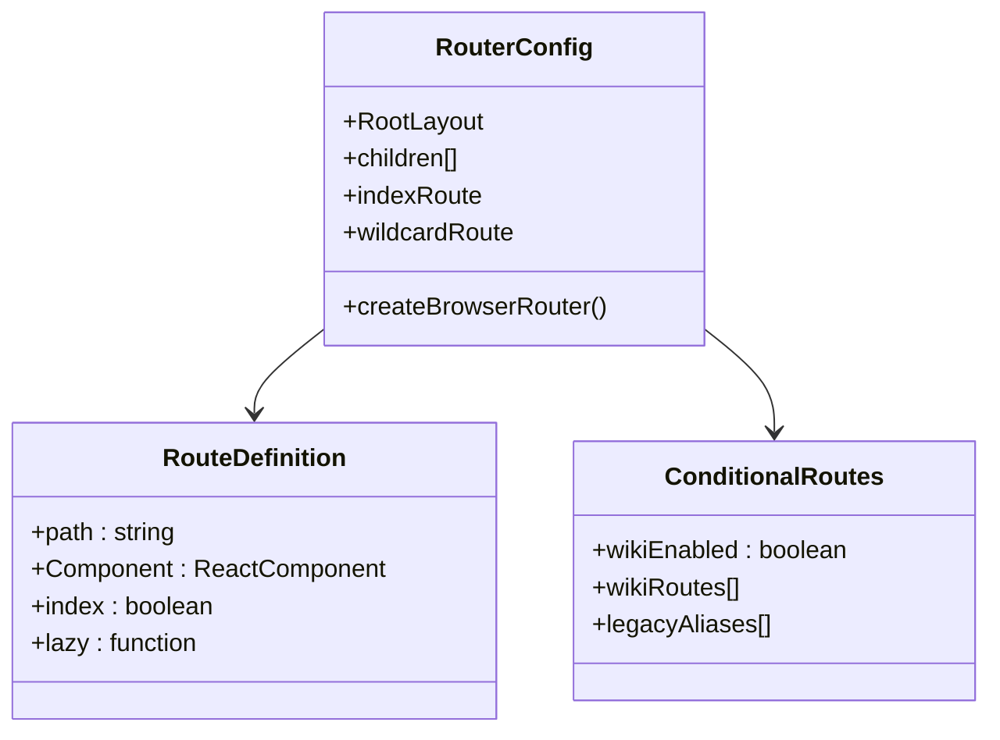
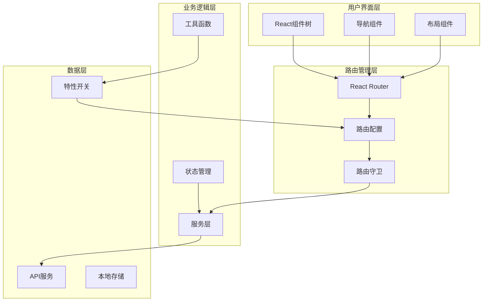
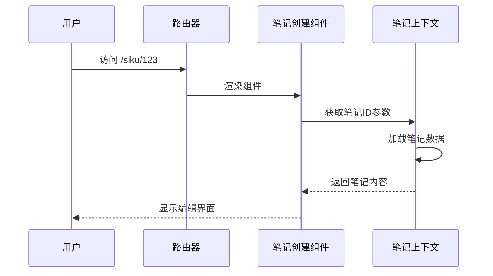
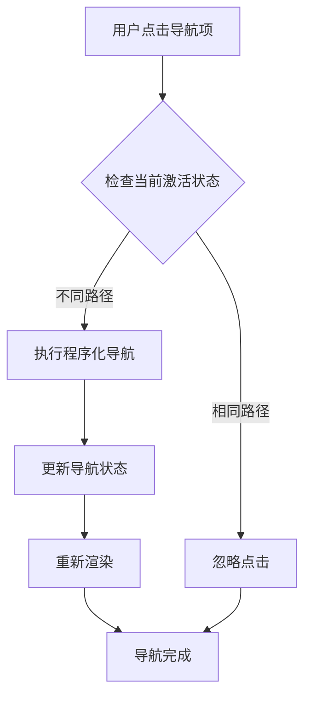
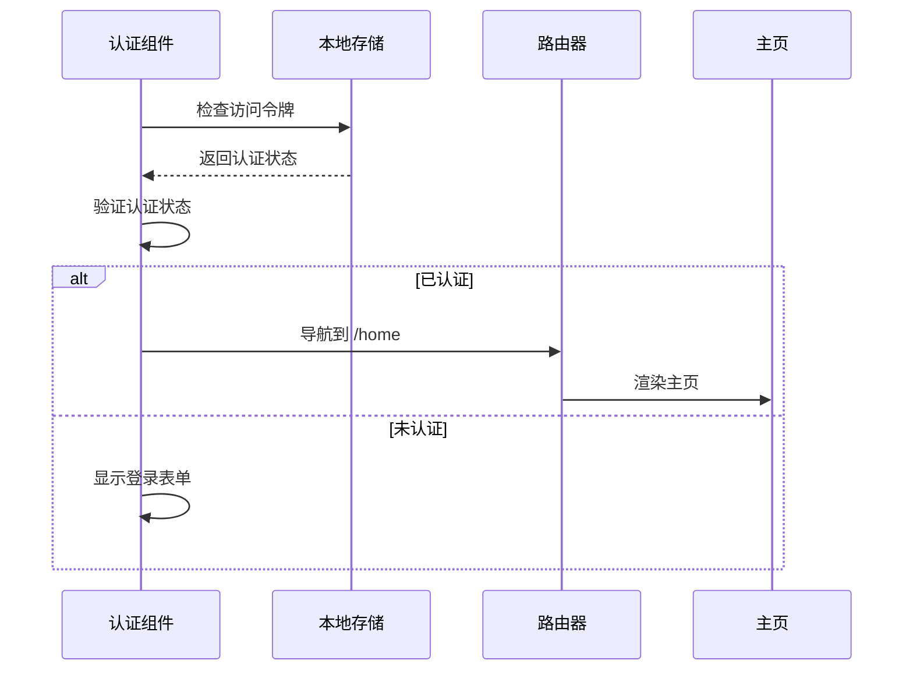
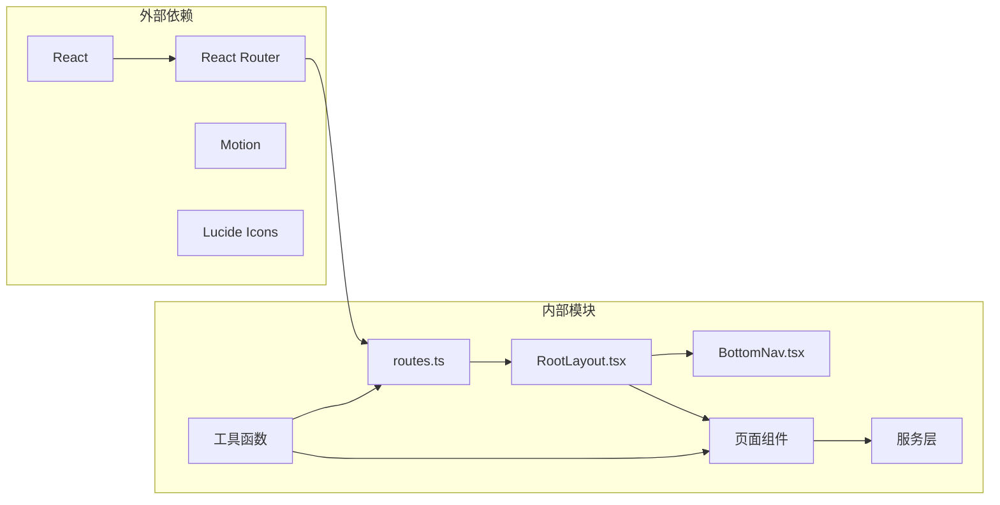
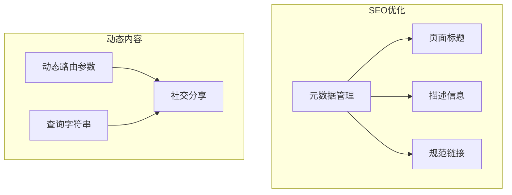

# 页面路由系统

<cite>
**本文档引用的文件**
- [src/app/routes.ts](file://src/app/routes.ts)
- [src/app/App.tsx](file://src/app/App.tsx)
- [src/main.tsx](file://src/main.tsx)
- [src/app/components/RootLayout.tsx](file://src/app/components/RootLayout.tsx)
- [src/app/components/BottomNav.tsx](file://src/app/components/BottomNav.tsx)
- [src/app/utils/featureFlags.ts](file://src/app/utils/featureFlags.ts)
- [src/app/pages/Auth.tsx](file://src/app/pages/Auth.tsx)
- [src/app/pages/HiBrain.tsx](file://src/app/pages/HiBrain.tsx)
- [src/app/pages/NoteList.tsx](file://src/app/pages/NoteList.tsx)
- [src/app/pages/NoteCreate.tsx](file://src/app/pages/NoteCreate.tsx)
- [src/app/components/ui/breadcrumb.tsx](file://src/app/components/ui/breadcrumb.tsx)
- [index.html](file://index.html)
</cite>

## 目录
1. [简介](#简介)
2. [项目结构](#项目结构)
3. [核心组件](#核心组件)
4. [架构概览](#架构概览)
5. [详细组件分析](#详细组件分析)
6. [依赖关系分析](#依赖关系分析)
7. [性能考虑](#性能考虑)
8. [故障排除指南](#故障排除指南)
9. [结论](#结论)

## 简介

本项目采用 React Router v6 构建的现代化单页应用路由系统，支持完整的页面导航、参数传递、查询字符串处理和程序化导航。系统包含从 Auth 登录页面到各种功能页面的完整路由映射，实现了动态路由参数、条件路由渲染和导航状态管理。

## 项目结构

项目采用基于功能的模块化组织结构，路由系统主要分布在以下目录：

**图表来源**
- [src/app/routes.ts:26-60](file://src/app/routes.ts#L26-L60)
- [src/app/components/RootLayout.tsx:10-51](file://src/app/components/RootLayout.tsx#L10-L51)

**章节来源**
- [src/app/routes.ts:1-61](file://src/app/routes.ts#L1-L61)
- [src/app/App.tsx:1-17](file://src/app/App.tsx#L1-L17)
- [src/main.tsx:1-7](file://src/main.tsx#L1-L7)

## 核心组件

### 路由配置系统

系统使用 `createBrowserRouter` 创建集中式路由配置，支持嵌套路由和条件渲染：

**图表来源**
- [src/app/routes.ts:26-60](file://src/app/routes.ts#L26-L60)
- [src/app/utils/featureFlags.ts:7-13](file://src/app/utils/featureFlags.ts#L7-L13)

### 应用入口点

应用通过单一入口点初始化，确保所有路由组件共享上下文提供者：

**章节来源**
- [src/app/App.tsx:7-17](file://src/app/App.tsx#L7-L17)
- [src/main.tsx:2-7](file://src/main.tsx#L2-L7)

## 架构概览

系统采用分层架构设计，实现清晰的关注点分离：

**图表来源**
- [src/app/routes.ts:26-60](file://src/app/routes.ts#L26-L60)
- [src/app/components/BottomNav.tsx:96-386](file://src/app/components/BottomNav.tsx#L96-L386)

## 详细组件分析

### 路由配置详解

系统路由配置采用声明式语法，支持多种路由类型：

#### 基础路由映射

| 路由路径 | 组件名称 | 功能描述 |
|---------|----------|----------|
| `/` | RootLayout | 根布局容器 |
| `/auth` | Auth | 用户认证页面 |
| `/home` | ShisiHome | 主页内容 |
| `/assistant` | HiBrain | AI助手功能 |
| `/siku` | NoteList | 笔记列表 |
| `/siku/create` | NoteCreate | 新建笔记 |
| `/siku/:id` | NoteCreate | 编辑笔记 |

#### 参数化路由

系统支持动态路由参数，用于笔记编辑和详情展示：

**图表来源**
- [src/app/routes.ts:39-40](file://src/app/routes.ts#L39-L40)
- [src/app/pages/NoteCreate.tsx:8-8](file://src/app/pages/NoteCreate.tsx#L8-L8)

#### 条件路由实现

wiki 功能通过特性开关动态启用/禁用：

**章节来源**
- [src/app/routes.ts:49-52](file://src/app/routes.ts#L49-L52)
- [src/app/utils/featureFlags.ts:7-13](file://src/app/utils/featureFlags.ts#L7-L13)

### 导航组件系统

底部导航组件提供统一的导航体验：

**图表来源**
- [src/app/components/BottomNav.tsx:223-227](file://src/app/components/BottomNav.tsx#L223-L227)
- [src/app/components/BottomNav.tsx:323-329](file://src/app/components/BottomNav.tsx#L323-L329)

### 认证与导航流程

认证系统集成导航逻辑，实现自动跳转：

**图表来源**
- [src/app/pages/Auth.tsx:475-481](file://src/app/pages/Auth.tsx#L475-L481)

**章节来源**
- [src/app/components/BottomNav.tsx:96-386](file://src/app/components/BottomNav.tsx#L96-L386)
- [src/app/pages/Auth.tsx:414-481](file://src/app/pages/Auth.tsx#L414-L481)

### 页面组件设计模式

各页面组件遵循统一的设计模式，支持响应式导航和状态管理：

#### 笔记列表组件

支持多视图切换、搜索过滤和标签筛选：

**章节来源**
- [src/app/pages/NoteList.tsx:383-800](file://src/app/pages/NoteList.tsx#L383-L800)

#### 笔记创建组件

集成富文本编辑器和AI生成功能：

**章节来源**
- [src/app/pages/NoteCreate.tsx:1-800](file://src/app/pages/NoteCreate.tsx#L1-L800)

## 依赖关系分析

系统依赖关系清晰，遵循单一职责原则：

**图表来源**
- [src/app/routes.ts:1-22](file://src/app/routes.ts#L1-L22)
- [src/app/components/BottomNav.tsx:1-10](file://src/app/components/BottomNav.tsx#L1-L10)

**章节来源**
- [src/app/routes.ts:1-22](file://src/app/routes.ts#L1-L22)
- [src/app/components/RootLayout.tsx:1-5](file://src/app/components/RootLayout.tsx#L1-L5)

## 性能考虑

### 路由性能优化

系统采用以下性能优化策略：

1. **条件路由渲染**：通过特性开关减少不必要的组件加载
2. **程序化导航**：避免不必要的重渲染
3. **状态管理**：集中管理导航状态，减少组件间通信开销

### SEO 优化策略

虽然为单页应用，但仍实现基本的SEO优化：

**图表来源**
- [index.html:4-8](file://index.html#L4-L8)

## 故障排除指南

### 常见问题及解决方案

#### 路由跳转失效

**症状**：点击导航按钮无反应
**原因**：导航状态检查逻辑问题
**解决**：检查 `isActive` 函数和 `useNavigate` 使用

#### 认证状态异常

**症状**：已登录用户仍显示登录页面
**原因**：本地存储数据损坏
**解决**：清理浏览器本地存储，重新登录

#### 动态路由参数丢失

**症状**：编辑笔记时参数丢失
**原因**：路由参数提取错误
**解决**：检查 `useParams` Hook 使用和路由配置

**章节来源**
- [src/app/components/BottomNav.tsx:223-227](file://src/app/components/BottomNav.tsx#L223-L227)
- [src/app/pages/Auth.tsx:475-481](file://src/app/pages/Auth.tsx#L475-L481)

## 结论

本路由系统采用现代 React Router v6 架构，实现了：

1. **完整的路由映射**：覆盖所有功能页面和导航场景
2. **灵活的参数传递**：支持动态路由参数和查询字符串
3. **条件路由渲染**：通过特性开关实现功能的动态启用
4. **统一的导航体验**：底部导航组件提供一致的用户体验
5. **良好的扩展性**：模块化设计便于功能扩展和维护

系统在保证功能完整性的同时，注重性能优化和用户体验，为后续的功能扩展奠定了坚实的基础。