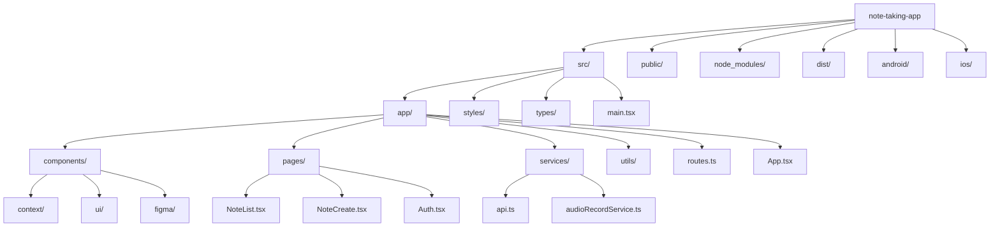
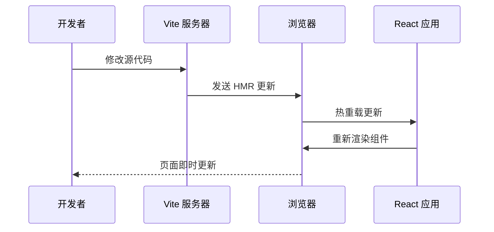

# 快速开始指南

<cite>
**本文档引用的文件**
- [README.md](file://README.md)
- [package.json](file://package.json)
- [vite.config.ts](file://vite.config.ts)
- [capacitor.config.json](file://capacitor.config.json)
- [postcss.config.mjs](file://postcss.config.mjs)
- [index.html](file://index.html)
- [src/main.tsx](file://src/main.tsx)
- [src/app/App.tsx](file://src/app/App.tsx)
- [src/app/routes.ts](file://src/app/routes.ts)
- [src/app/services/api.ts](file://src/app/services/api.ts)
- [src/app/services/audioRecordService.ts](file://src/app/services/audioRecordService.ts)
- [src/app/components/context/NoteContext.tsx](file://src/app/components/context/NoteContext.tsx)
- [src/styles/index.css](file://src/styles/index.css)
</cite>

## 目录
1. [简介](#简介)
2. [环境准备](#环境准备)
3. [项目安装](#项目安装)
4. [开发环境启动](#开发环境启动)
5. [项目结构概览](#项目结构概览)
6. [关键配置文件说明](#关键配置文件说明)
7. [开发工作流程](#开发工作流程)
8. [常见问题解决](#常见问题解决)
9. [故障排除指南](#故障排除指南)
10. [性能优化建议](#性能优化建议)
11. [总结](#总结)

## 简介

Note-taking app 是一个基于 React 和 Vite 构建的现代化笔记应用前端项目。该应用支持多平台部署（Web、iOS、Android），具备丰富的笔记管理功能，包括富文本编辑、标签管理、语音录制等功能。项目采用 Capacitor 作为跨平台框架，结合 Material-UI 组件库和 Tailwind CSS 样式系统。

## 环境准备

### Node.js 版本要求

在开始之前，请确保您的系统满足以下 Node.js 版本要求：

- **Node.js**: 18.3.1 或更高版本
- **npm**: 9.0.0 或更高版本
- **包管理器**: 支持 npm 或 pnpm

**验证 Node.js 安装**：
```bash
node --version
npm --version
```

**预期输出**：
```
v18.3.1
9.0.0
```

### 系统要求

- **操作系统**: macOS、Windows 或 Linux
- **内存**: 至少 4GB RAM
- **存储空间**: 至少 500MB 可用空间
- **网络**: 稳定的互联网连接（用于下载依赖）

## 项目安装

### 步骤 1: 克隆项目

```bash
# 使用 HTTPS
git clone https://github.com/your-repository/note-taking-app.git

# 或使用 SSH
git clone git@github.com:your-repository/note-taking-app.git
```

### 步骤 2: 进入项目目录

```bash
cd note-taking-app
```

### 步骤 3: 安装依赖

根据项目配置，推荐使用 npm 进行依赖安装：

```bash
npm install
```

**可选**: 如果您使用 pnpm（项目已配置 pnpm overrides），可以使用：

```bash
pnpm install
```

**预期输出**（示例）：
```
added 1234 packages, and audited 1235 packages in 45s
found 0 vulnerabilities
```

### 步骤 4: 验证安装

检查关键依赖是否正确安装：

```bash
npm list react react-dom vite
```

**预期输出**（示例）：
```
note-taking-app@0.0.1
├── react@18.3.1
├── react-dom@18.3.1
└── vite@6.3.5
```

## 开发环境启动

### 启动开发服务器

使用以下命令启动开发服务器：

```bash
npm run dev
```

**预期输出**（示例）：
```
  VITE v6.3.5  ready in 123 ms

  ➜  Local:   http://localhost:5173/
  ➜  Network: http://192.168.1.100:5173/
  ➜  press h to show help

  2:34:56 PM [vite] hmr update /src/main.tsx
  2:34:56 PM [vite] hmr update /src/app/App.tsx
  2:34:56 PM [vite] hmr update /src/app/routes.ts
```

### 访问应用

打开浏览器访问：`http://localhost:5173/`

**预期页面**：
- 应用主界面加载完成
- 控制台无错误信息
- 热重载功能正常工作

### 开发服务器配置

Vite 开发服务器配置特点：

- **端口**: 默认 5173
- **热重载**: 自动刷新页面
- **代理**: 支持 API 请求代理
- **HTTPS**: 可配置为 HTTPS 开发环境

## 项目结构概览

### 核心目录结构



**图表来源**
- [package.json:1-113](file://package.json#L1-L113)
- [src/app/routes.ts:1-61](file://src/app/routes.ts#L1-L61)

### 主要模块说明

#### 源代码目录 (`src/`)
- **app/**: 应用核心逻辑和组件
- **styles/**: 样式文件和主题配置
- **types/**: TypeScript 类型定义
- **main.tsx**: 应用入口点

#### 平台特定目录
- **android/**: Android 平台配置和资源
- **ios/**: iOS 平台配置和资源
- **dist/**: 构建输出目录

## 关键配置文件说明

### package.json - 项目配置

项目使用 npm 脚本进行构建和开发：

```json
{
  "scripts": {
    "build": "vite build",
    "dev": "vite"
  },
  "dependencies": {
    "react": "18.3.1",
    "react-dom": "18.3.1",
    "vite": "6.3.5"
  }
}
```

**重要配置项**：
- **dev**: 启动 Vite 开发服务器
- **build**: 生产环境构建
- **React 版本**: 18.3.1（严格锁定）
- **Vite 版本**: 6.3.5（严格锁定）

### vite.config.ts - Vite 配置

Vite 构建工具配置文件：

```typescript
export default defineConfig({
  plugins: [
    react(),
    tailwindcss(),
  ],
  resolve: {
    dedupe: ['react', 'react-dom', 'motion'],
    alias: {
      '@': path.resolve(__dirname, './src'),
    },
  },
  optimizeDeps: {
    include: ['react', 'react-dom', '@tiptap/core'],
  },
  assetsInclude: ['**/*.svg', '**/*.csv'],
})
```

**关键特性**：
- **插件系统**: React 和 Tailwind CSS 支持
- **别名配置**: `@` 指向 `src/` 目录
- **依赖预打包**: 优化启动性能
- **静态资源处理**: SVG 和 CSV 文件支持

### capacitor.config.json - Capacitor 配置

跨平台框架配置：

```json
{
  "appId": "com.shisi.app.v2",
  "appName": "拾思",
  "webDir": "dist",
  "server": {
    "androidScheme": "http",
    "cleartext": true
  }
}
```

**移动端特性**：
- **本地服务器**: Android 支持 HTTP 明文传输
- **Web 目录**: 构建输出到 `dist/` 目录
- **应用标识**: `com.shisi.app.v2`

### postcss.config.mjs - PostCSS 配置

PostCSS 处理器配置：

```javascript
export default {
  plugins: []
}
```

**配置说明**：
- **Tailwind CSS**: 通过 Vite 插件自动配置
- **额外插件**: 可在此添加自定义 PostCSS 插件

## 开发工作流程

### 启动开发环境

```bash
# 1. 安装依赖
npm install

# 2. 启动开发服务器
npm run dev

# 3. 在浏览器中访问 http://localhost:5173/
```

### 代码热重载机制

Vite 提供实时热重载功能：



**图表来源**
- [vite.config.ts:1-44](file://vite.config.ts#L1-L44)

### 构建生产版本

```bash
# 构建生产环境
npm run build

# 构建完成后，dist/ 目录包含优化后的静态文件
```

**构建输出**：
- **dist/**: 生产环境静态资源
- **index.html**: 应用入口页面
- **JavaScript/CSS 文件**: 优化压缩后的资源

## 常见问题解决

### 依赖安装问题

**问题**: `npm install` 失败
**解决方案**:
```bash
# 清理缓存
npm cache clean --force

# 删除 node_modules 和 package-lock.json
rm -rf node_modules package-lock.json

# 重新安装
npm install
```

**问题**: 依赖版本冲突
**解决方案**:
```bash
# 检查依赖树
npm ls react

# 强制重新安装特定包
npm install react@18.3.1 --force
```

### 开发服务器启动问题

**问题**: 端口被占用
**解决方案**:
```bash
# 更改端口号
VITE_PORT=3000 npm run dev

# 或者杀死占用端口的进程
lsof -ti:5173 | xargs kill -9
```

**问题**: 热重载不工作
**解决方案**:
```bash
# 检查文件监听
npm run dev -- --host

# 清理 Vite 缓存
rm -rf node_modules/.vite
```

### API 连接问题

**问题**: 无法连接到后端 API
**解决方案**:
```bash
# 设置环境变量
export VITE_API_URL=http://localhost:3000

# 或在 .env 文件中配置
echo "VITE_API_URL=http://localhost:3000" > .env
```

**API 配置检查**：
- **默认地址**: `http://120.26.35.225:3000/api`
- **环境变量**: `VITE_API_URL`
- **Capacitor 集成**: 原生平台自动配置

## 故障排除指南

### 环境诊断

**检查 Node.js 版本兼容性**：
```bash
node --version
npm --version

# 验证 React 版本
npm list react react-dom
```

**检查网络连接**：
```bash
# 测试 API 可达性
curl -I http://120.26.35.225:3000/api

# 检查防火墙设置
sudo ufw status
```

### 构建问题排查

**问题**: 构建失败
**排查步骤**:
```bash
# 清理构建缓存
rm -rf dist node_modules/.vite

# 重新安装依赖
npm install

# 尝试生产构建
npm run build -- --mode production
```

**问题**: 样式不生效
**解决方案**:
```bash
# 检查 Tailwind 配置
cat postcss.config.mjs

# 验证 CSS 导入
cat src/styles/index.css
```

### 移动端调试

**iOS 调试**:
```bash
# 启用 Safari Web 检查器
# 设置 -> Safari -> 高级 -> 启用 Web 检查器
```

**Android 调试**:
```bash
# 启用开发者选项和 USB 调试
# 在浏览器中访问 chrome://inspect
```

## 性能优化建议

### 开发阶段优化

**启用生产模式**：
```bash
# 开发时使用生产模式进行性能测试
npm run dev -- --mode production
```

**依赖优化**：
```typescript
// vite.config.ts 中的依赖预打包
optimizeDeps: {
  include: [
    'react',
    'react-dom',
    '@tiptap/core',
    '@tiptap/starter-kit'
  ]
}
```

### 内存管理

**避免内存泄漏**：
```typescript
// 在组件卸载时清理定时器和事件监听器
useEffect(() => {
  const timer = setInterval(() => {
    // 定时任务
  }, 1000);
  
  return () => {
    clearInterval(timer);
  };
}, []);
```

## 总结

通过以上步骤，您应该能够成功运行 Note-taking app 前端项目。这个项目提供了完整的开发环境配置，包括：

- **完整的依赖管理系统**
- **热重载开发服务器**
- **跨平台部署支持**
- **现代化的构建工具链**
- **完善的错误处理机制**

**下一步建议**：
1. 阅读项目中的注释和文档
2. 查看具体的页面组件实现
3. 了解 API 服务集成方式
4. 探索音频录制功能的使用方法

如果在开发过程中遇到任何问题，请参考故障排除指南或检查项目配置文件。祝您开发顺利！