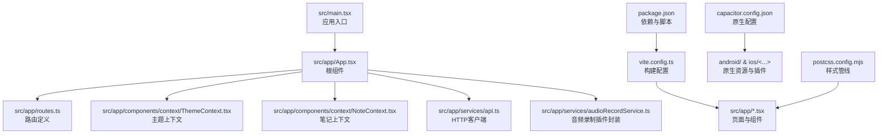
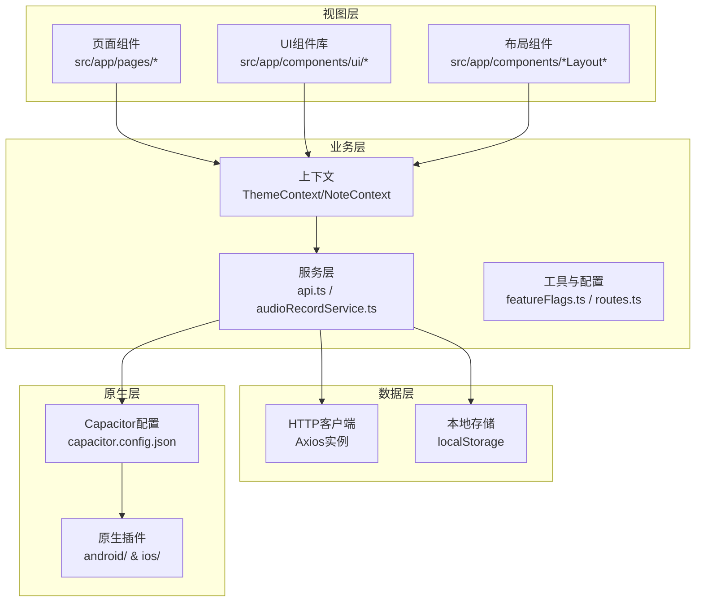
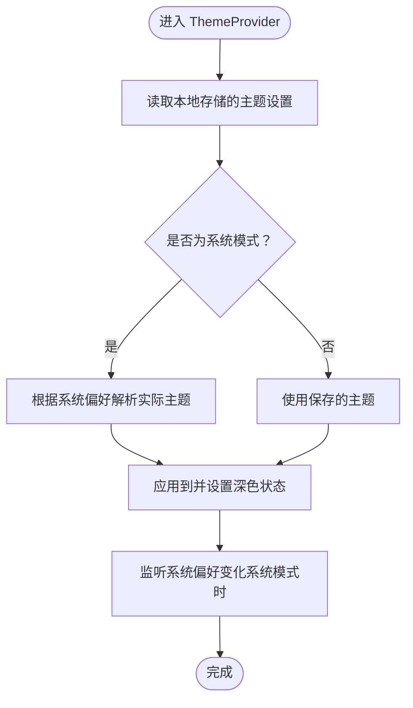
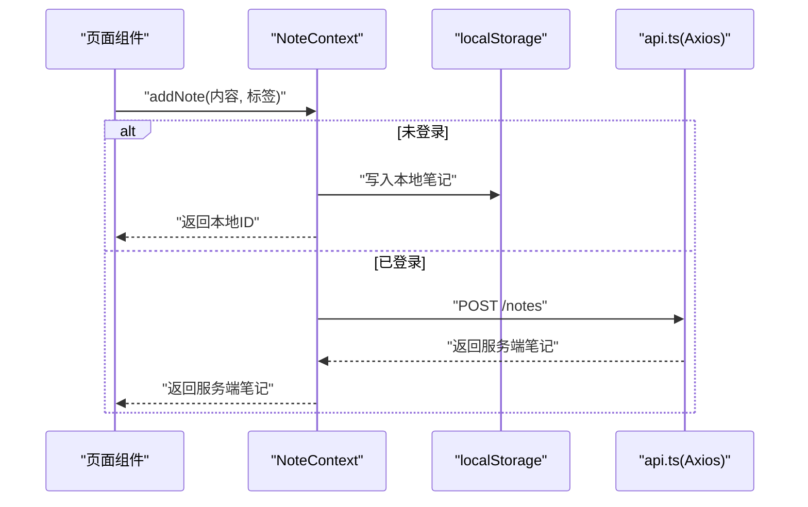
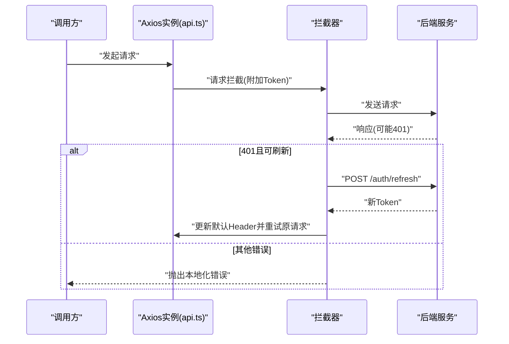
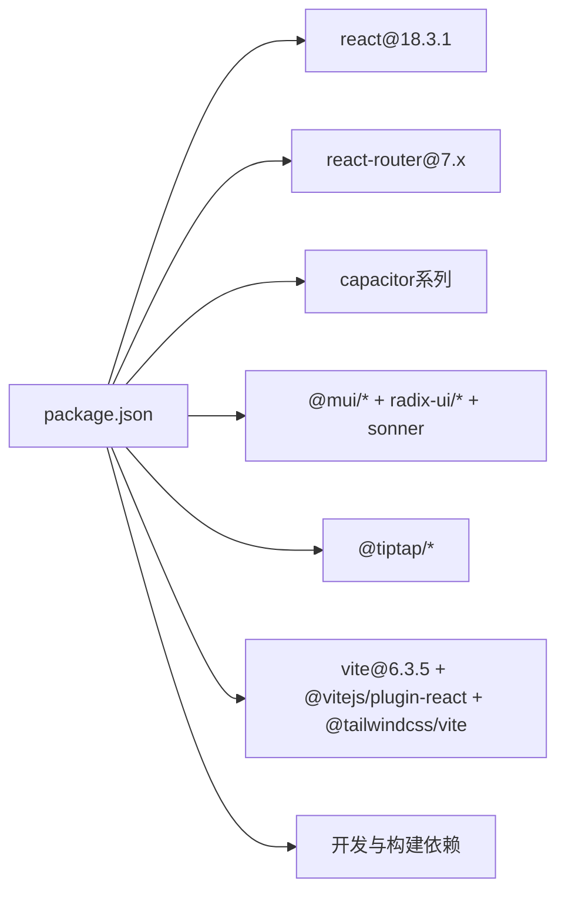

# 技术栈与架构

<cite>
**本文引用的文件**
- [package.json](file://package.json)
- [vite.config.ts](file://vite.config.ts)
- [capacitor.config.json](file://capacitor.config.json)
- [README.md](file://README.md)
- [src/main.tsx](file://src/main.tsx)
- [src/app/App.tsx](file://src/app/App.tsx)
- [src/app/routes.ts](file://src/app/routes.ts)
- [src/app/components/context/ThemeContext.tsx](file://src/app/components/context/ThemeContext.tsx)
- [src/app/components/context/NoteContext.tsx](file://src/app/components/context/NoteContext.tsx)
- [src/app/services/api.ts](file://src/app/services/api.ts)
- [src/app/services/audioRecordService.ts](file://src/app/services/audioRecordService.ts)
- [src/app/utils/featureFlags.ts](file://src/app/utils/featureFlags.ts)
- [postcss.config.mjs](file://postcss.config.mjs)
</cite>

## 目录
1. [引言](#引言)
2. [项目结构](#项目结构)
3. [核心组件](#核心组件)
4. [架构总览](#架构总览)
5. [详细组件分析](#详细组件分析)
6. [依赖分析](#依赖分析)
7. [性能考量](#性能考量)
8. [故障排查指南](#故障排查指南)
9. [结论](#结论)
10. [附录](#附录)

## 引言
本文件面向Note-taking app前端项目，系统性梳理并阐述技术栈与架构设计。重点覆盖以下方面：
- 核心技术栈：React 18.3.1、TypeScript、Vite 6.3.5、Capacitor 等在项目中的定位与作用
- 架构设计原则：组件化架构、分层架构、插件架构等
- 开发工具链、构建系统与部署策略
- 关键服务与上下文的设计动机与取舍
- 面向开发者的实践建议与排障指引

## 项目结构
该项目采用以功能域为中心的组织方式，结合Capacitor进行跨平台原生能力集成。前端核心入口通过Vite构建，Capacitor负责桥接Web与原生平台。

图表来源
- [src/main.tsx:1-7](file://src/main.tsx#L1-L7)
- [src/app/App.tsx:1-17](file://src/app/App.tsx#L1-L17)
- [src/app/routes.ts:1-61](file://src/app/routes.ts#L1-L61)
- [src/app/components/context/ThemeContext.tsx:1-110](file://src/app/components/context/ThemeContext.tsx#L1-L110)
- [src/app/components/context/NoteContext.tsx:1-356](file://src/app/components/context/NoteContext.tsx#L1-L356)
- [src/app/services/api.ts:1-127](file://src/app/services/api.ts#L1-L127)
- [src/app/services/audioRecordService.ts:1-35](file://src/app/services/audioRecordService.ts#L1-L35)
- [vite.config.ts:1-44](file://vite.config.ts#L1-L44)
- [capacitor.config.json:1-31](file://capacitor.config.json#L1-L31)
- [package.json:1-113](file://package.json#L1-L113)
- [postcss.config.mjs:1-16](file://postcss.config.mjs#L1-L16)

章节来源
- [src/main.tsx:1-7](file://src/main.tsx#L1-L7)
- [vite.config.ts:1-44](file://vite.config.ts#L1-L44)
- [capacitor.config.json:1-31](file://capacitor.config.json#L1-L31)
- [package.json:1-113](file://package.json#L1-L113)
- [postcss.config.mjs:1-16](file://postcss.config.mjs#L1-L16)

## 核心组件
- 应用入口与根组件
  - 入口文件负责挂载根组件，并引入全局样式
  - 根组件通过Provider组合主题、笔记、消息提示等上下文，并注入路由
- 路由体系
  - 使用浏览器路由，定义多页面布局与动态路由，支持特性开关控制部分模块的启用
- 主题上下文
  - 提供深浅色主题切换、系统跟随、本地持久化与DOM属性应用
- 笔记上下文
  - 统一封装笔记的增删改查、离线缓存合并、本地ID生成与同步逻辑
- HTTP客户端
  - 基于Axios封装，统一处理基础URL、请求头、鉴权与响应拦截（含令牌刷新与错误翻译）
- 音频录制插件封装
  - 基于Capacitor插件注册，提供类型安全的录音事件监听与生命周期管理
- 特性开关
  - 通过环境变量控制功能模块的启用/禁用，便于灰度与多环境差异

章节来源
- [src/main.tsx:1-7](file://src/main.tsx#L1-L7)
- [src/app/App.tsx:1-17](file://src/app/App.tsx#L1-L17)
- [src/app/routes.ts:1-61](file://src/app/routes.ts#L1-L61)
- [src/app/components/context/ThemeContext.tsx:1-110](file://src/app/components/context/ThemeContext.tsx#L1-L110)
- [src/app/components/context/NoteContext.tsx:1-356](file://src/app/components/context/NoteContext.tsx#L1-L356)
- [src/app/services/api.ts:1-127](file://src/app/services/api.ts#L1-L127)
- [src/app/services/audioRecordService.ts:1-35](file://src/app/services/audioRecordService.ts#L1-L35)
- [src/app/utils/featureFlags.ts:1-14](file://src/app/utils/featureFlags.ts#L1-L14)

## 架构总览
整体采用“组件化 + 分层 + 插件”混合架构：
- 组件化：页面与UI组件按功能域划分，复用性强
- 分层：视图层（React）、业务层（Context/Service）、数据层（API/Axios）
- 插件化：Capacitor插件桥接原生能力，保持Web层与原生层解耦

图表来源
- [src/app/App.tsx:1-17](file://src/app/App.tsx#L1-L17)
- [src/app/routes.ts:1-61](file://src/app/routes.ts#L1-L61)
- [src/app/components/context/ThemeContext.tsx:1-110](file://src/app/components/context/ThemeContext.tsx#L1-L110)
- [src/app/components/context/NoteContext.tsx:1-356](file://src/app/components/context/NoteContext.tsx#L1-L356)
- [src/app/services/api.ts:1-127](file://src/app/services/api.ts#L1-L127)
- [src/app/services/audioRecordService.ts:1-35](file://src/app/services/audioRecordService.ts#L1-L35)
- [capacitor.config.json:1-31](file://capacitor.config.json#L1-L31)

## 详细组件分析

### 组件A：主题上下文（ThemeContext）
- 设计要点
  - 支持系统/浅色/深色三种模式，自动监听系统偏好变化
  - 本地持久化用户选择，首次渲染即应用到<html>元素
  - 提供安全的DOM操作与受限环境兜底
- 复杂度与性能
  - 状态更新为O(1)，DOM变更通过单点属性切换，开销极低
- 错误处理
  - 匹配媒体查询与本地存储访问均做异常捕获，避免SSR/沙箱环境报错

图表来源
- [src/app/components/context/ThemeContext.tsx:63-105](file://src/app/components/context/ThemeContext.tsx#L63-L105)

章节来源
- [src/app/components/context/ThemeContext.tsx:1-110](file://src/app/components/context/ThemeContext.tsx#L1-L110)

### 组件B：笔记上下文（NoteContext）
- 设计要点
  - 合并本地与远端笔记数据，优先使用服务端权威数据
  - 未登录时以本地存储作为唯一数据源，支持离线新增/编辑/删除
  - 自动将本地未同步笔记批量同步至服务端
  - 规范化内容与标签，派生标题，推断笔记类型
- 数据流
  - 初始化加载 -> 本地恢复 -> 远端拉取 -> 合并去重 -> 同步本地未完成项
- 性能与可靠性
  - 使用Map去重与排序，避免重复渲染
  - 并发同步通过互斥标志防止重复提交

图表来源
- [src/app/components/context/NoteContext.tsx:224-272](file://src/app/components/context/NoteContext.tsx#L224-L272)
- [src/app/services/api.ts:36-42](file://src/app/services/api.ts#L36-L42)

章节来源
- [src/app/components/context/NoteContext.tsx:1-356](file://src/app/components/context/NoteContext.tsx#L1-L356)

### 组件C：HTTP客户端（api.ts）
- 设计要点
  - 动态基础URL：区分Web/Native/生产/开发环境；默认回退地址
  - 请求拦截：自动附加JWT
  - 响应拦截：统一处理401刷新令牌、错误信息本地化
- 安全与健壮性
  - 刷新令牌失败时清理本地凭证并跳转登录页
  - 对不可读的后端错误进行脱敏处理

图表来源
- [src/app/services/api.ts:44-126](file://src/app/services/api.ts#L44-L126)

章节来源
- [src/app/services/api.ts:1-127](file://src/app/services/api.ts#L1-L127)

### 组件D：音频录制插件封装（audioRecordService.ts）
- 设计要点
  - 基于Capacitor插件注册，暴露start/stop/addListener/removeAllListeners
  - 事件回调提供PCM16LE采样率、通道数、分片时长等参数
- 使用场景
  - 语音转写、语音摘要等AI能力前置采集

章节来源
- [src/app/services/audioRecordService.ts:1-35](file://src/app/services/audioRecordService.ts#L1-L35)
- [README.md:12-39](file://README.md#L12-L39)

### 组件E：特性开关（featureFlags.ts）
- 设计要点
  - 通过环境变量控制功能模块启用/禁用，支持布尔/字符串多种输入
  - 默认开启，显式关闭才禁用

章节来源
- [src/app/utils/featureFlags.ts:1-14](file://src/app/utils/featureFlags.ts#L1-L14)
- [src/app/routes.ts:24-52](file://src/app/routes.ts#L24-L52)

## 依赖分析
- 核心运行时依赖
  - React 18.3.1 及其DOM绑定，配合React Router实现页面级导航
  - Capacitor系列：核心、CLI、Android/iOS、键盘、状态栏、启动屏等插件
  - UI生态：Material UI、Radix UI、Sonner、Tailwind等
  - 编辑器与可视化：Tiptap、Recharts、Embla Carousel等
- 开发与构建依赖
  - Vite 6.3.5、@vitejs/plugin-react、@tailwindcss/vite
  - Tailwind CSS v4（通过Vite插件自动配置）
- 项目脚本
  - dev/build分别对应开发与生产构建

图表来源
- [package.json:10-112](file://package.json#L10-L112)

章节来源
- [package.json:1-113](file://package.json#L1-L113)

## 性能考量
- 构建与依赖优化
  - Vite启用dedupe与optimizeDeps，确保React与Motion等包仅有一份实例，避免“Invalid hook call”
  - 预打包常用依赖，缩短冷启动时间
- 运行时优化
  - 主题切换与笔记列表均采用最小DOM变更策略
  - Axios拦截器减少重复请求与错误传播成本
- 原生性能
  - Capacitor插件按需注册，避免不必要的原生桥接开销

章节来源
- [vite.config.ts:11-41](file://vite.config.ts#L11-L41)
- [src/app/components/context/ThemeContext.tsx:50-61](file://src/app/components/context/ThemeContext.tsx#L50-L61)
- [src/app/services/api.ts:44-126](file://src/app/services/api.ts#L44-L126)

## 故障排查指南
- 构建相关
  - 若出现“Invalid hook call”，检查React版本一致性与dedupe配置
  - 若Tailwind类不生效，确认@tailwindcss/vite已正确安装与启用
- 运行时相关
  - 登录后仍显示离线数据：确认令牌存在且API拦截器正常附加Authorization
  - 401频繁触发：检查刷新令牌流程与后端接口可用性
  - 主题切换无效：确认<html>上data-theme属性是否被覆盖
- 原生相关
  - 录音无事件：确认插件已注册且权限已授权
  - 服务器地址异常：核对环境变量与capacitor.config.json中webDir与server配置

章节来源
- [vite.config.ts:11-25](file://vite.config.ts#L11-L25)
- [postcss.config.mjs:1-16](file://postcss.config.mjs#L1-L16)
- [src/app/services/api.ts:21-34](file://src/app/services/api.ts#L21-L34)
- [capacitor.config.json:1-31](file://capacitor.config.json#L1-L31)
- [src/app/services/audioRecordService.ts:33-35](file://src/app/services/audioRecordService.ts#L33-L35)

## 结论
本项目以React 18.3.1为核心，借助Vite实现快速开发与高效构建，通过Capacitor打通Web与原生能力边界，形成“组件化 + 分层 + 插件化”的稳健架构。上下文与服务层清晰分离职责，HTTP客户端统一处理认证与错误，主题与笔记上下文兼顾用户体验与数据一致性。整体技术选型与工程实践契合跨平台笔记应用的开发目标。

## 附录
- 开发与部署建议
  - 开发：使用Vite dev，结合浏览器调试与React DevTools
  - 构建：使用Vite build，确保静态资源路径与Capacitor webDir一致
  - 原生：通过Capacitor CLI预览与打包，注意插件与权限配置
- 参考文件
  - [README.md:1-41](file://README.md#L1-L41)
  - [capacitor.config.json:1-31](file://capacitor.config.json#L1-L31)
  - [postcss.config.mjs:1-16](file://postcss.config.mjs#L1-L16)