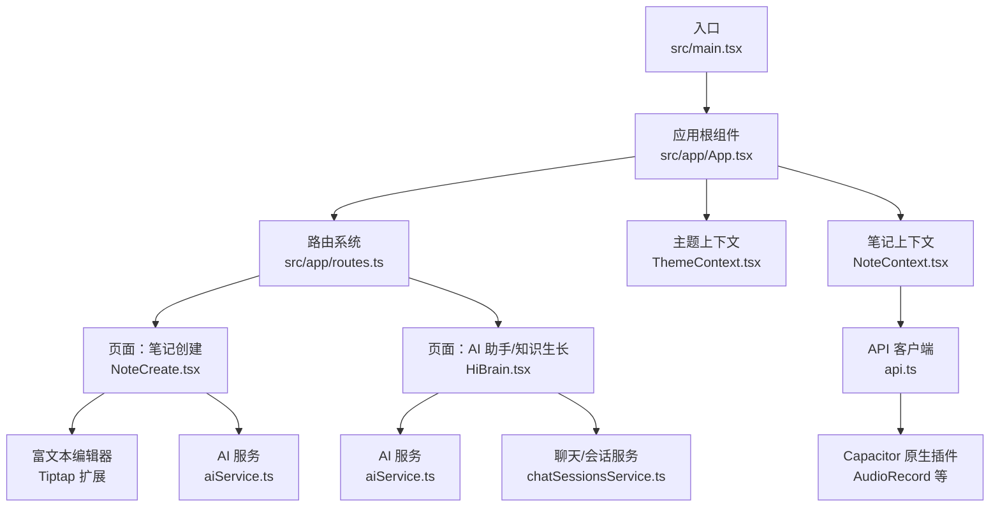
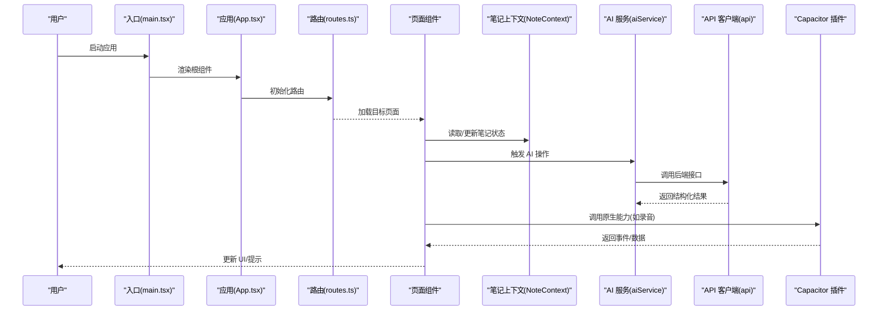
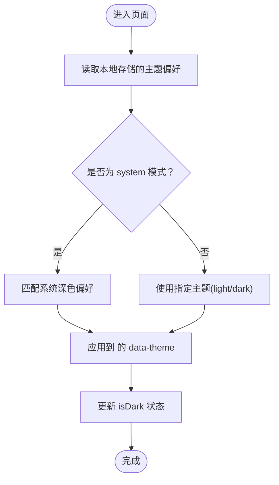
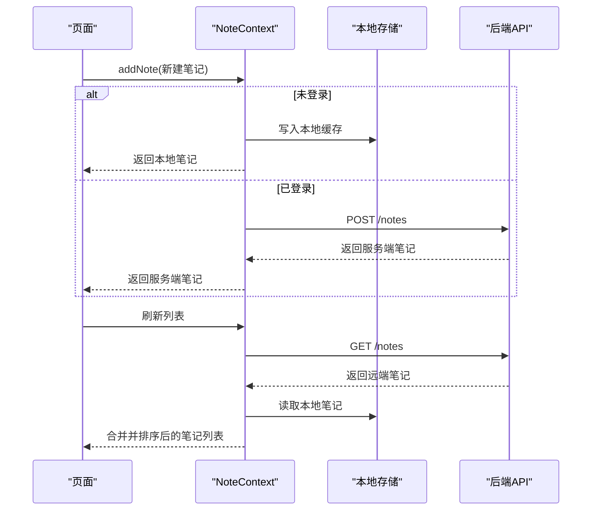
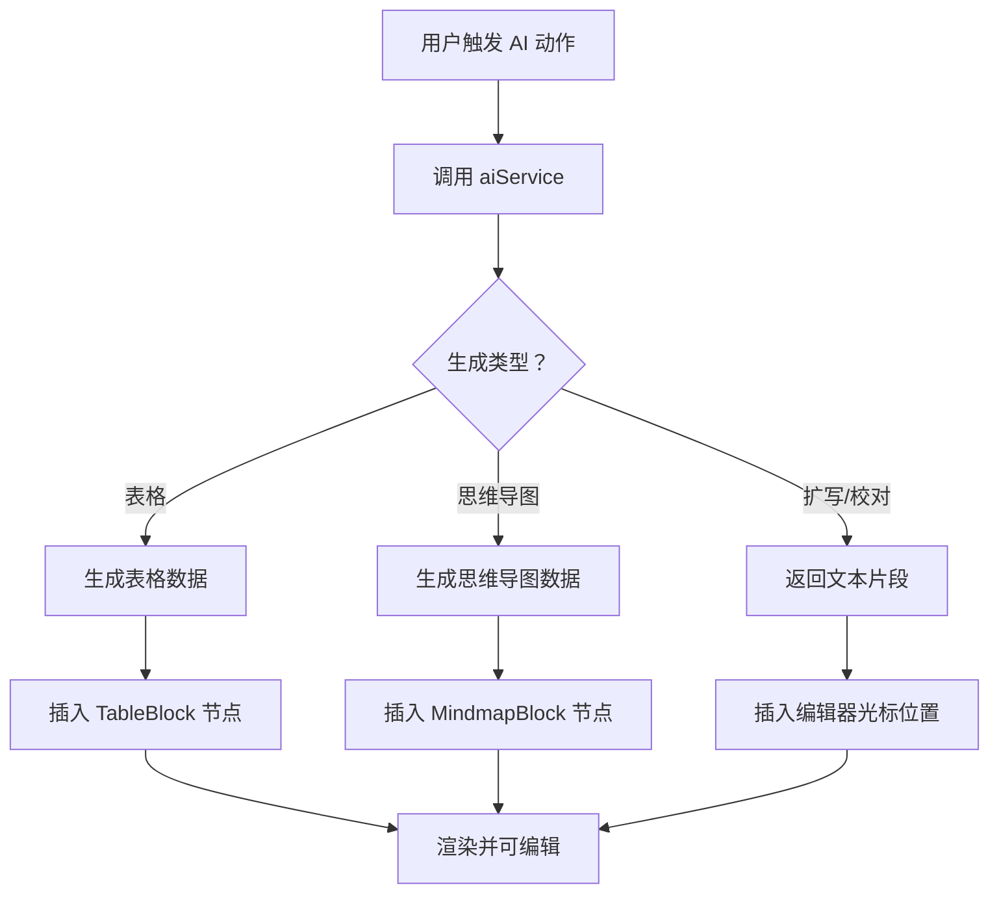
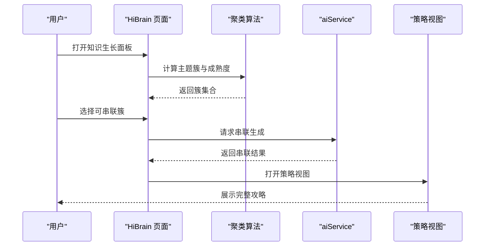
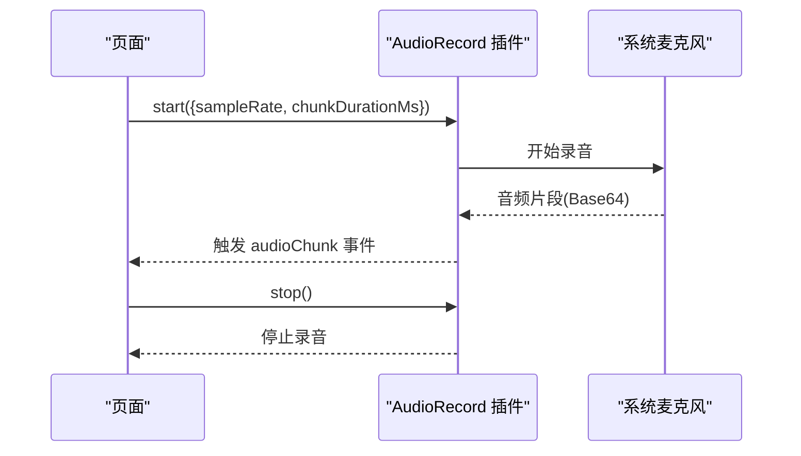
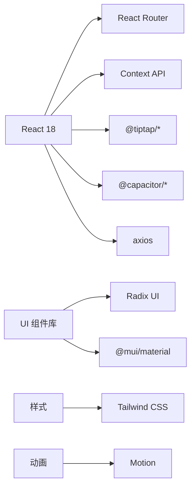

# 项目介绍与功能特性

<cite>
**本文档引用的文件**
- [README.md](file://README.md)
- [package.json](file://package.json)
- [capacitor.config.json](file://capacitor.config.json)
- [src/main.tsx](file://src/main.tsx)
- [src/app/App.tsx](file://src/app/App.tsx)
- [src/app/routes.ts](file://src/app/routes.ts)
- [src/app/components/context/ThemeContext.tsx](file://src/app/components/context/ThemeContext.tsx)
- [src/app/components/context/NoteContext.tsx](file://src/app/components/context/NoteContext.tsx)
- [src/app/services/aiService.ts](file://src/app/services/aiService.ts)
- [src/app/services/audioRecordService.ts](file://src/app/services/audioRecordService.ts)
- [src/app/services/api.ts](file://src/app/services/api.ts)
- [src/app/pages/NoteCreate.tsx](file://src/app/pages/NoteCreate.tsx)
- [src/app/pages/HiBrain.tsx](file://src/app/pages/HiBrain.tsx)
- [src/styles/theme.css](file://src/styles/theme.css)
</cite>

## 目录
1. [引言](#引言)
2. [项目结构](#项目结构)
3. [核心组件](#核心组件)
4. [架构总览](#架构总览)
5. [详细组件分析](#详细组件分析)
6. [依赖关系分析](#依赖关系分析)
7. [性能考虑](#性能考虑)
8. [故障排查指南](#故障排查指南)
9. [结论](#结论)

## 引言
本项目是一个基于 React 18 和 Vite 的现代化移动端笔记应用前端，采用 Capacitor 实现跨平台原生能力集成。项目围绕“智能笔记管理”“AI 增强功能”“多模态内容支持”三大核心方向构建，旨在为用户提供高效、自然、富有创造力的记录与思考体验。

- 设计理念：以“碎片化灵感 → 结构化知识”的路径为核心，通过标签与 AI 能力串联零散笔记，形成可沉淀、可复用的知识体系。
- 目标用户：需要随时记录灵感、整理思路、沉淀知识的学习者、创作者与研究者。
- 应用场景：日常学习笔记、创意草稿、会议纪要、读书摘录、知识串联与复习回顾等。

## 项目结构
项目采用“按功能域分层 + 组件化”的组织方式，核心目录与职责如下：
- src/app：应用主体逻辑与页面
  - components：通用 UI 组件与上下文（主题、笔记）
  - pages：页面级组件（笔记列表、笔记编辑、AI 助手、主页等）
  - services：业务服务（AI、音频录制、API、聊天会话等）
  - utils：工具与特性开关
  - types：类型定义
- src/styles：样式与主题变量
- src/main.tsx：应用入口
- 配置：package.json（依赖与脚本）、capacitor.config.json（原生配置）、vite.config.ts（构建配置）

图表来源
- [src/main.tsx:1-7](file://src/main.tsx#L1-L7)
- [src/app/App.tsx:1-17](file://src/app/App.tsx#L1-L17)
- [src/app/routes.ts:1-61](file://src/app/routes.ts#L1-L61)
- [src/app/components/context/ThemeContext.tsx:1-110](file://src/app/components/context/ThemeContext.tsx#L1-L110)
- [src/app/components/context/NoteContext.tsx:1-356](file://src/app/components/context/NoteContext.tsx#L1-L356)
- [src/app/pages/NoteCreate.tsx:1-800](file://src/app/pages/NoteCreate.tsx#L1-L800)
- [src/app/pages/HiBrain.tsx:1-800](file://src/app/pages/HiBrain.tsx#L1-L800)
- [src/app/services/aiService.ts:1-278](file://src/app/services/aiService.ts#L1-L278)
- [src/app/services/api.ts:1-127](file://src/app/services/api.ts#L1-L127)

章节来源
- [src/main.tsx:1-7](file://src/main.tsx#L1-L7)
- [src/app/App.tsx:1-17](file://src/app/App.tsx#L1-L17)
- [src/app/routes.ts:1-61](file://src/app/routes.ts#L1-L61)

## 核心组件
- 主题系统（ThemeContext）
  - 支持 light/dark/system 三种模式，持久化存储于本地，动态切换时通过 data-theme 属性应用到根节点，确保全局样式一致。
  - 自动监听系统深色偏好变化，实现无缝切换。
- 笔记系统（NoteContext）
  - 提供笔记的增删改查、离线本地存储与云端同步合并策略。
  - 支持标签、类型（纯文本/图片/混合）、状态（收件箱/归档）等元数据。
  - 未登录时以本地模式运行，登录后自动将本地笔记同步至服务端。
- 富文本编辑器（NoteCreate 页面 + Tiptap）
  - 基于 Tiptap 的扩展生态，支持标题、列表、引用、分割线等常用格式。
  - 内嵌“标签芯片”“表格块”“思维导图块”等 AI 生成内容的可视化渲染。
  - 提供移动端键盘适配的格式工具栏与选择菜单。
- AI 增强（aiService）
  - 提供智能扩写、智能校对、文本/文档总结、表格生成、思维导图生成、图片 OCR 分析等能力。
  - 对接后端接口，统一错误处理与超时控制。
- 原生能力集成（Capacitor）
  - 音频录制插件（AudioRecord），按固定节拍推送 PCM16LE 片段，便于语音转文字与分析。
  - 键盘、状态栏、启动页等原生插件配置，优化移动端体验。
- API 客户端（api）
  - 自动注入 Authorization 头，统一拦截 401 并进行令牌刷新。
  - 在开发/生产/原生环境间自动选择合适的 API 基础地址。

章节来源
- [src/app/components/context/ThemeContext.tsx:1-110](file://src/app/components/context/ThemeContext.tsx#L1-L110)
- [src/app/components/context/NoteContext.tsx:1-356](file://src/app/components/context/NoteContext.tsx#L1-L356)
- [src/app/pages/NoteCreate.tsx:1-800](file://src/app/pages/NoteCreate.tsx#L1-L800)
- [src/app/services/aiService.ts:1-278](file://src/app/services/aiService.ts#L1-L278)
- [src/app/services/audioRecordService.ts:1-35](file://src/app/services/audioRecordService.ts#L1-L35)
- [src/app/services/api.ts:1-127](file://src/app/services/api.ts#L1-L127)

## 架构总览
下图展示应用启动、路由导航、主题与笔记上下文、页面组件以及 AI 服务的整体交互：

图表来源
- [src/main.tsx:1-7](file://src/main.tsx#L1-L7)
- [src/app/App.tsx:1-17](file://src/app/App.tsx#L1-L17)
- [src/app/routes.ts:1-61](file://src/app/routes.ts#L1-L61)
- [src/app/pages/NoteCreate.tsx:1-800](file://src/app/pages/NoteCreate.tsx#L1-L800)
- [src/app/services/aiService.ts:1-278](file://src/app/services/aiService.ts#L1-L278)
- [src/app/services/api.ts:1-127](file://src/app/services/api.ts#L1-L127)
- [src/app/services/audioRecordService.ts:1-35](file://src/app/services/audioRecordService.ts#L1-L35)

## 详细组件分析

### 主题切换机制（ThemeContext）
- 关键点
  - 本地存储键名：hibrain_theme
  - 深色模式检测：matchMedia('(prefers-color-scheme: dark)')
  - DOM 应用：设置 html 的 data-theme 属性，配合 CSS 变量实现全站主题切换
  - 过渡动画：通过根节点过渡属性实现平滑颜色变化
- 适用范围：所有页面与组件均受 data-theme 影响，无需逐个组件适配

图表来源
- [src/app/components/context/ThemeContext.tsx:17-98](file://src/app/components/context/ThemeContext.tsx#L17-L98)

章节来源
- [src/app/components/context/ThemeContext.tsx:1-110](file://src/app/components/context/ThemeContext.tsx#L1-L110)
- [src/styles/theme.css:1-280](file://src/styles/theme.css#L1-L280)

### 笔记上下文与离线同步（NoteContext）
- 关键点
  - 本地存储键：shisi_local_notes_v1
  - 未登录时以本地模式运行，笔记标记 localOnly 并带 pendingSync
  - 登录后自动将本地笔记批量同步到后端，成功后清空本地缓存
  - 标准化内容与标签，推导显示标题，合并本地与远端数据
- 数据模型（简化）
  - Note：id、title、content、type、status、createdAt、tags、imageUrl、structuredData、localOnly、pendingSync

图表来源
- [src/app/components/context/NoteContext.tsx:95-218](file://src/app/components/context/NoteContext.tsx#L95-L218)
- [src/app/components/context/NoteContext.tsx:224-340](file://src/app/components/context/NoteContext.tsx#L224-L340)

章节来源
- [src/app/components/context/NoteContext.tsx:1-356](file://src/app/components/context/NoteContext.tsx#L1-L356)

### 富文本编辑与 AI 内容块（NoteCreate 页面 + Tiptap）
- 关键点
  - 编辑器扩展：StarterKit、Placeholder、Image、自定义节点（TagChip、TableBlock、MindmapBlock）
  - 移动端格式工具栏：根据选区启用/禁用按钮，支持智能标题与列表应用
  - AI 生成内容：表格块、思维导图块内嵌预览与编辑入口，支持通过自定义事件更新数据
  - 保存动画：全屏保存/成功/同步动画，提升反馈体验
- 流程示意（AI 生成与插入）

图表来源
- [src/app/pages/NoteCreate.tsx:664-687](file://src/app/pages/NoteCreate.tsx#L664-L687)
- [src/app/pages/NoteCreate.tsx:336-433](file://src/app/pages/NoteCreate.tsx#L336-L433)
- [src/app/pages/NoteCreate.tsx:443-659](file://src/app/pages/NoteCreate.tsx#L443-L659)
- [src/app/services/aiService.ts:77-97](file://src/app/services/aiService.ts#L77-L97)
- [src/app/services/aiService.ts:157-199](file://src/app/services/aiService.ts#L157-L199)

章节来源
- [src/app/pages/NoteCreate.tsx:1-800](file://src/app/pages/NoteCreate.tsx#L1-L800)
- [src/app/services/aiService.ts:1-278](file://src/app/services/aiService.ts#L1-L278)

### AI 助手与知识生长（HiBrain 页面）
- 关键点
  - 碎片聚类：基于标签的并查集算法，自动识别主题簇，计算成熟度与阶段（萌芽/生长中/茁壮/可串联）
  - 知识串联：AI 补全缺失模块，生成完整攻略；支持策略视图面板
  - 思链搜索：从灵感出发，基于标签发现关联笔记，生成关联图谱与路径
  - 通知与引导：知识推送通知、底部导航、粒子背景等增强交互
- 流程示意（知识串联）

图表来源
- [src/app/pages/HiBrain.tsx:68-98](file://src/app/pages/HiBrain.tsx#L68-L98)
- [src/app/pages/HiBrain.tsx:171-405](file://src/app/pages/HiBrain.tsx#L171-L405)
- [src/app/pages/HiBrain.tsx:411-695](file://src/app/pages/HiBrain.tsx#L411-L695)
- [src/app/services/aiService.ts:99-155](file://src/app/services/aiService.ts#L99-L155)

章节来源
- [src/app/pages/HiBrain.tsx:1-800](file://src/app/pages/HiBrain.tsx#L1-L800)
- [src/app/services/aiService.ts:1-278](file://src/app/services/aiService.ts#L1-L278)

### 原生功能集成（Capacitor）
- 音频录制（AudioRecord）
  - 事件：audioChunk（每 800ms 推送一次 PCM16LE mono 片段，Base64 编码）
  - 使用：在页面中注册监听、启动/停止录音、清理监听句柄
- 其他原生插件
  - 键盘、状态栏、启动页等已在配置中启用，优化移动端交互体验

图表来源
- [src/app/services/audioRecordService.ts:26-33](file://src/app/services/audioRecordService.ts#L26-L33)
- [README.md:12-39](file://README.md#L12-L39)

章节来源
- [src/app/services/audioRecordService.ts:1-35](file://src/app/services/audioRecordService.ts#L1-L35)
- [README.md:12-39](file://README.md#L12-L39)

## 依赖关系分析
- 技术栈
  - 前端框架：React 18、Vite
  - UI 与主题：Radix UI、Material Icons、Tailwind CSS、自定义主题变量
  - 富文本：Tiptap（starter-kit、image、placeholder、table 系列）
  - 移动端增强：Capacitor（keyboard、status-bar、splash-screen、音频录制插件）
  - 状态与路由：React Router、Context API
  - 工具与可视化：Recharts、Emotion、Motion（用于动画）
- 关键依赖（节选）
  - @capacitor/*：原生能力
  - @tiptap/*：富文本编辑
  - axios：HTTP 客户端
  - lucide-react、@mui/material：图标与组件库
  - next-themes：主题切换
  - react-router：路由

图表来源
- [package.json:10-83](file://package.json#L10-L83)

章节来源
- [package.json:1-113](file://package.json#L1-L113)

## 性能考虑
- 构建与打包
  - Vite 提供快速冷启与热更新，生产构建开启压缩与 Tree-Shaking
- 运行时优化
  - 主题切换仅操作根节点属性，避免全量重绘
  - 富文本编辑器按需渲染自定义节点，MindmapBlock 使用纯 DOM 减少 React 重渲染
  - AI 生成采用节流/防抖与骨架动画，避免阻塞主线程
- 网络与缓存
  - API 客户端统一拦截与错误翻译，减少重复请求
  - 笔记上下文在未登录时采用本地缓存，降低首屏等待

## 故障排查指南
- 登录与鉴权
  - 401 未授权：自动尝试刷新令牌，失败则跳转登录页
  - 网络异常：统一提示“网络开小差了，请检查网络连接或稍后再试”
  - 服务器错误：提示“服务器打了个盹，请稍后再试”
- 笔记同步
  - 本地笔记无法同步：检查本地存储键是否存在，确认网络状态与登录态
  - 同步后仍无数据：刷新页面或重新登录
- AI 功能
  - AI 接口报错：查看错误详情字段（状态码、错误 ID、错误码），必要时切换环境或升级后端
  - 生成内容为空：确认输入文本长度与格式，或稍后重试
- 原生录音
  - 无音频片段：确认权限与设备可用性，检查事件监听是否正确移除

章节来源
- [src/app/services/api.ts:56-126](file://src/app/services/api.ts#L56-L126)
- [src/app/components/context/NoteContext.tsx:190-210](file://src/app/components/context/NoteContext.tsx#L190-L210)
- [src/app/services/aiService.ts:12-50](file://src/app/services/aiService.ts#L12-L50)
- [README.md:12-39](file://README.md#L12-L39)

## 结论
本项目以 React 18 与 Vite 为基础，结合 Capacitor 的原生能力与 Tiptap 的富文本生态，构建了面向移动场景的智能笔记应用。通过主题系统、笔记上下文、AI 增强与知识生长等功能模块，实现了从“记录灵感”到“串联知识”的闭环体验。对于初学者而言，建议先从主题切换、笔记 CRUD、富文本编辑与 AI 生成四个模块入手，逐步理解上下文与服务层的协作关系，再深入探索原生插件与路由体系。