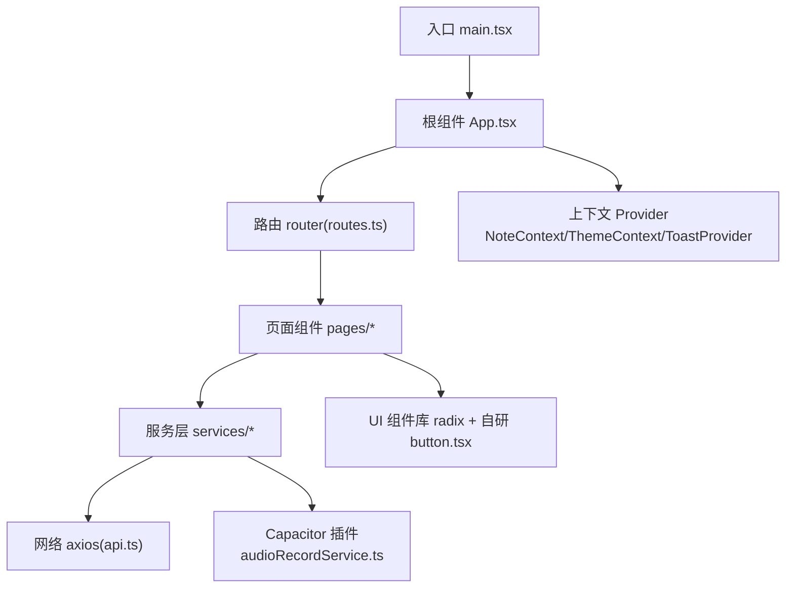
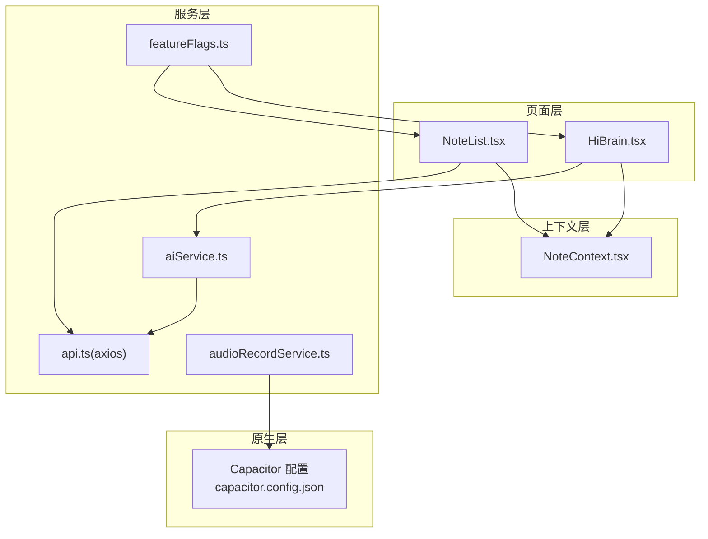
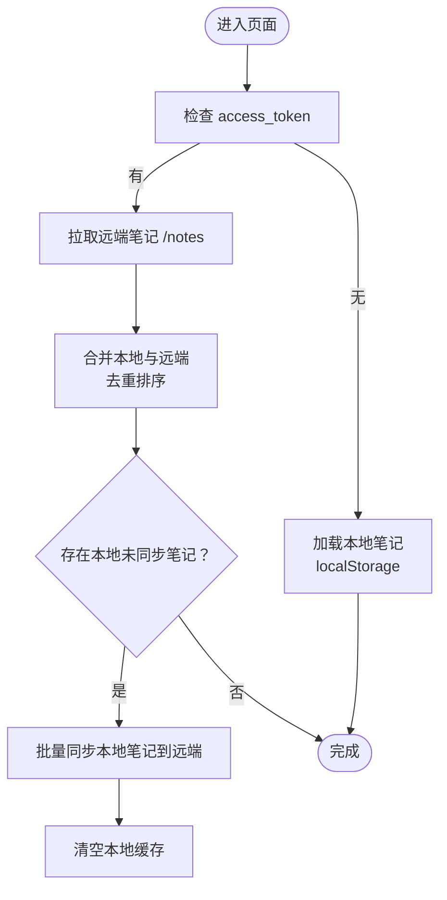
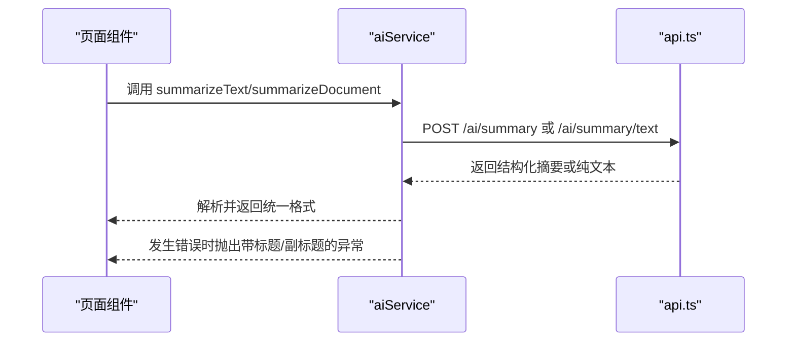
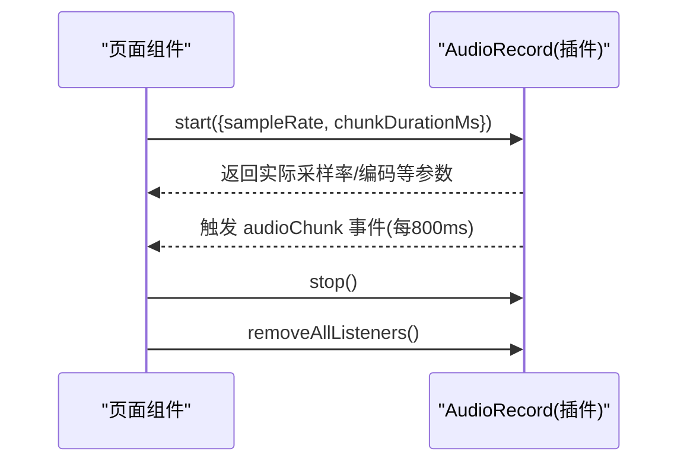
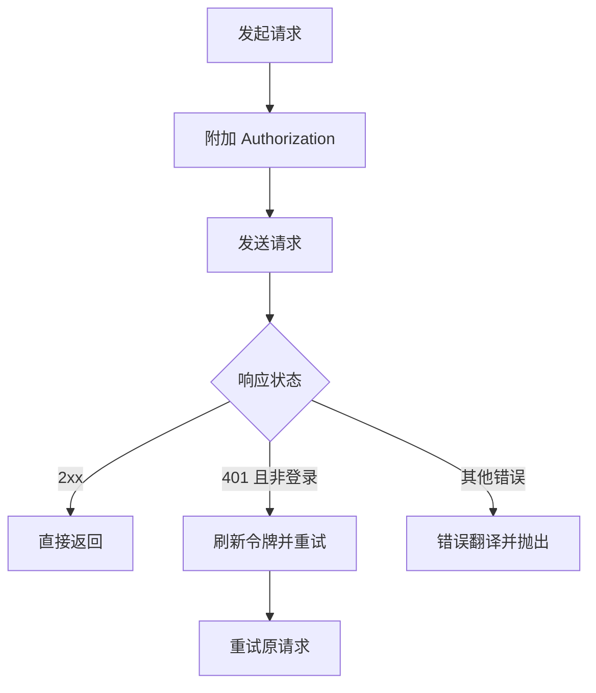
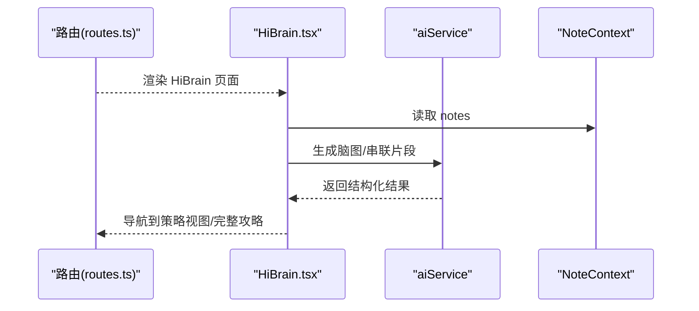
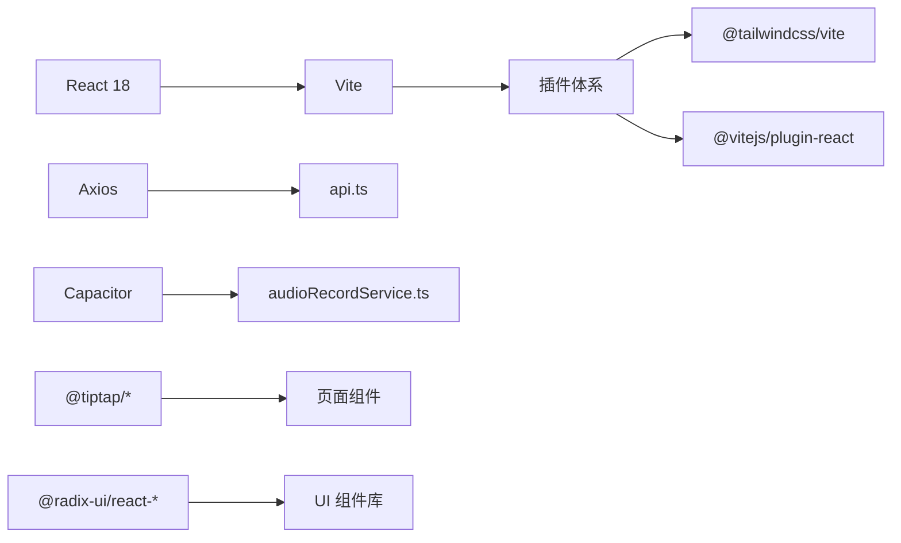

# 项目概述

<cite>
**本文引用的文件**
- [README.md](file://README.md)
- [package.json](file://package.json)
- [capacitor.config.json](file://capacitor.config.json)
- [vite.config.ts](file://vite.config.ts)
- [src/main.tsx](file://src/main.tsx)
- [src/app/App.tsx](file://src/app/App.tsx)
- [src/app/routes.ts](file://src/app/routes.ts)
- [src/app/components/context/NoteContext.tsx](file://src/app/components/context/NoteContext.tsx)
- [src/app/services/audioRecordService.ts](file://src/app/services/audioRecordService.ts)
- [src/app/services/aiService.ts](file://src/app/services/aiService.ts)
- [src/app/services/api.ts](file://src/app/services/api.ts)
- [src/app/utils/featureFlags.ts](file://src/app/utils/featureFlags.ts)
- [src/app/pages/HiBrain.tsx](file://src/app/pages/HiBrain.tsx)
- [src/app/pages/NoteList.tsx](file://src/app/pages/NoteList.tsx)
- [src/app/components/ui/button.tsx](file://src/app/components/ui/button.tsx)
</cite>

## 目录
1. [引言](#引言)
2. [项目结构](#项目结构)
3. [核心组件](#核心组件)
4. [架构总览](#架构总览)
5. [详细组件分析](#详细组件分析)
6. [依赖分析](#依赖分析)
7. [性能考虑](#性能考虑)
8. [故障排查指南](#故障排查指南)
9. [结论](#结论)
10. [附录](#附录)

## 引言
本项目是一个基于 React 18 和 Vite 的现代化移动端笔记应用前端，采用 Capacitor 实现跨平台原生能力集成。项目围绕“智能笔记管理”“AI 增强”“多模态内容支持”三大目标构建，提供从灵感记录、知识串联到结构化输出的完整体验。

- 目标用户：需要高效记录、整理与复用知识的个人与团队用户
- 核心价值：以 AI 驱动的知识增长与可视化，降低信息碎片化成本，提升学习与创作效率
- 技术定位：现代前端工程化实践，兼顾开发体验与运行性能，同时通过 Capacitor 提供原生能力

## 项目结构
项目采用“按功能域分层”的组织方式，核心目录与职责如下：
- src/main.tsx：应用入口，挂载根组件
- src/app/App.tsx：应用根组件，统一注入主题、笔记上下文、全局提示等 Provider
- src/app/routes.ts：路由定义，覆盖登录、主页、笔记、文档、消息、个人中心等页面
- src/app/components：通用 UI 组件与业务上下文（如 NoteContext、ThemeContext）
- src/app/pages：页面级组件（如 HiBrain、NoteList、DocumentDetail 等）
- src/app/services：服务层（网络请求、AI 能力、音频录制、聊天会话等）
- src/styles：样式入口（Tailwind、主题变量）
- vite.config.ts：Vite 构建配置（插件、别名、依赖优化）
- capacitor.config.json：Capacitor 配置（原生插件、启动页、键盘行为等）

图表来源
- [src/main.tsx:1-7](file://src/main.tsx#L1-L7)
- [src/app/App.tsx:1-17](file://src/app/App.tsx#L1-L17)
- [src/app/routes.ts:1-61](file://src/app/routes.ts#L1-L61)
- [src/app/components/context/NoteContext.tsx:1-356](file://src/app/components/context/NoteContext.tsx#L1-L356)
- [src/app/services/api.ts:1-127](file://src/app/services/api.ts#L1-L127)
- [src/app/services/audioRecordService.ts:1-35](file://src/app/services/audioRecordService.ts#L1-L35)
- [src/app/components/ui/button.tsx:1-59](file://src/app/components/ui/button.tsx#L1-L59)

章节来源
- [src/main.tsx:1-7](file://src/main.tsx#L1-L7)
- [src/app/App.tsx:1-17](file://src/app/App.tsx#L1-L17)
- [src/app/routes.ts:1-61](file://src/app/routes.ts#L1-L61)
- [vite.config.ts:1-44](file://vite.config.ts#L1-L44)
- [capacitor.config.json:1-31](file://capacitor.config.json#L1-L31)

## 核心组件
- 笔记上下文（NoteContext）：负责本地与远端笔记的加载、合并、增删改与同步；支持离线本地笔记与云端同步；提供派生字段（标题、类型、封面图）与标签归一化
- 路由系统（React Router）：集中式路由定义，支持动态子路由与特性开关（如 Wiki）
- 服务层（api/ai/audioRecord）：统一封装网络请求、鉴权拦截、错误翻译；提供 AI 总结、表格生成、脑图生成、图片分析等能力；封装 Capacitor 音频录制插件
- UI 组件库：基于 Radix UI 的可组合组件与自研 Button 组件，配合 Tailwind 进行主题化样式
- 页面组件：HiBrain（知识生长与串联）、NoteList（笔记卡片与多视图）、DocumentDetail（文档详情）等

章节来源
- [src/app/components/context/NoteContext.tsx:1-356](file://src/app/components/context/NoteContext.tsx#L1-L356)
- [src/app/routes.ts:1-61](file://src/app/routes.ts#L1-L61)
- [src/app/services/api.ts:1-127](file://src/app/services/api.ts#L1-L127)
- [src/app/services/aiService.ts:1-278](file://src/app/services/aiService.ts#L1-L278)
- [src/app/services/audioRecordService.ts:1-35](file://src/app/services/audioRecordService.ts#L1-L35)
- [src/app/components/ui/button.tsx:1-59](file://src/app/components/ui/button.tsx#L1-L59)

## 架构总览
应用采用“页面组件 + 服务层 + 上下文 + 原生插件”的分层架构：
- 页面层：承载业务场景与交互逻辑
- 服务层：抽象网络与第三方能力，提供稳定 API
- 上下文层：状态共享与跨组件通信
- 原生层：通过 Capacitor 插件桥接设备能力（如录音、键盘、启动屏等）

图表来源
- [src/app/pages/HiBrain.tsx:1-800](file://src/app/pages/HiBrain.tsx#L1-L800)
- [src/app/pages/NoteList.tsx:1-800](file://src/app/pages/NoteList.tsx#L1-L800)
- [src/app/services/api.ts:1-127](file://src/app/services/api.ts#L1-L127)
- [src/app/services/aiService.ts:1-278](file://src/app/services/aiService.ts#L1-L278)
- [src/app/services/audioRecordService.ts:1-35](file://src/app/services/audioRecordService.ts#L1-L35)
- [src/app/utils/featureFlags.ts:1-14](file://src/app/utils/featureFlags.ts#L1-L14)
- [src/app/components/context/NoteContext.tsx:1-356](file://src/app/components/context/NoteContext.tsx#L1-L356)
- [capacitor.config.json:1-31](file://capacitor.config.json#L1-L31)

## 详细组件分析

### 笔记上下文（NoteContext）
- 数据模型：Note 类型包含 id、title、content、type、status、createdAt、tags、imageUrl、structuredData 等字段，并提供派生字段与归一化处理
- 本地与云端合并：登录态下拉取远端笔记并与本地缓存合并，未登录时仅展示本地笔记；首次登录后异步尝试将本地笔记同步至远端
- 增删改：支持乐观更新策略（部分场景），并提供本地 ID 与远端 ID 的区分处理
- 同步机制：通过 ref 标记避免重复同步，完成后清理本地缓存

图表来源
- [src/app/components/context/NoteContext.tsx:152-218](file://src/app/components/context/NoteContext.tsx#L152-L218)

章节来源
- [src/app/components/context/NoteContext.tsx:1-356](file://src/app/components/context/NoteContext.tsx#L1-L356)

### AI 服务能力（aiService）
- 能力清单：智能扩写、智能校对、生成表格、文本/文档总结、生成脑图、图片分析
- 错误处理：针对不同后端错误码与状态进行统一翻译，便于前端展示友好提示
- Mock 与真实：部分能力提供本地 mock，便于开发联调；生产环境对接后端接口

图表来源
- [src/app/services/aiService.ts:99-155](file://src/app/services/aiService.ts#L99-L155)
- [src/app/services/api.ts:1-127](file://src/app/services/api.ts#L1-L127)

章节来源
- [src/app/services/aiService.ts:1-278](file://src/app/services/aiService.ts#L1-L278)

### 音频录制能力（AudioRecord）
- 插件封装：通过 Capacitor 注册插件，提供 start/stop/addListener/removeAllListeners 等方法
- 事件流：每 800ms 推送一次 PCM16LE mono 音频块（Base64），便于实时处理或上传
- 使用示例：README 中提供了完整的 start/stop 与监听器移除流程

图表来源
- [src/app/services/audioRecordService.ts:1-35](file://src/app/services/audioRecordService.ts#L1-L35)
- [README.md:12-41](file://README.md#L12-L41)

章节来源
- [src/app/services/audioRecordService.ts:1-35](file://src/app/services/audioRecordService.ts#L1-L35)
- [README.md:12-41](file://README.md#L12-L41)

### 网络与鉴权（api.ts）
- 基础地址：根据环境变量与是否原生平台动态决定 API 基础地址
- 请求拦截：自动附加 Bearer Token
- 响应拦截：统一处理 401 刷新令牌、错误翻译与跳转登录

图表来源
- [src/app/services/api.ts:44-126](file://src/app/services/api.ts#L44-L126)

章节来源
- [src/app/services/api.ts:1-127](file://src/app/services/api.ts#L1-L127)

### 页面与路由（HiBrain、NoteList）
- HiBrain：知识生长面板、碎片聚类、AI 串联、策略视图等，强调“从碎片到完整攻略”的串联体验
- NoteList：笔记卡片、标签筛选、搜索、文档库上传、今日统计等，强调“多模态内容预览与组织”

图表来源
- [src/app/routes.ts:1-61](file://src/app/routes.ts#L1-L61)
- [src/app/pages/HiBrain.tsx:1-800](file://src/app/pages/HiBrain.tsx#L1-L800)
- [src/app/services/aiService.ts:157-199](file://src/app/services/aiService.ts#L157-L199)
- [src/app/components/context/NoteContext.tsx:1-356](file://src/app/components/context/NoteContext.tsx#L1-L356)

章节来源
- [src/app/pages/HiBrain.tsx:1-800](file://src/app/pages/HiBrain.tsx#L1-L800)
- [src/app/pages/NoteList.tsx:1-800](file://src/app/pages/NoteList.tsx#L1-L800)

## 依赖分析
- 前端框架与工具链：React 18、Vite、TailwindCSS、Radix UI、Lucide React、Axios
- 跨平台：Capacitor（Android/iOS）、@capacitor-community/speech-recognition
- 编辑器与富文本：Tiptap（核心、Starter Kit、Image、Placeholder、Table 系列）
- UI 组件库：@radix-ui/react-*、@mui/material、@emotion/react
- 开发与构建：@vitejs/plugin-react、@tailwindcss/vite

图表来源
- [package.json:10-84](file://package.json#L10-L84)
- [vite.config.ts:1-44](file://vite.config.ts#L1-L44)
- [src/app/services/api.ts:1-127](file://src/app/services/api.ts#L1-L127)
- [src/app/services/audioRecordService.ts:1-35](file://src/app/services/audioRecordService.ts#L1-L35)

章节来源
- [package.json:1-113](file://package.json#L1-L113)
- [vite.config.ts:1-44](file://vite.config.ts#L1-L44)

## 性能考虑
- 依赖去重与预打包：Vite 配置对 React、motion、@tiptap 等进行 dedupe 与 optimizeDeps，减少包体积与运行时差异
- 组件动画：使用 motion/react，合理控制动画数量与复杂度，避免主线程阻塞
- 图片与富文本：NoteList 对图片缩略图与脑图缩略图进行裁剪与尺寸控制，减少渲染压力
- 网络请求：统一超时与错误处理，避免长时间阻塞 UI

章节来源
- [vite.config.ts:11-41](file://vite.config.ts#L11-L41)
- [src/app/pages/NoteList.tsx:186-278](file://src/app/pages/NoteList.tsx#L186-L278)
- [src/app/services/api.ts:36-42](file://src/app/services/api.ts#L36-L42)

## 故障排查指南
- 登录态与鉴权
  - 现象：频繁出现 401 或被重定向到登录页
  - 处理：检查本地是否存在 refresh_token；确认刷新流程是否成功；核对后端接口 /auth/refresh
- 网络异常
  - 现象：请求报错或超时
  - 处理：确认 VITE_API_URL 是否正确；检查代理与跨域设置；查看响应拦截器中的错误翻译
- 原生能力
  - 现象：录音无回调或无法停止
  - 处理：确认 Capacitor 配置与插件注册；确保按 README 流程正确 start/stop 并移除监听
- 特性开关
  - 现象：Wiki 页面不可见
  - 处理：检查 VITE_WIKI_ENABLED 是否开启

章节来源
- [src/app/services/api.ts:56-126](file://src/app/services/api.ts#L56-L126)
- [README.md:12-41](file://README.md#L12-L41)
- [src/app/utils/featureFlags.ts:1-14](file://src/app/utils/featureFlags.ts#L1-L14)

## 结论
本项目以 React/Vite 为基础，结合 Capacitor 实现跨平台原生能力，围绕“智能笔记管理”“AI 增强”“多模态内容支持”构建了完整的前端体验。通过上下文与服务层的清晰分层，以及完善的错误处理与特性开关，既满足初学者快速上手，也为经验开发者提供了可扩展的架构基座。

## 附录
- 快速开始
  - 安装依赖：npm i
  - 启动开发：npm run dev
  - 访问地址：http://localhost:5173
- 关键配置
  - API 基础地址：通过 VITE_API_URL 控制；原生平台默认回退到 http://120.26.35.225:3000/api
  - 特性开关：VITE_WIKI_ENABLED 控制 Wiki 功能是否启用
- 原生能力
  - 音频录制：按 README 示例初始化插件与事件监听，定时推送 PCM 音频块

章节来源
- [README.md:6-11](file://README.md#L6-L11)
- [src/app/services/api.ts:21-34](file://src/app/services/api.ts#L21-L34)
- [src/app/utils/featureFlags.ts:7-13](file://src/app/utils/featureFlags.ts#L7-L13)
- [capacitor.config.json:1-31](file://capacitor.config.json#L1-L31)