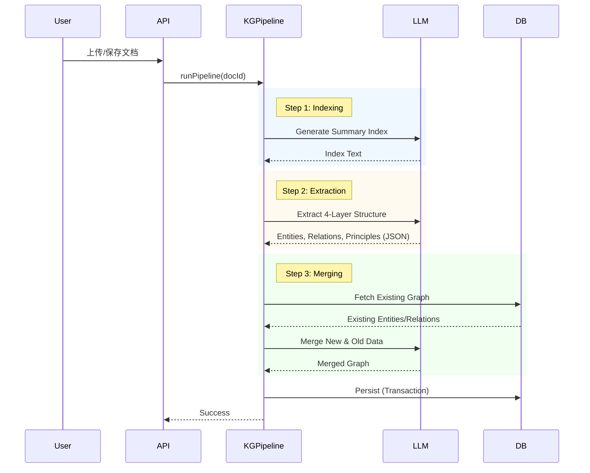

# Web端 Hi Brain 助手技术架构白皮书

## 1. 概述
本文档详细描述了 Web 端 Hi Brain 助手的技术架构，特别是其核心的 Agentic RAG（Retrieval-Augmented Generation）框架。该系统旨在通过构建多层认知结构的知识图谱，实现从简单的关键词匹配向深度语义理解和知识生成的跨越。

## 2. 系统架构图

```mermaid
graph TD
    User[用户] --> Frontend[Web前端 (V1.1)]
    Frontend --> API[API Gateway / Chat Service]
    
    subgraph "Core Backend Services"
        API --> ChatService[Chat Service (SQL)]
        API --> KGPipeline[KGPipelineService (Knowledge Graph)]
        API --> KGGrowth[KnowledgeGrowthService (Lifecycle)]
        
        KGPipeline --> LLMClient[LLM Client (Qwen-Plus)]
        KGPipeline --> Embedding[Embedding Service (Text-Embedding-V3)]
        
        subgraph "Data Layer"
            SQLite[(SQLite - Legacy)]
            Prisma[(Prisma ORM - Relational)]
            VectorDB[(Vector Index - Logical)]
        end
        
        KGPipeline --> Prisma
        KGPipeline --> SQLite
        Embedding --> VectorDB
    end
```

## 3. 核心模块说明

### 3.1 KGPipelineService (知识图谱流水线)
这是系统的核心大脑，负责将非结构化的文档转化为结构化的知识图谱。

*   **四层认知结构 (Four-Layer Cognitive Structure)**:
    *   **Layer 1 (What - 事实层)**: 提取核心实体 (Entity)，如概念、对象、流程、角色等。
    *   **Layer 2 (How - 结构层)**: 提取实体间的组织结构关系 (Relation)，如包含、组成、依赖。
    *   **Layer 3 (Why - 机制层)**: 提取实体间的因果和逻辑关系，如导致、触发、约束。
    *   **Layer 4 (So What - 抽象层)**: 提炼可迁移的原则 (Principle) 和方法论模式。

*   **流水线步骤**:
    1.  **Generate Index**: 使用 LLM 生成文档的结构化摘要索引。
    2.  **Extract Four Layers**: 基于索引，一次性提取上述四层结构数据。
    3.  **Merge Incremental**: 使用 LLM 智能合并新提取的知识与现有图谱，解决实体消歧和关系融合问题。
    4.  **Persist**: 通过 Prisma 将清洗后的数据持久化到数据库。

### 3.2 EmbeddingService (语义向量服务)
负责文本的向量化处理，支持语义搜索。

*   **模型**: Aliyun DashScope `text-embedding-v3`。
*   **功能**:
    *   `generateEmbedding(text)`: 生成文本向量。
    *   `cosineSimilarity(vecA, vecB)`: 计算余弦相似度。
    *   `findSimilar(...)`: 在候选集中查找最相似的记录。

### 3.3 KnowledgeGrowthService (知识生长服务)
管理知识体的生命周期，模拟知识的“生长”过程。

*   **状态管理**: 监控知识体节点的状态 (Empty -> Filled -> User Edited -> Mature)。
*   **导出与转化**: 当知识体成熟时，自动将其导出为线性文档 (Document)，支持富文本格式 (TipTap JSON)。

### 3.4 LLMClient (大模型客户端)
统一的大模型调用接口。

*   **模型**: Qwen-Plus (通义千问)。
*   **特性**: 支持流式输出 (Stream) 和 JSON 结构化输出解析，具备错误重试和超时控制。

## 4. 数据流时序图 (知识提取过程)



## 5. 性能基准 (当前估算)
*   **单文档处理时间**: ~5-15秒 (依赖 LLM 响应速度)。
*   **Token 消耗**: 每个文档约消耗 2-3k tokens (取决于文档长度和合并复杂度)。
*   **查询响应**: 向量检索 < 100ms (基于内存计算，大规模需优化)。
